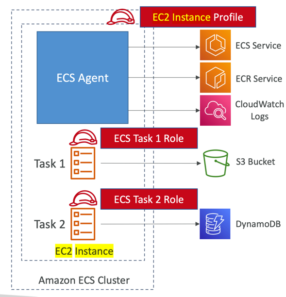
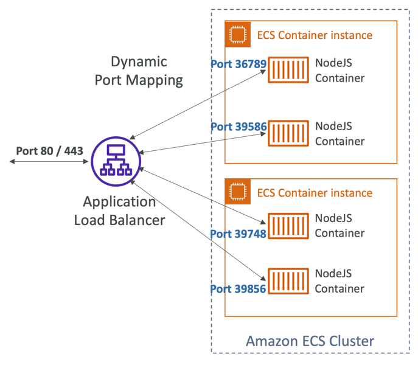
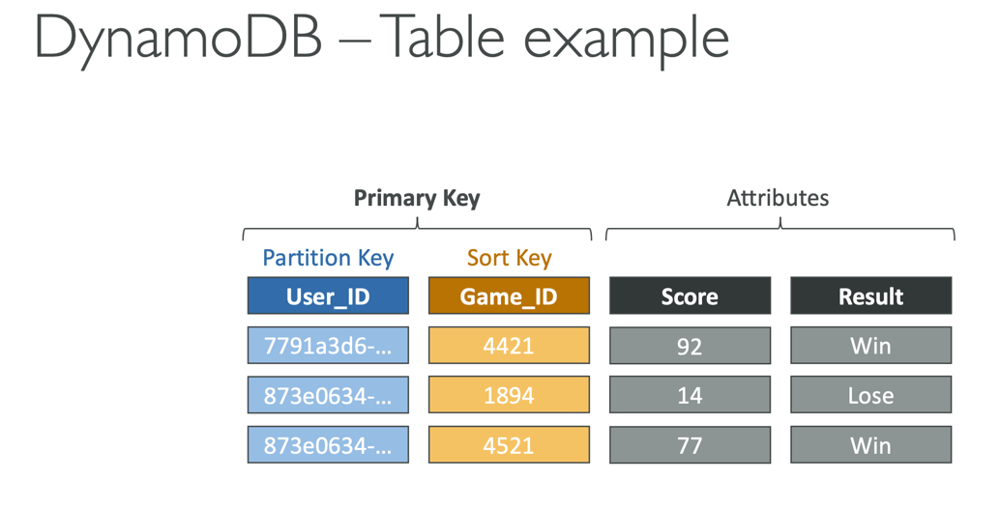

# Quiz 15: AWS 컨테이너 퀴즈
## Question 3:
ECS 작업이 S3 버킷에 파일을 업로드하도록 하려는 ECS 클러스터(EC2 launch type)에서 호스팅되는 애플리케이션이 있습니다. ECS 작업에 대해 어떤 IAM 역할을 수정해야 할까요?
- EC2 인스턴스 프로파일
- (정답) ECS 태스크 역할
```markdown
(해설) ECS 작업 역할은 ECS 작업 자체에서 사용하는 IAM 역할입니다. 컨테이너가 S3, SQS 등과 같은 다른 AWS 서비스를 호출하려고 할 때 사용  

# EC2 Instance Profile:
• (노드용)
• Used by the ECS agent
• Makes API calls to ECS service
• Send container logs to CloudWatch Logs
• Pull Docker image from ECR
• Reference sensitive data in Secrets Manager or SSM Parameter Store

# ECS Task Role:
• (컨테이너용)
• Allow each task to have a specific role
• Use different roles for the different ECS Services you run
• Task Role is defined in the task definition
```


## Question 6:
애플리케이션 로드 밸런서 (ALB)가 동일한 ECS Container 인스턴스에서 실행 중인 여러 ECS 작업으로 트래픽을 리디렉션할 수 있는 기능은 무엇일까요?
- (정답) 동적 포트 매핑
```markdown
# ECS - Load Balancing for EC2 Launch Type
- https://ohgym.tistory.com/69
- Dynamic port mapping은 container에 매핑되는 호스트의 포트를 고정하지 않는다
- ECS가 임의의 포트 중 중 하나의 값을 알아서 매핑시켜준다
- 선언하는 방법은 Task Definition에서 해당 container의 Host Port를 0으로 설정하면 동적 포트 매핑이 됨
- ALB 보안그룹에서 오는 0-65535 포트를 인바운드 규칙으로 설정해야 함
```


# Quiz 16: 서버리스 개요 퀴즈
## Question 8:
Edge-Optimized API Gateway를 사용하는 경우 API Gateway는 모든 AWS 리전의 CloudFront Edge Locations에 있습니다.
- (정답) 거짓
```markdown
- Edge-Optimized API Gateway는 지리적으로 분산된 클라이언트에 가장 적합합니다. 
- API 요청은 가장 가까운 CloudFront 엣지 로케이션으로 라우팅되어 지연 시간을 개선합니다. API Gateway는 여전히 하나의 AWS 리전에 있습니다.
- https://docs.aws.amazon.com/ko_kr/apigateway/latest/developerguide/api-gateway-api-endpoint-types.html
- https://techiespice.com/tag/edge-optimized/

# API Gateway 엔드포인트 종류
• Edge-Optimized (기본값): For global clients
  • 가장 가까운 CloudFront에서 요청을 받고 API Gateway로 전달 (latency 향상)
  • 그러나 CloudFront는 전역적이지만 API Gateway는 특정 리전에만 있음
  • 글로벌로 서비스를 제공하고자 할 때 사용
• Regional:
  • For clients within the same region
  • Could manually combine with CloudFront (more control over the caching strategies and the distribution)
• Private:
  • Can only be accessed from your VPC using an interface VPC endpoint (ENI)
  • Use a resource policy to define access
  • 보안이 중요하고 내부에서만 요청을 해야하는 경우에 사용 
```


## Question 12:
DynamoDB 테이블에 있는 항목의 최대 크기는 ...........
- (정답) 400 KB
```markdown
# DynamoDB 기초
- DynamoDB는 테이블로 구성
- 각 테이블은 Primary Key가 있음 (생성시 지정해야 함)
- 각 테이블은 무한개의 아이템(=row)을 가질 수 있음
- 각 아이템에는 attribute가 있음 (can be added over time, can be null)
- 단일 아이템의 최대 크기는 400KB
- 자료형의 종류
  - Scalar Types – String, Number, Binary, Boolean, Null
  - Document Types – List, Map
  - Set Types – String Set, Number Set, Binary Set
```


# Quiz 17: 서버리스 솔루션 아키텍처 토론 퀴즈
## Question 5:
ap-northeast-1에서 DynamoDB 테이블을 생성했고 eu-west-1에서 사용할 수 있도록 하기 위해 DynamoDB 전역 테이블을 생성하기로 결정했습니다. DynamoDB 글로벌 테이블을 생성하기 전에 먼저 활성화해야 하는 것은 무엇일까요?
- (정답) DynamoDB 스트림
- DynamoDB DAX
- DynamoDB 버전관리
- DynamoDB 백업
```markdown
# DynamoDB Streams
- 테이블 내 아이템 단위 변경(create/update/delete)에 대해 순서가 있는 스트림
- 스트림 레코드:
  • Kinesis 스트림으로 전송 
  • Lambda에서 읽어서 사용 
  • Kinesis Client Library 어플리케이션에서 읽어서 사용
- 보관 주기: 24시간
- 사용 사례:
  • react to changes in real-time (welcome email to users)
  • Analytics
  • Insert into derivative tables
  • Insert into ElasticSearch
  • Implement cross-region replication

# DynamoDB Global Tables
- DynamoDB를 여러 리전에서 빠르게(low-latency) 접근할 수 있도록 하는 서비스
- 양방향 복제 (two-way replication)
- active-active replication -> 어느 리전에서든 테이블 쓰기/읽기가 가능함
- DynamoDB Stream을 먼저 활성화해야 함
```