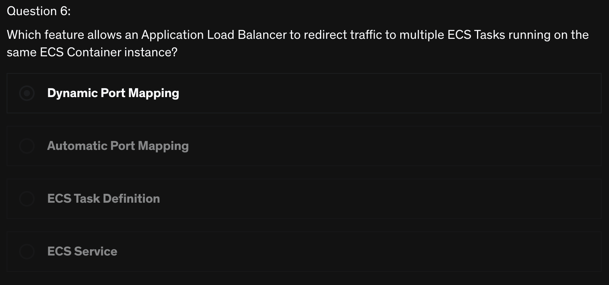
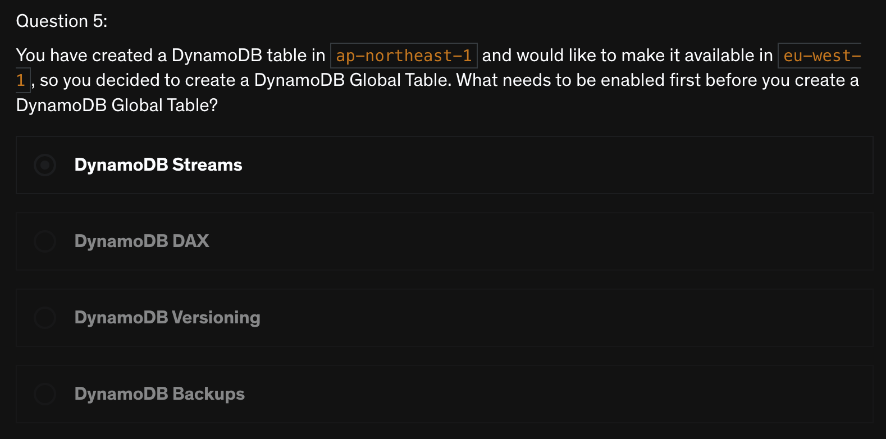

# Quiz
> [Udemy AWS SAA 강의](https://www.udemy.com/course/best-aws-certified-solutions-architect-associate/) Quiz 15, 16, 17 을 풀고, 어려운 문제를 선정하여 해설을 제출하기

<br>

## Quiz 15. Containers on AWS Quiz (7문제)

### Q6) 



```
답: 1번
```

### Dynamic Port Mapping
> ALB의 `Dynamic port mapping` 을 사용하여 여러개의 ECS task가 같은 host 내의 여러개의 host port에서 실행되도록 설정할 수 있다
- CLB를 사용하면 동일한 인스턴스에서 여러 작업 사본을 없고, 컨테이너 인스턴스의 포트 번호를 정적으로 mapping 해야 한다
- ALB는 Dynamic port mapping을 사용하므로 동일한 인스턴스의 단일 서비스에서 여러 작업을 실행할 수 있다!
- [ECS에서 Dynamic Port Mapping을 설정하는 방법](https://aws.amazon.com/ko/premiumsupport/knowledge-center/dynamic-port-mapping-ecs/)


<br>

## Quiz 16. Serverless Overview Quiz (11문제)

N/A

<br>

## Quiz 17. Serverless Solutions Architecture Discussions Quiz (10문제)

### Q5)



```
답: 1번
```

### [DynamoDB Streams](https://docs.aws.amazon.com/ko_kr/amazondynamodb/latest/developerguide/Streams.html)
- `DynamoDB Streams`는 DynamoDB 테이블에서 시간 순서에 따라 항목 수준 수정을 캡처하고 이 정보를 **최대 24시간** 동안 로그에 저장한다
  - 로그와 데이터 항목은 변경 전후 **거의 실시간**으로 나타나므로 애플리케이션에서 이러한 로그와 데이터에 액세스할 수 있다
- `DynamoDB Streams`는 DynamoDB 테이블 항목의 변경 사항에 대한 정렬된 정보 흐름이다
  - 테이블에서 스트림을 활성화하면 DynamoDB가 테이블 데이터 항목의 모든 수정에 대한 정보를 캡처한다
- `DynamoDB Streams`는 아래의 항목을 보장한다
  - 각 스트림 기록은 스트림에서 **한 번만 나타난다**
  - DynamoDB 테이블에서 수정된 각 항목의 스트림 레코드는 **항목의 실제 수정과 동일한 순서로 표시**된다
- `DynamoDB Streams`는 **거의 실시간**으로 스트림 레코드를 작성하므로 이러한 스트림을 소비하고 내용을 바탕으로 조치를 취할 수 있는 애플리케이션을 빌드할 수 있다