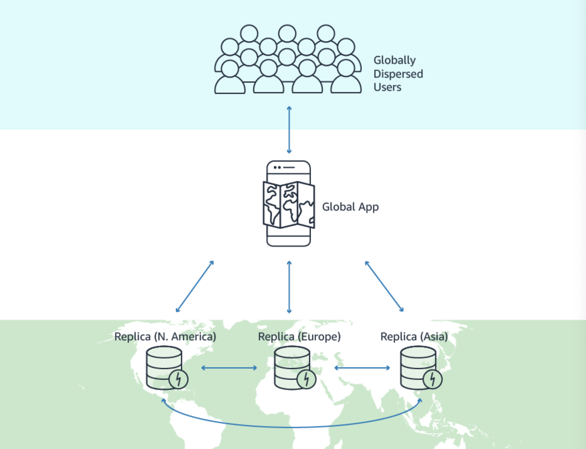

# Quiz
> [Udemy AWS SAA 강의](https://www.udemy.com/course/best-aws-certified-solutions-architect-associate/) Quiz 15, 16, 17 을 풀고, 어려운 문제를 선정하여 해설을 제출하기

<br>

## Quiz 15. Containers on AWS Quiz (7문제)

### Q6) 


```
답: 1번
```

### Dynamic Port Mapping
> ALB의 `Dynamic port mapping` 을 사용하여 여러개의 ECS task가 같은 host 내의 여러개의 host port에서 실행되도록 설정할 수 있다
- CLB를 사용하면 동일한 인스턴스에서 여러 작업 사본을 없고, 컨테이너 인스턴스의 포트 번호를 정적으로 mapping 해야 한다
- ALB는 Dynamic port mapping을 사용하므로 동일한 인스턴스의 단일 서비스에서 여러 작업을 실행할 수 있다!
- [ECS에서 Dynamic Port Mapping을 설정하는 방법](https://aws.amazon.com/ko/premiumsupport/knowledge-center/dynamic-port-mapping-ecs/)


<br>

## Quiz 16. Serverless Overview Quiz (11문제)

N/A

<br>

## Quiz 17. Serverless Solutions Architecture Discussions Quiz (10문제)

### Q5)


```
답: 1번
```

### [DynamoDB Global Table](https://aws.amazon.com/dynamodb/global-tables/)

- **설명**
  - Amazon DynamoDB를 기반으로 구축된 글로벌 규모의 완전 관리형, 다중 리전, 다중 활성 데이터베이스
  - 대규모로 확장되는 글로벌 애플리케이션에 대해 `빠른 로컬 읽기 및 쓰기` 성능을 제공한다
  - 선택한 AWS region에서 DynamoDB table을 `자동으로 복제` 한다
  - 전체 region에서 격리 or 성능 저하 문제가 있는 경우에도 애플리케이션의 `가용성`을 높게 유지할 수 있다
- **작동 방식**
  - DynamoDB가 단일 단위로 취급하는 여러 개의 복제본 테이블(AWS 리전당 1개)로 구성되어 생성된다
  - 모든 복제본은 동일한 테이블 이름과 동일한 기본 키 스키마를 가진다
  - 애플리케이션이 한 리전의 복제본 테이블에 데이터를 작성하면 DynamoDB는 다른 AWS 리전에 있는 다른 복제본 테이블에 이를 `자동으로 복사` 한다
- **장점**
  - `데이터 일관성`
    - 다중 활성 복제는 모든 리전에서 수행된 업데이트가 다른 리전으로 전파되고 모든 리전의 해당 데이터가 일관성을 유지하도록 보장한다
  - `성능`
    - 글로벌 테이블을 사용하면 데이터를 로컬에서 읽고 쓸 수 있으므로 전 세계에 분산된 애플리케이션에 대해 한 자리 수의 밀리초 지연 시간을 제공할 수 있다
  - `간편한 설정 및 운영`
    - 글로벌 테이블은 DynamoDB에서 전역적으로 사용 가능한 테이블을 배포하고 관리하는 `복잡성`과 `운영 부담`을 없애 준다
    - 데이터 복제가 필요한 리전을 선택하기만 하면 DynamoDB가 나머지를 처리한다
    - 애플리케이션은 기존 DynamoDB API 및 엔드포인트를 통해 글로벌 테이블에 액세스한다
  - `가용성, 내구성 및 다중 리전 내결함성`
    - AWS 리전 한 개가 분리되거나 성능이 저하되면 애플리케이션을 **다른 리전으로 리디렉션**하여 다른 복제본 테이블에 읽기와 쓰기가 가능하다
    - 리전이 다시 온라인 상태가 되면 DynamoDB이 해당 리전에서 대기 중인 모든 쓰기 작업을 **다른 리전의 복제본 테이블로 복사**하고, 그 반대의 작업도 수행한다
  - `일관성 및 충돌 해결`
    - 복제본 테이블에 있는 항목의 모든 변경 사항은 동일한 글로벌 테이블 내의 다른 모든 복제본에도 복제된다
      - 1초 이내에 모든 복제본 테이블로 복사됨!
    - 애플리케이션이 여러 리전의 동일한 항목을 거의 동시에 업데이트하면 충돌이 발생할 수 있는데, DynamoDB 글로벌 테이블은 최종 일관성을 유지하기 위해 동시 업데이트 간에 마지막 작성자를 채택하여 조정하는 방식을 사용하며, DynamoDB는 마지막 작성자를 알아내기 위해 노력한다
      - 이 충돌 해결 메커니즘에 따라 모든 복제본이 최신 업데이트를 일치시키고 모두 동일한 데이터를 보유한 상태로 만든다
- **유의할 점**
  - 글로벌 테이블을 활성화하기 위해서는 `DynamoDB Stream`이 활성화 되어야 한다
  
### [DynamoDB Streams](https://docs.aws.amazon.com/ko_kr/amazondynamodb/latest/developerguide/Streams.html)
- `DynamoDB Streams`는 DynamoDB 테이블에서 시간 순서에 따라 항목 수준 수정을 캡처하고 이 정보를 **최대 24시간** 동안 로그에 저장한다
  - 로그와 데이터 항목은 변경 전후 **거의 실시간**으로 나타나므로 애플리케이션에서 이러한 로그와 데이터에 액세스할 수 있다
- `DynamoDB Streams`는 DynamoDB 테이블 항목의 변경 사항에 대한 정렬된 정보 흐름이다
  - 테이블에서 스트림을 활성화하면 DynamoDB가 테이블 데이터 항목의 모든 수정에 대한 정보를 캡처한다
- `DynamoDB Streams`는 아래의 항목을 보장한다
  - 각 스트림 기록은 스트림에서 **한 번만 나타난다**
  - DynamoDB 테이블에서 수정된 각 항목의 스트림 레코드는 **항목의 실제 수정과 동일한 순서로 표시**된다
- `DynamoDB Streams`는 **거의 실시간**으로 스트림 레코드를 작성하므로 이러한 스트림을 소비하고 내용을 바탕으로 조치를 취할 수 있는 애플리케이션을 빌드할 수 있다
