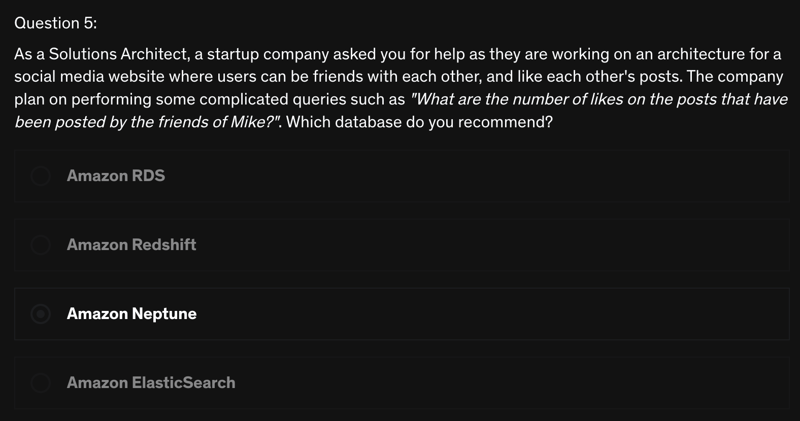
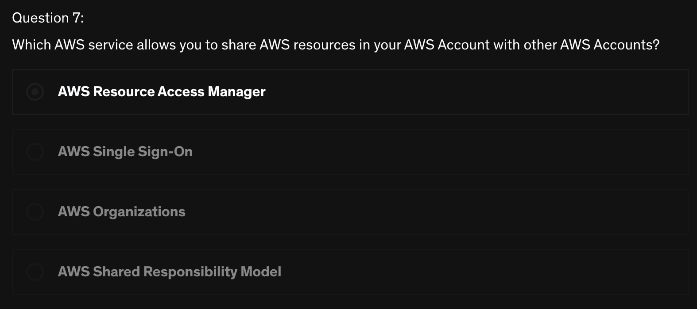

# Quiz
> [Udemy AWS SAA 강의](https://www.udemy.com/course/best-aws-certified-solutions-architect-associate/) Quiz 18, 19, 20 을 풀고, 어려운 문제를 선정하여 해설을 제출하기

<br>

## Quiz 18. Databases in AWS Quiz (12문제)

### Q5) 



```
답: 3번
```

#### [AWS Neptune](https://docs.aws.amazon.com/neptune/latest/userguide/intro.html)
> 빠르고 안정적인 완전 관리형 그래프 데이터베이스 서비스
- 고도로 연결된 데이터 세트를 사용하는 애플리케이션을 쉽게 빌드하고 실행할 수 있다
- Neptune은 특별한 용도의 `고성능 그래프 데이터베이스 엔진`이다
  - 이 엔진은 수십억 개의 관계를 저장하고 밀리초 대기 시간으로 `그래프를 쿼리하는 데 최적화`되어 있다
- Neptune은 읽기 전용 복제본, 시점 복구, Amazon S3 대한 지속적인 백업 및 가용 영역 간 복제를 통해 `뛰어난 가용성`을 가진다 
- Neptune은 유휴 및 전송 중 암호화를 지원하는 `데이터 보안 기능`을 제공한다
- Neptune은 `완벽하게 관리`되므로 하드웨어 프로비저닝, 소프트웨어 패치, 설정, 구성 또는 백업과 같은 `데이터베이스 관리 작업`에 대해 걱정할 필요가 없습니다.

<br>

## Quiz 19. Monitoring & Auditing Quiz (15문제)

N/A

## Quiz 20. IAM Advanced Quiz (8문제)

### Q7) 



```
답: 1번
```

#### [AWS Resource Access Mnanager(RAM)](https://docs.aws.amazon.com/ko_kr/ram/latest/userguide/what-is.html)
- AWS Resource Access Manager는 `Oranization` or `Organizational Units(OUs)` 내에서 AWS 리소스를 AWS 계정과 **안전하게 공유**할 수 있다
  - IAM Role 과 IAM User 와 리소스를 공유할 수도 있다
