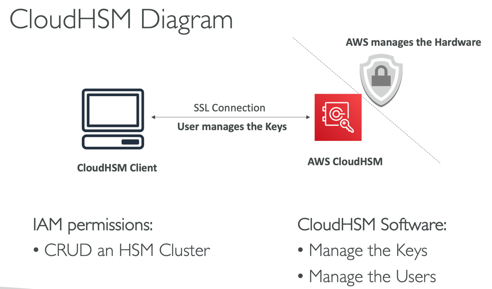
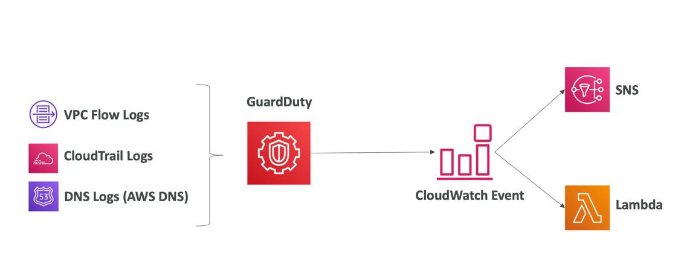
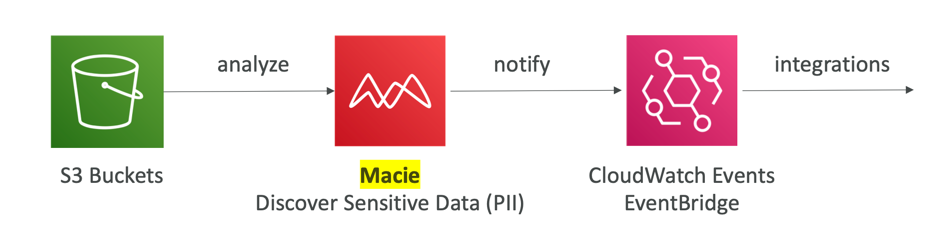

# Quiz 21: AWS 보안 및 암호화 퀴즈

## Question 6:
AWS KMST는 대칭 및 비대칭 KMS 키 모두를 지원합니다.
- (정답) 맞습니다.
```markdown
- 문제 내 오타: KMST (X) -> KMS (O)
KMS키는 대칭일 수도, 비대칭일 수도 있습니다. 대칭 KMS 키는 암호화와 복호화에 사용되는 256비트 키를 나타냅니다. 비대칭 KMS 키는 암호화 및 복호화, 혹은 서명과 검증에 사용되는 RSA 키 쌍을 나타내지만, 둘 다에 사용되지는 않습니다. 혹은 서명 및 검증에 사용되는 타원 곡선(ECC) 키 쌍을 나타냅니다.

# KMS Customer Master Key (CMK) 종류
- Customer Master Key는 사용자가 생성하는 것이 아닌 AWS에서 만들어 주는 것
- Client Side Encryption(사용자가 직접 키를 사용하여 암/복호화 하는 것)과 다름 
## 대칭 (Symmetric, AES-256 keys)
• First offering of KMS, single encryption key that is used to Encrypt and Decrypt
• AWS services that are integrated with KMS use Symmetric CMKs
• Necessary for envelope encryption
• You never get access to the Key unencrypted (must call KMS API to use)
• KMS API를 사용할 수 있을 때 사용 
## 비대칭 (Asymmetric, RSA & ECC key pairs)
• Public (Encrypt) and Private Key (Decrypt) pair
• Used for Encrypt/Decrypt, or Sign/Verify operations
• The public key is downloadable, but you can’t access the Private Key unencrypted
• Use case: encryption outside of AWS by users who can’t call the KMS API
• KMS API를 사용할 수 없을 때 사용

# (참고) envelope encryption
- key를 이용하여 암호화 시킨 데이터와 함께 key 또한 암호화 하고, 이것을 암호화된 데이터와 함께 동봉하여 보관하는 방식
```

## Question 8:
KMS CMK를 사용해 암호화된 EBS 스냅샷이 있는 AMI가 있습니다. 이 AMI를 다른 AWS 계정과 공유하려 합니다. AMI를 원하는 AWS 계정과 공유했으나, 다른 AWS 계정에서는 여전히 이를 사용할 수 없는 상태입니다. 이 경우, 어떻게 문제를 해결해야 할까요?
- 다른 AWS 계정이 로그아웃 후 다시 로그인해 자격 증명을 새로고침해야 함
- (정답) AMI를 암호화하는 데에 사용된 KMS CMK를 다른 AWS 계정과 공유해야 함
- 암호화된 EBS 스냅샷을 가진 AMI는 공유할 수 없음
```markdown
해설: 다른 계정에서는 암호화하는 데에 사용한 KMS API를 호출할 수 없기 때문에 키(CMK)를 계정 간(cross-account) 공유해야 함

# KMS Key Policies
## Default KMS Key Policy:
• Created if you don’t provide a specific KMS Key Policy
• Complete access to the key to the root user = entire AWS account
• Gives access to the IAM policies to the KMS key
• 기본키는 IAM 정책으로만 접근제어를 하기 때문에 계정 간 공유가 불가
## Custom KMS Key Policy:
• Define users, roles that can access the KMS key
• Define who can administer the key
• Useful for cross-account access of your KMS ke
• 커스텀 키는 IAM 정책 외에 직접 공유할 수 있기 때문에 계정 간 공유 가능 

# Copying Snapshots across accounts
1. Create a Snapshot, encrypted with your own CMK
2. Attach a KMS Key Policy to authorize cross-account access
3. Share the encrypted snapshot
4. (in target) Create a copy of the Snapshot, encrypt it with a KMS Key in your account
5. Create a volume from the snapshot
```

## Question 9:
S3 버킷과 EBS 스냅샷 모두를 암호화하는 데에 사용한 고객 관리형 CMK를 KMS에서 생성했습니다. 기업 정책에 따라 암호화 키를 매 3개월마다 교체해야 합니다. 어떻게 해야 할까요?
- KMS CMK를 다시 구성해 자동 교체를 활성화하고, ‘Period(기간)’를 3개월로 선택
- AWS에 의해 3개월 마다 자동으로 교체되는 AWS 관리 키를 사용
- (정답) KMS CMK를 수동으로 교체. KMS CMK를 생성하고 키 별칭을 사용해 새로운 KMS CMK를 참조. 오래된 데이터의 복호화를 위해 기존의 KMS CMK는 유지
```markdown
# 해설
- 3개월 -> 수동 키 순환을 사용해야 함
- (참고) 수동 키 순환은 CMK ID가 동일하기 때문에 alias(별칭)을 사용하여 변경사항을 숨기는 것이 좋음 

# KMS Automatic Key Rotation vs. KMS Manual Key Rotation
## 자동 키 순환
• For Customer-managed CMK (not AWS managed CMK)
• If enabled: automatic key rotation happens every 1 year
• Previous key is kept active so you can decrypt old data
• New Key has the same CMK ID (only the backing key is changed)
• 1년 주기로

## 수동 키 순환
• When you want to rotate key every 90 days, 180 days, etc...
• New Key has a different CMK ID
• Keep the previous key active so you can decrypt old data
• Better to use aliases in this case (to hide the change of key for the application)
• Good solution to rotate CMK that are not eligible for automatic rotation (like asymmetric CMK)
• 1년 이내의 주기로 순환이 필요할 때, 자동 키 순환이 불가한 비대칭 CMK를 사용할 때
```

## Question 12:
암호화 목적으로 사용하는 암호 값이 있고, 시간 경과에 따라 암호의 값을 저장하고 추적하려 합니다. 이 경우, 다음 중 어떤 AWS 서비스를 선택해야 할까요?
- AWS KMS 버전 관리 기능
- (정답) SSM 파라미터 스토어
- Amazon S3
```markdown
# SSM 파라미터 스토어
- SSM 파라미터 스토어는 암호를 저장하는 데에 사용될 수 있으며, 추적 기능이 내장되어 있습니다.
- 파라미터의 값을 수정할 때마다, SSM 파라미터 스토어가 파라미터의 새 버전을 생성하고 기존의 버전을 보관합니다
- 값을 포함한 모든 파라미터 버전의 내역을 상세히 볼 수 있습니다

# SSM Parameter Store (Simple Systems Manager Parameter Store)
• Secure storage for configuration and secrets
• Optional Encryption using KMS
• Serverless, scalable, durable, easy SDK
• Version tracking of configurations / secrets
• Configuration management using path & IAM
• Notifications with CloudWatch Events
• Integration with CloudFormation
```

## Question 14:
사용자 대면 웹사이트는 디도스 공격에 취약하며, 여러분은 이러한 공격에 대비해 24/7 지원을 받고자 합니다. AWS는 공격 중 발생한 비용에 대한 배상을 제공하고 있습니다. 이 경우, 다음 중 어떤 AWS 서비스를 선택해야 할까요?
- AWS WAF
- AWS Shield Advanced
- AWS Shield
- AWS DDoS OpsTeam
```markdown
- 24/7 지원은 AWS Shield Advanced를 사용해야 함 

# AWS Shield Standard
• Free service that is activated for every AWS customer
• Provides protection from attacks such as SYN/UDP Floods, Reflection attacks and other layer 3 & layer 4 attacks

# AWS Shield Advanced
• Optional DDoS mitigation service ($3,000 per month per organization)
• Protect against more sophisticated attack on EC2, ELB, CloudFront, Global Accelerator, Route 53
• 24/7 access to AWS DDoS response team (DRP)
• Protect against higher fees due to DDoS
```

## Question 15:
애플리케이션이 주요 데이터베이스의 구성 값을 외부적으로 유지하여 그 값을 런타임 시 선택할 수 있도록 하려 합니다. 제어와 버전 내역을 유지하기 위해서는 다음 중 어떤 장소에 구성 값을 저장해야 할까요?
- DynamoDB
- S3
- EBS
- SSM 파라미터 스토어
```markdown
설정 값에 대한 버전 내역을 유지하기 위해서는 SSM 파라미터 스토어를 사용해야 함
```

## Question 16:
암호화 키를 관리하고, 이들을 완전히 제어하기 위해 전용 하드웨어 모듈을 사용하려 합니다. 어떤 방법을 추천할 수 있을까요?
- (정답) CloudHSM
```
# CloudHSM (Hardware Security Module)
• CloudHSM vs. KMS
  • CloudHSM: AWS provisions encryption hardware
  • KMS: AWS manages the software for encryption 
• Dedicated Hardware (HSM = Hardware Security Module)
• You manage your own encryption keys entirely (not AWS)
• Must use the CloudHSM Client Software
• Good option to use with SSE-C encryption (server-side encryption with customer-provided encryption keys => when you want to manage your own encryption keys)
```


## Question 19:
EC2 인스턴스의 OS 취약점을 분석하려 합니다. 분석은 매주 수행되어야 하며, 취약점 발견 시 구체적인 권장 사항을 제공해야 합니다. 이 경우, 다음 중 어떤 AWS 서비스를 선택해야 할까요?
- AWS Shield
- Amazon GuardDuty
- Amazon Inspector
- AWS Config
```markdown
# Amazon Inspector
• Automated Security Assessments for EC2 instances
• Analyze the running OS against known vulnerabilities (with agent)
• Analyze against unintended network accessibility (agentless)
• OS 취약점 분석용 

# AWS Config
• Helps with auditing and recording compliance of your AWS resources
• Helps record configurations and changes over time
• Questions that can be solved by AWS Config:
  • Is there unrestricted SSH access to my security groups?
  • Do my buckets have any public access?
  • How has my ALB configuration changed over time?
• receive alerts (SNS notifications) for any changes
• 규정준수를 위한 AWS 설정이 변경되는지 감시하는 서비스
  
# Amazon GuardDuty
• Intelligent Threat discovery to Protect AWSAccount
• Uses Machine Learning algorithms, anomaly detection, 3rd party data
• One click to enable (30 days trial), no need to install software
```
- GuardDuty


## Question 18:
Application Load Balancer가 관리하는 한 세트의 EC2 인스턴스에 웹사이트가 호스팅되어 있습니다. 일반적인 웹 애플리케이션 공격(예: SQL 주입)으로부터 웹사이트를 보호하기 위해서는 다음 중 어떤 방법을 사용해야 할까요?
- (정답) AWS WAF
```markdown
# AWS WAF – Web Application Firewall
• Protects your web applications from common web exploits (Layer 7)
• Deploy on ALB, API Gateway, CloudFront
• Define Web ACL (Web Access Control List):
  • Rules can include: IP addresses, HTTP headers, HTTP body, or URI strings
  • Protects from common attack - SQL injection and Cross-Site Scripting (XSS)
  • Size constraints, geo-match (block countries)
  • Rate-based rules (to count occurrences of events) – for DDoS protection
```

## Question 20:
다음 중 자동 순환을 지원하며, RDS DB 비밀번호를 저장하는 데에 가장 적합한 AWS 서비스는 무엇인가요?
- (정답) Secrets Manager
- SSM Parameter Store
```markdown
- 민감정보를 저장한다는 점에서 SSM Paramter Store와 헷갈릴 수 있지만 Secrets Manger는 자동 순환을 지원함

# AWS Secrets Manager
• Newer service, meant for storing secrets
• Capability to force rotation of secrets every X days
• Automate generation of secrets on rotation (uses Lambda)
• Integration with Amazon RDS (MySQL, PostgreSQL, Aurora) • Secrets are encrypted using KMS
• Mostly meant for RDS integration
```

## Question 21:
AWS 조직 내 AWS 계정 전체의 EC2 보안 그룹과 AWS Shield Advanced를 중앙에서 관리하기 위해서는 다음 AWS 서비스 중 무엇을 사용해야 할까요?
- (정답) AWS Firewall Manager
```markdown
- AWS Firewall Manager는 보안 관리 서비스로 AWS Organizations에 있는 계정과 애플리케이션 간에서 방화벽 규칙을 구성하고 중앙 관리할 수 있게 해줍니다.
- AWS Organizations에 통합되어 있기 때문에, AWS WAF 규칙, AWS Shield Advanced 보호, 보안 그룹, AWS Network Firewall 규칙, Amazon Route 53 Resolver와 DNS 방화벽 규칙을 활성화할 수 있습니다.
```

## Question 22:
다음 중 S3 버킷에 저장된 민감한 데이터를 보호하기 위해서는 어떤 AWS 서비스를 사용해야 할까요?
- GuardDuty
- Shield
- (정답) Macie
- KMS
```markdown
Amazon Macie는 완전 관리형 데이터 보안 서비스로, 머신 러닝을 사용해 S3 버킷 내에 저장된 민감한 데이터를 발견하고 보호합니다. 이는 암호화되지 않은 버킷의 목록, 공용으로 액세스 가능한 버킷 및 다른 AWS 계정과 공유된 버킷을 포함한 S3 버킷의 인벤토리를 자동으로 제공합니다. 이를 사용하면, 개인 식별 정보(PII)와 같이 민감한 데이터를 식별해 경고해 줍니다.
```
