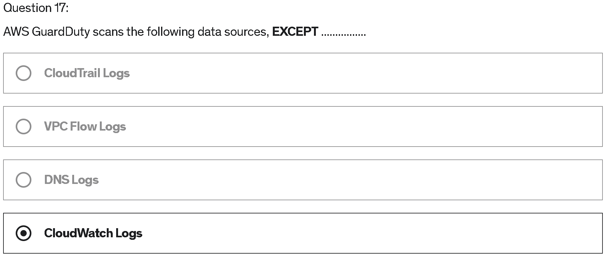
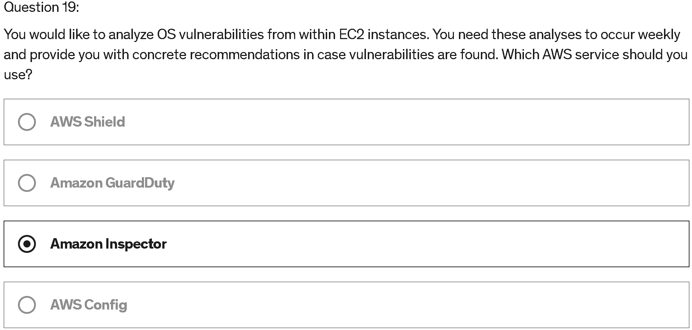

# Quiz
> [Udemy AWS SAA 강의](https://www.udemy.com/course/best-aws-certified-solutions-architect-associate/) Quiz 21 을 풀고, 어려운 문제를 선정하여 해설을 제출하기

<br>

## Quiz 21. AWS Security & Encription Quiz (22문제)

### Q17) 



```
답: 4번
```

#### [Amazon GuardDuty](https://docs.aws.amazon.com/ko_kr/guardduty/latest/ug/what-is-guardduty.html)

> Amazon GuardDuty란 AWS 계정과 워크로드를 보호하기 위해 악의적 활동 or 무단 동작을 지속적으로 모니터링하는 **위협 탐지 서비스**이다
- 아래의 data source를 분석하고, 처리하는 지속적 **보안 모니터링 서비스**이다
  - VPC Flow Logs
  - CloudTrail management event logs
  - CloudTrail S3 data event logs
  - EKS audit logs
  - DNS logs
- 악성 IP 주소 및 도메인 목록 등 위협 인텔리전스 피드를 바탕으로 Machine Learning을 사용하여 위협이 될만한 요소들을 탐지하고 그것들을 리스트로 표현해준다

<br>

### Q19) 



```
답: 3번
```

#### [Amazon Inspector](https://docs.aws.amazon.com/ko_kr/inspector/latest/user/what-is-inspector.html)
> Amazon Inspector는 **지속적으로 스캔**하는 **취약성 관리 서비스**이다
- AWS 취약성을 위한 워크로드인 Amazon Inspector는 Amazon EC2 인스턴스와 Amazon ECR 에 있는  컨테이너 이미지를 자동으로 검색하여 소프트웨어 취약성과 의도하지 않은 네트워크 노출이 있는지 검사한다