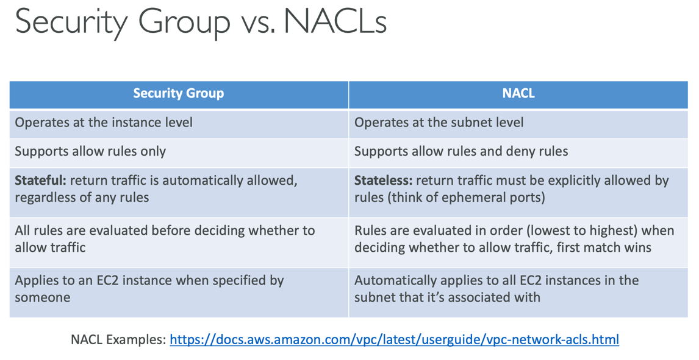
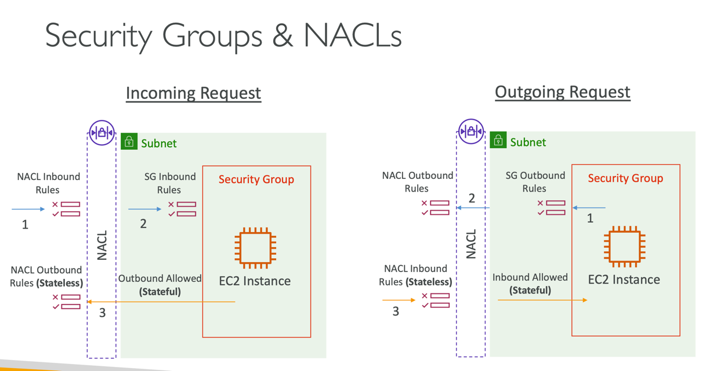
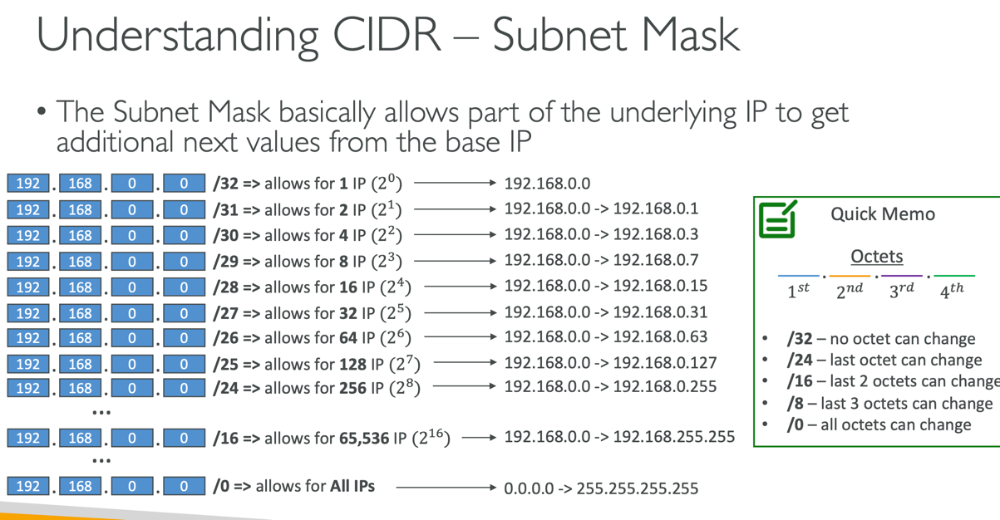
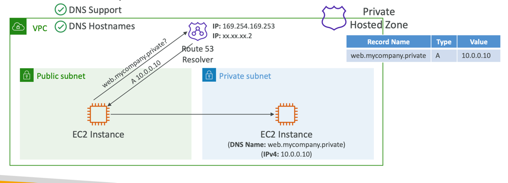
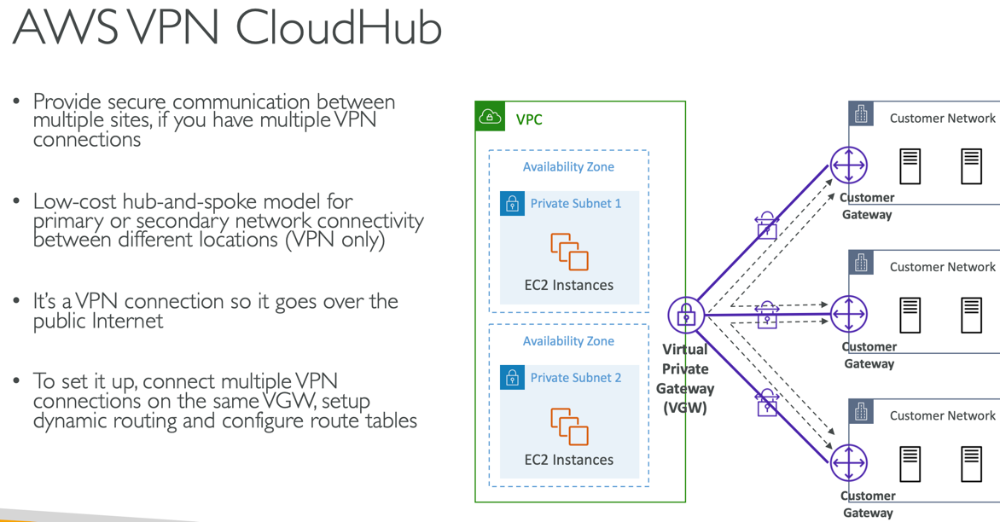
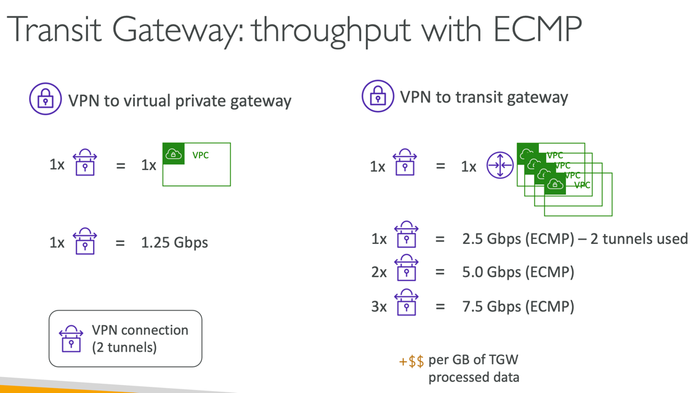
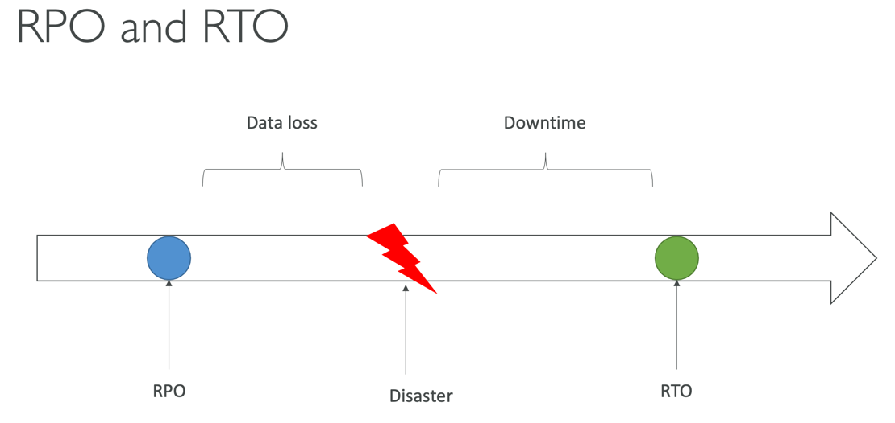
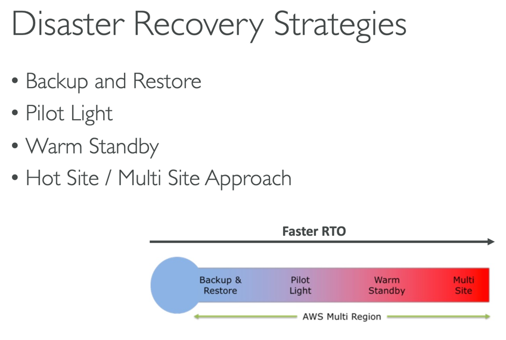
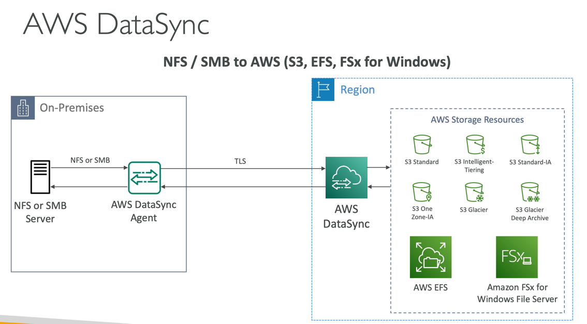
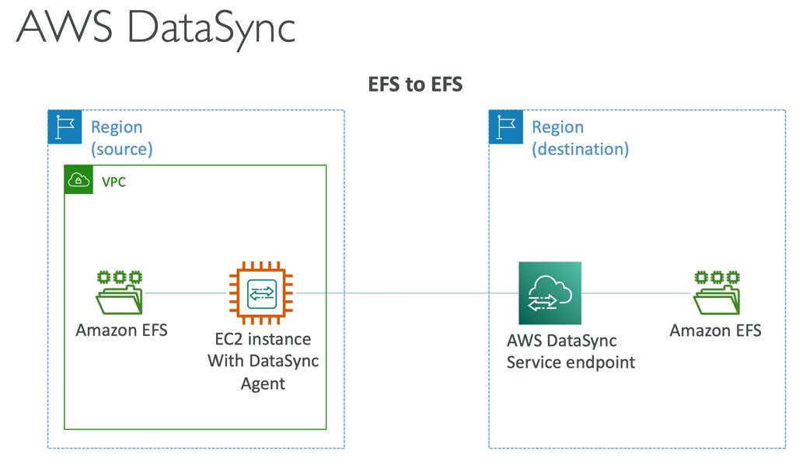

# Quiz 22: VPC 퀴즈
## Security Group vs. NACLs


- 보안그룹: stateful, 요청이 들어왔다면 다시 나갈 수 있다. 
- NACL: stateless, 규칙 기반이기 때문에 요청이 들어오지만 나가지 못할 수도 있다.

## Question 2:
인터넷 게이트웨이를 VPC에 연결했으나, 여전히 인터넷을 통한 EC2 인스턴스 액세스가 불가능한 상태입니다. 이런 경우, 가능성이 있는 원인이 아닌 것을 고르세요
- 라우팅 테이블에 항목이 누락됨
- (정답) 보안 그룹이 들어오는 트래픽을 허용하지 않음
- EC2 인스턴스에 공용 IP가 없음
- NACL이 나가는 네트워크 트래픽을 허용하지 않음
```markdown
- 보안 그룹은 상태를 유지하기 때문에, 트래픽이 나갈 수 있다면 다시 들어갈 수도 있음
- 인터넷 게이트웨이를 VPC에 연결했으면 보안 그룹 문제는 아님
```

## Question 5:
기업 데이터 센터와 AWS 계정 내 VPC A 사이에 Direct Connect 연결을 설정했습니다. 기업의 데이터센터가 다른 AWS 리전에 있는 VPC B로도 액세스할 수 있어야 합니다. 어떻게 해야 할까요?
- (정답) Direct Connect Gateway 사용하기

## Question 6:
CIDR 10.0.4.0/28은 무엇에 해당할까요?
- (정답) 10.0.4.0 to 10.0.4.15
```markdown
(해설) /28 -> 2^(32-28) = 2^4 = 16
```


## Question 8:
최소 28개의 EC2 인스턴스를 위한 용량을 갖는 서브넷을 생성하려 합니다. 이 경우, 서브넷에 필요한 최소 크기는 무엇인가요?
- /27
- /28
- (정답) /26
- /25
```markdown
- 28개 + reserved IP 5개를 포함하는 최쇠 CIDR
- 2^5 < 33개 < 2^6 => 2^(32-26) => /26 
```

## Question 10:
VPC에 새로운 서브넷을 생성할 때마다, AWS는 5개의 IP 주소를 예약합니다. CIDR 10.0.0.0/24로 서브넷을 생성할 경우, 다음 중 ....................를 제외한 IP 주소들이 예약됩니다
- (정답) 10.0.0.4
```markdown
# VPC – Subnet (IPv4)
- AWS reserves 5 IP addresses (first 4 & last 1) in each subnet
- ex) if CIDR block 10.0.0.0/24, then reserved IP addresses are:
  • 10.0.0.0 – Network Address
  • 10.0.0.1 – reser ved by AWS for the VPC router
  • 10.0.0.2 – reserved by AWS for mapping to Amazon-provided DNS
  • 10.0.0.3 – reserved by AWS for future use
  • 10.0.0.255 – Network Broadcast Address.AWS does not support broadcast in aVPC, therefore the address is reserved
```

## Question 11:
4개의 서브넷을 갖는 새로운 VPC를 생성했습니다. 이 서브넷들의 내부에 한 세트의 EC2 인스턴스를 실행했으나, 이 EC2 인스턴스들에 공용 호스트 이름이 할당되어 있지 않고, DNS resolution이 작동되고 있지 않다는 사실을 발견했습니다. 이 문제를 해결하기 위해서는 어떻게 해야 할까요?
- (정답) VPC에 DNS Resolution과 DNS Hostnames를 활성화
```markdown
# DNS Resolution in VPC
- enableDnsSupport=True & enableDnsHostname=True 설정시
- Private Hosted Zone에서 custom DNS domain name 사용가능

## DNS Resolution (enableDnsSupport)
- Decides if DNS resolution from Route 53 Resolver server is supported for theVPC

## DNS Hostnames (enableDnsHostnames)
- If True, assigns public hostname to EC2 instance if it has a public IPv4
```
- enableDnsSupport=True & enableDnsHostname=True 설정시 Private Hosted Zone에서 DNS 사용 가능


## Question 12:
여러분은 3개의 VPC A, B, C가 있습니다. 3개의 모든 VPC 간에 VPC 피어링 연결을 설정하려고 합니다. 어떻게 해야 할까요?
- VPC 피어링은 전이적 피어링을 지원하므로 2개의 VPC 피어링 연결(AB, BC)을 설정해야 합니다.
- (정답) 3개의 VPC 피어링 연결 설정(AB, AC, BC)

## Question 18:
여러분의 기업은 미국 전역에 몇 개의 온프레미스 사이트를 갖고 있습니다. 이 사이트들은 현재 프라이빗 연결을 사용해 연결되어 있으나, 최근에는 프라이빗 연결 제공자가 상당히 불안정해져 IT 아키텍처의 일부가 오프라인 상태가 되었습니다. 여러분은 온프레미스 사이트들을 연결하기 위해 공용 인터넷을 사용하는 백업 연결을 생성하여, 제공 업체에 문제가 발생한 경우 장애 조치로 사용을 하려 합니다. 어떤 방법을 추천할 수 있을까요?
- (정답) AWS VPN 클라우드허브
```markdown
# AWS VPN CloudHub
- VPC - 복수 on-premise 사이트 연결 용도
```


## Question 20:
Direct Connect 연결을 사용해, 공용 및 프라이빗 AWS 리소스 모두에 액세스할 수 있습니다.
- (정답) 거짓
```markdown
# Direct Connect (DX)
- Access public resources (S3) and private (EC2) on same connection
```

## Question 21:
온프레미스 데이터와 AWS Cloud 간에 구축된 AWS 사이트 대 사이트 VPC 연결 처리량을 단일 IP초 터널의 최대 제한인 1.25Gbps 이상으로 스케일 업하려 합니다. 어떻게 해야 할까요?
- 2개의 가상 프라이빗 게이트웨이 사용
- Direct Connect Gateway 사용
- (정답) Transit Gateway 사용


# Quiz 23: 재해 복구 & 이전 퀴즈
## RPO and RTO
- RPO: Recovery Point Objective, 복구시점목표
- RTO: Recovery Time Objective, 복구시간목표
- RPO, RTO을 단축시키기 위해서는 비용이 높일 수 밖에 없음


## Disaster Recovery Strategies


## Pilot Light vs. Warm Standby
- Pilot Light: A small version of the app (only core)
- Warm Standby: Full system (minimum size, scalable)

## Question 6:
You have on-premises sensitive files and documents that you want to regularly synchronize to AWS to keep another copy. Which AWS service can help you with that? (AWS 데이터베이스 마이그레이션 서비스)
- AWS Database Migration Service (AWS Database Migration Service(AWS DMS)를 사용하면 데이터베이스를 AWS로 빠르고 안전하게 이전시킬 수 있습니다.) 
- Amazon EFS (Amazon EFS)
- AWS Datasync (AWS 데이터싱크)
```markdown
- 한국어 번역이 이상해서 영어 문제를 같이 표기

# AWS DataSync
- 온라인 데이터 전송 서비스
- 온프레미스 스토리지 시스템과 AWS 스토리지 시스템 간의 데이터 이전, 그리고 AWS 스토리지 서비스들 간의 데이터를 이전 과정을 단순화, 자동화 및 가속화해 주는 서비스
- ex) -> Amazon S3 (all storage classes, including Glacier), Amazon EFS, Amazon FSx for Windows
```



## site to site VPN vs. direct connect
- https://dev.classmethod.jp/articles/what-is-differnce-aws-dx-ans-vpn-kr/