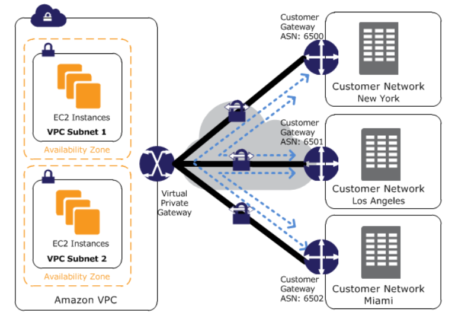

# Quiz
> [Udemy AWS SAA 강의](https://www.udemy.com/course/best-aws-certified-solutions-architect-associate/) Quiz 22, 23 을 풀고, 어려운 문제를 선정하여 해설을 제출하기

<br>

## Quiz 22. VPC Quiz (22문제)

### Q9) 


```
답: 3번
```

#### VPC Gateway Endpoint와 Interface Endpoint

- `VPC Gateway Endpoint`
  - VPC Endpoint를 갖는 서비스: Amazon S3, DynamoDB
- `Interface Endpoint`
  - Private Link 를 이용한 private IP
  - Interface Endpoint를 갖는 서비스: 위의 2개의 서비스 제외 전부 다


<br>

### Q13)


```
답: 1번
```

#### [VPC Flow Logs](https://docs.aws.amazon.com/vpc/latest/userguide/flow-logs.html)

> `VPC FLow Logs` 는 VPC의 Network Interface 에서 전송되고 수신되는 IP traffic 에 대한 정보를 수집하는 기능이다
- Flow log data는 `Amazon CloudWatch Log` 또는 `Amazon S3` 에 publish 될 수 있다
- **Flow log가 도움이 되는 작업들**
  - 지나치게 제한적인 Security Group rules 진단
  - 인스턴스에 도달하는 traffic monitoring
  - Network interface를 오가는 트래픽 방향 결정
- Flow log data는 Network traffic 경로 외부에서 수집되므로, Network 처리량이나 지연 시간에 영향을 주지 않는다
  - **Network의 성능에 영향을 주지 않고** Flow log를 생성/삭제할 수 있다!


<br>

### Q18)


```
답: 2번
```

#### [VPN CloudHub](https://docs.aws.amazon.com/vpn/latest/s2svpn/VPN_CloudHub.html)

- 다수의 AWS Site-to-Site VPN 연결을 사용하는 경우 AWS VPN CloudHub로 사이트 간에 **보안 통신**을 제공할 수 있다
  - 이를 통해 원격 사이트가 VPC 뿐만 아니라 서로 통신할 수 있다
