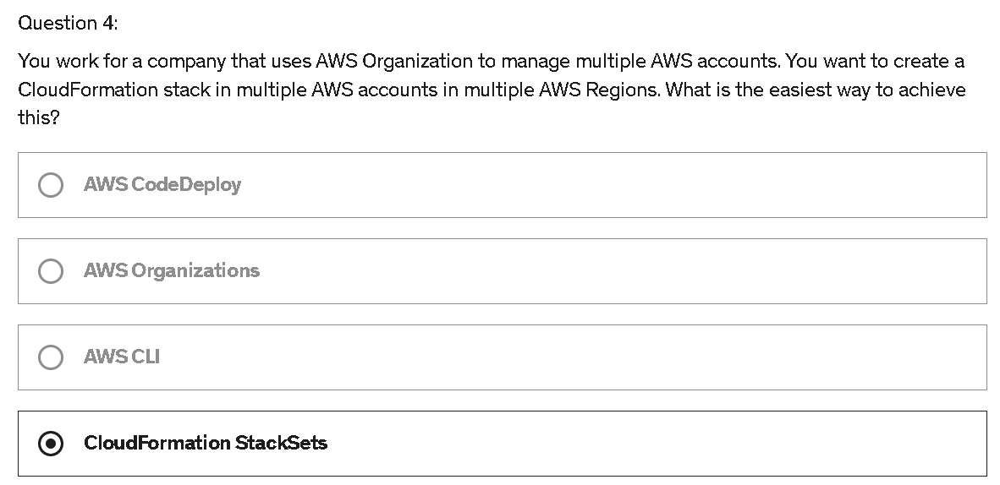
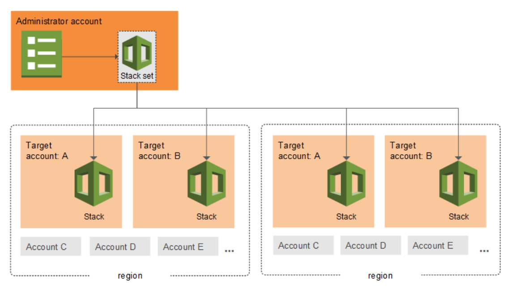

# Quiz

> [Udemy AWS SAA 강의](https://www.udemy.com/course/best-aws-certified-solutions-architect-associate/) Quiz 25를 풀고, 어려운 문제를 선정하여 해설을 제출하기

<br>

## Quiz 25. Other Services Quiz (15문제)

### Q4)



```text
답: 4번
```

#### [CloudFormation StackSets](https://docs.aws.amazon.com/ko_kr/AWSCloudFormation/latest/UserGuide/what-is-cfnstacksets.html)



- AWS CloudFormation StackSets는 단일 작업으로 여러 계정 및 리전에 대해 스택을 **생성**, **업데이트** 또는 **삭제**할 수 있도록 하여 스택의 기능을 확장한다
- 관리자 계정을 사용하여 template을 정의 & 관리하고, template을 지정된 AWS CloudFormation region에 대해 선택한 대상 계정으로 stack을 프로비저닝하기 위해 사용한다

<br>

## Optional) Practice Test 3: AWS 공인 솔루션스 아키텍트 – 어소시에이트 연습문제 3

### Q1) 

AWS Lambda와 함께 서버리스 컴퓨팅을 사용하여 서버를 설정하거나 관리하지 않고도 애플리케이션을 구축하고 실행하는 소프트웨어 개발팀을 이끌고 있습니다. MongoDB Atlas에 연결하는 Lambda 함수가 있습니다. 이 서비스는 인기 있는 DBaaS (Database as a Service) 플랫폼이며 타사 API를 사용하여 애플리케이션의 특정 데이터를 가져옵니다. 개발자 중 한명에게 MongoDB 데이터베이스 호스트 이름, 사용자 이름 및 비밀번호에 대한 환경 변수와 DEV, SIT, UAT 및 PROD 환경을 위한 Lambda 함수에서 사용할 API 자격 증명을 작성하도록 지시했습니다.
Lambda 함수가 중요한 데이터베이스 및 API 자격 증명을 저장하는 것을 고려할 때 팀의 다른 개발자나 다른 사람이 이러한 자격 증명을 일반 텍스트로 보지 못하도록 이러한 정보를 어떻게 보호 할 수 있습니까? (최대한의 보안을 제공하는 최상의 옵션을 선택해야 합니다)

- AWS Lambda는 환경 변수에 대한 암호화를 제공하지 않습니다. 대신 EC2 인스턴스에 코드를 배포합니다.
- 새 KMS 키를 만들어 AWS 키 관리 서비스를 활용하는 암호화 도우미가 중요한 정보를 저장하고 암호화할 수 있도록 합니다.
- 민감한 정보를 저장하고 암호화 하기 위해 AWS CloudHSM을 활용하는 SSL 암호화를 활성화합니다.
- 기본적으로 AWS Lambda는 이미 AWS Key Management Service를 사용하여 환경 변수를 암호화하므로 아무 것도 수행 할 필요가 없습니다.

```text
정답: 2번
선택한 답: 4번
```

#### AWS Lambda

- Lambda는 기본적으로 함수의 환경 변수를 암호화하지만, 중요한 정보는 Lambda 콘솔에 액세스할 수 있는 다른 사용자에게 계속 표시된다
- 이것는 Lambda가 기본 KMS 키를 사용하여 변수를 암호화하기 때문이며, 일반적으로 다른 사용자가 액세스할 수 있기 때문이다
- 그러므로 `암호화 도우미`를 사용하여 환경 변수를 보호해야 한다!

<br>

### Q5)

애플리케이션은 다중 AZ 배포 구성에서 EC2 인스턴스의 Auto Scaling 그룹, Application Load Balancer 및 MySQL RDS 인스턴스로 구성됩니다. 고객의 기밀 데이터를 보호하려면 인증 토큰을 통해 EC2 인스턴스와 관련된 프로필 자격 증명을 사용해야만 RDS 데이터베이스에 액세스 할 수 있어야 합니다.
위의 요구 사항을 충족하기 위해 다음 중 어떤 작업을 수행해야 합니까?

- IAM DB 인증을 활성화합니다.
- IAM 역할을 생성하고이를 EC2 인스턴스에 할당하면 RDS 인스턴스에 독점적으로 액세스 할 수 있습니다
- RDS에 대한 데이터베이스 연결을 암호화 하도록 애플리케이션에서 SSL 구성합니다.
- IAM과 STS의 조합을 사용하여 임시 토큰을 통해 RDS 인스턴스에 대한 액세스를 제한합니다.

```text
정답: 1번
선택한 답: 2번
```

#### IAM DB 인증

- IAM DB 인증을 사용하여 DB 인스턴스에 인증할 수 있다
  - DB 인스턴스에 연결할 때 암호를 사용할 필요가 없으며, 대신에 `인증 토큰` 을 사용한다
  - MySQL, PostgreSQL 에서 작동한다
- 인증 토큰
  - 요청이 있을 때 Amazon RDS가 생성하는 고유 문자열
  - 각 토큰의 수명은 15분
  - 인증을 외부에서 IAM을 사용해 관리하기 때문에 사용자 자격 증명을 데이터베이스에 저장할 필요 X
- IAM DB 인증의 장점
  - DB를 오가는 네트워크 트래픽은 SSL(Secure Sockets Layer)을 통해 암호화된다
  - DB 리소스에 대한 액세스는 DB 인스턴스에서 개별적으로 관리할 필요 없이 IAM을 통해 중앙에서 관리할 수 있다
  - Amazon EC2에서 실행되는 애플리케이션의 경우, 암호가 아닌 EC2 인스턴스용 프로파일 자격 증명을 사용해 데이터베이스에 액세스하기 때문에 보안을 더욱 강화하는 효과가 있다!

<br>

### Q12)

회사에는 SWF (Simple Workflow Service)를 사용하여 순차 백그라운드 작업을 처리하는 EBS 지원 EC2 인스턴스에 호스팅 된 애플리케이션이 있습니다. 애플리케이션은 프로덕션 환경에서 잘 작동하며 관리자는 비즈니스의 다른 영역에도 동일한 솔루션을 구현하도록 요청했습니다.
SWF(Simple Workflow Service)와 Amazon EC2를 모두 솔루션으로 사용할 수 있는 다른 시나리오는 무엇입니까? (2 개 선택)

- 컨텐츠 전달 네트워크가 필요한 웹 애플리케이션
- 분산 비즈니스 프로세스의 실행 조정
- 전자 상거래 모바일 앱의 다단계 및 다중 결정 체크 아웃 프로세스 관리
- 메시지 큐가 필요한 응용 프로그램의 경우 SES로 사용
- 모바일 애플리케이션을 위한 분산 세션 관리

```text
정답: 2, 3번
선택한 답: 2, 5번
```

#### Amazon SWF

- Amazon SWF를 사용하면 분산된 구성 요소에 대해 작업을 조정하는 애플리케이션을 쉽게 구축할 수 있다
- Amazon SWF에서 작업은 애플리케이션의 구성 요소가 수행하는 `논리적 작업 단위` 이다
- Amazon SWF를 사용하면 작업의 진행 상황을 추적하고 상태를 유지 관리할 수 있다
- Amazon SWF를 사용하는 경우 작업을 수행할 작업자를 구현하고, 작업자를 EC2 같은 `클라우드 인프라`나 `온프라미스 인프라`에서 실행한다
- Amazon SWF는 작업을 저장하고, 작업자가 준비되면 작업자에게 작업을 할당하며, 진행 상황을 추적하고, 완료 세부 정보를 비롯하여 작업 상태를 기록한다

#### 오답 풀이

: "모바일 애플리케이션을 위한 분산 세션 관리" 는 ElastiCache가 분산 세션 관리에 가장 적합한 옵션이라고 함

<br>

### Q27)

회사가 도커화 된 애플리케이션 스택을 AWS 클라우드로 이전하는 것을 고려하고 있습니다. 이 회사는 Fargate 시작 유형의 ECS (Elastic Container Service)와 비교하여 EC2 시작 유형의 ECS 사용에 대한 가격을 잘 모릅니다.
이 두 서비스의 가격과 관련하여 다음 중 올바른 것은 무엇입니까?

- EC2 시작 유형의 ECS와 Fargate 시작 유형의 ECS는 컨테이너화된 애플리케이션이 요청하는 vCPU 및 메모리 리소스에 따라 요금이 청구됩니다.
- EC2 시작 유형의 ECS와 Fargate 시작 유형의 ECS는 모두 사용된 EC2 인스턴스 및 EBS 볼륨에 따라 요금이 부과됩니다.
- EC2 시작 유형의 ECS와 Fargate 시작 유형의 ECS는 시간당 사용되는 Elastic Container Service에 따라 요금이 청구됩니다.
- EC2 시작 유형의 ECS는 사용된 EC2 인스턴스 및 EBS 볼륨에 따라 요금이 청구됩니다. Fargate 시작 유형의 ECS는 컨테이너화된 애플리케이션이 요청하는 vCPU 및 메모리 리소스에 따라 요금이 청구됩니다.

```text
정답: 4번
선택한 답: 1번
```

#### 오답 풀이

- Amazon Elastic Container Service(ECS)에는 두 가지 서로 다른 요금 모델이 있다
  - **Fargate 시작 유형 모델**
    - Fargate에서는 컨테이너화된 애플리케이션에서 요청하는 vCPU 및 메모리 리소스 양에 대해서만 지불하면 된다
    - vCPU 및 메모리 리소스는 컨테이너 이미지를 가져온 시간부터 Amazon ECS 작업*이 종료된 시간까지 계산되며 가장 가까운 시간(초)까지 반올림된다
  - **EC2 시작 유형 모델**
    - EC2 시작 유형에 대해서는 추가 요금이 없다!
    - 애플리케이션을 저장하고 실행하기 위해 생성한 AWS 리소스(예: EC2 인스턴스 또는 EBS 볼륨)에 대한 비용만 지불하면 된다
- Amazon ECS on AWS Outposts는 EC2 시작 유형과 동일한 모델을 따른다

<br>

### Q35)

데이터 분석 회사에서 애플리케이션 워크플로우의 다양한 프로세스를 분리하기 위해 SQS 대기열을 사용하고 있습니다. 회사는 대기열에 특정 메시지 배달을 1분 연기하고 다른 모든 메시지는 대기열에 즉시 배달해야 합니다.
회사에 제안할 솔루션은 다음 중 무엇입니까?

- 제한 시간 초과를 사용하여 특정 메시지를 대기열에 1분 전달하는 것을 연기합니다.
- 지연 대기열을 사용하여 특정 메시지를 대기열에 전달하는 것을 1분 연기합니다.
- 배달 못한 편지 대기열을 사용하여 대기열에 특정 메시지 전달을 1분 연기합니다.
- 메시지 타이머를 사용하여 대기열에 대한 특정 메시지 배달을 1분 연기합니다.

```text
정답: 4번
선택한 답: 2번
```

#### SQS의 메시지 타이머

- 메시지 타이머를 사용하여 대기열에 추가되는 메시지의 `초기 미표시 기간`을 지정한다
- 메시지의 기본(최소) 지연 시간은 `0초`, 최대값은 `15분`

<br>

### Q43)

AWS Organization에서 관리하는 여러 AWS 계정이 있으며 이러한 모든 계정의 모든 EC2 인스턴스가 비공개적으로 통신 할 수 있도록 하려고 합니다.
다음 중 가장 저렴한 비용으로 기능을 제공하는 솔루션은 무엇입니까?

- 모든 VPC간에 VPC 피어링 연결을 만듭니다.
- 계정에서 VPC를 생성하고 Resource Access Manager를 사용하여 다른 계정과 VPC를 공유합니다.
- 모든 EC2 인스턴스간에 프라이빗 링크를 생성합니다.
- Transit Gateway를 생성하고 모든 계정의 모든 VPC를 함께 연결합니다.

```text
정답: 2번
선택한 답: 1번
```

#### AWS Resource Access Manager(RAM)

- AWS Resource Access Manager(RAM)로 `AWS 계정` 또는 `AWS Organizations 내에서 리소스`를 공유할 수 있다
- 여러 AWS 계정을 사용하는 고객은 집중식으로 리소스를 생성하고 RAM을 사용하여 여러 계정 간에 공유할 수 있으므로 다중 계정 전략의 이점을 유지하면서 고객의 `운영 오버헤드`는 줄일 수 있다
- RAM을 사용하여 `리소스를 공유`하면 고객이 각 계정에서 중복 리소스를 만들지 않아도 되므로 `비용을 절감`할 수 있다

#### 오답 풀이

:  RAM을 사용하여 VPC를 공유하면, 모든 EC2 인스턴스를 동일한 VPC에 배포하고 서로 쉽게 통신할 수 있다!
