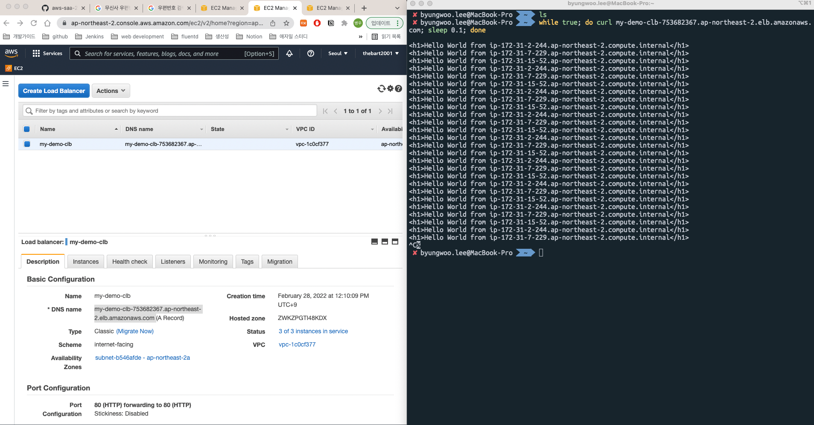

# CLB 실습



## 1. EC2 > Instances > Launch Instance 선택
- 테스트를 위해서 internet-facing 선택
- user data
```bash
#!/bin/bash
# Use this for your user data (script from top to bottom)
# install httpd (Linux 2 version)
yum update -y
yum install -y httpd
systemctl start httpd
systemctl enable httpd
echo "<h1>Hello World from $(hostname -f)</h1>" > /var/www/html/index.htmlks-
```
- sg rule inbound
```
HTTP, 80, src 0.0.0.0/0
SSH, 22, src 0.0.0.0/0
```
- 동일하게 3개의 인스턴스 생성 (동일한 sg 사용할 것)

## 2. EC2 > LB > Create LB > CLB 선택
- sg rule inbound
```
HTTP, 80, src 0.0.0.0/0
```
- healthcheck
```
HTTP, 80, /index.html
```
- add ec2 instances: 1에서 만든 n개의 인스턴스 연결

## 3. 인스턴스 확인
- 2에서 만든 CLB의 Public DNS으로 요청 
```
while true; do curl ${CLB_PUBLIC_DNS}; sleep 1; done
```

## 4. 보안강화
- 1에서 만든 EC2의 sg의 inbound rule 수정하여 보안 강화
- CLB에서 오는 트래픽만 허용하도록 변경
```
(delete) HTTP, 80, src 0.0.0.0/0
(add) HTTP, 80, src ${clb-sg}
```
```bash
curl ${EC2_PUBLIC_DNS} # response error
curl ${CLB_PUBLIC_DNS} # response successs
```