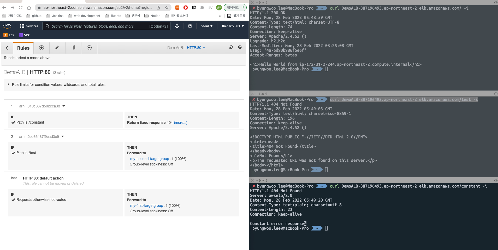

# ALB 실습



## 1. EC2 > LB > Create LB > ALB 선택
- DemoALB 생성
- 테스트를 위해서 internet-facing 선택
- Listeners and Routing: HTTP, 80, Forward to ${my-first-tg}
### Create Target Group (my-first-tg)
- Target Type: Instance Type
- Health Checks: `HTTP /` (빠른 테스트를 위해 `Advanced health check settings` 조정 가능)
- Register Targets: CLB 실습에서 사용한 EC2를 등록하거나 없다면 새로 생성
### Create EC2
- CLB 실습과 동일하게 아래의 user data를 가진 EC2 3개 생성
```bash
#!/bin/bash
# Use this for your user data (script from top to bottom)
# install httpd (Linux 2 version)
yum update -y
yum install -y httpd
systemctl start httpd
systemctl enable httpd
echo "<h1>Hello World from $(hostname -f)</h1>" > /var/www/html/index.html
```
### 테스트
```bash
curl ${ALB_PUBLIC_DNS}
```

## 2. EC2 > TG
- DemoTG 선택 > Targets > Register Targets
- Available instances 중에서 추가하고자 하는 EC2 선택하여 추가
### 접속 테스트
```bash
curl ${ALB_PUBLIC_DNS}
```

## 3. EC2 > LB
- Target Group 생성(my-second-tg) 및 EC2 인스턴스 1개 연결
- 1번에서 생성한 DemoALB 선택 > Listeners > HTTP:80 View/edit rules
```
# 1,2번쨰에 rule 추가
IF /test THEN forward_to my-second-tg
IF /constant THEN reponse_code=404, contents_type=text/plain, reponse_body="Constant error reponse" 
```
- 테스트
```bash
curl ${ALB_PUBLIC_DNS} # 200 OK
curl ${ALB_PUBLIC_DNS}/test # Not Found
curl ${ALB_PUBLIC_DNS}/constant # 404
```