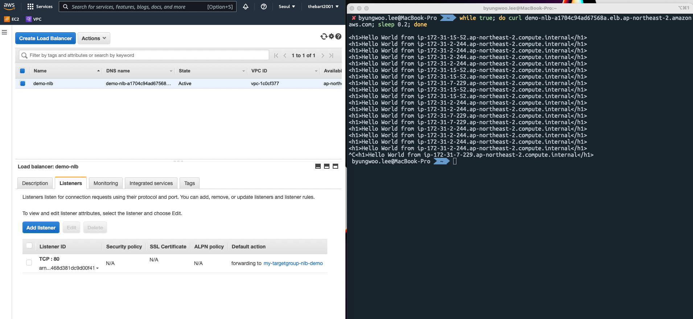

# NLB 실습


## 1. EC2 > LB > Create LB
- NLB 선택
- Subnet > IPv4 address > Assigned by AWS (also supports Elasitc IP)
- Listeners and Routing > Create Target Group
```
TCP 80, forward to ${my-tg-nlb-demo}
```
### Target Group
- my-tg-nlb-demo 생성
- Target Type: Instances
- TCP 80
- Healthcheck TCP
- CLB, ALB 실습에서 사용한 EC2 3대 등록

## 2. Security Group Rule 수정
- NLB는 Security Group이 없다.
- NLB -> TG(EC2)에서 EC2의 sg를 다음과 같이 수정
```
# inboud rule
HTTP 80 0.0.0.0/0
```