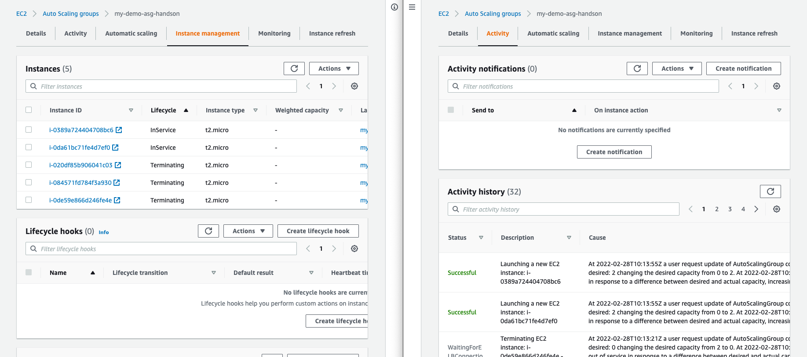

# ASG 실습


## 1. EC2 > Auto Scaling Groups
- Name: DemoASG
- Subnets: 여러 Availity Zone에 걸쳐서 선택
- Health checks: EC2, ELB 모두 선택
- Group size: desired 1, min 1, max 1
- Scaling Policies: None
- TargetGroup: my-first-target-group (LoadBalancer: DemoALB)
### Launch Template
- Name: MyDemoTemplate
- Advanced Details > user data
```
#!/bin/bash
# Use this for your user data (script from top to bottom)
# install httpd (Linux 2 version)
yum update -y
yum install -y httpd
systemctl start httpd
systemctl enable httpd
echo "<h1>Hello World from $(hostname -f)</h1>" > /var/www/html/index.htmlks-
```
### ASG & EC2 확인
- EC2 > ASG > Activity, Instance Management 확인
- EC2 > TG > my-first-target-group > Registerd targets 확인
```bash
curl ${DemoALB_Public_DNS}
```

## 2. Scaling ASG
- EC2 > ASG > DemoASG > Details
- min, desired, max 조정
- EC2 > ASG > Activity, Instance Management 확인
- EC2 > TG > my-first-target-group > Registerd targets 확인