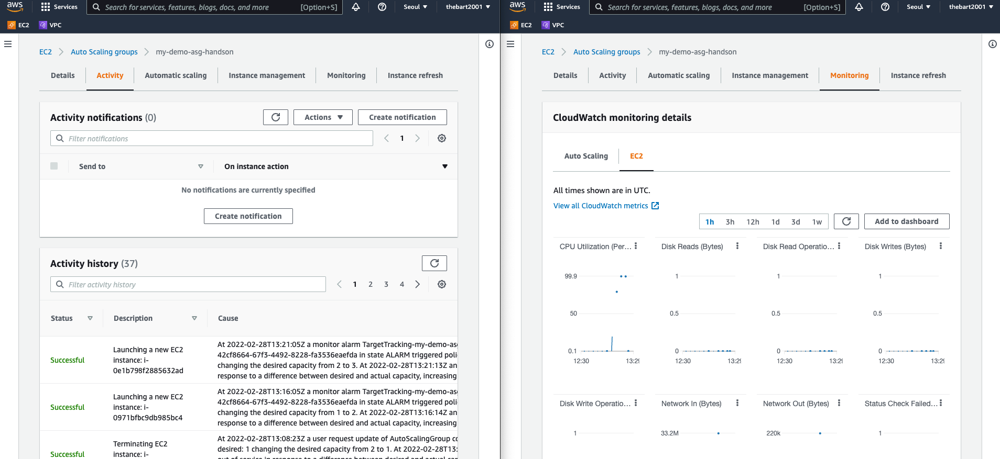

# ASG Scaling Policy 실습


## 1. EC2 > ASG > DemoASG
### Automatic scaling > Dynamic Scaling Policies
- Create Dynamic Scaling Policy
```
- Target tracking scaling
- Target Tracing Policy
- Average CPU utilization
- Target Value 40
```
### Details > Group Details
- Group Details 수정: min=1, desired=1, max=3

## 2. EC2 > ASG > DemoASG > Instance Management
- 인스턴스에 부하주기
- 접속: 인스턴스 선택 > Connect
- stress 도구 설치 및 실행
```bash
sudo amazon-linux-extras install epel -y
sudo yum install stress -y
stress -c 4
```
- EC2 > ASG > DemoASG > Monitoring: CPU 사용률 확인
- EC2 > ASG > DemoASG > Activity: scaling 확인

## 3. CloudWatch > Alarms > In alarm
- TargetTracking Policy 알람 발생 확인