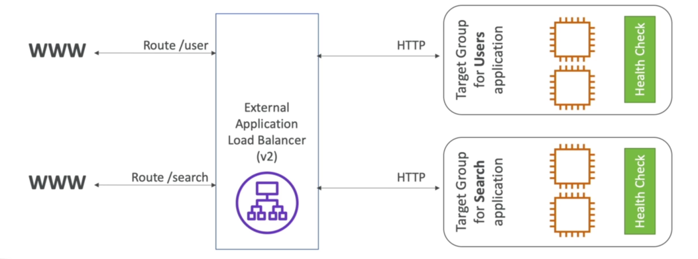
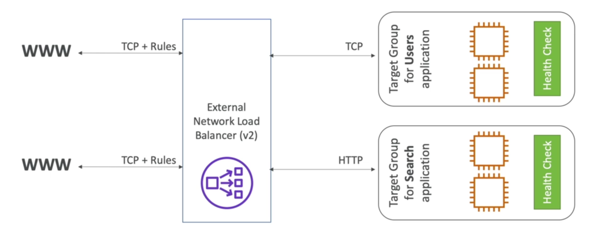
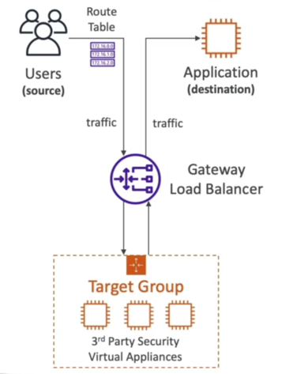
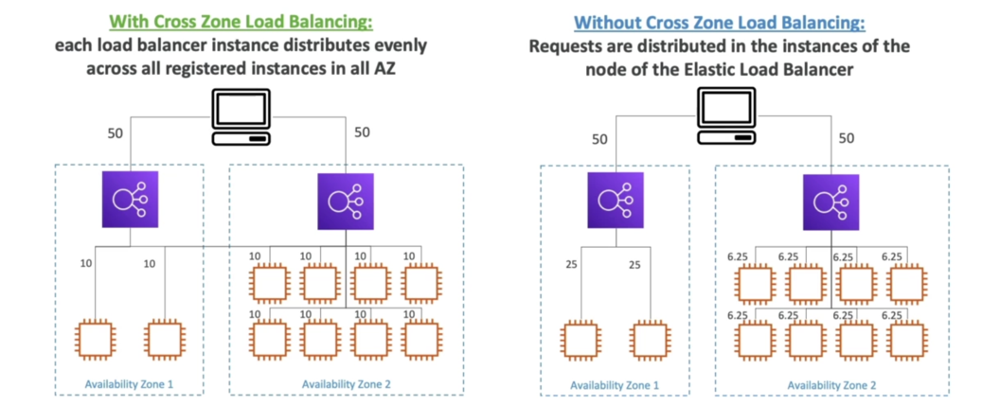
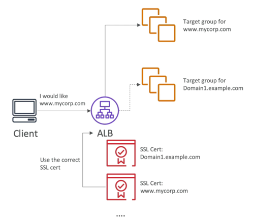

# Elasitc Load Balancer (ELB)

## Scalability (스케일링성)
### Vertical Scalability: scale-down/up
- increase instance size: t2.micro → t2.large
- ex) RDS, ElasticCache
### Horizontal Scalability: scale-in/out
- increase number of instances

## High Availiability (HA, 고가용성)
- running your application/system at least 2 data centers(=AZ)
- goal: to survive a data centers loss
- can be passive (사용자가 통제불가하며 기능지원이 필요, ex. RDS Multi AZ)
- can be active (사용자가 통제/설계 가능, ex. for horizontal scaling)

## Load Balancer (LB)
- servers that forward traffic to multiple servers downstream (ex. EC2 instances)
- ex) user -> ELB -> EC2 instances

## Why use LB? 
- spread load (부하분산)
- expose single point of access (DNS) to your app (단일접근지점 제공)
- handle failures of downstream instances
- regular health checks
- SSL termination (HTTPS)
- stickiness with cookies
- HA across zones
- seperate public traffic from private traffic (expose only LB in public)

## Why use ELB?
- managed LB
  - guaratees working
  - upgrade, maintenance, HA
  - few configuration nobs (설정의 단순화)
- 직접 구축하는 것이 저렴하나 직접 관리하기 것은 너무 어렵다
- integrated with AWS services
  - EC2, ASG, ECS
  - ACM, CloudWatch
  - Route53, WAF, Global Accelerator

## Health Checks
- crucial for LB
- enable LB to know traffic forwarded downstream instances are available 
- required: port, protocol, endpoint
- if repsonse is not 200 OK, then instance is unhealthy
- ex) ELB -(HTTP 4567 /health)-> EC2 instanes

## AWS LB 종류
- CLB(v1): HTTP, HTTPS, TCP, SSL(secure TCP)
- ALB(v2): HTTP, HTTPS, WebSocket
- NLB(v2): TCP, TLS(secure TCP), UDP
- GWLB(v2): layer 3 (Network layer) - IP Protocol
- some LB can be internal(private) or external(public)
- [ELB 제품 상세 비교](https://aws.amazon.com/ko/elasticloadbalancing/features/#Product_comparisons)
- ELB 제품 간단 비교

> 출처: https://wisen.co.kr/pages/blog/blog-detail.html?idx=1926

## Load Balancer Secutiy Groups (SG)
- Users -(HTTPS/HTTP from any)-> LB -(HTTP Restricted to LB)→ EC2
- LB SG: HTTP/HTTPS, 80/443, src 0.0.0.0/0
- EC2 SG: HTTP, 80, sg-${lb} (LB에서 오는 통신만 허용)

## Classic Load Balancer (CLB, v1)
- Client -> CLB -> EC2 
- TCP(layer4), HTTP/HTTPS(layer7)
- TCP or HTTP based health checks
- fixed hostname: ex) XXX.region.elb.amazonaws.com
- [2022.8.15에 서비스 종료 예정](https://aws.amazon.com/ko/blogs/korea/ec2-classic-is-retiring-heres-how-to-prepare/)

## Application Load Balancer (ALB, v2)
- Layer7 (HTTP)
- downstream/backend
  - multiple HTTP apps across machines (Target Groups, TG)
  - multiple apps on the same machine (ex. containers)
- support HTTP/2, WebSocket
- support redirects (ex. from HTTP to HTTPS)
- routing tables to different TG
  - path (ex. /user, /posts)
  - hostname (ex. one.example.com, other.example.com)
  - query string, headers (ex. ?id=123&order-false)
- great for micro services, container based apps (ex. Docker, ECS)
- [dynamic port mapping feature for ECS](https://ohgym.tistory.com/69)
- CLB vs. ALB
  - multiple CLB -> multiple apps 
  - one ALB for multiple apps (simple!)

## ALB Target Groups (TG)
- 종류
  - EC2 instances (or can be managed by ASG) - HTTP
  - EC2 tasks (managed by ECS) - HTTP
  - Lamda functions
  - IP address (private)
- ALB can route to mutiple TG
- health checks are at TG level
  - 따라서 health check path는 TG 간에 동일하여도 문제없음

## ALB Tips
- fixed hostname for ALB (ex. XXX.region.elb.amazonaws.com)
- application can not know real IP directly! 
  - real client IP is inserted in X-Forwared-For header
  - also can get X-Forwarded-Port, X-Forwarded-Proto header
  - so to get real IP/Port/Proto, use X-Forwarded-* header!

## Network Load Balancer (NLB, v2)
- Layer 4
  - forward TCP/UDP
  - handle millions of request per seconds
  - 100ms latency (vs 400ms for ALB)
- has one static IP per AZ
- support Elastic IP (for whitelisting IP)
- used for extreme performance (TCP/UDP traffic)
- not AWS free tier

## NLB Target Groups (TG)
- EC2 instances
- IP addresses (private)
- ALB (to expose static IP)

## Gateway Load Balancer (GWLB, v2)
- to manage 3rd party network virtual appliances in AWS
- ex) Firewalls, Intrusion Detection, Prevention System, Deep Packet Inspection Systems, ...
- Users → Route Table → GWLB → 3rd Party Security Virtual Appliances → Application

- Layer 3 (Network Layer) - IP Packets
- 2개의 기능 통합
  - Transparent Network GW - single entry/exit for all traffic
  - Load Balancer - distribute traffic to your virtual appliances
- GENEVE protocol, port 6801

## GWLB Target Groups (TG)
- EC2 instances
- IP Address (private)

## Sticky Session (Session Affinity)
- same client always redirected to the same instance behind LB
- on CLB & ALB
- cookie used for stickiness (with expiration date)
- ex) restore user session data
- may bring imbalance load over EC2

## Sticky Sessions - Cookie Names
- Application-based Cookies
  - can be Custom cooke
    - generated by TG
    - custom attributes
    - cookie name must be specified by TG
    - can not use AWSALB, AWSALBAPP, AWSALBTG
  - can be Application cookie
    - generated by LB
    - cookie name is AWSALBAPP
- Duration-based Cookies
  - generated by LB
  - Cookie name is AWSALB(ALB), AWSELB(CLB)

## Cross-Zone Load Balancing

- with Cross-Zone: 1/n load per instances (regardless of AZ)
- without Cross-Zone: 1/n load per AZ
- ALB (free!)
  - always on (cannot be disabled)
  - no charges for inter AZ data
- NLB (not free!)
  - disabled by default
  - charges on inter AZ data if enabled
- CLB (free!)
  - disabled by default
  - no charges for inter AZ data

## SSL/TLS
- SSL certificate allows traffic to be encrypted
- SSL(Secure Sockets Layer), TLS(Transport Layer Security)
- usually SSL refers SSL & TLS
- Public SSL certificats issued by Certificate Authorities (CA)
- SSL certificates have custom expiration date
- SSL certificates must be renewed

## Load Balancer - SSL Certificates
- Users -(HTTPS)→ LB -(HTTP)→ EC2
- ELB uses X.509 certificate (SSL/TLS server certificate)
- manage certificate with ACM (AWS Certificate Manager)
- can upload own certificate alternatively
- for LB HTTPS listener
  - must specify a default certificate
  - can add an optional list of certs to support multiple domains
  - clients can use SNI(Server Name Indication) to specify the hostname they reach
  - ability to specify security policy to support older versions os SSL/TLS (legacy clients)

## Server Name Indication (SNI)
- multiple SSL certificate onto 1 web server (to serve multiple websites)
- ‘newer’ protocol and requires client to indicate hostname of target server in initial SSL handshake
- The server will them find the correct certificate or return the default one
- **works for ALB, NLB, CF (newer gen) but not CLB (older gen)**

## ELB - SSL Certificates
- CLB (v1)
  - supports only 1 SSL certificate
  - must use multiple CLB for multiple hostname & SSL certificates
- ALB (v2)
  - supports multiple listeners with multiple SSL certificates
  - uses SNI to make it work
- NLB (v2)
  - supports multiple listeners with multiple SSL certificates
  - uses SNI to make it work

## Connection Draining
- connection draining (for CLB), deregistration delay (for ALB & NLB)
- time to complete in-flight requests whilte instance is de-registering or unhealthy
- stop sending new requests to EC2 when de-registering
- 1 ~ 3600s (default: 300s, disabled: 0)
- set low if your requests are short 