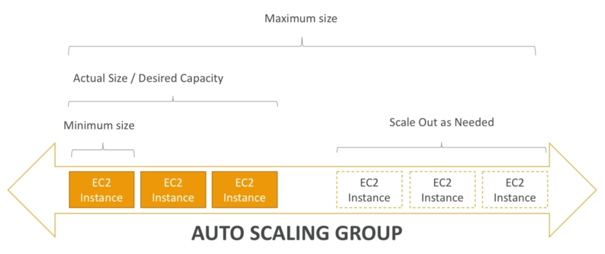

# Auto Scaling Group
## Auto Scaling Group (ASG)
- goal of ASG
  - scale-out to match increased load
  - scale-in to match decreased load
  - ensure min/max number of instances running 
  - automatically register new instances to LB

## ASG in AWS

- minimum size
- actual size / desired capacity
- maximum size

## ASG attributes
- ASG 생성시 필요한 속성들
- Launch Configuration (LC)
  - AMI, Instnace Type
  - EC2 User Data
  - EBS Volumes
  - Security Groups
  - SSH Key Pair
- Min Size / Max Size / Initial Capacity
- Network + Subnets Information
- LB information
- Scaling Policies

## Auto Scaling Alarms
- ASG based on CloudWatch alarms
- alarm monitors a metric (ex. avg CPU)
- <U>metrics are computed for overall ASG instances</U>
- based on alarm, can create scale-in/out policies

## Auto Scaling New Rules
- possible to define “better” rules
  - Target Avg CPU Usage
  - Number of requests on ELB per instance
  - Avg Network In/Out

## Auto Scaling Custom Metric
- can create scaling policies based on custom metric
- ex) number of connected users
  1. send custom metric from app on EC2 to CloudWatch (PutMetric API)
  2. create ClougWatch alarm as scaling policy for ASG

## ASG Tips
- Scaling policies can be based on CPU, Network and custom metric, or schedule
- ASG use LC or LT
- to update ASG, must provide new LC or LT
- IAM roles attached to ASG get assigned to EC2
- ASG is free. you pay for EC2 behind
- **if instances terminated, ASG automatically create new ones as replacement, extra safety!**
- ASG terminate instances marked as unhealthy by LB

## ASG - Dynamic Scaling Policies
### Target Tracking Scaling
- 대상의 특정 지표를 대상으로 스케일링 수행
- most simple & easy
- ex) I want to avg ASG CPU to stay around 40%

### Simple / Step Scaling
- ex) when a CloudWatch alarm is triggered (CPU > 70%), add 2 units
- ex) when a CloudWatch alarm is triggered (CPU < 30%), remote 1 unit

### Scheduled Actions
- 예측 가능한 이벤트에 대비할 경우
- ex) increase min capacity to 10 at 5pm Fridays

## ASG - Predictive Scaling
- predictive scaling: forecast loat and schedule scaling ahead
- based on ML
- 데이터가 있어야 하기 때문에 실제로 수행하는 데에 오래 걸림 (일주일?)

## Good metrics to scale in/out
- CPU Utilization: avg CPU across instances
- Request Count per Target: number of requests per EC2 is stable
- Avg Network In / Out: if app is network bound (ex. up/download)
- Any custom metric (using CloudWatch PutMetric API)

## ASG - Scaling Cooldowns
- 휴지기간
- after scaling, cooldown period begins (default 300s)
- during cooldown period, ASG will not scale-in/out (for metrics to stabilize)
- (권고) Use read-to-use AMI to reduce configuration time and cooldown period

## ASG for SA (Solution Architects)
### ASG default termination policy
1. find AZ has most instances
2. delete one with oldest LC/LT
- ASG tries to balance the number of instances across AZ

### ASG Lifecycle Hooks
- [수명주기후크](https://docs.aws.amazon.com/ko_kr/autoscaling/ec2/userguide/lifecycle-hooks.html)
- as soon as instance is launchd in ASG, it’s in service
- pending state: extra steps before instance goes in service
- terminating state: extra steps before instance is terminated

## LT vs. LC
### Both have
- ID of AMI
- instance type
- key pair
- sg
- tags
- other parameters (ex. EC2 user-data)
### LC (legacy)
- **no versioning**
- must be re-created every-time
### LT (new, recommended)
- can have multiple versions
- create parameter subsets (for re-use and inheritance)
- provision using both on-demand and spot instances (or mix)
- can use T2 unlimited burst feature