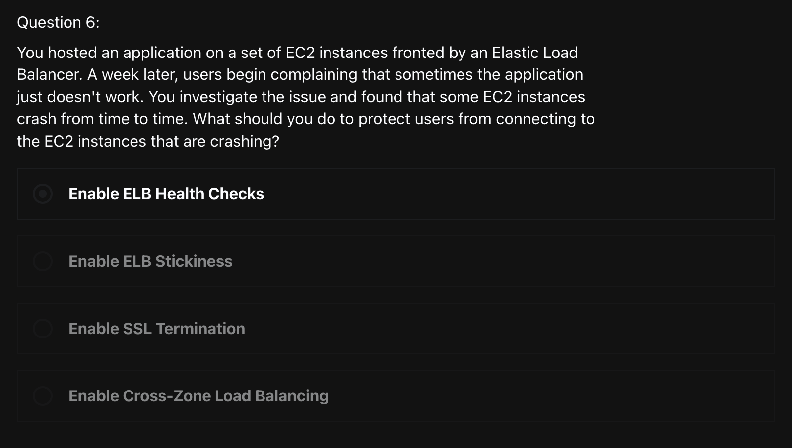
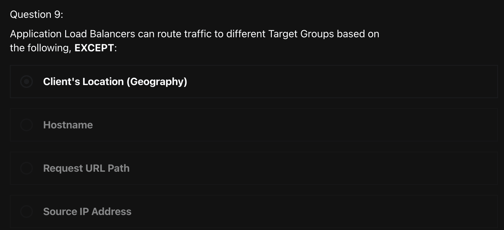
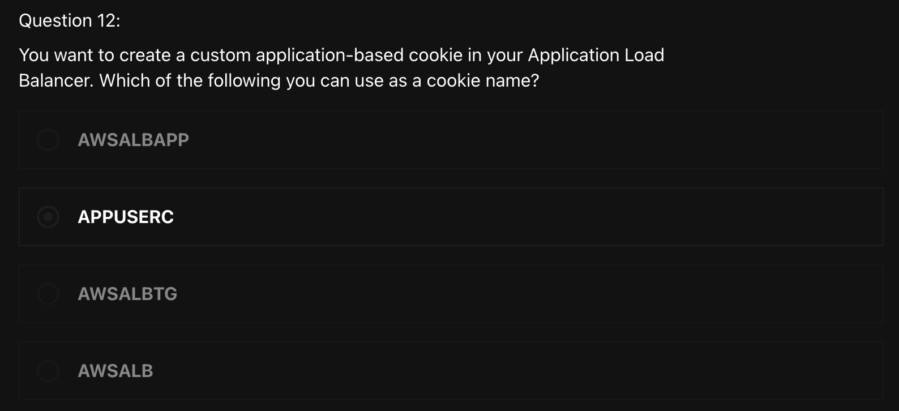
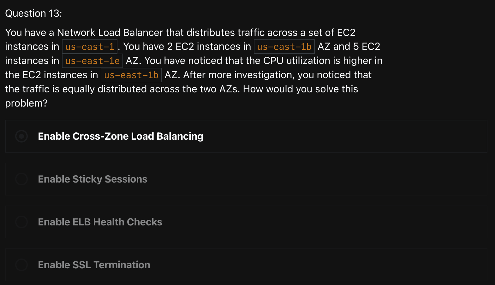
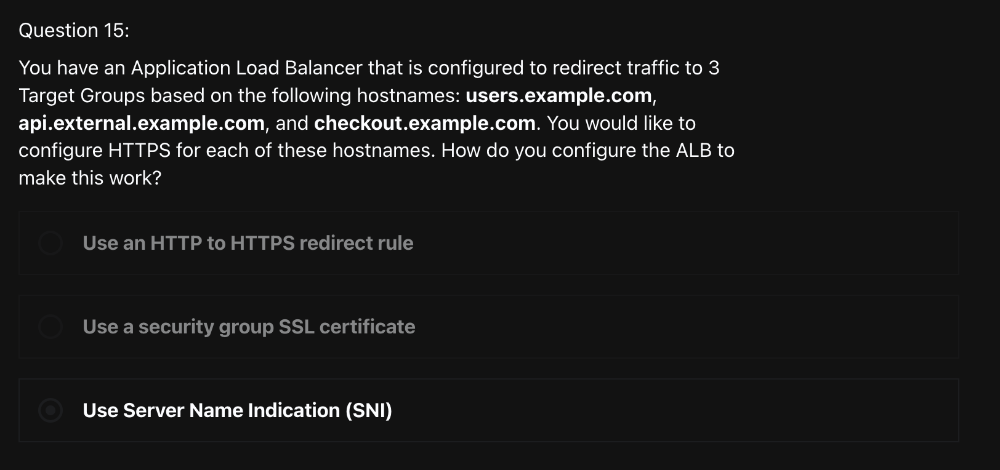
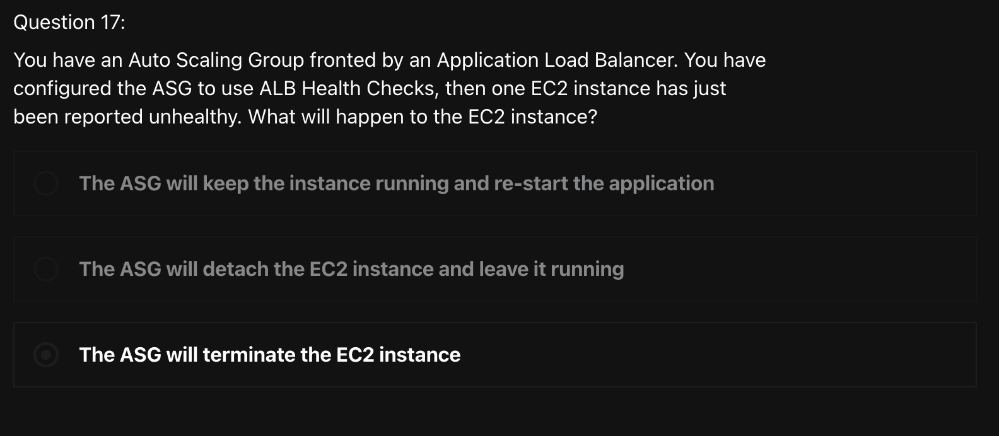
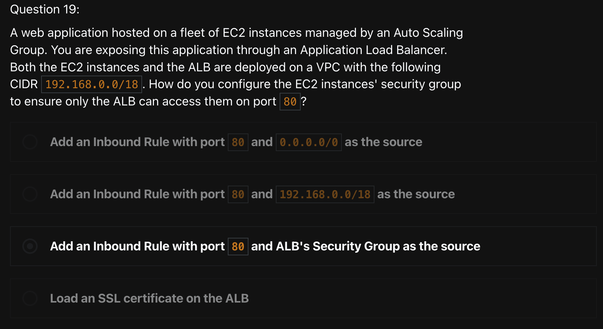
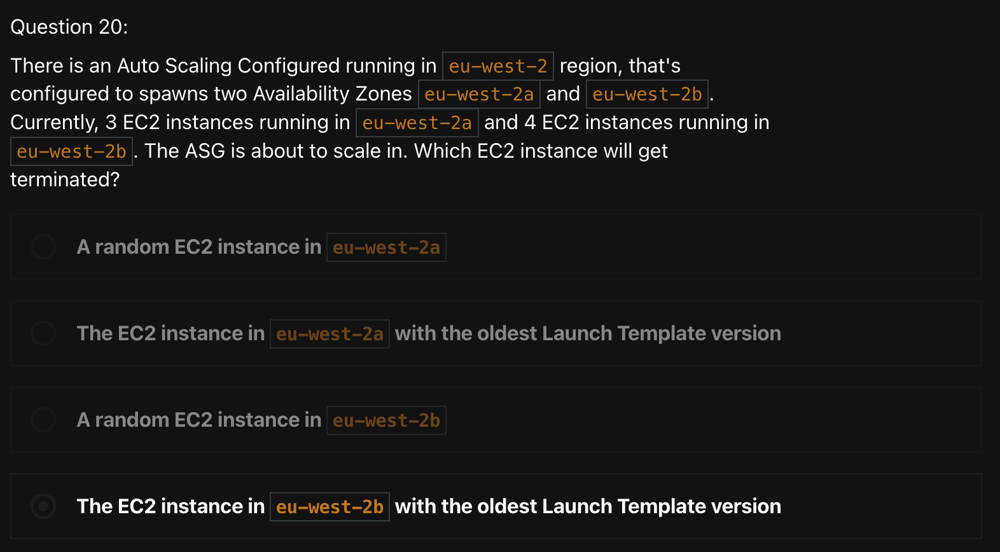
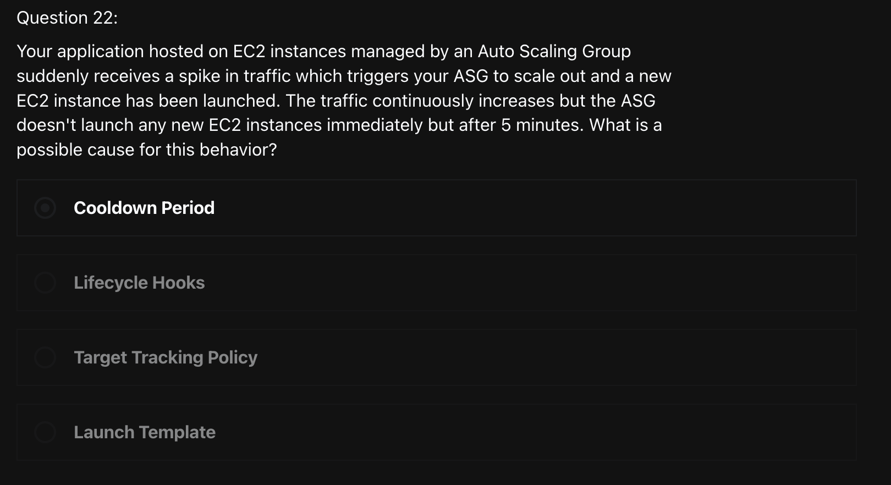
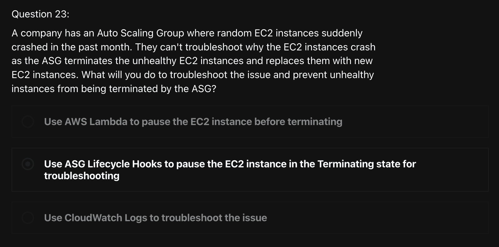

# Quiz 5: High Availability & Scalability Quiz

<br>
<br>


```
오직 NLB만이 static DNS name과 static IP를 제공한다
ALB는 static DNS name은 제공하지만, static IP는 제공하지 않는다
이유는 infrastructure가 변경되어도 static endpoint를 통해서 ELB에 접근할 수 있게 하기 위해서!
```


```
ELB Sticky Session feature는 동일한 client로 부터 오는 traffic을 하나의 target (ex. EC2 instance)로 redirect되게 한다
이렇게 함으로써 client는 session data를 잃지 않게 된다!
```


```
EC2 instance에서 client IP 주소를 얻으려면, ALB에 client IP 정보를 가지고 있는 "X-Forwarded-For" header를 추가하면 된다!
```





```
ALB는 Layer 7에서 동작!
```





```
NLB는 AZ 별로 하나의 static IP 주소를 갖고 있고 Elastic IP를 attach 할 수 있다
ALB와 CLB는 static DNS name을 갖고 있다
```




```
Cookie names reserved by the ELB
1. AWSALB
2. AWSALBAPP
3. AWSALBTG
```






```
Server Name Indication (SNI)는 LB 뒤에 각각 다른 SSL certificate을 갖는 multiple HTTPS application을 호스팅할 수 있게 도와준다!
```









```
ASG의 Default Termination Policy는 우선 AZ의 balance를 맞추려고 하고, 그 다음 Launch Configuration의 age에 따라서 terminate한다
```



```
각각의 ASG에는 scaling activity가 일어난 후에 Cooldown Period가 있다.
이 기간동안, ASG는 EC2 instance를 추가로 launch하거나 terminate하지 않는다.
이렇게 함으로써 metric이 안정화될 수 있는 시간을 확보해준다.
Default 값은 300초 (5분)이다!
```



