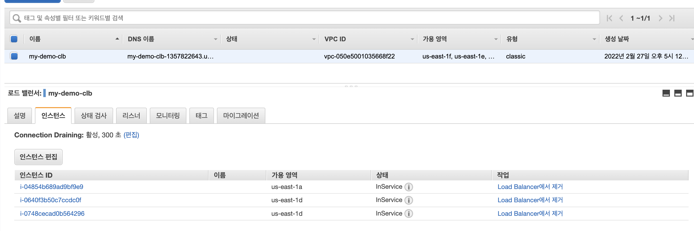
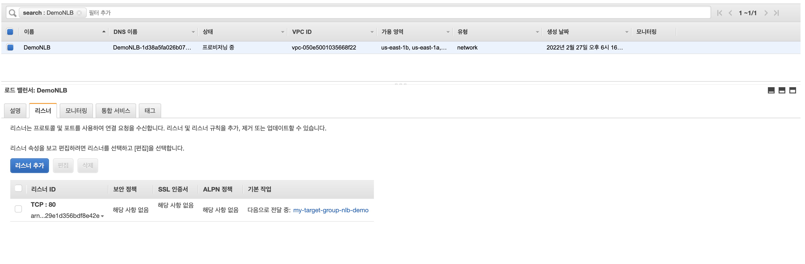
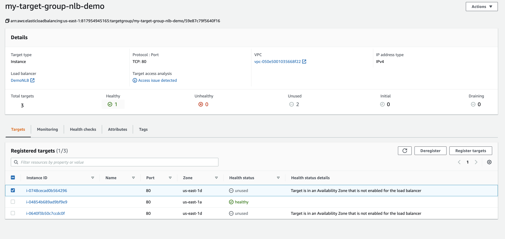
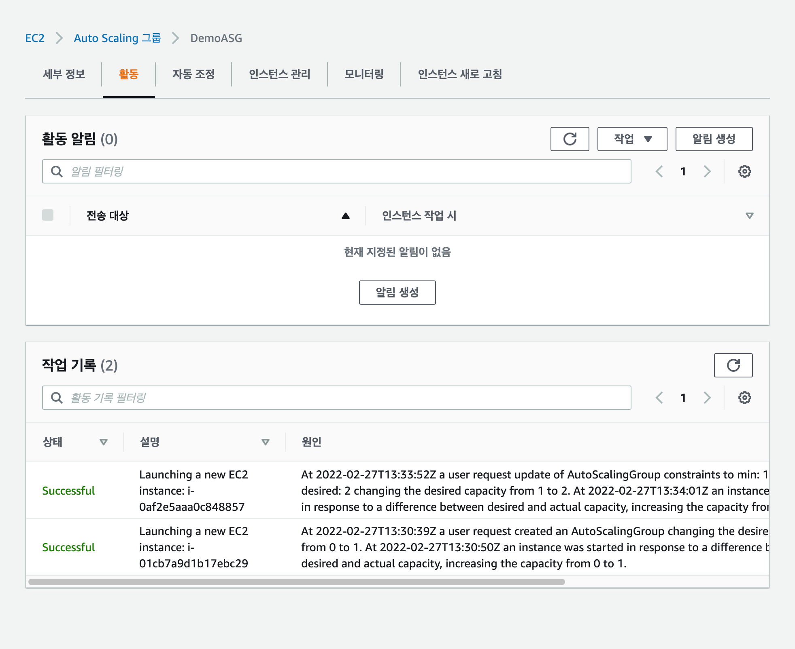
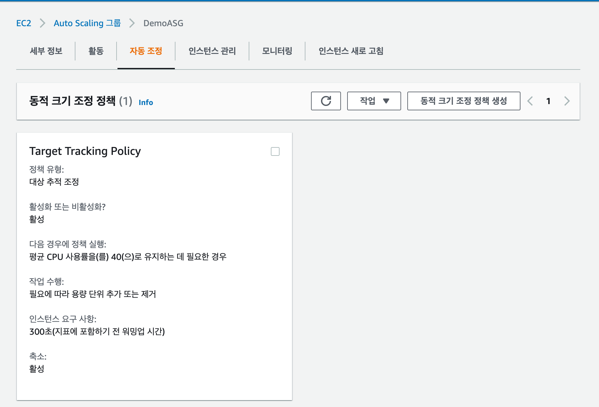
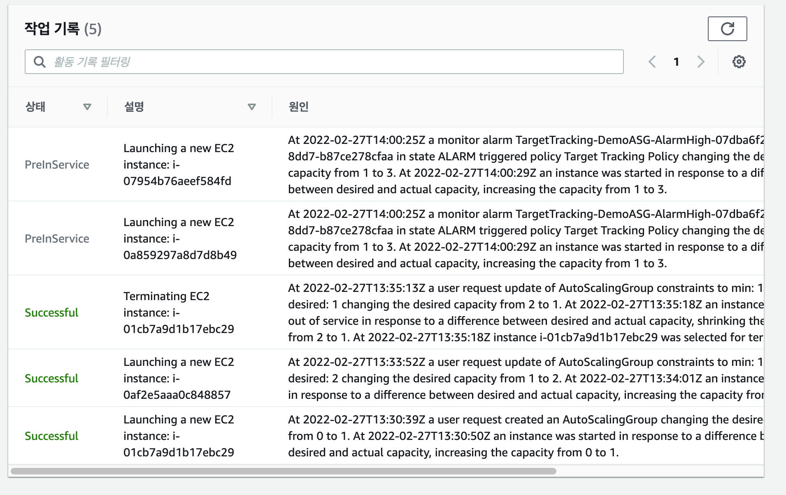

## Classic Load Balancer (CLB) 실습


## Application Load Balancer (ALB) 실습


## Network Load Balancer (NLB) 실습


## Auto Scaling Group (ASG) 실습


## Auto Scaling Group (ASG) 실습 - 스케일링 정책 실습



## 퀴즈 풀이

```aidl
질문 1:
EC2 인스턴스를 r4.large에서 r4.4xlarge로 스케일링하는 것을 .....................................이라 합니다.

답 : 수직 스케일링성
👉 하나의 크기를 늘리는 것은 수직 스케일링, number 를 늘리는 것을 수평 스케일링이라 한다.
```

```aidl
EC2 인스턴스 수를 스케일링 및 축소하는 오토 스케일링 그룹 (ASG)에서 애플리케이션을 실행하는 것을 .....................................라고 합니다.

답 : 수평 스케일링성
👉 하나의 크기를 늘리는 것은 수직 스케일링, number 를 늘리는 것을 수평 스케일링이라 한다.
```

```aidl
질문 3:
Elastic Load Balancer는 ..................................을 제공합니다

답 : 애플리케이션에서 사용할 수 있는 정적 DNS 이름
👉 ELB 의 종류에 따라 IP 가 고정되거나 변하지만, DNS 이름은 공통적으로 고정된다.
```

```aidl
질문 4:
여러분은 ELB 하나에 EC2 인스턴스 10개로 웹 사이트를 실행 중 입니다.   
사용자들로부터 페이지 사이를 이동할 때 마다 재인증을 해야하는 것에 대해서 컴플레인이 들어오고 있습니다.   
한 개의 EC2 인스턴스가 있는 개발 환경과 컴퓨터에서 웹페이지는 정상적으로 작동하기 때문에 여러분은 혼란에 빠졌습니다.   
이 현상의 발생 이유는 무엇일까요?  

답 : ELB 에 Sticky Session이 활성화되어 있지 않습니다.
👉 Sticky Session 은 쿠키를 이용해서 Scaling 된 EC2 중 이전에 요청에 대한 응답을 받았던 EC2 으로 리디렉션 되도록 하여 Session 을 유지시킬 수 있다.
```

```aidl
질문 5:
여러분은 ALB를 사용하여 EC2 인스턴스에서 호스팅되는 웹 사이트의 트래픽을 분산하고 있고 웹 사이트는 실제로 ALB의 IP 주소인 프라이빗 IPv4 주소에서 오는 트래픽만 인식하는 것으로 나타났습니다.  
이때 웹사이트에 연결된 클라이언트의 IP 주소를 얻으려면 어떻게 해야 할까요?

답 : X-Forwarded-For 헤더에서 클라이언트 IP 주소를 가져오도록 웹사이트의 백엔드를 수정합니다.
👉 ALB 에서 클라이언트의 IP 를 넣는 헤더의 이름은 X-Forwarded-For 이다.
```

```aidl
질문 6:
여러분은 ELB 하나와 EC2 인스턴스 집합으로 애플리케이션을 호스팅하였습니다. 
일주일 후, 유저들은 애플리케이션이 간헐적으로 작동을 멈춘다고 컴플레인을 하기 시작합니다. 
조사 결과, 일부 EC2 인스턴스가 때때로 충돌하는 것을 발견했습니다. 
이때 사용자가 충돌하는 EC2 인스턴스에 연결하지 못하도록 보호하려면 어떻게 해야 할까요?

답 : ELB Health Checks 활성화
👉 충돌 이라는 의미가 어떤걸 뜻하는지 헷갈렸지만, failure 인 것 같다.
ELB 의 Health Check 기능을 사용하면 ELB 가 충돌난 EC2 에는 요청을 보내지 않는다.
```

```aidl
질문 7:
여러분은 솔루션 아키텍트로써 초당 수백만 건의 요청을 수신할 고성능, 저지연 시간 애플리케이션을 위한 아키텍처를 설계하려 합니다. 
이때 어떤 유형의 ELB를 선택해야 할까요?

답 : NetWork Load Balancer (NLB)
👉 NLB 는 ALP 보다 처리속도가 빠르기 때문에, 고성능을 필요로 할 때 사용할 수 있다.
```

```aidl
질문 8:
Application Load Balancer (ALB)가 지원하는 프로토콜이 아닌것은?

답 : TCP
👉 ALB 는 Application Layer (Layer 7) 에서 동작하는 로드벨런서이다. (TCP 는 Layer 4)
```

```aidl
질문 9:
ALB는 일정 기준에 따라 트래픽을 다른 대상 그룹으로 라우팅할 수 있습니다. 이 기준에 해당하지 않는 것은?

답 : 고객의 위치(지역)
👉 ALB 는 URL, 호스트, IP 주소, 쿼리스트링과 헤더 에 따라 로드를 분산시킬 수 있다.
```

```aidl
질문 10:
다음 중 ALB의 대상 그룹에 등록된 대상이 아닌 것은?

답 : Network Load Balancer(NLB)
👉 고정 Ip 등의 이유로 NLB 에 ALB 를 등록할 수는 있다. (보기와 반대)
```

```aidl
질문 11:
여러분은 규정 준수를 위해 최종 사용자에게 고정 IP 주소를 노출하여 규제 기관에서 승인한 안정적인 방화벽 규칙을 작성하도록 하려 합니다. 
어떤 유형의 ELB를 선택하시겠습니까

답 : Network Load Balancer(NLB)
👉 NLB 는 고정 IP 를 가진다. (탄력적 IP 사용) ALB, CLB 는 고정 DNS 를 가지지만 고정 IP 를 가지지는 않는다.
```

```aidl
질문 12:
다음 중 애플리케이션 로드 밸런서 (ALB)에서 사용자 지정 애플리케이션 기반 쿠키를 생성 시 쿠키 이름으로 사용할 수 있는 것은 무엇일까요?

답 : APPUSERC
👉 AWSALB, AWSALBAPP, AWSALBTG 는 ELB 에서 예약어로 사용중인 쿠키 이름이다. 사용할 수 없다.
```

```aidl
질문 13:
여러분은 us-east-1의 EC2 인스턴스 세트에 트래픽을 분산하는 네트워크 로드 밸런서 (NLB)가 있습니다. 
us-east-1b AZ에 2개의 EC2 인스턴스와 us-east-1e AZ에 5개의 EC2 인스턴스가 있습니다. 
us-east-1b AZ의 EC2 인스턴스에서 CPU 사용률이 더 높다는 것을 확인했습니다. 
추가 조사 후 트래픽이 두 AZ에 균등하게 분산되어 있음을 알 수 있습니다. 
이 문제를 어떻게 해결하시겠습니까?

답 : Cross-Zone Load Balancing 활성화
👉 Cross-Zone Load Balancing 은 같은 ELB 의 다른 AZ 에 있는 EC2 에게 트래픽을 고르게 분산시킬 수 있다. 
```

```aidl
질문 14:
애플리케이션 로드 밸런서 (ALB)와 네트워크 로드 밸런서 (NLB)의 어떤 기능을 통해 하나의 리스너에서 여러 SSL 인증서를 로드할 수 있을까요?

답 : Server Name Indication (SNI)
👉 SNI 기능을 사용하면 ELB 에서 여러 서버의 인증서를 로드 후 각 서버에 맞는 인증서를 사용할 수 있다.
```

```aidl
질문 15:
여러분은 다음 호스트 이름을 기반으로 트래픽을 3개의 대상 그룹으로 리디렉션하도록 구성된 애플리케이션 로드 밸런서 (ALB)가 있습니다
: users.example.com, api.external.example.com 및 checkout.example.com. 
이러한 각 호스트 이름에 대해 HTTPS를 구성하려고 합니다.
 이 작업을 수행하려면 ALB를 어떻게 구성해야 할까요?

답 : Server Name Indication (SNI) 사용
👉 SNI 기능을 사용하면 ELB 에서 여러 서버의 인증서를 로드 후 각 서버에 맞는 인증서를 사용할 수 있다.
```

```aidl
질문 16:
여러분은 원하는 용량과 최대 용량을 모두 3으로 구성한 오토 스케일링 그룹 (ASG)에서 관리하는 EC2 인스턴스 세트에서 호스팅되는 애플리케이션이 있습니다. 
또한 CPU 사용률이 60%에 도달하면 ASG를 스케일링하도록 구성된 CloudWatch 경보를 생성했습니다. 
여러분의 애플리케이션은 갑자기 엄청난 트래픽을 수신했고 현재 80% CPU 사용률로 실행되고 있습니다. 
이제 무슨 일이 일어날까요?

답 : 아무 일도 일어나지 않습니다.
👉 최대 용량 = 원하는 용량 이기 때문에, 사용량이 Metric 을 넘더라도 더 만들 수 없다.
```

```aidl
질문 17:
여러분은 애플리케이션 로드 밸런서 (ALB)가 전면에 있는 오토 스케일링 그룹이 있습니다. 
ALB 상태 확인을 사용하도록 ASG를 구성했는데 하나의 EC2 인스턴스가 비정상으로 보고되었습니다.
이 EC2 인스턴스는 어떻게 될까요?

답 : ASG 는 EC2 인스턴스를 종료합니다.
👉 ASG 설정 시 ALB 를 통해 EC2 의 상태를 확인하는 경우 Health Check 에 실패한 EC2 를 종료시키고 새로운 EC2 인스턴스를 시작한다. 
```

```aidl
질문 18:
여러분의 상사는 애플리케이션이 데이터베이스에 대해 수행하는 분당 요청 수를 기반으로 오토 스케일링 그룹을 스케일링하도록 요청했습니다. 
어떻게 해야 할까요?

답 : CloudWatch 사용자 지정 지표를 생성한 다음 이 지표에 대한 CloudWatch 경보를 생성하여 ASG 를 스케일링합니다.
👉 벡엔드에서 데이터베이스로 요청을 보내는 수를 모니터링하는 Metrics 는 없어서 Custom 하게 만들어야 한다고 한다.
```

```aidl
질문 19:
오토 스케일링 그룹 (ASG)에서 관리하는 EC2 인스턴스 플릿이 호스팅하는 웹 애플리케이션이 있습니다. 
여러분은 애플리케이션 로드 밸런서 (ALB)를 통해 이 애플리케이션을 노출하고 있습니다. 
EC2 인스턴스와 ALB는 모두 다음 CIDR 192.168.0.0/18을 사용하여 VPC에 배포됩니다. 
ALB만 포트 80에서 액세스할 수 있도록 EC2 인스턴스의 보안 그룹을 구성하려면 어떻게 해야 할까요?

답 : 포트 80 및 ALB 의 보안 그룹을 소스로 사용하여 인바운드 규칙 추가
👉 ALB 는 EC2 에게 HTTP 요청을 보낸다 => 80 번 포트
EC2 에서는 ALB 에서만 요청을 받으면 된다. 외부로 노출되는건 ALB 의 보안그룹에 설정한다.
```

```aidl
질문 20:
eu-west-2 리전에서 실행 중인 오토 스케일링 Configured가 있으며 eu-west-2a 및 eu-west-2b 가용 영역 두 개를 생성하도록 구성되어 있습니다. 
현재 eu-west-2a에서 EC2 인스턴스 3개와 eu-west-2b에서 EC2 인스턴스 4개가 실행 중입니다. ASG가 곧 축소됩니다.
 어떤 EC2 인스턴스가 종료될까요?

답 : 가장 오래된 런치 템플릿 버전이 있는 eu-west-2b 의 EC2 인스턴스
👉 Termination Policy 
eu-west-2a 에는 3개 eu-west-2b 는 4개이므로 3-3 을 맞추기 위해 eu-west-2b 에서 지울 것.
그리고 launch template 이 가장 오래된 버전부터 지운다.
```

```aidl
질문 21:
애플리케이션은 애플리케이션 로드 밸런서 (ALB) 및 오토 스케일링 그룹과 함께 배포됩니다. 
현재 ASG를 수동으로 스케일링하고 EC2 인스턴스에 대한 평균 연결 수가 약 1000개인지 확인하는 스케일링 정책을 정의하려고 합니다.
어떤 스케일링 정책을 사용해야 할까요?

답 : 대상 추적 정책 
👉 대상 추적 정책은 대상의 CPU, Network, 요청 갯수 에 따라 Scaling 을 조정할 수 있다.
```

```aidl
질문 22:
오토 스케일링 그룹 (ASG)가 관리하는 EC2 인스턴스에서 호스팅되는 애플리케이션이 갑자기 트래픽 급증을 수신하여 ASG가 스케일링되고 
새 EC2 인스턴스가 시작되었습니다. 
트래픽은 지속적으로 증가하지만 ASG는 새 EC2 인스턴스를 즉시 시작하지 않고 5분 후에 시작합니다. 
이 동작이 가능한 원인은 무엇일까요?

답 : 쿨다운 기간
👉 쿨 다운 기간 = 휴지 기간. 일시적인 급 상승 또는 급 하강인지 아닌지 판별하기 위해 휴지기간을 가질 수 있다. Default 는 300초이고 즉시 인스턴스가 생성되거나
삭제되길 바란다면 이 쿨다운 기간을 짧게 조장하면 된다.
```

```aidl
질문 23:
여러분의 회사에는 지난 달에 임의의 EC2 인스턴스가 갑자기 충돌한 오토 스케일링 그룹 (ASG)이 있습니다. 
ASG가 비정상 EC2 인스턴스를 종료하고 새 EC2 인스턴스로 교체할 때, EC2 인스턴스가 충돌하는 이유를 알아낼 수 없었습니다. 
문제를 해결하고 비정상 인스턴스가 ASG에 의해 종료되는 것을 방지하기 위해 어떻게 해야할까요?

답 : ASG 수명 주기 후크를 사용하여 문제 해결을 위해 종료 중 상태의 EC2 인스턴스를 일시 중지
👉 수명 주기 후크는 Scale in / out 시에 사용자가 지정한 특정 행동을 취할 수 있다. 여기서는 일시 중지 후 상태를 보겠다는 것.
```