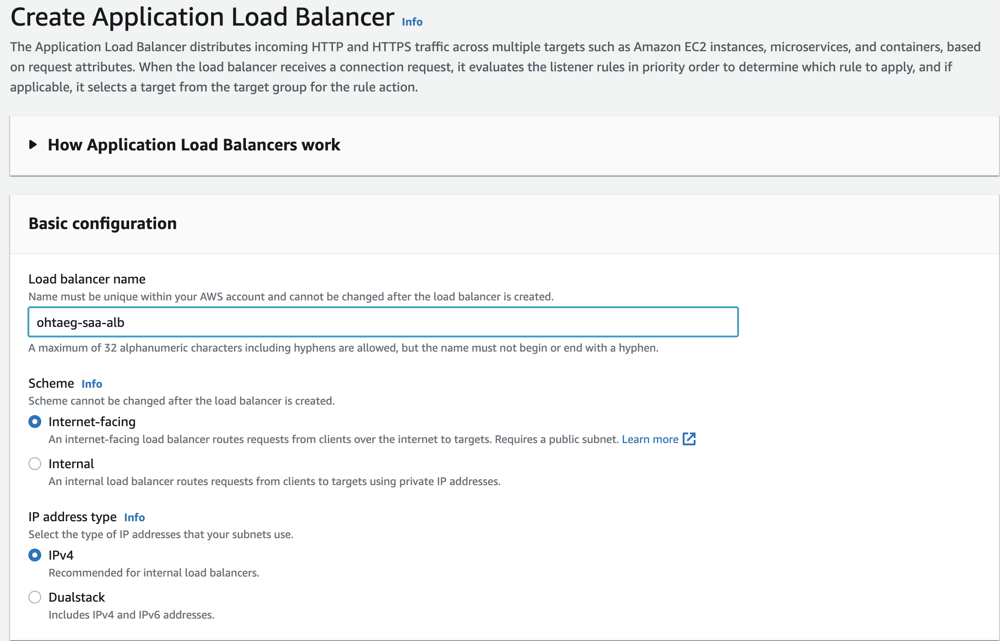
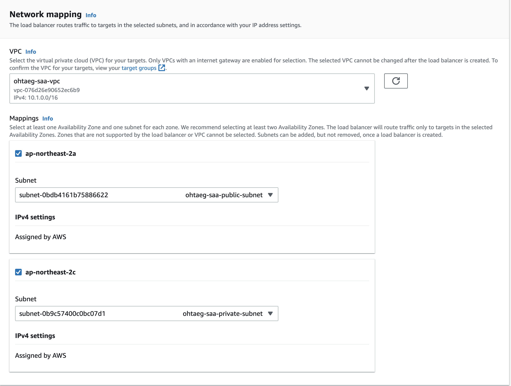
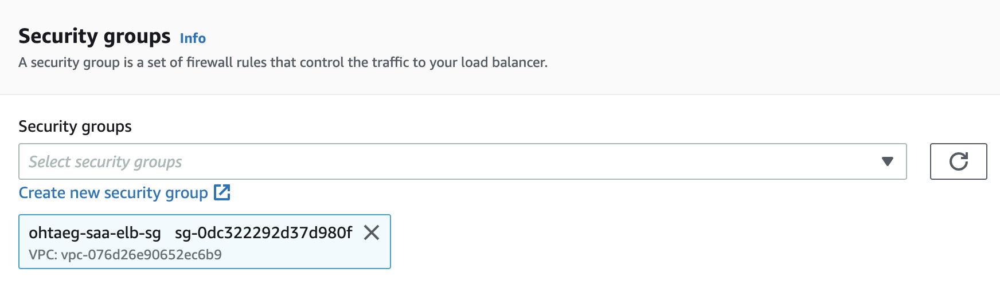
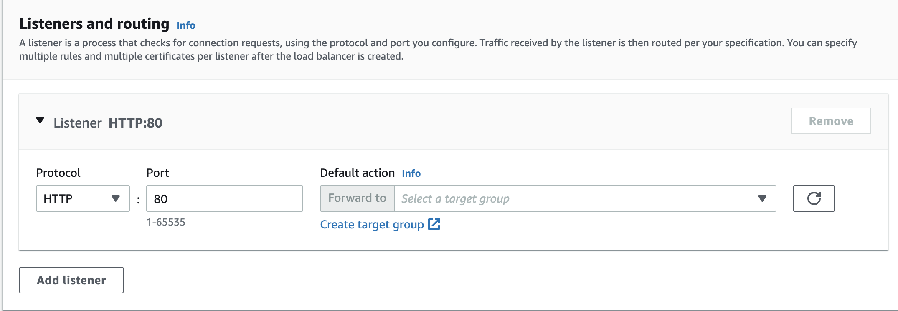
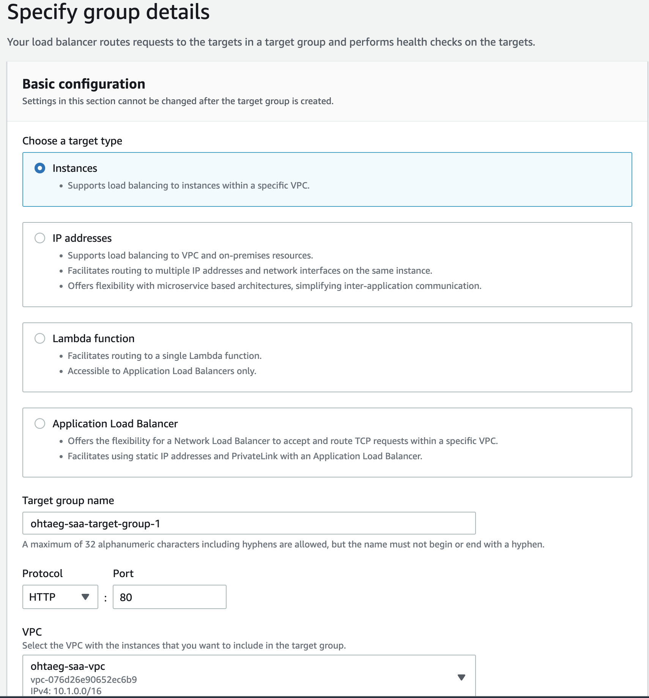
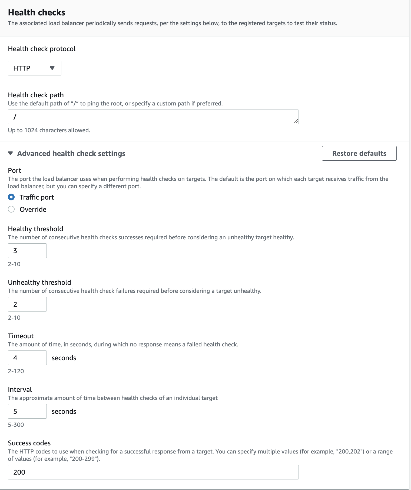
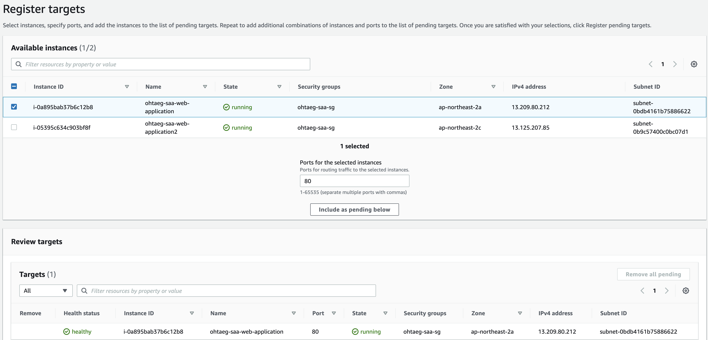

# 1. ALB 실습
### 간단 요약
- Application Load Balancer (Layer 7, HTTP)
- 컨테이너를 사용하고 ECS 사용
- HTTP2, WebSocket 지원
- 트래픽 리다이렉트 지원 (HTTP to HTTPS)
- 루트 라우팅 지원
  - `URL` 기반으로 라우팅 가능
    - ex) example.com/`users`
    - ex) example.com/`posts`
  - URL `호스트 명` 기반으로 라우팅 가능
    - ex) one.example.com
    - ex) other.example.com
  - `쿼리 스트링`과 `헤더` 기반으로 라우팅 가능
    - ex) example.com/reserves`?id=123`
- 포트 매핑 지원
  - ECS 인스턴스의 다이나믹 포트로 리다이렉션하고 다시 ECS 섹션에 직접 리다이렉션 가능
- ALB 타겟 그룹은 다음과 같다.
  - EC2 인스턴스들
  - EC2 Tasks
  - Lambda functions
  - Private IP Address
- 교차 로드 밸런싱은 항상 켜져있고, 비활성화 할 수 없다.
  - 항상 켜져있기에 돈이 들지 않는다.
  
<br>

#### ALB 실습전 준비사항
1. 고정된 호스트 명을 가져야한다.
2. 앱 서버는 고객의 IP를 직접적으로 볼 수 없다.
   - 고객의 IP는 `X-Forwarded-For 헤더`에서 확인할 수 있다.
   - X-Forwarded-Ports, X-Forwarded-Proto 헤더를 통해 고객 포트를 가질 수 있다.
3. 2개의 인스턴스를 준비한다.
```shell
# ec2 생성후 웹서버 세팅
$ sudo apt update

// 우분투에선 httpd가 apache로 불린다.
$ sudo apt-get install apache2 

// 우분투 20.04 버전부터 netstat이 기본설치가 아니다.
$ sudo apt-get install net-tools

$ sudo systemctl enable apache2.service

# 새로운 index.html이 위치한 경로로 변경, pwd - /home/ubuntu/elb-html
$ mkdir elb-html
$ cd elb-html
$ sudo vi index.html

<!DOCTYPE html>
<html lang="en">
<head>
  <meta charset="UTF-8">
  <title>Title</title>
</head>
<body>

</body>
</html>

# 기본 경로인 \var\www\html 를 /home/ubuntu/elb-html 로 바꿔준다. 
$ sudo vi /etc/apache2/sites-available/000-default.conf
# DocumentRoot 부분을 /home/ubuntu/elb-html 로 변경 후 저장


# 디렉토리 접근 권한 기본 설정 변경
$ sudo vi /etc/apache2/apache2.conf
# Directory 부분에 Require all denied -> granted 로 변경 후 저장

$ sudo systemctl start apache2.service
```

<br>

## ALB 실습
1. 기본 설정
- 
2. 네트워크 매핑 설정
- 
3. 로드 밸런서 용 시큐리티 그룹 설정
- 
4. 리스너 및 라우터 설정 및 타겟 그룹 생성
- 
- 
- 
- 
5. ALB 생성 및 리스너 규칙 편집
- 
- 
   

