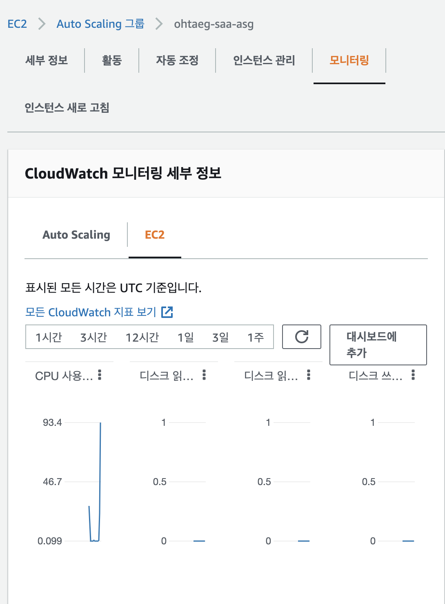

# 오토 스케일링
- 늘어난 트래픽을 감당하기 위해 서버의 수를 늘려 대응 = Scale out
- 트래픽에 따라 서버의 수를 자동으로 늘리거나 줄이는 자동 조정 = Auto Scaling
- 같은 사양, 같은 환경, 같은 코드를 가진 인스턴스들을 묶는다.
- 지원하는 인스턴스는 다음과 같다.
  - EC2
  - Dynamo DB
  - 스팟 인스턴스
  - Aurora
  - ECS

### ASG Attributes
1. Launch Configuration
  - 무엇을 어떻게 실행 시킬것인가?
  - EC2 타입
  - AMI
  - EC2 User Data
  - EBS Volumes
  - Security Group
  - SSH Key Pair
2. Min / Max Size / Initial Capacity 
3. Subnet Information 
4. LB Information 
5. Scaling Polices
   - 스케일 인아웃 트리거

### AS Rules
- CPU Usage
- Number Of Request on ELB per instance
  - ex) ELB에서 인스턴스탕 1000개의 요청
- Average Network IN / OUT


### AS 생성
1. Auto Scaling Launch Template(시작 템플릿) 생성
   - 
   1.1 AMI 선택
     - 새로운 AMI 선택하거나 기존 인스턴스의 AMI를 사용하면 된다.
     - 
2. 네트워크 선택 
3. LB 연결
4. 상태 체크 선택
  - Auto Scaling 그룹의 `기본` 상태 검사는 `EC2 상태 확인만` 해당
  - 인스턴스가 상태 확인을 통과하지 못하면 비정상으로 표시되고 Amazon EC2 Auto Scaling이 새 교체 인스턴스를 시작하는 동안 종료되는데
  - ELB도 선택하면 EC2뿐만 아니라 로드 밸런서를 통해서도 확인한다. 
  - 
5. 생성
  - 

-----
# Dynamic Scaling Policies
1. 대상 추적 조정
   - AutoScaling이 설정되길 원하는 임계치를 설정 가능
   - 평균 CPU 사용률
   - 평균 네트워크 입력
   - 평균 네트워크 출력
   - Number of Request per EC2 => 대상당 Application Load Balancer 요청 수
2. Simple / Step Scaling
   - CloudWatch alarm을 설정
   - ex) CPU 70퍼 이상이면 인스턴스 증가
   - ex) CPU 30퍼 미만이면 인스턴스 감소
3. Scheduled Action
     - 특정 시간동안 인스턴스 증가
5. Average Network In / Out
6. Custom Metric
   - using CloudWatch

#### Scaling CoolDown
- 인스턴스 증가/감소 후 쿨다운 기간 시작
  - default 300 seconds
- 이 기간 동안 ASG는 추가적인 인스턴스를 시작하거나 종료하지 않는다.


### Stress test
1. Stress 테스트를 위한 스케일링 정책 설정
   - 

2. Stress 
```shell
$ apt-get install stress
$ stress --cpu 4
```

3. Stress를 테스트하면 다음과 같이 모니터링에서 CPU 사용률이 90% 넘어감을 알 수 있다.
  - 
4. 스케일링 정책으로 새로 생긴 인스턴스를 확인할 수 있다.
  - 

-----
### ASG 종료 정책
- 기본 정책
  1. Find AZ
  2. AZ 안에 많은 인스턴스가 있을 경우 오래된 시작 템플릿과 함께 인스턴스 삭제
- 수명 주기 후크
  - Pending State [wait -> proceed] -> InService -> Terminating [wait -> proceed] -> Terminated
  - Terminating 상태에서 정보를 얻기 원하는 경우 (로그나 파일을 가져올 때) 수명 주기 후크를 활용한다.

### Launch Template vs Launch Configuration
- Common
  - AMI ID 정의
  - 인스턴스 타입, 키페어, 보안그룹 설정
- Launch Configuration (Legacy)
  - 매개 변수를 업데이트 해야할 경우 재생성해야한다.
- Launch Template (Newer)
  - 매개 변수를 업데이트 해야할 경우 버전관리로 해결할 수 있다.
  - 매개변수 재사용을 위해 하위 집합을 구성할 수 있다.
  - 온디맨드, 스팟 인스턴스를 지원한다.
  - AWS에서 권장하는 방법이다.

   

   
