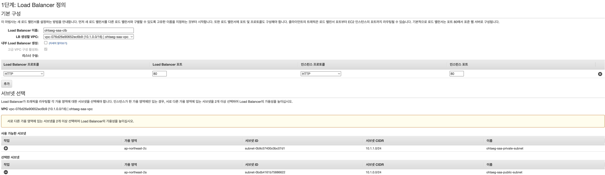
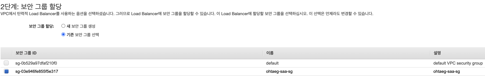
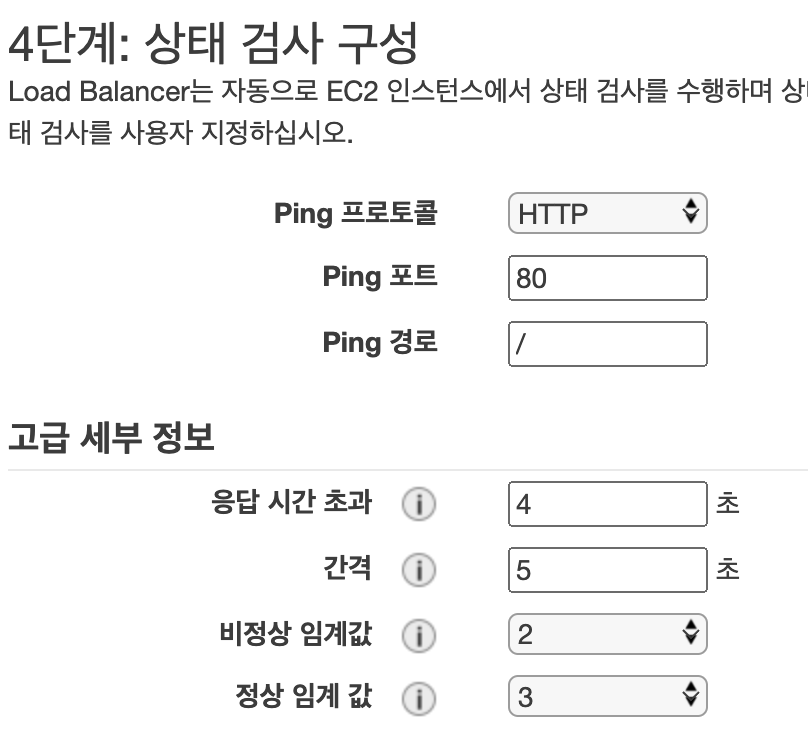
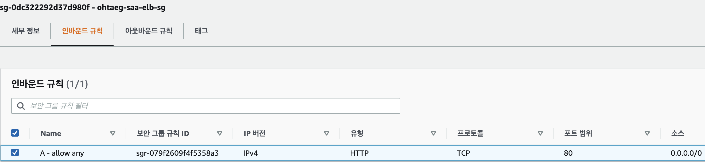
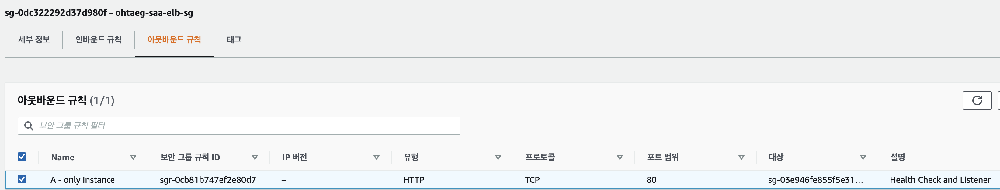
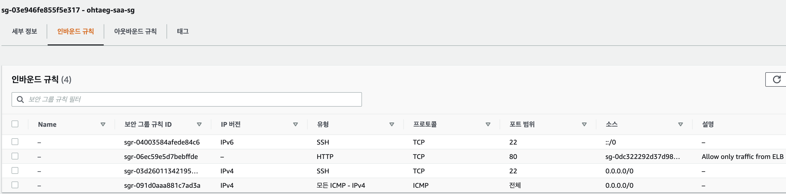
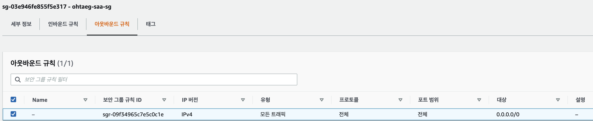

# 1. CLB 실습
- CLB 간단 요약
  - Support TCP (L4)
  - Support HTTP & HTTPS (L7)
  - CLB는 호스트 명이 고정되어 있다.

<br>

## 2. CLB 실습 과정
### 1. ec2 생성 후 웹서버 세팅
```
  # ec2 생성후 웹서버 세팅
  $ sudo apt update
  
  // 우분투에선 httpd가 apache로 불린다.
  $ sudo apt-get install apache2 
  
  // 우분투 20.04 버전부터 netstat이 기본설치가 아니다.
  $ sudo apt-get install net-tools
  
  $ sudo systemctl enable apache2.service
```

<br>

### 2. CLB 생성
- CLB 로드 밸랜서 설정
  

- 보안 그룹 설정
  

- 헬스 체크 설정
  - 3단계는 https or ssl 을 사용하라는 경고 단계라 넘어감

  

    - 응답 시간 초과 : 응답 시간 초과는 간격보다 작아야한다.
    - 비정상 임계 값 : 헬스 체크시 비 정상이라고 판단할 수 있는 횟수
    - 정상 임계 값 : 헬스 체크시 정상으로 간주되기까지 상태 확인 카운트
  
- ec2, tag 추가 후 생성

<br>

### 3. CLB 시큐리티 그룹 재설정
- 보통 인스턴스에 연결된 시큐리티 그룹은 PORT를 공개하여 누구나 접근 할 수 있도록 설정되어있다.
- 보안적인 측면에서 외부에서 인스턴스에 바로 접속하게하고 오직 LB에서만 접근할 수 있도록 시큐리티 그룹을 통해 제어할 수 있다.

1. ELB 시큐리티 그룹(이하 A)을 새로 생성
  - Inbound :
    - Type : HTTP
    - Port : 80
    - Source : 0.0.0.0 <- any access
     
     

<br>

  - OutBound : 
    - Type : HTTP
    - Port : 80
    - `Source : 인스턴스 시큐리티 그룹(이하 B)` <- Health Check and Listener
    
    

<br>

2. B에 외부로 연결되는 포트를 제거하고 A를 연결한다.
  - InBound :
    - Type : HTTP
    - Port : 80
    - `Source : A` <- Allow only traffic from ELB
    
    

<br>

  - OutBound :
    - Type : 사용자 지정
    - Port : 전체
    - `Source : A` <- 어떤 프로토콜이든 간에 ELB로 보낸다.

    