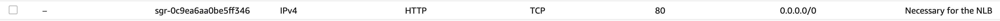

# 1. NLB 실습
### 간단 요약
- Layer 4 (TCP, UDP)
  - 
  - TCP 기반의 트래픽이 대상 그룹에 도달할 수 있다.
- 초당 수백만개의 요청 해결 가능
- 대기시간도 ALB보다 적음
  - 예로 ALB 대기 시간이 400 밀리초면 NLB 대기 시간은 100 밀리초
- NLB는 `AZ 당` `고정 ip`를 가지며 `EIP`도 지원한다.
  - ALB 와 NLB 차이점
    - ALB는 고정 호스트 명을 가지고
    - `NLB는 고정 IP 주소를 가진다.`
- NLB는 프리티어를 지원하지 않는다.
- NLB의 대상 그룹들은 다음과 같다.
  - EC2
  - IP 주소
  - ALB, NLB <-> ALB 연결 가능
- Reverse Proxy 방식의 ALB/CLB와 달리 리턴 트래픽은 ELB가 관여하지 않는다.
  - 
- 교차 로드 밸런싱은 기본적으로 비활성화 되어있다.
  - 일정 금액을 지불하면 활성화 할 수 있다.

 

## 2. CLB 실습 과정
1.ALB와 생성과정이 거의 흡사하다.
  - 다만 AZ 영역 선택시 ALB와 차이가 있다. 고정 IP를 할당 받을 수 있고 EIP를 사용할 수 있다.
  - AZ 당 하나의 고정된 ip를 할당할 수 있다.
  - 
2. NLB 용 대상 그룹을 새로 생성 해준다.
3. 생성해준 후 접속하면 접속이 되지 않는다.
   - 
   - 그 이유는 NLB 대상 그룹은 TCP 기반이기 때문이다.
   - NLB를 수행할 때 고려하는 보안 그룹은 인스턴스 보안 그룹이다.
   - 현재 인스턴스 보안 그룹은 HTTP 80 설정은 ALB 보안 그룹만 허용하는 것으로 되어있다.
   - NLB가 작동할 수 있도록 인스턴스 보안 그룹에 NLB가 필요한 모든 곳에서 접속할 수 있도록 열어줘야 한다.
     - 
   

### NLB Security Group
- NLB를 위해 인스턴스 시큐리티 그룹을 0.0.0.0 으로 다 열어야 한다는 것에 잘 몰랐는데 찾아보니까
- 다른 LB와 다르게 Security Group(줄여서 SG)를 설정하지 않는데 그 이유는
- `Network 장비`이기 때문이다.
- nlb를 최전방 LB로 사용하려면 LB 뒤에 붙은 장비(ex. EC2)의 SG에 설정을 해줘야 한다.
- [공식 문서](https://aws.amazon.com/ko/premiumsupport/knowledge-center/security-group-load-balancer/) 에서도 NLB 는 인스턴스 보안 그룹을 업데이트 하라고 쓰여있다.
  - NLB 특성상 Client IP가 백엔드에 직접 전달되므로 백엔드 계층에서 방화벽 정책을 제어해야 한다.

