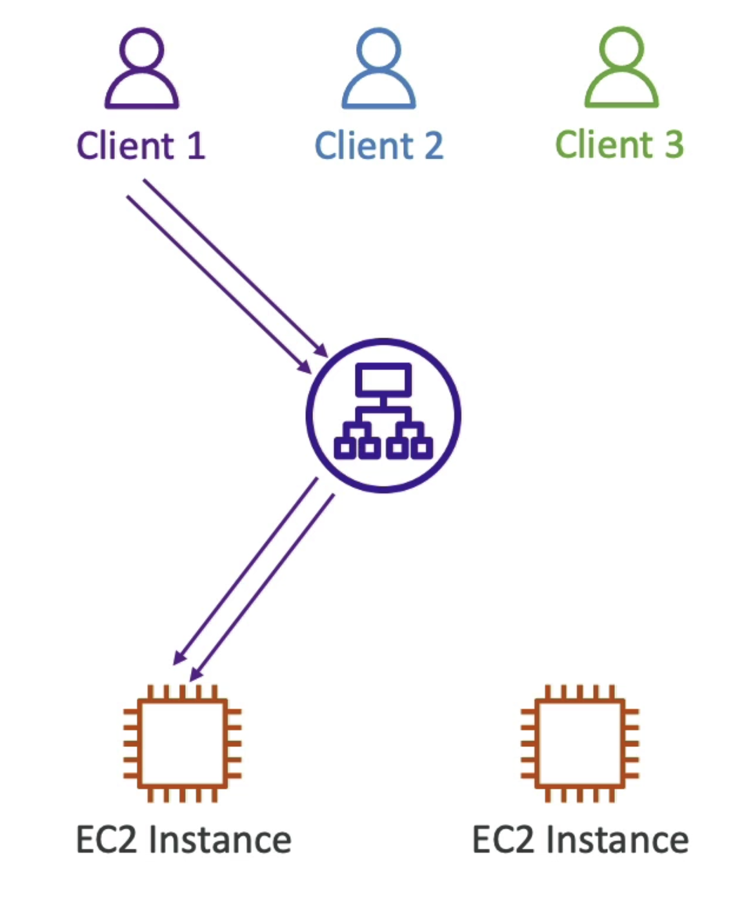

# Sticky Session (Session Affinity)
- 끈끈한, 붙어있는 세션
- 특정 사용자가 접속을 시도 했을 때, 처음 접속된 서버로 계속해서 접속되도록 트래픽 처리 방식
- 
  - 첫번째 사용자가 요청을 했을 때 1번 인스턴스에서 응답을 받았으면
  - 첫번째 사용자의 다음 요청도 1번 인스턴스에서 응답을 받는다는 것.
- ELB 내부에 특정 유저가 어떤인스턴스에 접근했는지 정보를 저장하는 구조
- CLB / ALB 에서 동작
  - 클라이언트에서 LB 요청시, 쿠키가 사용된다.
  - 쿠키가 만료되면 1번 사용자가 1번 인스턴스로부터 응답 받는 것이 다른 인스턴스에서 받을 수 있다는 것
- Sticky Session 을 활성화 하면 EC2 인스턴스에 부하를 줄 수 있다.
- Sticky Session 에 대한 쿠키는 2가지 타입이 존재한다.
  1. 어플리케이션 기반 쿠키
     1. 커스텀 쿠키
        - 목표에 의해 생성된 맞춤 쿠키
        - 앱에 필요한 속성을 포함
        - 쿠키 이름은 목표 그룹에 따라 설정된다.
        - `AWSALB`, `AWSALBAPP`, `AWSALBTG` 이름은 사용하면 안된다.
        - 이미 AWS에서 예약된 키워드이기 때문에
     2. 어플리케이션 쿠키
        - 로드 밸랜서 자체에서 생성
        - `AWSALBAPP` 쿠키 이름을 사용한다. 
  2. 기간 기반 쿠키
    - 로드 밸런서에 의해 생성된 쿠키
    - ALB라면 쿠키 이름은 `AWSALB`
    - CLB라면 쿠키 이름은 `AWSELB`
    - 기간 또한 로드 밸런서에 의해 생성
- Sticky Session를 활성화하려면 대상 그룹에 들어가서 속성 편집을 해주면 된다.