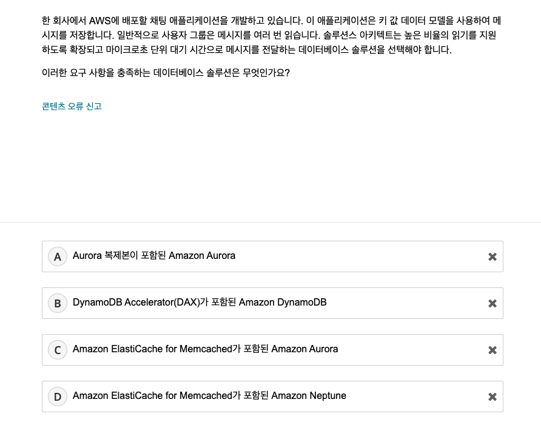

# AWS Certified Solutions Architect - Associate Official Practice Question Set (SAA - Korean)
- [시험링크](https://explore.skillbuilder.aws/learn/course/9160/play/30304/iyong-jichim-aws-certification-official-practice-question-sets-korean)

## 문제 1.


```
선택 D
정답 D
```
- SQS의 메세지 백로그가 증가하고 사용자가 처리 지연을 보고하고 있다는 것은 컨슈머 어플리케이션이 부족하다는 것으로 볼 수 있다.
- 이를 유연하게 대응하기 위해서는 ASG를 구성하는데 특정 지표를 기반으로 해아하는데 [ApproximaeNumberOfMessage](https://docs.aws.amazon.com/ko_kr/autoscaling/ec2/userguide/as-using-sqs-queue.html) 지표로 사용할 수 있다고 판단했다.

## 문제 2.


```
선택 B
정답 B
```
- EC2에서 Task의 사본에 대해서 매번 다른 포트를 매핑하여 효율적으로 사용하기 위해서는 [Dynamic Host Port Mapping 기능](https://faun.pub/understanding-dynamic-port-mapping-in-amazon-ecs-with-application-load-balancer-bf705ee0ca8e)을 사용해야 되는 것으로 알고 있다.

## 문제 3.


```
선택 B
정답 D
```
- 일단 단일 AZ에 있기 때문에 다중 AZ으로 구성해야 한다.
- 선택지를 제대로 읽지 않은 것 같고 로드밸런서가 아닌 ASG가 다중 AZ로 구성하는 D를 선택했어야 했다.
- [참고] [Amazon EC2 Auto Scaling의 이점](https://docs.aws.amazon.com/ko_kr/autoscaling/ec2/userguide/auto-scaling-benefits.html)

## 문제 4.


```
선택 A
정답 A
```

S3 버전 관리를 사용하여 한 버킷에 여러 버전의 객체를 보관하고, 실수로 삭제되거나 덮어쓰기된 객체를 복원할 수 있다. 객체를 영구적으로 제거하지 않고 삭제 마커를 활용하여 데이터를 보존한다.
[참고] [S3 버전 관리 작동 방식](https://docs.aws.amazon.com/ko_kr/AmazonS3/latest/userguide/versioning-workflows.html)

## 문제 5.


```
선택 B
정답 D
```

- 로드밸런서에서 Connection Draining에 해당하는 내용으로 보인다.
- ALB에서는 [Deregistration Delay](https://docs.aws.amazon.com/ko_kr/autoscaling/ec2/userguide/Cooldown.html)이라고 부르며 응답이 긴 어플리케이션일 경우 이 설정값을 늘려주어야 오토스케일링 동작 중에 5xx에러가 발생하지 않는다.
- [조정휴지(CoolDown)](https://docs.aws.amazon.com/ko_kr/autoscaling/ec2/userguide/Cooldown.html)는 스케일링 작업 간의 간격이므로 유사해보이나 다른 개념이다.

## 문제 6.


```
선택 C
정답 D
```

- [스팟 인스턴스 종료](https://docs.aws.amazon.com/ko_kr/AWSEC2/latest/UserGuide/spot-requests.html#terminating-a-spot-instance)에 대한 이해도 중요하지만 일단 스팟 요청을 먼저 취소하지 않으면 인스턴스를 종료한 후에 다시 스팟 인스턴스를 요청하지 않을까?...

## 문제 7.


```
선택 A
정답 A
```

- [인스턴스 내부에서 메타 데이터 검색 주소는 169.254.169.254이다.](https://docs.aws.amazon.com/ko_kr/AWSEC2/latest/UserGuide/instancedata-data-retrieval.html)

## 문제 8.


```
선택 C
정답 C

```

- [S3 Transfer Acceleration](https://aws.amazon.com/ko/s3/transfer-acceleration/)은 업로드 시간을 단축하는 것이지 큰 파일 업로드의 실패를
- 크기가 큰 파일은 [멀티파트 업로드](https://aws.amazon.com/ko/s3/transfer-acceleration/)를 사용한다.

## 문제 9.


```
선택 B
정답 B
```

- 높은 IOPS를 위해서는 SSD를 사용해야하고 범용은 아닌 것 같았음
- [Amazon EBS 볼륨 유형 내 SSD(Solid-State Drive) 참고](https://docs.aws.amazon.com/ko_kr/AWSEC2/latest/UserGuide/ebs-volume-types.html#solid-state-drives)

## 문제 10.


```
선택 AB
정답 CE
```

- [Site-to-Site VPN](https://docs.aws.amazon.com/ko_kr/vpn/latest/s2svpn/VPC_VPN.html)이란 VPC에서 고객의 원격 네트워크에 대한 액세스를 활성화하는 기능이다.
- [Site-to-Site VPN은 다음과 같은 구성요소를 가지고 있다.](https://docs.aws.amazon.com/ko_kr/vpn/latest/s2svpn/how_it_works.html)
  - 가상 프라이빗 게이트웨이
  - Transit Gateway
  - 고객 게이트웨이 디바이스
  - 고객 게이트웨이
- [참고] [Site-to-Site VPN 이란?](https://velog.io/@rhgkssk1114/Site-to-Site-VPN-%EC%9D%B4%EB%9E%80)

## 문제 11.



```
선택 B
정답 B
```

- key-value 데이터 모델은 NoSQL이며 높은 읽기 빈도와 성능이 필요함
- [DynamoDB Accelerator(DAX)](https://aws.amazon.com/ko/dynamodb/dax/)(캐시)를 활용하여 DynamoDB의 읽기 성능을 극대화할 수 있음
- Aurora -> RDBMS
- Neptune -> GraphDB

## 문제 12.


```
선택 D
정답 B
```

- 정기 감사와 같은 상시가 아닌 일시적인 권한이 필요한 경우 그룹을 만드는 것보다 role assume을 하는 것이 모범사례인 것 같음
- [역할을 사용하여 권한 위임](https://docs.aws.amazon.com/ko_kr/IAM/latest/UserGuide/best-practices.html#delegate-using-roles)

## 문제 13.


```
선택 D
정답 C
```

- [Amazon Cognito](https://docs.aws.amazon.com/ko_kr/cognito/latest/developerguide/what-is-amazon-cognito.html)를 사용하면 웹/앱에 대한 인증/권한 관리를 제공한다.

## 문제 14.

```
선택 AE
정답 AE
```
- 프라이빗 서브넷을 사용하는 것과 보안그룹을 사용하는 것이 DB 인스턴스 접근제어를 통해서 보안을 강화 것으로 볼 수 있음
- [탄력적 네트워크 인터페이스(ENI)](https://docs.aws.amazon.com/ko_kr/AWSEC2/latest/UserGuide/using-eni.html)는 보안 강화와는 관련이 없음
- [Shield](https://docs.aws.amazon.com/ko_kr/waf/latest/developerguide/shield-chapter.html)는 DDos 공격을 차단하기 위해 사용되지만 접근제어와는 관련이 없음
- [Direct Connect(DX)](https://aws.amazon.com/ko/directconnect/features/?whats-new-cards.sort-by=item.additionalFields.postDateTime&whats-new-cards.sort-order=desc)는 온프레미스에서 AWS로 네트워크 연결을 쉽게 설정할 수 있는 서비스이지 보안과는 관련이 없음

## 문제 15.

```
선택 D
정답 C
```

- [WAF, Shield, Firewall Manager](https://docs.aws.amazon.com/ko_kr/waf/latest/developerguide/what-is-aws-waf.html)에 대해서 몰랐음
- WAF를 사용하면 악성일 가능성이 있는 SQL 코드, 스크립트를 차단할 수 있음

## 문제 16.


```
선택 D
정답 B
```

- 저장된 후에 거의 액세스되지 않으나 2시간 내에 액세스 할 수 있는 스토리지 클래스가 필요함
- https://docs.aws.amazon.com/ko_kr/AmazonS3/latest/userguide/storage-class-intro.html
- S3 Glacier는 아카이빙 목적임
- [S3 스토리지 클래스 간단 비교](https://www.google.com/search?q=s3+classes&tbm=isch&chips=q:s3+classes,online_chips:s3+%EC%8A%A4%ED%86%A0%EB%A6%AC%EC%A7%80%ED%81%B4%EB%9E%98%EC%8A%A4:VtXO4kyFx1Y%3D&rlz=1C5CHFA_enKR986KR986&hl=ko&sa=X&ved=2ahUKEwiltv-jg7H2AhUTdt4KHVTAAscQ4lYoAXoECAEQHw&biw=1676&bih=968#imgrc=gyp7dUma_jxO-M)

## 문제 17.


```bash
선택 B
정답 A
```

- 임시 데이터 볼륨과 높은 IOPS가 필요함
- [EC2 인스턴스 스토어](https://docs.aws.amazon.com/ko_kr/AWSEC2/latest/UserGuide/InstanceStorage.html)
- [[AWS EC2] 어떤 Storage를 추가해야될까?? (Storage 종류 분석)](https://chucoding.tistory.com/16)
- HDD EBS는 높은 IOPS를 제공하지 못함
- 프로비저닝된 SSD EBS는 높은 IOPS를 제공하나 비용 효율적이지 않음

## 문제 18.

```bash
선택 D
정답 D
```
- [AWS SNS](https://docs.aws.amazon.com/ko_kr/sns/latest/dg/welcome.html)

## 문제 19.


```
선택 A
정답 A
```
- 활성기간에만 요금을 지불하려면 Fargate, Serverless를 사용해야 비용 효율적임

## 문제 20.


```
선택 B
정답 A
```
- (A) [AWS Snowball에는 온디멘드 요금에는 10일간의 디바이스 사용과 외부로의 데이터 전송에 대해서만 요금을 지불하면 됨](https://aws.amazon.com/ko/snowball/pricing/) 
- (B,C) 일단 새로운 S3 버킷으로 복제하는 것 자체가 비용효율적인 방법이 아님 
- (D) [CloudFront를 통해서 S3 버킷 객체를 전송하는 것도 비용이 발생함](https://aws.amazon.com/ko/cloudfront/pricing/) 
