# AWS Skill builder - AWS Certification Official Practice Question Sets (Korean) 

> [AWS Skill Builder](https://explore.skillbuilder.aws/learn/course/external/view/elearning/9160/aws-certification-official-practice-question-sets-korean) SAA Prep 문제를 풀어보아요

<br>
<br>


## 1)
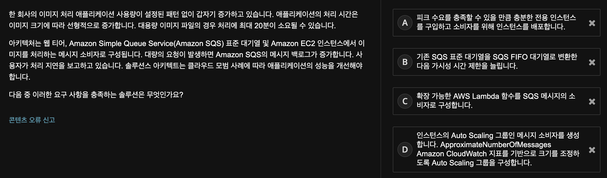
```
답: D
```

- A) AWS Cloud는 피크 소비에 맞춰 구매할 필요가 없고, On-demand로 확장할 수 있다
  - [동적 공급](https://docs.aws.amazon.com/ko_kr/wellarchitected/latest/cost-optimization-pillar/dynamic-supply.html) 참고 
- B) FIFO Queue는 메시지가 순서에 맞지 않게 처리될 때 발생하는 문제점을 해결한다.
  - but, 급격한 볼륨 증가 시 FIFO Queue의 성능이 향상되지는 않는다
  - 또한 SQS를 생성한 후에는 타입을 변경할 수 없다
- C) 해당 시나리오에 따르면 대용량 이미지의 처리는 최대 20분이 소요될 수 있다고 하는데, Lambda 함수의 제한 시간은 900초 (15분)이기 때문에 적합하지 않은 선택지이다.
  - [Lambda 할당량](https://docs.aws.amazon.com/ko_kr/lambda/latest/dg/gettingstarted-limits.html) 참고
- D) EC2 Auto Scaling을 사용하여 처리 용량이 큰 요청을 충족할 수 있다
  - [Amazon SQS 기반 크기 조정](https://docs.aws.amazon.com/ko_kr/autoscaling/ec2/userguide/as-using-sqs-queue.html) 참고

<br>

## 2)
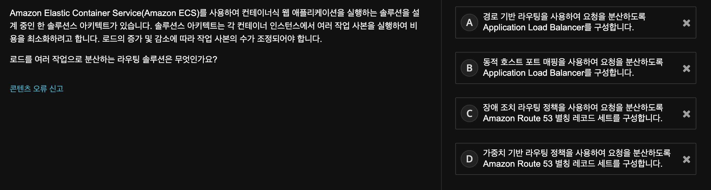
```
답: B
```
- A) Path 기반 라우팅을 사용하면, 여러 서비스가 하나의 ALB에서 동일한 listener port를 사용할 수 있고, ALB는 URL을 기반으로 특정 Target Group으로 해당 요청을 전달한다.
  - but, 이것은 동일 서비스의 여러 작업간 load balancing에 도움이 되지 않는다
  - [서비스 로드 밸런싱](https://docs.aws.amazon.com/ko_kr/AmazonECS/latest/developerguide/service-load-balancing.html) 참고
- B) `Dynamic host port mapping`을 사용하여 요청을 분산하도록 ALB를 구성할 수 있다
- C) 장애 발생시 `장애 조치 라우팅 정책`을 사용하여 트래픽을 백업 인스턴스로 라우팅 할 수 있다
  - but, 해당 기능을 사용하여 단일 컨테이너에서 여러 작업을 관리할 수는 없다
  - [라우팅 정책 선택](https://docs.aws.amazon.com/ko_kr/Route53/latest/DeveloperGuide/routing-policy.html) 참고
- D) `가중치 기반 라우팅 정책`을 사용하여 트래픽을 지저한 비율에 따라 인스턴스로 라우팅할 수 있다
  - but, 가중치 기반 라우팅 정책을 사용하여 단일 컨테이너에서 여러 작업을 관리할 수는 없다

<br>

## 3)
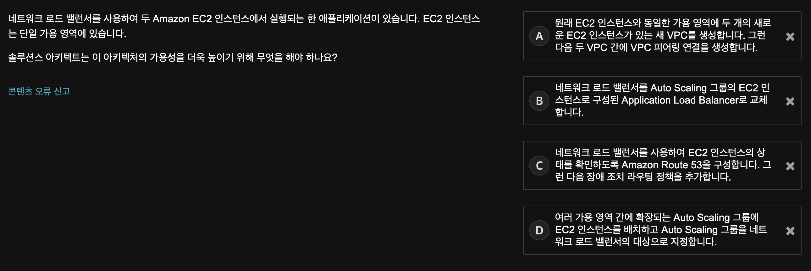
```
답: D
```
- A) `VPC Peering`은 서로 다른 AZ에 대한 연결을 제공한다
  - but, VPC Peering을 활성화 하더라도 EC2 인스턴스는 여전히 하나의 AZ에 있기 때문에 고가용성을 보장하지 않는다
  - [VPC 피어링이란?](https://docs.aws.amazon.com/ko_kr/vpc/latest/peering/what-is-vpc-peering.html) 참고
- B) NLB를 ALB로 교체해도 가용성이 추가되지 않는다. (두 가지 ELB 모두 기본적으로 가용성이 높다)
  - but, EC2 인스턴스는 AZ가 두 개 이상으로 확장된 경우에 높아진다.
  - [Elastic Load Balancing의 작동 방식](https://docs.aws.amazon.com/ko_kr/elasticloadbalancing/latest/userguide/how-elastic-load-balancing-works.html) 참고
- C) 여전히 EC2는 하나의 AZ에 있기 때문에 고가용성을 보장하지 않는다
  - [DNS 장애 조치 구성](https://docs.aws.amazon.com/ko_kr/Route53/latest/DeveloperGuide/dns-failover-configuring.html) 참고
- D) 해당 솔루션을 통해 여러 AZ 간에 EC2 인스턴스를 확장하고, 추가 용량이 필요할 경우 자동으로 용량을 추가할 수 있다
  - [Amazon EC2 Auto Scaling의 이점](https://docs.aws.amazon.com/ko_kr/autoscaling/ec2/userguide/auto-scaling-benefits.html) 참고
  
<br>

## 4)
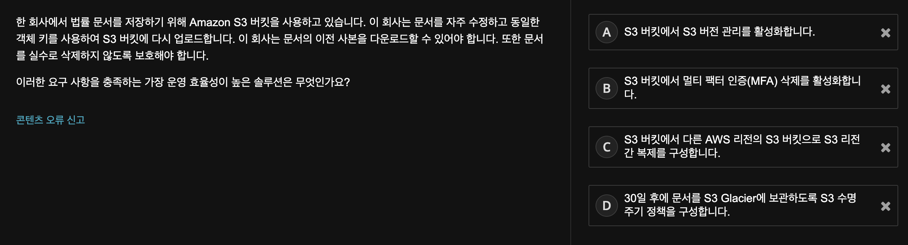
```
답: A
```
- A) S3 버전 관리를 사용하여 동일한 S3 버킷에서 object의 versioning을 할 수 있으며, 저장된 모든 version의 object를 모두 보존, 검색 및 복원할 수 있다
  - 또한 의도하지 않은 작업 및 장애로부터 복구할 수 있다
  - [S3 버전 관리 작동 방식](https://docs.aws.amazon.com/ko_kr/AmazonS3/latest/userguide/versioning-workflows.html) 참고
- B) `MFA 삭제`는 추가 객체 보안 계층을 제공하고, 객체를 삭제하는 주체가 승인된 MFA Token을 보유하도록 한다
  - but, 해당 문제의 요구사항을 충족하지는 않는다!
  - [MFA Delete 구성](https://docs.aws.amazon.com/ko_kr/AmazonS3/latest/userguide/MultiFactorAuthenticationDelete.html) 참고
- C) `S3 Region 간 복제`의 전제 조건이 `S3 버전 관리`이다.
  - but, S3 버전 관리만으로도 해당 문제의 요구사항을 충족하므로 Region간 복제는 불필요!
  - [객체 복제](https://docs.aws.amazon.com/ko_kr/AmazonS3/latest/userguide/replication.html) 참고
- D) `S3 Lifecycle Policy`를 사용하여 비용 효율적으로 객체를 저장할 수 있다.
  - [스토리지 수명 주기 관리](https://docs.aws.amazon.com/ko_kr/AmazonS3/latest/userguide/object-lifecycle-mgmt.html) 참고

<br>

## 5)
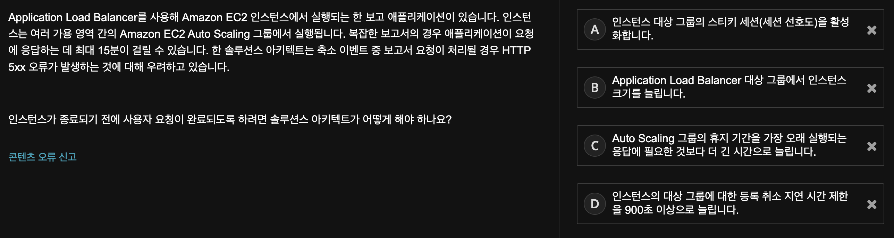
```
답: D
```
- A) Scale-in 중에 EC2 인스턴스가 Target Group에서 제거된 경우 EC2 인스턴스에 장애가 발생하거나 비정상 상태가 된다.
  - ALB는 해당 target에 대한 요청 라우팅을 중지하고, 정상 target에 요청을 보낸다
  - [Application Load Balancer에 대한 고정 세션](https://docs.aws.amazon.com/ko_kr/elasticloadbalancing/latest/application/sticky-sessions.html) 참고
- B) Scale-up을 하면 처리 속도가 빨라질 수는 있으나, 해당 문제 요구사항에는 적합하지 않음!
  - [등록 취소 지연](https://docs.aws.amazon.com/ko_kr/elasticloadbalancing/latest/application/load-balancer-target-groups.html#deregistration-delay) 참고
- C) EC2 Auto Scaling cooldown을 지정하여 ASG에서 인스턴스를 시작하거나 종료하지 않을 수 있도록 할 수 있다
  - [Amazon EC2 Auto Scaling을 위한 조정 휴지](https://docs.aws.amazon.com/ko_kr/autoscaling/ec2/userguide/Cooldown.html)
- D) ELB는 기본적으로 `Deregistration delay` 프로세스가 완료되기 전 300초 동안 대기하는데, 이것을 통해서 해당 target에서 진행 중인 요청을 완료하는데 도움을 줄 수 있다

<br>

## 6)
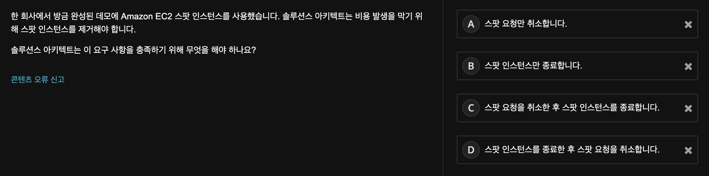
```
답: C
```
- Spot Instance가 종료되면 spot 요청이 취소될 때 까지 새 인스턴스가 실행된다
- [스팟 인스턴스 종료](https://docs.aws.amazon.com/ko_kr/AWSEC2/latest/UserGuide/spot-requests.html#terminating-a-spot-instance) 참고

<br>

## 7)
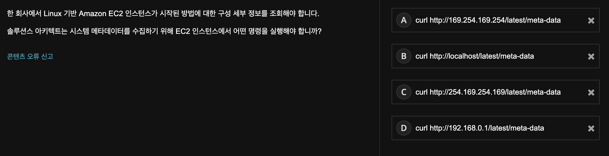
```
답: A
```
- Instance meta-data를 검색하는 유일한 방법은 링크-로컬 주소 (`169.254.169.254`)를 사용하는 것이다
- [인스턴스 메타데이터 검색](https://docs.aws.amazon.com/ko_kr/AWSEC2/latest/UserGuide/instancedata-data-retrieval.html) 참고

<br>

## 8)
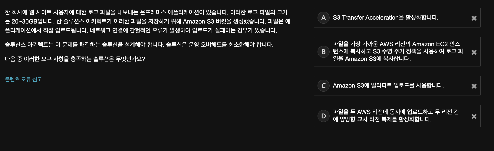
```
답: C
```
- A) `S3 Transfer Acceleration`은 edge location을 사용하여 데이터를 S3로 복사함으로써 **업로드 시간을 단축**할 수 있다
  - but, 단일 PUT 작업에 대한 파일 크기 제한 문제는 해결하지 못한다
  - [S3 Trasfer Acceleration](https://aws.amazon.com/ko/s3/transfer-acceleration/) 참고
- C) 단일 PUT 작업으로 최대 5GB의 단일 객체를 업로드 할 수 있는데, `Multipart upload`를 사용하면, 대용량 파일을 업로드할 수 있다!
  - [멀티파트 업로드를 사용한 객체 업로드 및 복사](https://docs.aws.amazon.com/ko_kr/AmazonS3/latest/userguide/mpuoverview.html) 참고

<br>

## 9)
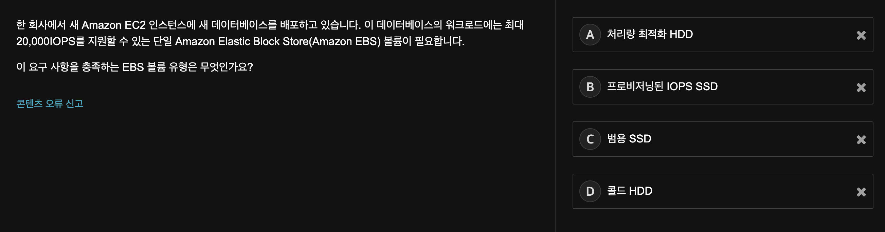
```
답: B
```
- A) `처리량 최적화 HDD EBS 볼륨`은 각 볼륨에 대해 **500IOPS**로 제한
  - [하드 디스크 드라이브(HDD)](https://docs.aws.amazon.com/ko_kr/AWSEC2/latest/UserGuide/ebs-volume-types.html#hard-disk-drives) 참고
- B) `프로비저닝된 IOPS SSD EBS 볼륨`은 각 볼륨에 대해 최대 **64,000IOPS**를 제공
  - [SSD(Solid-State Drive)](https://docs.aws.amazon.com/ko_kr/AWSEC2/latest/UserGuide/ebs-volume-types.html#solid-state-drives) 참고
- C) `범용 SSD EBS 볼륨`은 각 볼륨에 대해 **16,000IOPS**로 제한
- D) `콜드 HDD 볼륨`은 IOPS가 아닌 **처리량**으로 성능을 정의하는 저비용 마그네틱 스토리지를 제공
  - 순차적인 대용량 콜드 데이터 워크로드에 적합!
  - [Amazon EBS 콜드 HDD 볼륨](https://aws.amazon.com/ko/ebs/cold-hdd/) 참고
<br>

## 10)
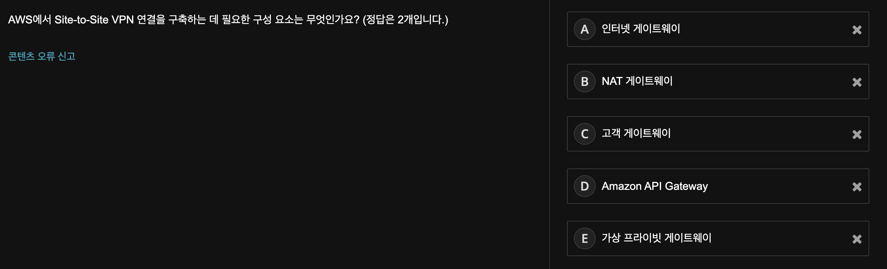
```
답: C, E
```
- VPN 연결을 설정하려면 `고객 게이트웨이`와 `가상 프라이빗 게이트웨이`가 필요하다
  - 고객 게이트웨이 디바이스는 고객의 데이터 센터에서 설정 및 구성되고,
  - 가상 프라이빗 게이트웨이는 **VPC에 연결**되어 AWS에서 Site-to-Site VPN 연결을 생성한다
- [AWS Site-to-Site VPN이란 무엇인가요?](https://docs.aws.amazon.com/ko_kr/vpn/latest/s2svpn/VPC_VPN.html) 참고

<br>

## 11)
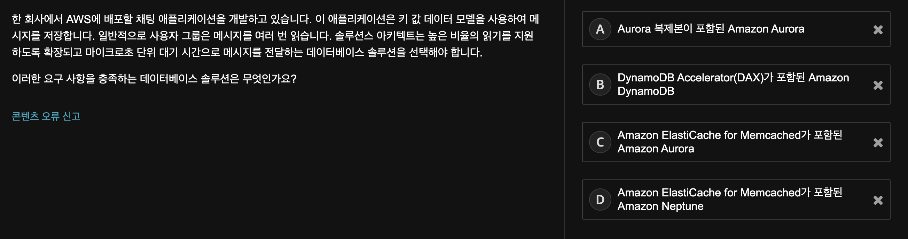
```
답: B
```
- `DynamoDB`는 키 값 레코드를 지원하는 **NoSQL** 데이터베이스이다
  - [Amazon DynamoDB란?](https://docs.aws.amazon.com/ko_kr/amazondynamodb/latest/developerguide/Introduction.html) 참고
- `DAX`는 마이크로초 단위로 응답 시간을 제공한다
  - [DynamoDB Accelerator(DAX)를 통한 인 메모리 가속화](https://docs.aws.amazon.com/ko_kr/amazondynamodb/latest/developerguide/DAX.html) 참고

<br>

## 12)
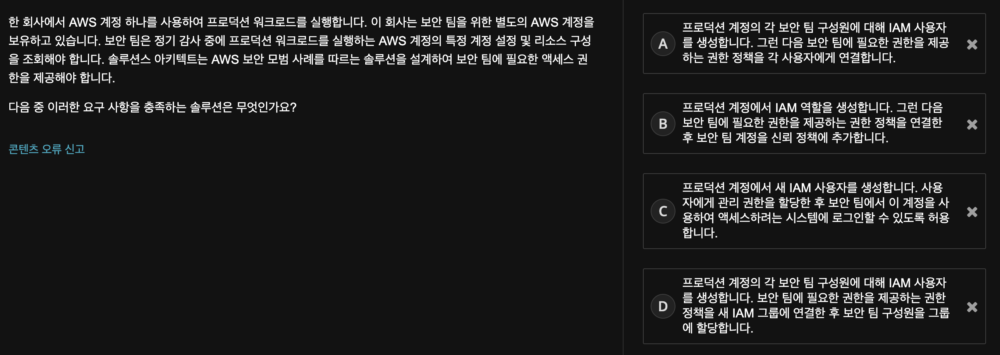
```
답: B
```
- IAM Role을 사용하여 최소 권한을 부여할 수 있도록 한다
  - [역할을 사용하여 권한 위임](https://docs.aws.amazon.com/ko_kr/IAM/latest/UserGuide/best-practices.html#delegate-using-roles) 참고

<br>

## 13)
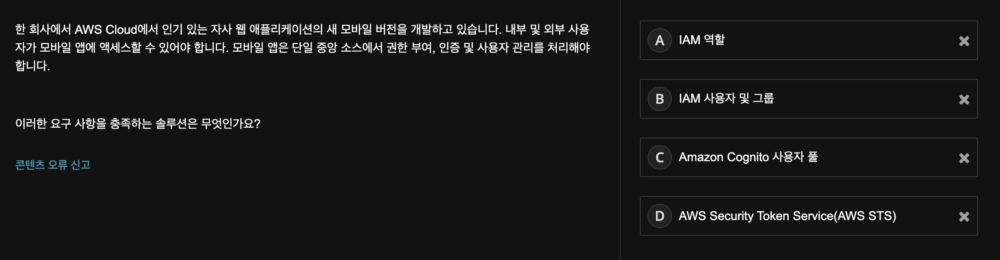
```
답: C
```
- C) Amazon Cognito는 웹 및 모바일 앱에 대한 **인증**, **권한 부여** 및 **사용자 관리**를 제공한다
  - [Amazon Cognito란 무엇입니까?](https://docs.aws.amazon.com/ko_kr/cognito/latest/developerguide/what-is-amazon-cognito.html) 참고
- D) AWS STS를 사용하면 AWS 리소스에 대한 액세스를 제어할 수 있는 **임시 보안 자격 증명**을 생성하여 신뢰받는 사용자에게 제공할 수 있다
  - but, STS가 어플리케이션에 대한 액세스를 제어하지는 않는다
  - [IAM의 임시 보안 자격 증명](https://docs.aws.amazon.com/ko_kr/IAM/latest/UserGuide/id_credentials_temp.html) 참고
<br>

## 14)
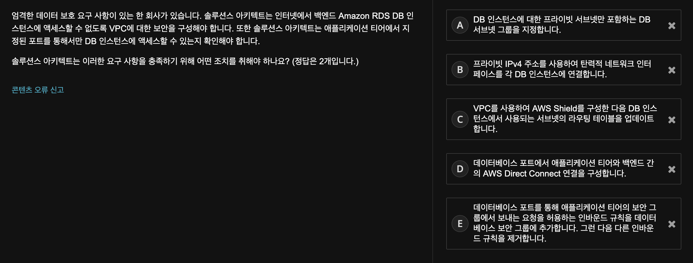
```
답: A, E
```
- A) `Private subnet`을 사용하여 데이터베이스 티어를 보호할 수 있다
  - 인터넷 트래픽은 private subnet에 라우팅되지 않기 때문에 private subnet에 DB 인스턴스를 배치하면 보안 계층이 추가된다
  - [Routing](https://docs.aws.amazon.com/ko_kr/vpc/latest/userguide/VPC_Scenario2.html#VPC_Scenario2_Routing) 참고
- C) `Shield`를 사용하여 DDoS 공격으로부터 보호할 수 있지만, 라우팅 테이블에 있는 경로의 대상이 될 수는 없다
  - [AWS Shield](https://docs.aws.amazon.com/ko_kr/waf/latest/developerguide/shield-chapter.html) 참고

<br>

## 15)
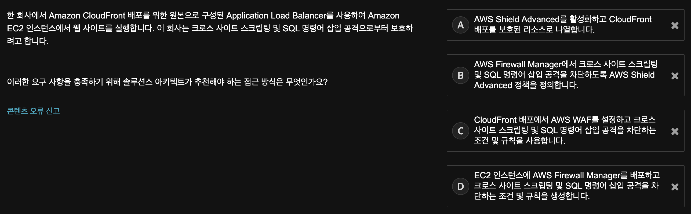
```
답: C
```
- A) Shield Advanced는 DDoS 공격으로부터 보호하지만,  **SQL Injection**과 **Cross-Site Scripting(XSS)**으로부터 보호하지는 않는다
  - [AWS Shield](https://docs.aws.amazon.com/ko_kr/waf/latest/developerguide/shield-chapter.html) 참고
    -  AWS Shield의 종류
       - AWS Shield Standard
         - AWS WAF 및 기타 AWS 서비스에 대해 이미 지불한 비용 외에 다른 추가 비용 없이 자동으로 포함된다
       - AWS Shield Advanced
    - Shield Advanced를 적용할 수 있는 리소스
      - Amazon CloudFront Distributions
      - Amazon Route 53 hosted zones
      - AWS Global Accelerator standard accelerators
      - Amazon EC2 Elastic IP addresses
      - ELB (Elastic Load Balanc)
        - ALB
        - CLB
        - NLB (Amazon EC2 Elastic IP를 통해서 가능) 
- B) Firewall Manager를 사용하면 AWS WAF, Shield Advanced 및 기타 AWS 서비스를 관리할 수 있지만, AWS Shiled Advanced는 DDoS 공격을 위한 것!
  - [AWS WAF, AWS Shield 및 AWS Firewall Manager란 무엇인가요?](https://docs.aws.amazon.com/ko_kr/waf/latest/developerguide/what-is-aws-waf.html) 참고
- C) AWS WAF는 악성일 가능성이 있는 **SQL Injection**과 **Cross-Site Scripting(XSS)** 를 감지할 수 있다
  - [AWS WAF](https://docs.aws.amazon.com/ko_kr/waf/latest/developerguide/waf-chapter.html) 참고
- D) Firewall Manager로 AWS WAF를 관리할 수 있지만, EC2 인스턴스에 설치되지 않는 관리형 서비스이다

<br>

## 16)
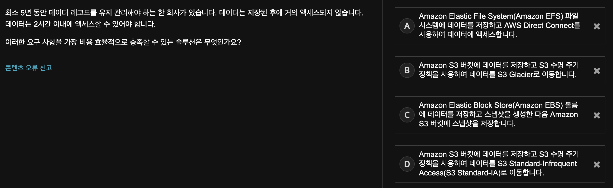
```
답: B
```
- B) `S3 Glacier`는 2시간 검색 시간 요구 사항을 충족하는 가장 비용 효율적인 아카이브 스토리지 솔루션이다
  - [스토리지 수명 주기 관리](https://docs.aws.amazon.com/ko_kr/AmazonS3/latest/userguide/object-lifecycle-mgmt.html) 참고
  - [Amazon S3 스토리지 클래스 사용](https://docs.aws.amazon.com/ko_kr/AmazonS3/latest/userguide/storage-class-intro.html) 참고


<br>

## 17)
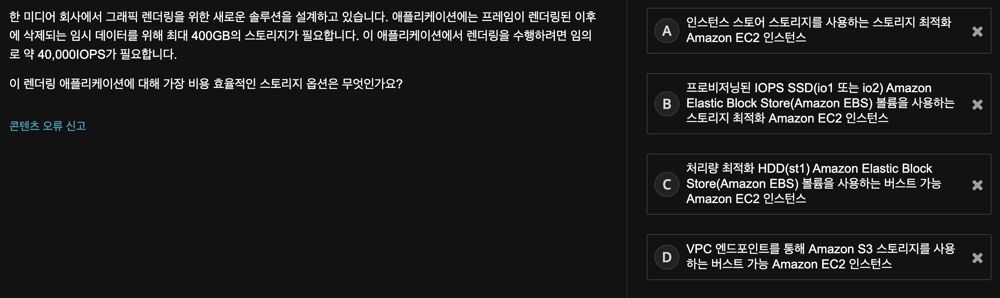
```
답: A
```
- A) `SSD 지원 스토리지 최적화(i2) 인스턴스`는 임의로 **365,000IOPS 이상**을 제공하며, 인스턴스 스토어는 인스턴스의 정규 시간당 요금에 비해 추가 비용이 없다!
- B) `프로비저닝된 IOPS SSD(io1 또는 io2) EBS 볼륨`은 **40,000IOPS 이상**을 제공하지만, 시간당 인스턴스 요금에 비용을 추가하므로 인스턴스 스토어만큼 비용 효율적이지 않다
  - [Provisioned IOPS SSD 볼륨](https://docs.aws.amazon.com/ko_kr/AWSEC2/latest/UserGuide/ebs-volume-types.html#EBSVolumeTypes_piops) 참고
- C) `처리량 최적화 HDD(st1) EBS 볼륨`은 **볼륨에서 주고받을 수 있는 데이터 처리량**을 최대화하도록 설계되었다
  - but, EBS는 시간당 인스턴스 요금에 비용을 추가하므로 탈락!


<br>

## 18)
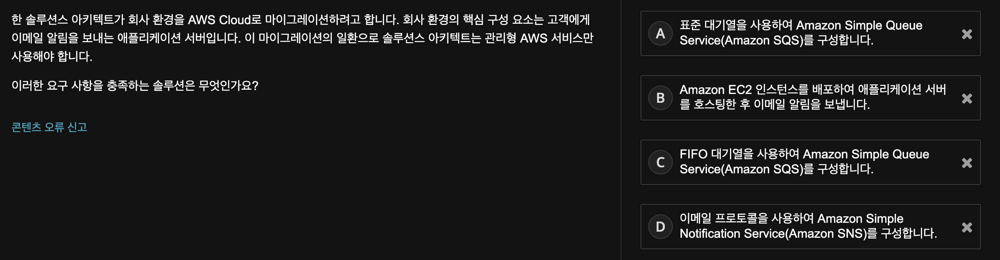
```
답: D
```
- A, C) Amazon SQS는 소프트웨어 구성 요소 간에 메시지를 전송하는 완전관리형 메시지 대기열 서비스이다
  - but, SQS로 고객에게 메시지를 푸시할 수는 없다!
  - [Amazon Simple Queue Service](https://aws.amazon.com/ko/sqs/) 참고
    - `SNS vs SQS`
      - **SNS**
        - distributed **publish-subscribe** system
        - Messages are pushed to subscribers as and when they are sent by publishers to SNS
      - **SQS**
        - distributed **queuing** system.
        - Messages are not pushed to receivers. 
        - Receivers have to poll or pull messages from SQS.
- D) Amazon SNS는 애플리케이션 간 통신 및 **애플리케이션과 사용자 간** 통신을 위한 완전관리형 메시징 서비스이다
  - [Amazon SNS FAQ](https://aws.amazon.com/ko/sns/faqs/) 참고
    - 개발자에게 애플리케이션의 메시지를 게시하고 이를 구독자나 다른 애플리케이션에 즉시 전송할 수 있는 고도로 확장 가능하며 유연하고 비용 효율적인 기능을 제공한다
    - SNS는 “publish-subscribe”(pub-sub) 메시징 패러다임을 따른다
      - 즉, 클라이언트에게 전송되는 알림이 “푸시” 메커니즘을 사용하기 때문에 새로운 정보나 업데이트를 정기적으로 확인하거나 “폴링”할 필요가 없다
    - `SNS의 장점`
      - 즉시적인 푸시 기반 전송(폴링 필요 없음)
      - 간편한 API와 손쉬운 애플리케이션 통합
      - 여러 전송 프로토콜을 지원하는 유연한 메시지 전송
      - 사전 확약금 없는 저렴한 종량 과금제 모델
      - 웹 기반 AWS Management Console의 간편한 포인트 앤 클릭 방식 인터페이스

<br>

## 19)
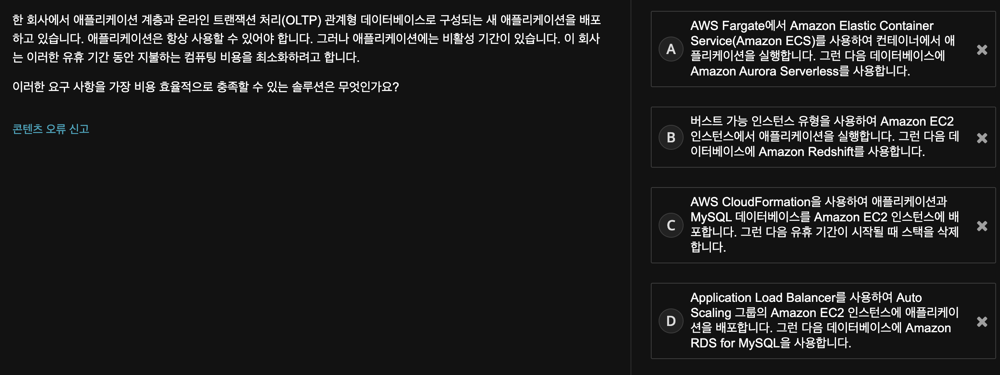
```
답: A
```
- A) Amazon ECS에서 컴퓨팅에 `Fargate`를 사용할 때, 그리고 `Aurora Serverless` 유휴 상태일 때 비용이 발생하지 않음!
  - [Amazon Aurora 서버리스](https://aws.amazon.com/ko/rds/aurora/serverless/) 참고

<br>

## 20)
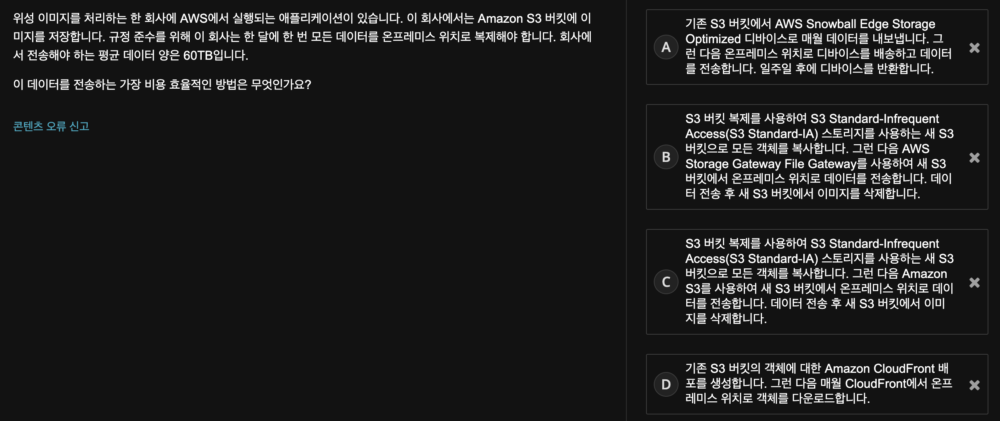
```
답: A
```
- A) 기본 가격에는 디바이스와 10일간의 온프레미스 위치 사용 기간이 포함된다
  - 즉, 회사에서 1주일 이내에 디바이스를 반환할 경우 기본 가격과 AWS에서 데이터를 전송하는 데 필요한 가격을 지불하면 된다
  - [AWS Snowball 요금](https://aws.amazon.com/ko/snowball/pricing/) 참고
- D) CloudFront로의 데이터 전송은 무료이지만, CloudFront에서 온프레미스 위치로 60TB의 데이터를 전송하려면 비용이 발생하므로 비효율적!
  - [Amazon CloudFront 요금](https://aws.amazon.com/ko/cloudfront/pricing/) 참고
<br>
