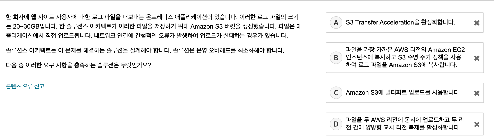
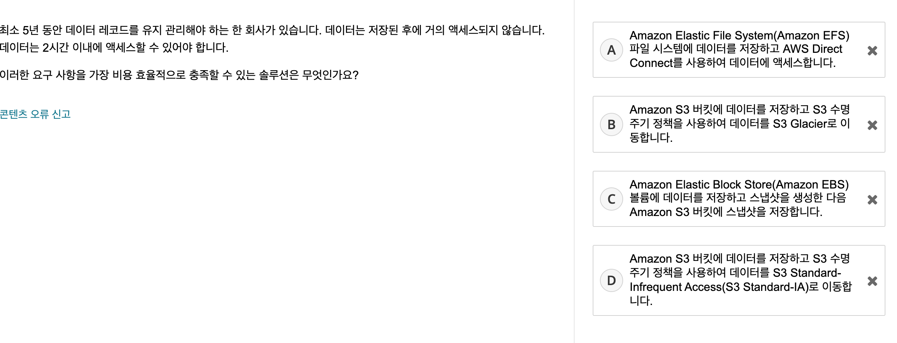
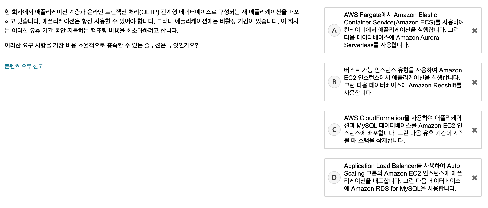

# Skill Builder 문제풀이

[Aws Skill Builder 20 문제](https://explore.skillbuilder.aws/learn/course/external/view/elearning/9160/aws-certification-official-practice-question-sets-korean)

위 링크를 풀고 해설합니다.

 
 

### 1번

1. 전용 인스턴스는 외부로 나가면 안되는 코드를 사용하거나, 그런 환경이 필요할 때 사용하는 EC2 인스턴스이다.
2. consumer 가 sqs 큐에서 메세지를 수신해도 메세지는 큐에 남아있다. consumer 는 작업을 처리 후 메세지를 삭제해야 한다. 그런데 처리하는 시간이 오래 걸려서, 재때 큐의 메세지를 삭제하지 못하면, 다른 서버에서 그 일을 중복으로 수신해서 처리할 수 있다. 그래서 가시성 제한을 두어 특정 시간이 지나면 큐의 메세지를 자동으로 삭제할 수 있다. 디폴트 타임아웃은 30 초이다. 작업이 얼마나 걸릴 지 모르는 경우에는, 메세지가 누락되는 것 보다는 차라리 중복처리가 나으니 가시성 제한을 최대한으로 늘리는게 best practice 이다.
3. 람다의 최대 운영 시간은 15분이다.
4. 메세지가 늘어나면 cloudWatch 로 감지 후 인스턴스를 자동으로 늘리고, 다시 줄어들면 인스턴스를 삭제할 수 있도록 >ASG 를 구성하는게 좋다.

정답 : 4

 

---

### 2번

1. ALB 의 경로기반 라우팅은 url 또는 호스트 이름으로 로드를 분산시킨다. 같은 작업에 대해서 분산시키지 않음.
2. ALB + ECS 구성 시 동적 호스트 포트 매핑을 사용하면, 같은 서비스라도 포트번호로 서로 다른 컨테이너로 로드를 분산시킬 수 있다.
3. Route 53 의 장애 조치 라우팅 정책은 서비스중인 인스턴스가 장애가 나면 백업 인스턴스로 요청을 옮기는 역할을 한다.
4. Route 53 의 가중치 기반 라우팅으로 트래픽을 여러 인스턴스로 라우팅할 수 있지만, 한 컨테이너의 작업 사본 갯수를 관리할 수 없다.

정답 : 2

 

---

### 3번

서로 다른 AZ 에 인스턴스들을 두어서, 재해복구가 가능한 가용성을 묻는 것 같다.

1. 동일한 AZ 라 가용성이 올라가지 않는다. VPC 를 다른 AZ 에 구성 후 피어링해야한다.
2. 가용성과 LB 종류는 관계없다.
3. 장애복구 또한 가용성이 높게 하는 방법 중 하나라 생각했지만, 단일 AZ 라는 점이 문제에서 더 묻고 싶은 것 같다.
4. ASG 이 생성하는 인스턴스가 여러 AZ 라면 확실히 가용성이 높다.

정답 : 4

 

---

### 4번

1. S3 는 버전관리 기능이 있다!!
2. MFA 는 보안을 높이는 방법.
3. 리전 복제를 하려면 버전관리를 해야 하지만, 문제의 요구사항은 버전관리로 충분.
4. 수명주기 설정은 해당 자료를 볼 것인가, 보지 않아서 삭제할 것인가를 정의한다. 문제의 요구사항과 다른 관점.

정답 : 1

 

---

### 5번

3. cooldown : 휴지기간, cloudWatch 의 일정 metric 을 충족하여 인스턴스를 늘리거나 줄일 때, 그게 일시적인 변화인지 조금 기다려보는 시간
4. connection draining : 등록 취소 지연 시간, 인스턴스가 unhealth 일 때 이미 진행중인 요청은 처리할 수 있게 인스턴스를 종료하기 전에 일정 시간을 기다려주는 것.  

정답 : 4

 

---

### 6번

스팟 인스턴스는 현물 가격에 따라 삭제될 수 있다. 스팟 요청(spot Request) 를 작성해 놓으면 현물 가격이 다시 제자리를 찾았을 때 자동으로 인스턴스를 만들어준다. 따라서 자동으로 생성되는 것을 막기 위해 스팟 요청을 먼저 삭제 후 인스턴스를 삭제해야 한다.

정답 : 4

 

---

### 7번

인스턴스의 메타 데이터를 조회하기 위해서는
1. 인스턴스 안에서
2. 아래의 링크-로컬 주소를 호출해야한다.

IPv4
http://169.254.169.254/latest/meta-data/
IPv6
http://[fd00:ec2::254]/latest/meta-data/

정답 : 1

 

---

### 8번

1. S3 Transfer Acceleration : 엣지 로케이션(Cloud Front. CDN) 을 사용해서 빠르게 S3 업로드를 수행하는 기능
2. 수명주기 정책은 이 문제와 관계없음
3. 멀티파트 업로드는 큰 단일 객체를 여러 객체로 쪼개서 업로드 가능. 그중 실패한 것만 따로 재시도를 할 수 있고, 병렬로 실행할 수 있다.

정답 : 3

 

---

### 9번

IOPS(Input/Output Operations Per Second, IOPS) : 처리속도의 단위  
SDD 는 IOPS 가 높아 IO 의 횟수가 많은 트랜잭션 워크로드에 적합하고,
HDD 는 처리량이 많은 대규모 스트리밍 워크로드에 적합

1. 처리량 최적화 HDD : 자주 액세스하는 처리량 집약적 워크로드에 적합한 저비용 HDD
2. 프로비저닝된 IOPS SSD : 스토리지 성능과 일관성에 민감한 I/O 집약적 워크로드, 특히 데이터베이스 워크로드의 요구 사항을 충족하도록 설계. 프로비저닝된 IOPS SSD 볼륨은 볼륨을 생성할 때 지정한 일관된 IOPS 속도를 사용하며 Amazon EBS는 프로비저닝된 성능의 99.9%를 제공합니다.
3. 범용 SSD : 최대 16000 IOPS
4. 콜드 HDD : HDD 여서 처리량에 포커스를 맞춤. 처리량 최적화 HDD 보다 IOPS 가 낮으며 더 저렴하다. 자주 액세스 하지 않는 워크로드에 적합.

정답 : 2

 

---

### 10번

Site-to-Site VPN : 자체 온프레미스 네트워크와 인스터스의 VPC 가 통신하기 위한 VPN

A. 인터넷 게이트웨이 : 온프레미스 네트워크 내부와 트래픽을 주고받기 위해 사용
B. NAT 게이트웨이 : public IP <> private IP 교환을 해주는 게이트웨이.
D. Amazon API Gateway : 벡엔드 API 들을 모니터링할 수 있도록 하는 관리 게이트웨이

C. 고객 게이트웨이 : 이게뭐지..
E. 가상 프라이빗 게이트웨이 : 이것도 뭐지..

정답 : C, E

 

---

### 11번

A. Aurora : RDB 임.
B. DynamoDB Accelerator 가 포함된 Amazon DynamoDB : 다이나모 DB 는 NoSql. DynamoDB Accelerator 는 마이크로초 단위로 응답을 제공한다.
C. Amazon ElasticCache for Memcached 가 포함된 Amazon Aurora : ElasticCache For Memcached 는 메모리에 키:벨류로 저장하는 캐시 서비스이다. 에플리케이션의 수정 없이 단순하게 사용할 수 있다. 마이크로초 단위로 사용할 수 있지만, 일관되게 그렇다는 보장은 없고 평균 1미리초 미만이라 한다.
D. Amazon Neptune : 그래프 데이터베이스

정답 : B

 

---

### 12번

음... 계정을 하나 사용하고, 감사때 한꺼번에 조회해야 한다는 점에서 D 보다는 정책들을 포함한 역할을 생성해서 사용하는 B 가 맞다는 것 같다.

정답 : B

 

---

### 13번

AWS STS : 리소스에 대한 엑세스 허가, 인가를 할 수 있음.
Amazon Cogmito : 웹, 앱에 대해 인증처리 즉 엑세스를 관리. 로그인 인증 및 권한을 부여.

정답 : C

 

---

### 14번

B. 탄력적 네트워크 인터페이스 : VPC 에서 사용하는 네트워크 카드
C. AWS Shield : 디도스 공격을 방어. CloudFront, Route53, ALB, ELB, Elastic Ip 등에 붙어지며, 추가요금 없음.
D. AWS Direct Connection : end to end private network. 네트워크를 연결할 뿐 디비에 포트 접속을 한정하고 그런게 아님. 주로 AWS 네트워크와 온프레미스 네트워크를 연결하는데 쓰임.

A. DB 를 프라이빗 서브넷으로 묶으면 인터넷 트래픽이 들어오지 않음이 보장된다.
E. 에플리케이션 단의 보안 그룹을 DB 의 보안 규칙에 추가하면 에플리케이션에서만 요청을 받도록 방화벽을 여는 효과가 있다.
정답 : A, E

 

---

### 15번

AWS WAF : web application firewall. CloudFront, ALB, Api GateWay 등등과 같이 사용하며, 콘텐츠에 대한 엑세스를 제어할 수 있다. 지정한 요청을 제외하고 모두 요청을 허용하거나 차단할 수 있다. 다음은 WAF 에서 요청을 받을 것인가 말 것인가를 정의할 수 있는 것들이다. 즉 WAF 에서 알 수 있는 것들. (ACL 웹 엑세스 제어 목록 이라고 한다.)
 - 요청이 시작되는 IP 주소
 - 요청이 시작되는 국가
 - 요청 헤더 값
 - 요청 길이
 - 요청에 나타나는 문자열(정규식 비교 가능)
 - SQL injection 여부
 - XSS 여부

AWS Shield : WAF 의 ACL 을 이용하여 DDOS 공격을 최소화할 수 있다.

Firewall Manager : Firewall Manager를 사용하면 AWS WAF, AWS Shield Advanced 및 기타 AWS 서비스를 관리

정답 : C

 

---

### 16번

Aws Glacier, S3 Standard-Infrequent Access 둘 다 오래 저장하고 적게 요청하는 데이터. 하지만 glacier 은 검색속도가 느리고 더 저렴하다. S3 Standard IA 는 밀리초 이내의 검색속도를 제공한다. S3 Glacier Instant Retrieval 는 glacier 중 밀리초의 응답을 제공한다.

차이는,  
S3 Glacier Instant Retrieval 는 S3 Standard IA 에 비해 저장비용이 저렴하나, 검색 비용이 비싸다. 문제에서 거의 검색을 안한다니 Glacier 가 더 알맞는 것 같다.

정답 : B

 

---

### 17번

스토리지 최적화 인스턴스 (i2.~) 를 사용하면 
chleo 365000IOPS 이상을 제공한다. 그리고 문제에서 계속 가지고 있을 필요 없는 데이터라 했기 때문에, SSD 서비스를 굳이 사용하지 않고, 인스턴스 스토리지를 사용하는 게 더 좋겠다.
  
  인스턴스 스토어 스토리지는 인스턴스 요금 외에 추가요금이 붙지 않기 때문에 더 비용 효율적이다.

정답 : A

 

---

### 18번

관리형 : EC2 에 Mysql 설치해서 사용 (예시)
완전 관리형 : RDS 사용 (예시)

SQS 는 작업자가 큐에서 작업을 꺼내가야 하지만,
SNS 는 메세지를 푸시해주기까지 한다.

정답 : D

 

---

### 19번

ECS Fargate 는 애플리케이션이 비활성일 때 컴퓨팅 비용이 발생하지 않는다.  
Aurora Serverless 는 애플리케이션이 비활성일때 컴퓨팅 비용이 발생하지 않는다.

정답 : A

 

---

### 20번

AWS Snowball : 스토리지.  
물리적 스토리지 디바이스를 사용하여(S3 의 데이터를 담은 커다란 하드디스크같은 실제 기기가 배달온다.) 더 빠른 전송을 가능하게 하기 떄문에 시간을 절약할 수 있다.  
10일 단위로 디바이스를 빌릴 수 있고, 디바이스 비용이 늦어지지 않는 한 10일 대여비용과 전송비용만 내면 되서 가격을 절약할 수 있다.

온프레미스 데이터 센터 <> S3 간의 대용량 파일 전송에 주로 쓰인다.

정답 : A

 

---