# Practice Exam
- https://explore.skillbuilder.aws/learn/course/9160

### 1번 문제
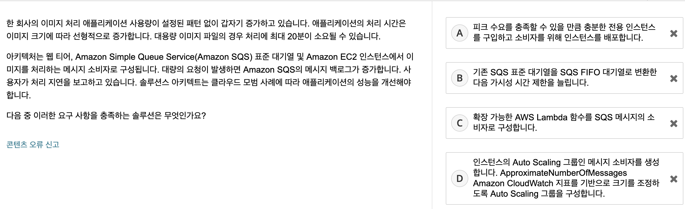
```
선택 : (D)

문제 요구사항은 다음과 같다.
1. 대용량 이미지 처리시 시간 증가
2. SQS 큐로 대기열 관리하고 EC2 인스턴스에서 이미지 처리
3. 대량 요청 발생시 SQS 메세지 백로그 증가
4. 위와 같을때 성능 개선은 어떻게 할 수 있는가?
즉, 대용량 이미지 처리시, 오래걸려서 SQS의 쌓이는 메시지가 많다고 이해

A - 비용적인 면에서 최선이라고 생각하지 않음

B - 가시성은 하나의 큐에 여러 서버가 동일 메시지 처리하는 것을 방지하고자 특정 시간동안 다른곳에서 해당 메시지를 볼 수 없는 것을 뜻함
문서에 따르면 https://aws.amazon.com/ko/premiumsupport/knowledge-center/sqs-message-backlog/
SQS 메시지 백로그가 증가할 경우 오히려 가시성 시간 제한을 설정하라고 설명되어 있음 고로 B 제거

C - 헷갈린 보기였음, 이미지 처리를 EC2가 아닌 람다로 한다는 의미로 이해함. 람다를 잘 모르기에 일단 보류

D - 대용량 이미지 처리시 한 인스턴스가 처리하면 오래걸리니, 오토스케일링을 통해 크기를 조정하여 
대용량 이미지 처리하는 EC2 외에 다른 메시지를 처리할 수 있는 인스턴스를 늘리는 방법이 최선일 것 같아 D 선택
```
```
정답 : (D)

A - 전용 인스턴스를 사용하면 기존 서버 바인딩 소프트웨어 라이선스를 사용하여 비용을 절감 가능.
[하지만 서버 바인딩 라이선스는 이 시나리오에서 다루지 않음]
AWS Cloud의 장점 중 하나는 피크 소비에 맞춰서 구매할 필요가 없음, AWS Cloud는 온디맨드로 확장할 수 있다.
전용 호스트에 대한 자세한 내용은 Amazon EC2 전용 호스트 요금을 참조해볼 것.
https://aws.amazon.com/ko/ec2/dedicated-hosts/pricing/

B - FIFO 대기열은 메시지가 순서에 맞지 않게 처리될 때 발생하는 문제를 해결한다.
그러나 급격한 볼륨 증가 시 FIFO 대기열의 성능이 향상되지 않는다.
또한 [SQS 대기열을 생성한 후에는 변환할 수 없습니다.]

포인트는 이거 같다.
[기존 표준 대기열을 FIFO 대기열로 변환할 수 없습니다.]
이동하려면 애플리케이션의 새 FIFO 대기열을 만들거나 기존의 표준 대기열을 삭제하고 FIFO 대기열로 다시 만들어야 합니다.
https://docs.aws.amazon.com/ko_kr/AWSSimpleQueueService/latest/SQSDeveloperGuide/FIFO-queues-moving.html

C - 이 시나리오의 일부 파일은 처리하는 데 최대 20분이 걸릴 수 있습니다.
Lambda에는 15분의 운영 제한이 있습니다.
포인트는 [Lambda에는 15분의 운영 제한]인 것 같다.
```

<br>
<br>

### 2번 문제
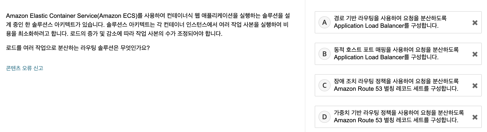
```
선택 : (B)

문제 요구사항
ECS 컨테이너 기반 로드(트래픽?)를 분산하는 솔루션은?
로드가 무엇일까?

A - 트래픽 분산하는 리소스는 ALB가 타당한 것 같아서 킾. 같은 작업을 경로 기반으로 나눌 순 있겠으나 최선같지 않아 제거
B - 트래픽 분산하는 리소스는 ALB가 타당한 것 같아서 킾. 기본적으로 호스트 포트 매핑을 사용하면 같은 작업을 실행할 수 있을 것 같아 선택
C - Route53과는 무관해보여서 제거 
D - Route53과는 무관해보여서 제거
```
```
정답 : (B)

A - 경로 기반 라우팅을 사용하면 여러 서비스가 단일 Application Load Balancer(ALB)에서 동일한 리스너 포트를 사용할 수 있습니다. 
ALB는 [URL 경로에 기반하여 특정 대상 그룹으로 요청을 전달]합니다. 하지만 이 솔루션은 [동일한 서비스의 여러 작업 간 로드 배포에 도움이 되지 않습니다.]

B - ALB는 컨테이너가 동적 호스트 포트 매핑을 사용하도록 허용합니다 (그래서 컨테이너 인스턴스마다 동일 서비스의 여러 작업이 허용됩니다)

C - 기본 인스턴스에 장애가 발생할 경우 장애 조치 라우팅 정책을 사용하여 트래픽을 백업 인스턴스로 라우팅할 수 있지만 [장애 조치 라우팅 정책을 사용하여 단일 컨테이너에서 여러 작업을 관리할 수는 없습니다.]

D - 가중치 기반 라우팅 정책을 사용하여 트래픽을 지정한 비율에 따라 인스턴스로 라우팅할 수 있지만 [가중치 기반 라우팅 정책을 사용하여 단일 컨테이너에서 여러 작업을 관리할 수는 없습니다.]
```

<br>
<br>

### 3번 문제
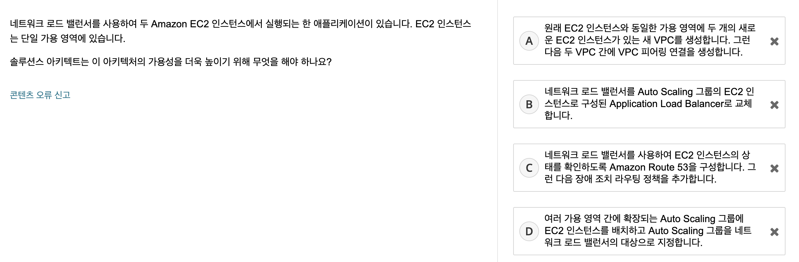
```
선택 : (D)

문제 요구 사항
NLB를 사용하며 단일 AZ를 사용하는 두개의 EC2가 있을 때, 가용성을 높이는 방법은?
가용성이라 하면 장애가 나더라도 안전하게 운영할 수 있어야 한다는 뜻

A - 단일 가용 영역에 있는 인스턴스들을 말하는데, 다른 VPC의 가용영역은 별개같아서 제거
B - NLB <-> ALB 교체한다고 가용성은 그대로 일 것 같아서 제거
C - Route53 및 장애 조치 라우팅 정책과 무관한 문제 같아서 제거
D - Auto Scaling으로 가용성 확보가 적절한 것 같아서 선택
```
```
정답 : (D)
A - VPC 피어링은 다른 가용 영역에 대한 연결을 제공합니다. 하지만 [VPC 피어링은 EC2 인스턴스가 여전히 단일 가용 영역에 있기 때문에 고가용성을 보장하지 않습니다.]
B - [네트워크 로드 밸런서를 Application Load Balancer로 교체해도 가용성이 추가되지 않습니다.] 두 로드 밸런서는 기본적으로 가용성이 높습니다. 하지만 EC2 인스턴스는 두 가용 영역 간에 확장된 경우에만 가용성이 높습니다.
C - 장애 조치 라우팅에는 기본 대상과 보조(장애 조치) 대상이 필요합니다. 이 솔루션에는 장애 조치 대상이 지정되어 있지 않습니다. 또한 이 접근 방식은 EC2 인스턴스가 여전히 단일 가용 영역에 있기 때문에 고가용성을 보장하지 않습니다
```

<br>
<br>

### 4번 문제
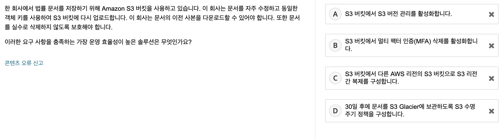
```
선택 : (A)

문제 요구 사항
S3 버킷에 문서를 저장하는데 자주 수정함. 이전 사본을 다운로드 해야하고 삭제하지 않도록 보호

A - 이전 사본을 다운로드라는 말에 버전 관리과 떠올랐고, 삭제가 되더라도 버전관리를 통해 복구 가능할 것 같아 A 선택
B - MFA 삭제와는 무관해 보임
C - 다른 리전에 복제하는 방법도 하나의 방법이겠으나 최선이라고 생각하지 않음
D - S3 Glacier 이 무엇인지는 모르겠으나 수명주기와는 무관해보임 
```
```
정답 : (A)

A - S3 버전 관리를 사용하면 동일한 S3 버킷에 객체의 여러 변형을 유지할 수 있으며 S3 버킷에 저장된 모든 버전의 객체를 모두 보존, 검색 및 복원할 수 있습니다.
또한 의도하지 않은 사용자 작업 및 애플리케이션 장애로부터 복구할 수 있습니다.

B - MFA 삭제는 추가 객체 보안 계층을 제공합니다. 또한 MFA 삭제는 객체를 삭제하는 엔터티가 승인된 MFA 토큰을 보유하도록 합니다.
하지만 MFA 삭제는 이 질문의 문서 버전 관리 요구 사항을 충족하지 않습니다.

C - S3 리전 간 복제를 위해서는 S3 버전 관리가 전제 조건입니다. 
하지만 S3 버전 관리만으로도 이 질문의 요구 사항이 충족되므로 운영 효율성이 더 높은 솔루션입니다.

D - S3 수명 주기 규칙을 사용하여 수명 주기 전반에서 비용 효율적으로 객체를 저장할 수 있습니다. 
그러나 S3 수명 주기 규칙은 이 질문의 문서 버전 관리 요구 사항을 충족하지 않습니다. 
```

<br>
<br>

### 5번 문제
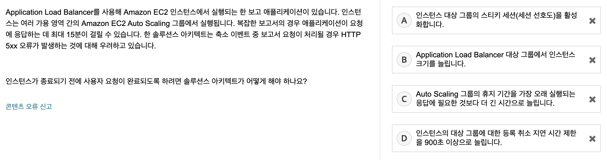
```
선택 : (D)

문제 요구사항
최대 15분이 걸리는 작업이 있을 때, Auto Scaling 축소 이벤트가 발생할 경우 5XX 오류가 발생하지 않도록 요청이 완료되길 원함
문제를 보고, 수명 주기 후크를 말하는건가 싶었는데 Connection Draining을 떠올림

A - 동일한 클라이언트에 동일한 인스턴스에 접속하게 해주는 스티키 세션과 무관해보여서 제거
B - 인스턴스 크기와 무관해보여서 제거
C - 휴지 기간이 무엇인지 모르겠다. 쿨다운 기간을 말하는 거같아서 제거
D - 등록 취소 지연 시간은 ALB에서 Connection Draining을 다른말로 DeRegistraion Delay로 말하기에 선택
```
```
정답 : (D)

A - 축소 프로세스 중에 EC2 인스턴스가 대상 그룹에서 제거된 경우 EC2 인스턴스에 장애가 발생하거나 비정상 상태가 됩니다(점검 시). 
Application Load Balancer는 해당 대상에 대한 요청 라우팅을 중지하고 정상적인 새 대상을 선택합니다.

B - 인스턴스 크기가 증가하면 처리 속도가 빨라질 수 있습니다.
하지만 이 솔루션은 요청을 처리하는 인스턴스가 축소 작업의 영향을 받지 않도록 직접 보장하지 않습니다.

C - Amazon EC2 Auto Scaling 휴지 기간을 지정하여 이전 활동의 효과가 나타나기 전에
Auto Scaling 그룹에서 추가 인스턴스를 시작하거나 종료하지 않도록 할 수 있습니다.
휴지 기간 : 한번의 Auto Scaling 실행 후 다음 Auto Scaling 실행까지의 시간 간격
```

<br>
<br>

### 6번 문제
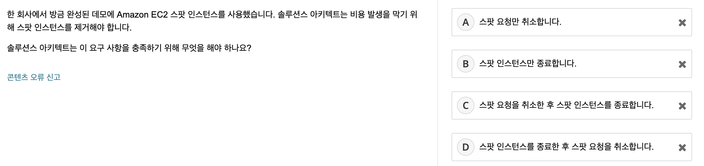
```
선택 : (D)

문제 요구사항
스팟 인스턴스를 사용하고 있는데, 스팟 인스턴스를 제거하기 위해선 어떻게 해야하는가?

스팟 인스턴스란 AWS 내에서 놀고있는 컴퓨터를 인스턴스로 하는 정책,
노는 컴퓨터가 많을 때는 가격이 저렴하지만 노는 컴퓨터가 없으면 일반 가격보다 비싸지는 가변적인 요금 정책

A - 보기 C, D와 달리 단일 작업만으로는 제거가 될 것 같지 않아 제거
B - 보기 C, D와 달리 단일 작업만으로는 제거가 될 것 같지 않아 제거
C - 인스턴스를 종료하고 취소를 할 수 있지 않을까해서 C 제거

스팟 인스턴스 다음과 같다.
- 스팟 인스턴스 요청은 [일회성] 또는 [영구적]입니다.
- Amazon EC2에서는 요청에 연결된 스팟 인스턴스가 종료된 후 스팟 인스턴스 요청을 자동으로 다시 제출합니다.

스팟 인스턴스 종료 정책은 다음과 같다.

[영구적 스팟 인스턴스 요청일 경우]
- 실행 중이거나 중지된 스팟 인스턴스를 종료하면 새 스팟 인스턴스를 시작할 수 있도록 스팟 인스턴스 요청이 open 상태임.
- 새로운 스팟 인스턴스가 시작되지 않도록 먼저 스팟 인스턴스 요청을 취소해야 한다.

[실행 중인 active 스팟 인스턴스 요청을 취소하는 경우]
- 실행 중인 스팟 인스턴스가 자동으로 종료되지 않습니다. 스팟 인스턴스를 수동으로 종료해야 합니다.

[중지된 disabled 스팟 인스턴스 요청을 취소하는 경우]
- 중지된 스팟 인스턴스가 Amazon EC2 스팟 서비스에 의해 자동으로 종료
```
```
정답 : (C)

A - 스팟 요청을 취소하는 것만으로는 실행 인스턴스가 자동으로 종료되지 않습니다.
이 경우 인스턴스는 계속 실행되며 추가 비용이 발생합니다.

B - 스팟 인스턴스가 종료되면 스팟 요청이 취소될 때까지 새 인스턴스가 시작됩니다.

C - 스팟 인스턴스를 제거하려면 적절한 단계에 따라 스팟 요청을 취소한 다음 스팟 인스턴스를 종료해야 합니다.

D - 스팟 인스턴스가 종료되면 스팟 요청이 취소될 때까지 새 인스턴스가 시작됩니다.
```

<br>
<br>

### 7번 문제
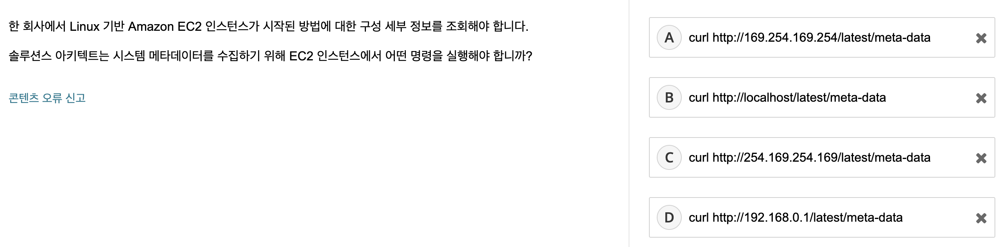
```
선택 : (C)

인스턴스 메타 데이터가 무엇인지 처음 들음

A - A랑 C랑 고민하다가 C 선택
B - 로컬 호스트는 아닌 것 같아 제거
C - A랑 C랑 고민하다가 C 선택
D - 192.168.0.1 은 iptime 어드민 설정 들어갈때 썼던 기억이 나서 제거
```
```
정답 : (A)

A - 인스턴스 메타데이터를 검색하는 유일한 방법은 링크-로컬 주소(169.254.169.254)를 사용하는 것
B - localhost 이름을 활용하여 메타데이터를 사용할 수 없습니다.
C - 링크-로컬 주소의 형식은 169.254.169.254입니다.
D - 192.168.x.x IP 주소 범위는 퍼블릭 블록입니다. 인스턴스 메타데이터는 퍼블릭 블록을 통해 사용할 수 없습니다.

인스턴스 메타데이터 서비스의 IPv4 주소(169.254.169.254)
인스턴스 메타데이터 서비스의 IPv6 주소(fd00:ec2::254)
메타데이터 서비스의 IPv6 주소는 IMDSv2 명령과 호환
```

<br>
<br>

### 8번 문제
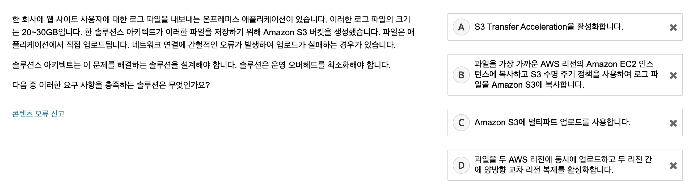
```
선택 : (B)

문제 요구 사항
1. 어플리케이션에서 직접 S3에 업로드하는데 종종 업로드 실패하는 경우
2. 운영 오버헤드 최소화

A - 뭔지 몰라서 제거
B - 업로드가 실패해도 라이프 사이클 정책이 뭔지는 모르겠지만 재시도할 수 있을 것 같아 선택
C - 뭔지 몰라서 제거
D - 뭔지 몰라서 제거
```
```
정답 : (C)

A- [S3 Transfer Acceleration]은 엣지 로케이션을 사용하여 데이터를 Amazon S3으로 복사함으로써 [업로드 시간을 단축]할 수 있다.
그러나 S3 Transfer Acceleration은 단일 PUT 작업에 대한 [파일 크기 제한(5GB)] 문제를 해결하지 못합니다.

B - 이 답은 단일 PUT 작업에 대한 파일 크기 제한(5GB) 문제를 해결하지 못한다.
S3 수명 주기 정책은 EC2 블록 스토리지에서 Amazon S3으로 파일을 전송할 수 없다.
이 답은 불필요한 서비스와 운영 오버헤드를 추가한다.

C - [단일 PUT 작업]으로 [최대 5GB 크기]의 단일 객체를 업로드할 수 있지만
[멀티파트 업로]드를 사용하면 이 시나리오의 파일과 같은 [대용량 파일을 업로드]할 수 있다.

D - 이 솔루션은 단일 PUT 작업에 대한 파일 크기 제한(5GB) 문제를 해결하지 못한다.
각 대상 리전에는 단일 리전과 동일한 문제가 있습니다. 또한 이 솔루션은 운영 오버헤드를 추가합니다.


수명 주기 : 오래된 파일들을 삭제하거나 다른 스토리지에 백업하여 S3 저장 공간을 절약할 수 있는 효율적인 비용 관리 방법
두가지 수명 주기 유형이 있다.

1. 전환 작업 
- 생성 후 30일이 지나면 객체를 S3 Standard-IA 스토리지 클래스로 전환하거나, 생성 후 1년이 지나면 객체를 S3 Glacier 스토리지 클래스에 아카이브하도록 선택
- Standard-IA는 장기 스토리지, 백업 및 재해 복구 파일용 데이터 스토어에 적합
- Glacier는 데이터 보관을 위한 안전하고 내구력 있으며 저렴한 스토리지, 중요한 정보를 저장하는데 사용

2. 만료 작업
- 객체가 만료되는 시기를 정의한다. S3는 만료된 객체를 자동으로 삭제합니다.
```

<br>
<br>

### 9번 문제
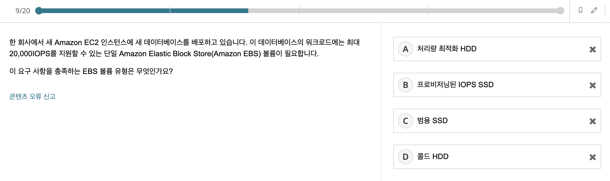
```
선택 : (B)

문제 요구사항
20,000IOPS를 지원하는 EBS 선택

A - 뭔지 모르겠음, HDD라 제거
B - 프로비저닝 : 사용자의 요구에 맞게 시스템 자원을 할당하는 것을 말하고, SSD라 선택
C - SSD이나 프로비저닝이 강렬해서 선택x
D - HDD라 제거
```
```
정답 : (B)

IOPS : Input/Output Operation Per Second, 초당 입출력 속도
IOPS 예로 MySQL과 MariaDB는 16KB 크기의 페이지를 사용함. 그래서 입출력 한번 당 16KB 단위로 전송.
매초 102,400KB (100MB)의 읽기 동작이 필요한 애플리케이션인 경우 16KB 페이지 크기의 데이터 베이스를 사용할 경우 초당 6,400 번의 읽기 동작을 해야 한다.
즉 6,400 IOPS 이상의 성능을 가진 EBS볼륨이 필요

A - 처리량 최적화 HDD EBS 볼륨
-> 각 볼륨에 대해 [500IOPS]로 제한되는 HDD 지원 스토리지 디바이스

B - 프로비저닝된 IOPS SSD EBS 볼륨은
-> 각 볼륨에 대해 [최대 64,000IOPS]를 제공합니다.

C - 범용 SSD EBS 볼륨
-> 각 볼륨에 대해 [16,000IOPS]로 제한됩니다.

D - 콜드 HDD 볼륨
-> IOPS가 아닌 처리량으로 성능을 정의하는 저비용 마그네틱 스토리지를 제공합니다.
따라서 콜드 HDD 볼륨은 순차적인 대용량 콜드 데이터 워크로드에 적합
```

<br>
<br>

### 10번 문제
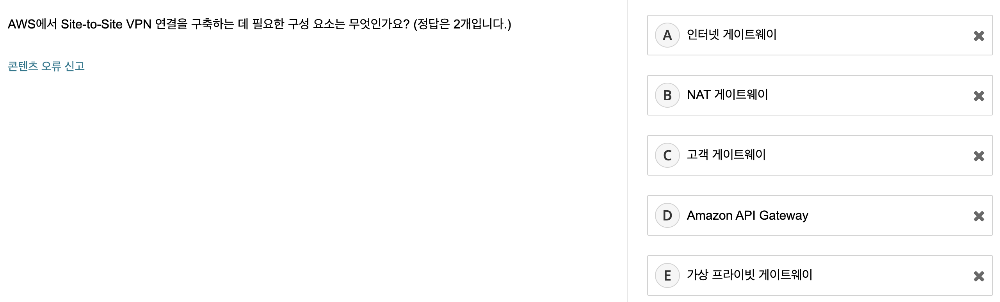
```
선택 : (A, D)

site to site 가 외부 to 외부로 이해하고 품

그래서 인터넷 게이트웨이가 필요하다고 생각 및 API Gateway는 뭔지 몰라서 선택
```
```
정답 : (C, E)

site to site vpn이란?
[자체 네트워크와 AWS VPC를 연결]해주는 VPN 서비스
가상의 사설 네트워크 연결을 사용하여 [프라이빗 통신을 가능하게 하는 서비스]
[가상 프라이빗 게이트웨이(VGW)] 또는 [Transit Gateway] 와
[고객 게이트웨이]를 사용
Site-to-Site VPN을 통해 사내에서는 VPN 연결 없이 바로 AWS 리소스에 접근

A - 인터넷 게이트웨이는 암호화된 VPN 연결이 아닌 개방형 인터넷의 트래픽을 허용
B - 프라이빗 Amazon EC2 인스턴스에서 인터넷에 요청을 보낼 수 있다.
D - API Gateway는 어떤 규모에서든 개발자가 API를 생성, 게시, 유지 관리, 모니터링 및 보호할 수 있게 해주는 완전관리형 서비스, 액세스하는 데 사용되는 정문 역할
```

<br>
<br>

### 11번 문제
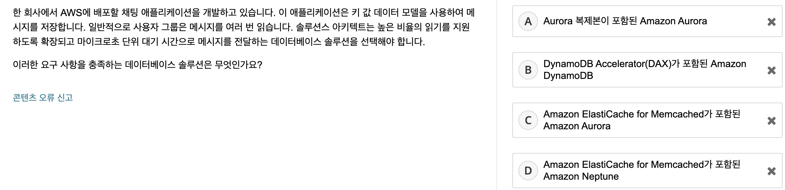
```
선택 : (B)

문제 요구사항 : key-value 형태인 db 솔루션 선택

A - Aurora는 key value가 아니라서 제거
B - DynamoDB는 key - value 형태라서 선택
C - A와 이유 동일
D - A와 동일
```
```
정답 : (B)

A - 관계형 데이터베이스
B - DynamoDB Accelerator(DAX)는 마이크로초 단위로 응답 시간을 제공
D - Neptune은 고도로 연결된 데이터 작업에 최적화된 그래프 데이터베이스
```

<br>
<br>

### 12번 문제
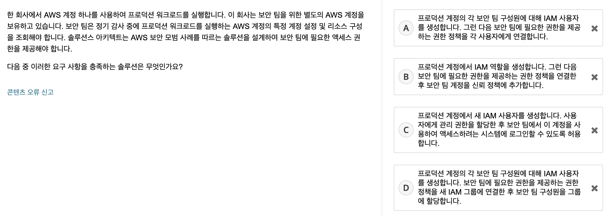
```
선택 : (B)

문제 요구 사항
- 회사에서 하나의 계정(A)을 사용중
- 보안 팀을 위한 별도의 AWS 계정(B)을 보유
- 보안팀은 B를 통해 A 계정의 특정 계정 설정 및 리소스 구성을 조회할 수 있어야함

서로 다른 계정인데 새로운 사용자를 추가하는 것은 불필요하다고 생각하고
역할을 부여하여 해결할 수 있다고 판단하여 (B) 선택
```
```
정답 : (B)

A - 역할을 사용하여 권한을 위임하는 보안 모범 사례를 따르지 않는다.
C - 사용자에게 관리 권한을 할당하면 보안 모범 사례 및 최소 권한 원칙에 위배
D - 역할을 사용하여 권한을 위임하는 보안 모범 사례를 따르지 않
```

<br>
<br>

### 13번 문제
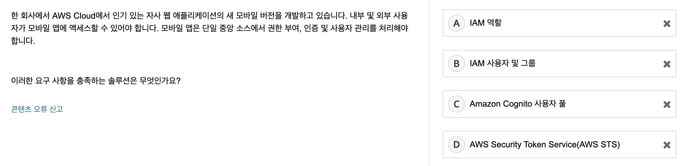
```
선택 : (D)

요구사항 : 권한 부여, 인증 및 사용자 관리를 처리할 수 있는 솔루션은?

보안에 밀접해 보이는 애가 D 같아서 선택
```
```
정답 : (C)

A - IAM 역할은 IAM 사용자가 맡을 수 있는 IAM 엔터티입니다. IAM 역할에는 엔터티가 수행할 수 있는 작업과 수행할 수 없는 작업을 정의하는 권한 정책이 있습니다.
하지만 [IAM 역할은 AWS 리소스에 대한 액세스 권한을 위임할 수 있지만 애플리케이션에 대한 액세스를 제어하지 않는다.]

B -  IAM 사용자 및 그룹을 사용하여 AWS 서비스를 사용하도록 인증되고 권한이 부여된 사용자를 제어할 수 있습니다. 
하지만 사용자 및 그룹은 애플리케이션에 대한 액세스를 제어하지 않습니다.

C - Amazon Cognito는 웹 및 모바일 앱에 대한 인증, 권한 부여 및 사용자 관리를 제공합니다. 
사용자는 사용자 이름과 암호를 사용하여 직접 로그인하거나 신뢰할 수 있는 서드 파티를 통해 로그인할 수 있습니다.
사용자 풀 - 앱 사용자의 가입 및 로그인 옵션을 제공하는 사용자 모음
자격 증명 풀 - 사용자 풀에 저장된 정보를 바탕으로 로그인 또는 회원가입에 성공한 사용자에게 AWS 인프라의 여러 서비스에 대한 권한을 부여할 수 있는 서비스

D - AWS Security Token Service (STS)
- AWS 리소스에 대한 엑세스를 제어할 수 있는 임시 보안 자격 증명을 생성하여 신뢰받는 사용자에게 제공 가능
- 단기적인 임시 보안 자격 증명임 (몇분 ~ 몇시간)
- AWS STS는 애플리케이션에 대한 액세스를 제어하지 않는다.
```

<br>
<br>

### 14번 문제
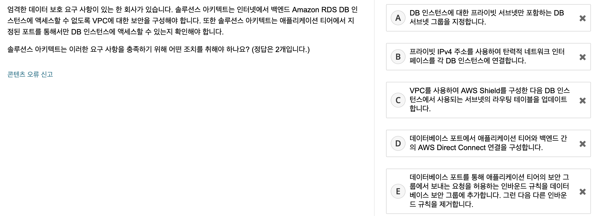
```
선택 : (A, E)

문제 요구사항
DB 인스턴스를 보안적으로 안전하게 설계하는 방법을 요구

A - private 서브넷에 두는것이 보안적으로 이롭다고 알고있음
B - 탄력적 네트워크 인터페이스가 뭔지 몰르지만 DB 인스턴스 연결한다고 하기에 제거
C - AWS Shield가 뭔지 몰라서 패스
D - AWS Direct Connect가 뭔지 몰라서 패스
E - 보안 그룹을 통해 DB 접근을 제어할 수 있어서 선택
```
```
정답 : (C)

A - 프라이빗 서브넷은 데이터베이스 티어를 보호하는 데 사용되는 구성 요소 중 하나
인터넷 트래픽은 프라이빗 서브넷에 라우팅되지 않는다.

B - 탄력적 네트워크 인터페이스는 VPC에서 가상 네트워크 카드를 나타내는 논리적 네트워킹 구성 요소
- VPC의 IPv4 주소 범위 중 기본 프라이빗 IPv4 주소
- VPC의 IPv4 주소 범위 중 하나 이상의 보조 프라이빗 IPv4 주소
- 프라이빗 IPv4 주소당 한 개의 탄력적 IP 주소(IPv4)
- 한 개의 퍼블릭 IPv4 주소
- 한 개 이상의 IPv6 주소
- 하나 이상의 보안 그룹
- MAC 주소

C - Shield는 DDoS 공격으로부터 보호하지만 라우팅 테이블에 있는 경로의 대상이 될 수는 없습니다. 
또한 Shield를 사용해도 시나리오의 요구 사항이 충족되지 않습니다.

D - Direct Connect는 AWS 환경에 대한 전용 연결을 제공합니다.
그러나 Direct Connect를 사용해도 시나리오의 요구 사항이 충족되지 않습니다.
AWS와 사용자의 데이터 센터, 사무실, 또는 코로케이션 환경 사이에 프라이빗 연결을 설정할 수 있다.

AWS Direct Connect 와 Site-to-Site VPN의 차이
VPN
- IPSec을 사용하여 인터넷에서 온 프레미스 네트워크와 Amazon VPC 간에 암호화된 네트워크를 형성
- Transit Gateway로 구성하여 최대 50Gbps

Direct Connect
- 인터넷이 필요하지 않으며 대신 온 프레미스 네트워크와 Amazon VPC 간에 전용 프라이빗 네트워크 연결을 사용
- VPN보다 Direct Connect가 다양한 대역폭을 선택
- 연결의 유형과 리전에 따라 최소 50Mbps 부터 최대 100Gbps 까지 대역폭을 지원합
```

<br>
<br>

### 15번 문제
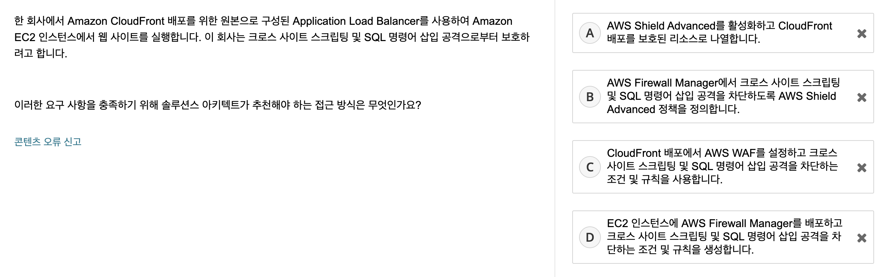
```
선택 : (C)

문제 요구 사항
XSS 와 SQL Injection 방어를 위한 추천 솔루션은?

A - AWS Shield는 DDos 공격을 방어하는 개념으로 알고있어서 XSS와 SQL Injection을 방어해주는지 몰라서 일단 제거
B - A와 마찬가지 이유
C - public한 CloudFront에서 처리해주면 좋겠다고 생각하고 있었는데, 규칙을 설정한다해서 확실치는 않지만 느낌으로 찍음 
D - 인스턴스에서 처리하는 방식이기에 public한 CloudFront는 그대로 노출되어 위험할 것아서 제거 
```
```
정답 : (C)

A - Shield Advanced는 DDoS 공격으로부터 보호하지만, 크로스 사이트 스크립팅 또는 SQL 명령어 삽입으로부터 보호하지는 않습니다.

B - Firewall Manager를 사용하면 AWS WAF, Shield Advanced 및 기타 AWS 서비스를 관리할 수 있습니다.
Shield Advanced는 DDoS 공격으로부터 보호하지만, 크로스 사이트 스크립팅 또는 SQL 명령어 삽입으로부터 보호하지는 않습니다.

C - AWS WAF는 악성일 가능성이 있는 SQL 코드(SQL 명령어 삽입이라고 함)의 존재를 감지할 수 있습니다. 
또한 AWS WAF는 악성일 가능성이 있는 스크립트(크로스 사이트 스크립팅이라고 함)의 존재를 감지할 수 있습니다.

D - Firewall Manager를 사용하면 AWS WAF, AWS Shield Advanced 및 기타 AWS 서비스를 관리할 수 있습니다. 
Firewall Manager는 EC2 인스턴스에 설치되지 않은 관리형 서비스입니다.

AWS Shield란?
- AWS는 DDoS 공격을 차단하기 위해 AWS Shield Standard와 AWS Shield Advanced을 제공
  - Standard는 비용 x, Advanced는 비용 o
  - AWS Shield Advanced 적용 가능 대상
  - Amazon CloudFront 배포
  - Amazon Route 53 호스팅 영역
  - AWS Global Accelerator 액셀러레이터
  - Application Load Balancers
    - NLB에 적용 불가, 그래서 EIP를 통해 해야한다. 
  - Amazon EC2 EIP
  
AWS WAF란?
- 요청이 시작되는 IP 주소 또는 쿼리 문자열의 값 등 지정하는 조건에 따라 보호되는 리소스에 접근할 수 있거나
- HTTP 403 상태 코드 (금지됨) 로 요청에 응답할 수 있다.
- 요청이 차단될 때 사용자 지정 오류 페이지를 반환하도록 CloudFront를 구성할 수 있다.

Firewall Manager란?
- 여러 계정과 리소스의 관리 및 유지 관리 작업을 간소화한다.
- 계정의 리소스를 보호할 수 있다.
- Amazon CloudFront 배포와 같은 특정 유형의 리소스를 모두 보호할 수 있다.
- 특정한 태그를 가진 리소스를 모두 보호할 수 있다.

```

<br>
<br>

### 16번 문제
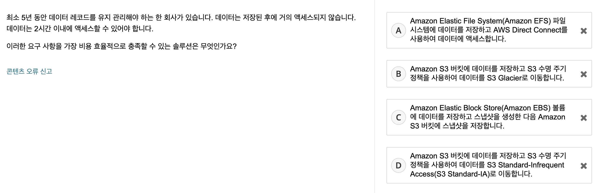
```
선택 : (D)

문제 요구 사항
오래 저장할 수 있어야하고 저장하면 거의 엑세스가 없지만 접근하게 되면 2시간 이내에 엑세스가 가능해야한다.

A - AWS Direct Connect는 네트워크간 private 연결을 위해 사용되는거라 성격이 달라 제거
B - S3라서 후보군에 뒀지만 Glacier이 뭔지 몰라 제거
C - 데이터 엑세스는 EBS 및 스냅샷이랑 관련 없는 것 같아 제거
D - Infrequent : 드문이란 뜻을 갖고있어서 S3에 접근 관련한 기능인 것 같아 선택
```
```
정답 : (B)

A.
[EFS] 
- 애플리케이션 중단할 필요 없이 확장되므로 사용자가 용량을 프로비저닝 및 관리할 필요 없음
- 확장 및 비용 최적화할 수 있게 해주는 서버리스 파일 시스템
- On-premise 서버는 Direct Connect & VPN 연결을 통해 파일 시스템 탑재
- AWS 클라우드 및 사내 서버의 컴퓨팅 인스턴스에 사용할 공유 file 스토리지
- 수천 대의 EC2 인스턴스 간 파일 시스템 공유

B - S3 버킷에 데이터를 저장하면 데이터를 위한 비용 효율적인 초기 위치가 제공됩니다. 
[S3 Glacier는 2시간 검색 시간] 요구 사항을 충족하는 가장 비용 효율적인 아카이브 스토리지 솔루션입니다.

C - S3 뿐만 아니라 EBS도 사용해야하는 부분에서 비용적인 측면에서 효율적이지 않음

[EBS]
- 파일 시스템 생성하고 파일 저장
- 단일 EC2 인스턴스의 전용 블록 스토리지
- 볼륨의 크기를 변경은 수동적인 작업

D.
[S3 Standard-IA] : 수명이 길지만 자주 엑세스하지 않는 데이터, 즉시 접근 가능해야할 때
[Glacier] : 장기적으로 보관할 데이터, 즉시 접근 가능할 필요 없을 때, Standard IA보다 비용 절감
[Glacier Deep Archive]: 1년에 한 두 번정도만 엑세스하는 데이터 장기 보관

https://aws.amazon.com/ko/efs/faq/
질문: Amazon EFS와 Amazon EBS와 Amazon S3는 각각 어떤 경우에 사용해야 합니까? 참고
```

<br>
<br>

### 17번 문제
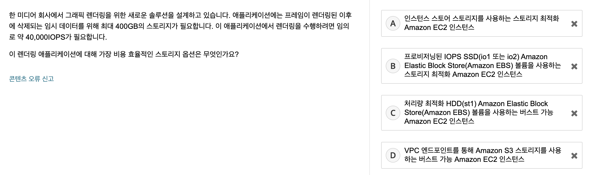
```
선택 : (B)

문제 요구 사항
- 400GB 스토리지가 필요
- 40,000 Network Input/Output Operation Per Second, 초당 입출력 속도를 지원

A - 인스턴스 스토어 스토리지가 뭔지 몰라 제거
B - 프로비저닝된 IOPS SSD는 최대 64,000IOPS를 지원한다고 알고있어서 선택
C - 처리량 최적화 HDD는 천 이하 IOPS를 지원하는 것으로 알고있어서 제거
D - 그냥 제거
```
```
정답 : (A)

A - SSD 지원 스토리지 최적화(i2) 인스턴스는 임의로 [365,000 IOPS] 이상을 제공합니다. 
인스턴스 스토어는 인스턴스의 정규 시간당 요금에 비해 추가 비용이 없습니다.

https://aws.amazon.com/ko/ec2/previous-generation/
i2는 이전 세대 인스턴스 유형인 것 같다.
인스턴스 스토어 스토리지는 비용이 EBS처럼 시간당 요금이 아닌 I/O마다 발생한다.

B - 프로비저닝된 IOPS SSD(io1 또는 io2) EBS 볼륨은 시나리오에 필요한 40,000IOPS 이상을 제공할 수 있습니다.
하지만 Amazon EBS는 시간당 인스턴스 요금에 비용을 추가하므로 이 솔루션은 인스턴스 스토어만큼 비용 효율적이지 않습니다. 

C - 최대 500 IOPS

D - 스크래치 볼륨 공간에 필요한 데이터가 빠르게 변화하므로 Amazon S3(객체 스토리지)를 잘못된 스토리지로 만듭니다.
블록 스토리지는 읽기/쓰기 기능을 원활하게 작동하도록 하는 데 적합합니다.

```

<br>
<br>

### 18번 문제
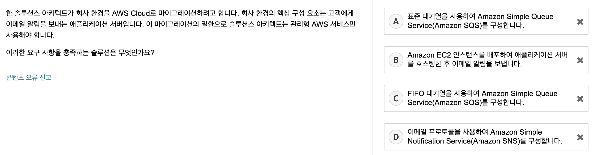
```
선택 : (D)

A - Standard 메시징 큐
B - EC2에서 SMTP 를 구성해서 이메일은 보낼 수 있겠으나 적절한 솔루션이 아닌 것 같아 제거
C - FIFO 메시지 큐
D - 이메일 알림 서비스라 선택

FIFO SQS와 표준 대기열 SQS의 차이는?

1. 메시지가 삭제되지 않은 개수
- 표준: 120,000개
- FIFO: 20,000개

2. Standard 
- 최대 처리량, 무제한에 가까운 메시지 전송 지원 (최대 처리량), 제한이 없는 TPS
- Best effort 순서, 메시지 순서 보장 안됨
- 최소 1회 전달 제공, 대신 중복 전송될수도 있다.

3. FIFO
- 초당 300TPS 제한 존재
- 정확한 순서의 보장, 다만 순서를 위해 느림
- 정확히 1번 실행, 중복 수신 x
```
```
정답 : (D)

A - Amazon SQS는 소프트웨어 구성 요소 간에 메시지를 전송하는 완전관리형 메시지 대기열 서비스입니다. 하지만 Amazon SQS는 고객에게 메시지를 푸시할 수 없습니다.
B - 회사에서 EC2 인스턴스를 배포하여 애플리케이션을 실행할 수 있습니다. 하지만 이 솔루션이 관리형 서비스만 사용하는 것은 아닙니다.
C - Amazon SQS는 소프트웨어 구성 요소 간에 메시지를 전송하는 완전관리형 메시지 대기열 서비스입니다. 하지만 Amazon SQS는 고객에게 메시지를 푸시할 수 없습니다.
D - Amazon SNS는 애플리케이션 간 통신 및 애플리케이션과 사용자 간 통신을 위한 완전관리형 메시징 서비스입니다.
```

<br>
<br>

### 19번 문제

```
선택 : (A)

문제 요구사항
- RDB
- 비활성 기간 존재
- 최소 비용

A - 잘 모르겠지만 ECS 와 RDB인 Aurora를 사용한다여 선택 
도현님이 말씀하시길 비용 관련 문제는 관리형 리소스가 설치형보다 싸다고 하여 선택

B - 버스트 기능 이라는게 뭔지 모르겠지만 비싸보임

C - 관리형 서비스를 이용하는 것이 아닌 직접 오픈소스를 설치해서 사용하기에 제거

D - 관리형 서비스를 이용하는 것이 아닌 직접 오픈소스를 설치해서 사용하기에 제거
```
```
정답 : (A)

A - Amazon ECS에서 컴퓨팅에 Fargate를 사용하는 경우 애플리케이션이 유휴 상태일 때 비용이 발생하지 않습니다. 
또한 [Aurora Serverless]는 [유휴 상태일 때 컴퓨팅 비용이 발생하지 않습니다].

B - EC2 버스트 가능 인스턴스는 크기 조정 없이 버스트 가능한 기능을 제공합니다. 
하지만 이 솔루션은 비활성 기간 동안 비용을 최소화하지 않으므로 가장 비용 효율적인 옵션이 아닙니다.
Amazon Redshift 데이터베이스는 OLTP에 적합하지 않습니다.
Amazon Redshift는 온라인 분석 처리(OLAP)를 위해 특별히 설계되었습니다.

C - 코드형 인프라(IaC)는 가용성에 도움이 되지만 이 솔루션은 상시 사용 가능 요구 사항을 충족하지 못합니다. 
또한 이 솔루션은 데이터베이스를 다시 생성한 이후에 데이터베이스 데이터를 유지할 수 없습니다.

D - 이 솔루션을 사용하면 비활성 기간 동안 하나 이상의 인스턴스와 데이터베이스가 실행됩니다.
그러나 이 솔루션은 비활성 기간 동안 비용을 최소화하지 않으므로 가장 비용 효율적인 옵션이 아닙니다.

AWS Fargate
- 별도로 인스턴스를 생성 관리하지 않고 컨테이너를 실행하기 위해 Amazon ECS에서 사용하는 기술
- 컨테이너의 CPU와 메모리 사용량에 기반하여 초 단위로 요금을 과금
- 1년 또는 3년 단위의 Compute Savings Plan 요금제를 이용하여 절약가능
- 1년 전체 선결제시 27%, 3년 전체 선결제시 47%를 절약할 수 있다.

Amazon Redshift
- 페타바이트급 데이터 웨어하우스
- RDB이지만 데이터웨어 하우스를 위한 DB로, 분석에 집중
- 대량의 데이터를 분석하고 BI를 통해 분석리포트를 제공하는 것에 특화되어있으며(OLAP) OLTP용으로는 적합하지 않습니다.

```

<br>
<br>

### 20번 문제
.png)
.png)
```
선택 : (B)

문제 요구사항
- 한 달에 한 번 모든 데이터를 온프레미스 위치로 복제
- 평균 데이터 양은 60TB
- 효율적인 전송 방법은?

A - Snowball Edge Storage Optimized가 뭔지 몰라 제거, 그리고 일주일 후에 디바이스를 반환해야한다는 번거로움이 있는 거 같아서 제거
B - S3 Standard IA를 못보고 지문이 젤 길어서 선택..
C - S3 Standard IA 라서 제거
D - CloudFront 내용이 아닌 것 같아서 제거
```
```
정답 : (A)

A - 기본 가격에는 디바이스와 10일간의 온프레미스 위치 사용 기간이 포함됩니다.
회사에서 1주일 이내에 디바이스를 반환할 경우 기본 가격과 AWS에서 데이터를 전송하는 데 필요한 가격을 지불합니다.

Snowball Edge Storage Optimized: TB~PB사이즈의 데이터를 AWS로 빠르고 안전하게 전송해야할 때 사용

B - S3 Standard-IA 스토리지를 사용하는 다른 S3 버킷에 모든 데이터를 복사하는 경우 비용상의 이점이 없습니다. 
이 솔루션은 추가 복제를 수행하면 비용이 증가하므로 가장 비용 효율적인 옵션은 아닙니다.

Aws Storage Gateway : S3는 REST/HTTP 기번이기 때문에 네트워크 지연의 문제가 있을 수 있음
이를 개선하기 위한것이 storage gateway임.
온프레미스 환경에서 Cloud 상의 스토리지를 지원하게 할 수 있는 Gateway 역할을 한다. 즉 [백업 툴]이라고 볼 수 있다.
레거시 환경에서 온프레미스 환경에서 데이터를 보관하는 서비스를 위해 백업 전용 게이트 웨이임.
레거시 환경에서 AWS로 마이그레이션 할 수 있는 방법 중 하나.

Aws Storage Gateway File Gateway : on-premise 스토리지에 저장된 파일을 object로 변환하여 S3에 저장하는 게이트웨이 서비스
on-premise 스토리지의 파일을 block storage인 S3의 오브젝트로 변환하여 데이터를 저장
NFS - Network File System, Linux
SMB - Server Message Block, Windows

C - S3 Standard-IA 스토리지를 사용하는 다른 S3 버킷에 모든 데이터를 복사하는 경우 비용상의 이점이 없습니다.
이 솔루션은 추가 복제를 수행하면 비용이 증가하므로 가장 비용 효율적인 옵션은 아닙니다.

D - CloudFront로의 데이터 전송은 무료이지만, CloudFront에서 온프레미스 위치로 60TB의 데이터를 전송하려면 비용이 발생합니다.
이 옵션의 비용은 AWS Snowball Edge Storage Optimized 디바이스를 사용하는 옵션의 약 2배에 해당합니다.
```