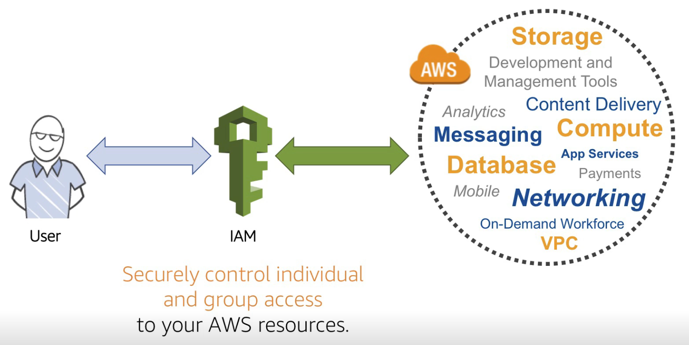
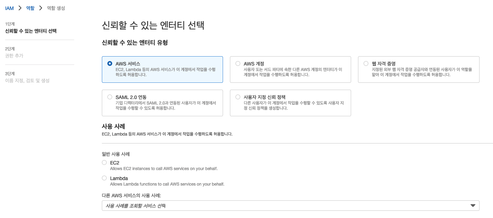

# 2. 
```
Amazon Elastic Container Service(Amazon ECS)를 사용하여
컨테이너식 웹 애플리케이션을 실행하는 솔루션을 설계 중인 한 솔루션스 아키텍트가 있습니다.
솔루션스 아키텍트는 각 컨테이너 인스턴스에서 여러 작업 사본을 실행하여 비용을 최소화하려고 합니다.
로드의 증가 및 감소에 따라 작업 사본의 수가 조정되어야 합니다.

로드를 여러 작업으로 분산하는 라우팅 솔루션은 무엇인가요?
```

선택 : D  
정답 : B

## 노트

### [가중치 기반 라우팅 정책](https://docs.aws.amazon.com/ko_kr/Route53/latest/DeveloperGuide/routing-policy.html)

* 트래픽을 지정한 비율에 따라 인스턴스로 라우팅
* 단일 컨테이너에서 여러 작업을 관리할 수는 없음

### 동적 호스트 포트 맵핑 
* Application Load Balancer는 컨테이너가 동적 호스트 포트 매핑을 사용하도록 허용
  (그래서 컨테이너 인스턴스마다 동일 서비스의 여러 작업이 허용됨).


# 3.

```
네트워크 로드 밸런서를 사용하여 두 Amazon EC2 인스턴스에서 실행되는 한 애플리케이션이 있습니다.
EC2 인스턴스는 단일 가용 영역에 있습니다.

솔루션스 아키텍트는 이 아키텍처의 가용성을 더욱 높이기 위해 무엇을 해야 하나요?
```

선택 : D  
정답 : D

## 노트

### [Auto Scaling](https://docs.aws.amazon.com/autoscaling/ec2/userguide/auto-scaling-benefits.html)
 * 정의 : 인스턴스들의 그룹을 자동으로 관리해주는 서비스
 * 장점 1. 내결함성 향상
   * 인스턴스가 비정상일 때, 이를 감지하여 대체할 인스턴스를 시작함.
   * 여러개의 가용 영역을 사용하도록 지정할 수 있음. 하나의 가용영역이 사용불가할 경우 다른 가용영역의 인스턴스를 시작할 수 있다.
 * 장점 2. 가용성 향상
   * 항상 현재 트래픽 요구를 처리할 수 있는 올바른 용량을 갖도록 도와줌.(어떻게...?)
 * 장점 3. 비용 관리 향상
   * 필요에 따라 용량을 동적으로 조절할 수 있음. ec2는 사용한 인스턴스에 대해서만 비용을 지불한다.
   
# 4. 

```
한 회사에서 법률 문서를 저장하기 위해 Amazon S3 버킷을 사용하고 있습니다.
이 회사는 문서를 자주 수정하고 동일한 객체 키를 사용하여 S3 버킷에 다시 업로드합니다.
이 회사는 문서의 이전 사본을 다운로드할 수 있어야 합니다. 또한 문서를 실수로 삭제하지 않도록 보호해야 합니다.

이러한 요구 사항을 충족하는 가장 운영 효율성이 높은 솔루션은 무엇인가요?
```

선택 : A  
정답 : A

## 노트

### [S3 버전 관리](https://docs.aws.amazon.com/AmazonS3/latest/userguide/versioning-workflows.html)
* 한 버킷에 여러 버전의 객체를 보관
* 객체를 삭제하는 경우 S3에서 영구히 제거하는 것이 아니라 현재 버전에 삭제 마커를 삽입하여, 이전 버전으로 복원 가능  
* 객체를 덮어 쓴 경우 새 객체 버전이 생성되어, 이전 버전으로 복원 가능

# 5.

```
Application Load Balancer를 사용해 Amazon EC2 인스턴스에서 실행되는 한 보고 애플리케이션이 있습니다.
인스턴스는 여러 가용 영역 간의 Amazon EC2 Auto Scaling 그룹에서 실행됩니다.
복잡한 보고서의 경우 애플리케이션이 요청에 응답하는 데 최대 15분이 걸릴 수 있습니다.
한 솔루션스 아키텍트는 축소 이벤트 중 보고서 요청이 처리될 경우 HTTP 5xx 오류가 발생하는 것에 대해 우려하고 있습니다.
인스턴스가 종료되기 전에 사용자 요청이 완료되도록 하려면 솔루션스 아키텍트가 어떻게 해야 하나요?
```

선택 : C  
정답 : D

## 노트

### [조정 휴지(scaling cooldown)](https://docs.aws.amazon.com/autoscaling/ec2/userguide/Cooldown.html)
* 이전 활동의 효과가 나타나기 전에 Auto Scaling 그룹에서 추가 인스턴스를 시작하거나 종료하지 않도록 대기하는 시간
* 즉, Auto Scaling 이후 다시 Auto Scaling이 개시될 때까지 대기하는 시간
* 따라서 문제에서 어플리케이션 요청에 응답에 대기하는 시간과는 관련 없다.

### [등록 취소 지연(deregistration delay)](https://docs.aws.amazon.com/elasticloadbalancing/latest/application/load-balancer-target-groups.html#deregistration-delay)
* 등록 취소 대기값은 기본 300초
* 대상에 대해 진행 중인 요청을 완료하는데 도움이 됨.(등록 취소가 무엇이고 등록 취소 Delay를 늘리면 왜 요청을 완료하는데 도움이 되지??)

# 6.

```
한 회사에서 방금 완성된 데모에 Amazon EC2 스팟 인스턴스를 사용했습니다.
솔루션스 아키텍트는 비용 발생을 막기 위해 스팟 인스턴스를 제거해야 합니다.

솔루션스 아키텍트는 이 요구 사항을 충족하기 위해 무엇을 해야 하나요?
```

선택 : B  
정답 : C

## 노트

### [스팟 인스턴스 종료](https://docs.aws.amazon.com/ko_kr/AWSEC2/latest/UserGuide/spot-requests.html#terminating-a-spot-instance)
* [스팟 인스턴스](https://docs.aws.amazon.com/ko_kr/AWSEC2/latest/UserGuide/using-spot-instances.html) 는 온디맨드 가격보다 저렴한 비용으로 제공되는 예비 EC2 용량을 사용하는 인스턴스이다.
* 스팟 인스턴스가 종료되면 스팟 요청이 취소될때까지 새 인스턴스가 시작 됨.
* 따라서 스팟 요청을 취소한 후 스팟 인스턴스를 종료해야 함.

# 7.

```
한 회사에서 Linux 기반 Amazon EC2 인스턴스가 시작된 방법에 대한 구성 세부 정보를 조회해야 합니다.

솔루션스 아키텍트는 시스템 메타데이터를 수집하기 위해 EC2 인스턴스에서 어떤 명령을 실행해야 합니까?
```

선택 : D  
정답 : A

## 노트

### [인스턴스 메타데이터 검색](https://docs.aws.amazon.com/ko_kr/AWSEC2/latest/UserGuide/instancedata-data-retrieval.html)
* 192.168.x.x IP 주소 범위는 퍼블릭 블록이며, 인스턴스 메타데이터는 퍼블릭 블록을 통해 사용할 수 없음
* 인스턴스 메타데이터를 검색하는 유일한 방법은 링크-로컬 주소(169.254.169.254)를 사용하는 것

# 8.

```
한 회사에 웹 사이트 사용자에 대한 로그 파일을 내보내는 온프레미스 애플리케이션이 있습니다.
이러한 로그 파일의 크기는 20~30GB입니다. 한 솔루션스 아키텍트가 이러한 파일을 저장하기 위해 Amazon S3 버킷을 생성했습니다.
파일은 애플리케이션에서 직접 업로드됩니다. 네트워크 연결에 간헐적인 오류가 발생하여 업로드가 실패하는 경우가 있습니다.

솔루션스 아키텍트는 이 문제를 해결하는 솔루션을 설계해야 합니다. 솔루션은 운영 오버헤드를 최소화해야 합니다.

다음 중 이러한 요구 사항을 충족하는 솔루션은 무엇인가요?

```

선택 : D  
정답 : C

## 노트

### [멀티파트 업로드](https://docs.aws.amazon.com/ko_kr/AmazonS3/latest/userguide/mpuoverview.html)
* 단일 객체를 여러 파트의 집합으로 업로드 가능
* 각각의 파트는 독립적으로 업로드되며, 모든 파트가 업로드 되면 s3가 이를 수집하여 객체를 조립함.
* 파트의 전송이 실패하더라도 다른 파트에 영향을 미치지 않음.
* 단일 PUT 작업으로 최대 5기가의 단일 객체 업로드 가능 (문제에서는 30GB인데...?)

# 9.

```
한 회사에서 새 Amazon EC2 인스턴스에 새 데이터베이스를 배포하고 있습니다.
이 데이터베이스의 워크로드에는 최대 20,000IOPS를 지원할 수 있는 단일 Amazon Elastic Block Store(Amazon EBS) 볼륨이 필요합니다.

이 요구 사항을 충족하는 EBS 볼륨 유형은 무엇인가요?
```

선택 : B  
정답 : B

## 노트

### [EBS 최적화](https://www.popit.kr/aws-ebselastic-block-storage%EC%9D%98-%EB%B9%84%EC%9A%A9-%EC%B5%9C%EC%A0%81%ED%99%94/)
* IOPS = 초당 입출력 속도 (Input/Output Per Second)
* RDB의 입출력 단위는 페이지(혹은 블록)이며, mysql 기준으로 1페이지는 16kb이다. (오라클은 8kb)
* 범용 ssd의 경우 16,000 iops, 프로비전닝된 ssd의 경우 최대 64,000 iops를 지원한다.

# 10.

```
AWS에서 Site-to-Site VPN 연결을 구축하는 데 필요한 구성 요소는 무엇인가요? (정답은 2개입니다.)
```

선택 : C, E  
정답 : C, E

## 노트

### [Site-to-Site VPN](https://docs.aws.amazon.com/ko_kr/vpn/latest/s2svpn/VPC_VPN.html)

# 11.

```
한 회사에서 AWS에 배포할 채팅 애플리케이션을 개발하고 있습니다.
이 애플리케이션은 키 값 데이터 모델을 사용하여 메시지를 저장합니다.
일반적으로 사용자 그룹은 메시지를 여러 번 읽습니다.
솔루션스 아키텍트는 높은 비율의 읽기를 지원하도록 확장되고 마이크로초 단위 대기 시간으로 메시지를 전달하는 데이터베이스 솔루션을 선택해야 합니다.

이러한 요구 사항을 충족하는 데이터베이스 솔루션은 무엇인가요?
```

선택 : C
정답 : B

## 노트

### [DynamoDB](https://docs.aws.amazon.com/ko_kr/amazondynamodb/latest/developerguide/Introduction.html)
* 키 값 레코드를 지원하는 NoSQL 데이터베이스
* 데이터베이스를 분산하고 크기를 조정하는 부담을 줄임
* 어느 수준의 트래픽이라도 다운타임 없이 처리 능력을 확장/축소 가능
* 온디멘드 백업 지원

### [DynamoDB Accelerator(DAX)](https://docs.aws.amazon.com/ko_kr/amazondynamodb/latest/developerguide/DAX.html)
* DynamoDB와 호환되는 인메모리 캐싱 서비스
* 응답시간을 밀리초 ~ 마이크로초까지 줄여 줌
* DynamoDB와 호환되는 API를 지원하여 운영의 복잡도를 줄여 줌
* 읽기 중심적 / 일정 시간에 사용량 증가 / 개별키를 반복적으로 읽는 어플리케이션에 특히 유용

# 12.

```
한 회사에서 AWS 계정 하나를 사용하여 프로덕션 워크로드를 실행합니다.
이 회사는 보안 팀을 위한 별도의 AWS 계정을 보유하고 있습니다.
보안 팀은 정기 감사 중에 프로덕션 워크로드를 실행하는 AWS 계정의 특정 계정 설정 및 리소스 구성을 조회해야 합니다.
솔루션스 아키텍트는 AWS 보안 모범 사례를 따르는 솔루션을 설계하여 보안 팀에 필요한 액세스 권한을 제공해야 합니다.

다음 중 이러한 요구 사항을 충족하는 솔루션은 무엇인가요?
```
## 노트

### [IAM(Identity and Access Management)](https://docs.aws.amazon.com/ko_kr/IAM/latest/UserGuide/introduction.html)
* IAM 이란 ? 개인 또는 그룹이 AWS 리소스에 안전하게 접근하도록 제어하는 서비스


### [IAM 보안 모범 사례](https://docs.aws.amazon.com/ko_kr/IAM/latest/UserGuide/best-practices.html#delegate-using-roles)
* aws 루트 사용자
  * 루트 사용자는 결제 정보를 포함한 aws의 모든 리소스에 접근 가능하다.
  * 루트 사용자는 **IAM 관리 사용자를 처음 생성하는 작업에만 사용**하는 것이 강력히 권장 된다.
  * 이후에는 IAM 사용자에게 역할에 대한 권한을 위임하여 개별적인 작업을 허용한다.
* [역할을 사용하여 권한 위임](https://docs.aws.amazon.com/IAM/latest/UserGuide/id_roles.html)
  * IAM의 identity가 될 수 있는 것은 `유저`, `그룹`, `역할` 이렇게 세 가지이다.
  * 이 identity는 `누가 AWS 리소스에 접근하는가`를 나타낸다.  
  * `역할`을 사용하면 해당 세션을 위한 임시 자격 증명을 받아 접근한다.(세션은 일정 시간 후 소멸)
  * 이는 비밀번호나 액세스키로 접근하는 `유저`, `그룹`과는 달리 더 안전하다.
  * `역할`을 사용하면 일반적으로 **AWS 리소스에 액세스할 수 없는 사용자, 애플리케이션 또는 서비스에 액세스 권한을 위임할 수 있다.**
* 최소 권한 위임
  * IAM 권한 정책을 만들 때는 작업에 필요한 최소한의 권한만을 부여한다.  


## 문제 풀이
```
A. 프로덕션 계정의 각 보안팀 구성에 대해 IAM 사용자를 생성합니다.  
그런 다음 보안팀에 필요한 권한을 제공하는 권한 정책을 각 사용자에게 연결합니다.
```
-> IAM의 사용자를 생성하는 것을 **역할을 사용하여 권한을 위임**하는 모범사례에 위배

```
B. 프로덕션 계정에서 IAM 역할을 생성합니다.  
그런 다음 보안 팀에 필요한 권한을 제공하는 권한 정책을 연결한 후  
보안 팀 계정을 신뢰 정책에 추가합니다.
```
-> 정답
```
C. 프로덕션 계정에서 새 IAM 사용자를 생성합니다.  
사용자에게 관리 권한을 할당한 후 보안 팀에서 이 계정을 사용하여  
액세스하려는 시스템에 로그인 할 수 있도록 허용합니다.
```
-> 사용자에게 관리 권한을 할당하는 것은 **최소 권한 위임**하는 모범사례에 위배
```
D. 프로덕션 계정의 각 보안팀 구성원에 대해 IAM 사용자를 생성합니다.  
보안 팀에 필요한 권한을 제공하는 권한 정책을 새 IAM 그룹에 연결한 후  
보안팀 구성원을 그룹에 할당합니다.
```
-> IAM그룹을 연결하는 것은 **역할을 사용하여 권한을 위임**하는 모범사례에 위배

# 13.

```
한 회사에서 AWS Cloud에서 인기 있는 자사 웹 애플리케이션의 새 모바일 버전을 개발하고 있습니다.
내부 및 외부 사용자가 모바일 앱에 액세스할 수 있어야 합니다.
모바일 앱은 단일 중앙 소스에서 권한 부여, 인증 및 사용자 관리를 처리해야 합니다.

이러한 요구 사항을 충족하는 솔루션은 무엇인가요?
```

## 문제 풀이

```
A. IAM 역할
```
-> IAM 역할에는 **엔터티가 수행할 수 있는 작업과 수행할 수 없는 작업을 정의**하는 권한 정책이 있습니다.  
하지만 IAM 역할은 애플리케이션에 대한 액세스를 제어하지 않습니다.

* IAM 역할이란 **어떤 역할이 aws의 리소스에 접근할지**에 대한 정책이다.
* 여기서 역할의 `주체`가 되는 것이 엔티티이다.

```
B. IAM 사용자 및 그룹
```
-> IAM 사용자 및 그룹 또한 애플리케이션에 대한 액세스를 제어하지 않음.
```
C. Amazon Cognito 사용자 풀
```
-> Amazon Cognito는 웹 및 모바일 앱에 대한 인증, 권한 부여 및 사용자 관리를 제공
사용자는 사용자 이름과 암호를 사용하여 직접 로그인하거나 Facebook, Amazon, Google과 같은 타사를 통해 로그인할 수 있음.

```
D. AWS Security Token Serviceo(STS)
```
-> STS는 `임시 보안 자격 증명을`을 생성할 수 있는 기능이다. 애플리케이션에 대한 액세스를 제어 하지 않는다.

# 14.

```
엄격한 데이터 보호 요구 사항이 있는 한 회사가 있습니다.
솔루션스 아키텍트는 인터넷에서 백엔드 Amazon RDS DB 인스턴스에 액세스할 수 없도록 VPC에 대한 보안을 구성해야 합니다.
또한 솔루션스 아키텍트는 애플리케이션 티어에서 지정된 포트를 통해서만 DB 인스턴스에 액세스할 수 있는지 확인해야 합니다.

솔루션스 아키텍트는 이러한 요구 사항을 충족하기 위해 어떤 조치를 취해야 하나요? (정답은 2개입니다.)
```

## 노트
### 프라이빗 서브넷 ([참고:라우팅](https://docs.aws.amazon.com/ko_kr/vpc/latest/userguide/VPC_Scenario2.html#VPC_Scenario2_Routing))
* 인터넷 트래픽은 프라이빗 서브넷에 라우팅되지 않음
* 프라이빗 서브넷에 DB 인스턴스를 배치하면 보안 계층이 추가됨

# 15.

```
한 회사에서 Amazon CloudFront 배포를 위한 원본으로 구성된 Application Load Balancer를 사용하여
Amazon EC2 인스턴스에서 웹 사이트를 실행합니다. 이 회사는 크로스 사이트 스크립팅 및 SQL 명령어 삽입 공격으로부터 보호하려고 합니다.

이러한 요구 사항을 충족하기 위해 솔루션스 아키텍트가 추천해야 하는 접근 방식은 무엇인가요?
```

## 노트
### [AWS WAF](https://docs.aws.amazon.com/waf/latest/developerguide/waf-chapter.html)
* AWS WAF는 악성일 수 있는 SQL과 스크립트를 감지


# 16.

```
최소 5년 동안 데이터 레코드를 유지 관리해야 하는 한 회사가 있습니다.
데이터는 저장된 후에 거의 액세스되지 않습니다. 데이터는 2시간 이내에 액세스할 수 있어야 합니다.

이러한 요구 사항을 가장 비용 효율적으로 충족할 수 있는 솔루션은 무엇인가요?
```

## 노트
### [S3 스토리지 클래스](https://docs.aws.amazon.com/ko_kr/AmazonS3/latest/userguide/storage-class-intro.html)
* 자주 액세스하는 객체를 위한 스토리지 클래스
  * S3 Standard – 기본 스토리지 클래스. 객체를 업로드할 때 스토리지 클래스를 지정하지 않으면 Amazon S3가 S3 Standard 스토리지 클래스를 할당
* 변경되는 또는 알 수 없는 액세스 패턴으로 데이터를 자동으로 최적화하는 스토리지 클래스
  * S3 Intelligent-Tiering - 가장 비용 효과적인 액세스 계층으로 데이터를 자동으로 이동하여 스토리지 비용을 최적화
* 자주 액세스하지 않는 객체를 위한 스토리지 클래스
  * S3 Standard-IA 및 S3 One Zone-IA
  * 자주 액세스되지는 않지만 그래도 밀리초 액세스가 필요한 오래된 데이터
  * 검색 비용을 부과
* 객체 아카이빙을 위한 스토리지 클래스
  * S3 Glacier Instant Retrieval, S3 Glacier Flexible Retrieval 및 S3 Glacier Deep Archive
  * 요금제별로 액세스 시간이 밀리초 ~ 몇 시간 소요
# 17.

```
한 미디어 회사에서 그래픽 렌더링을 위한 새로운 솔루션을 설계하고 있습니다.
애플리케이션에는 프레임이 렌더링된 이후에 삭제되는 임시 데이터를 위해 최대 400GB의 스토리지가 필요합니다.
이 애플리케이션에서 렌더링을 수행하려면 임의로 약 40,000IOPS가 필요합니다.

이 렌더링 애플리케이션에 대해 가장 비용 효율적인 스토리지 옵션은 무엇인가요?
```

## 노트

# 18.

```
한 솔루션스 아키텍트가 회사 환경을 AWS Cloud로 마이그레이션하려고 합니다.
회사 환경의 핵심 구성 요소는 고객에게 이메일 알림을 보내는 애플리케이션 서버입니다.
이 마이그레이션의 일환으로 솔루션스 아키텍트는 관리형 AWS 서비스만 사용해야 합니다.

이러한 요구 사항을 충족하는 솔루션은 무엇인가요?
```

## 노트
### [Amazon Simple Notificationi Service(SNS)](https://aws.amazon.com/ko/sns/faqs/)
* 클라우드에서 손쉽게 알림을 설정, 운영 및 전송할 수 있도록 하는 웹 서비스
* 애플리케이션의 메시지를 게시하고 이를 구독자나 다른 애플리케이션에 즉시 전송할 수 있는 고도로 확장 가능하며 유연하고 비용 효율적인 기능을 제공
* pub-sub 메시징 방식

# 19.

```
한 회사에서 애플리케이션 계층과 온라인 트랜잭션 처리(OLTP) 관계형 데이터베이스로 구성되는 새 애플리케이션을 배포하고 있습니다.
애플리케이션은 항상 사용할 수 있어야 합니다. 그러나 애플리케이션에는 비활성 기간이 있습니다.
이 회사는 이러한 유휴 기간 동안 지불하는 컴퓨팅 비용을 최소화하려고 합니다.

이러한 요구 사항을 가장 비용 효율적으로 충족할 수 있는 솔루션은 무엇인가요?
```

## 노트
### [Amazon Aurora 서버리스](https://aws.amazon.com/rds/aurora/serverless/)

# 20.

```
위성 이미지를 처리하는 한 회사에 AWS에서 실행되는 애플리케이션이 있습니다.
이 회사에서는 Amazon S3 버킷에 이미지를 저장합니다.
규정 준수를 위해 이 회사는 한 달에 한 번 모든 데이터를 온프레미스 위치로 복제해야 합니다.
회사에서 전송해야 하는 평균 데이터 양은 60TB입니다.

이 데이터를 전송하는 가장 비용 효율적인 방법은 무엇인가요?
```

## 노트
### [AWS Snowball](https://aws.amazon.com/ko/snowball/?whats-new-cards.sort-by=item.additionalFields.postDateTime&whats-new-cards.sort-order=desc)
* 엣지 컴퓨팅, 데이터 마이그레이션 및 엣지 스토리지 디바이스
* 로컬 스토리지 및 대규모 데이터 전송에 적합
* AWS Snowball을 사용하는 경우 디바이스 사용 및 AWS 외부로의 데이터 전송에 대해서만 요금을 지불