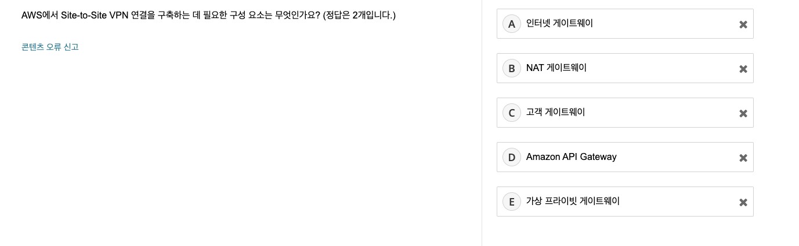
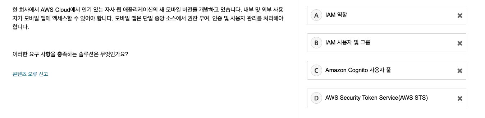

# Skill Builders

[BenchPrep 바로 가기](https://amazonwebservices.benchprep.com/app/aws-certification-official-practice-question-sets-korean#exams)

# 퀴즈

### 1)


```
선택) D
정답) D

해설) 
소거법으로 진행했다.
A - 뭔가 전용 인스턴스를 구입하고 배포하는 것도 하나의 방법이 될 수 있을 것이라고 생각했지만, 모범 사례는 아닐 것 같다는 생각이 들어 pass
B - 가시성 시간 제한이 정확히 무엇인지 모르겠으나, 뭔가 성능 개선의 방법은 아닌 것 같다고 생각해서 pass
C - 람다를 추가한다고 해서 성능이 개선될까 싶어 pass
D를 선택했다.
```

**[처음 알게 된 내용 ✏️ ]**

- **가시성 시간 제한**
    - 하나의 큐에 여러 서버가 동일 메세지를 처리하는 것을 방지하고자 특정 시간동안 다른 곳에서 해당 메세지를 볼 수 없는 것
    - 백로그가 증가할 경우 가시성 시간 제한을 설정해야한다.
- **SQS FIFO 대기열로 변환**
    - SQS 대기열을 생성한 후에는 FIFO로 변경할 수 없다.
- **Lambda의 제약**
    - 함수 메모리 양은 128 MB ~ 10,240 MB로 1 MB씩 증가한다.
    - 함수의 제한 시간은 900초이다 (15분)
    - 환경 변수의 합계는 4KB가 넘어갈 수 없다.
    - 리소스 기반 정책은 20KB가 넘어갈 수 없다.
    - 함수의 레이어는 5개로 구성되어있다.
    - 함수의 동시성 버스팅은 지역마다 다르지만 500 ~ 3000개 사이이다.
    - 요청 및 응답의 호출 페이로드는 동기일때 6 MB, 비동기일때 256 KB까지 가능하다.
- **SQS 기반 ASG 구성**
    - `ApproximateNumberOfMessagesVisible` 지표를 사용해서 대상 추적 조정 정책을 적용하면 메세지 수에 따라 ASG 구성이 가능하다.

### 2)


```
선택) A
정답) B

해설) 
오 ... ECS에 대해 정말 모르지만, "로도를 여러 작업으로 분산하는 라우팅 솔루션"만 봤을땐
ALB에 관한 설명이 아닐까 싶었다.
그러면 답이 A 또는 B인데, 포트 매핑과는 관련이 없어보여 A를 선택했으나 정답은 B였다 ... 😭
```

**[처음 알게 된 내용 ✏️ ]**

- **ALB와 컨테이너 ([#](https://docs.aws.amazon.com/ko_kr/AmazonECS/latest/developerguide/service-load-balancing.html))**
    - **경로 기반 라우팅**을 사용하면 여러 서비스가 단일 ALB에서 동일한 리스너 포트를 사용할 수 있다.
    - **동적 호스트 매핑**을 사용하면 컨테이너 인스턴스마다 동일 서비스의 여러 작업이 허용된다.
- **라우팅 정책 ([#](https://docs.aws.amazon.com/ko_kr/Route53/latest/DeveloperGuide/routing-policy.html))**
    - **장애 조치 라우팅 정책**은 특정 리소스가 비정상이면 다른 리소스로 트래픽을 라우팅하는 것. 그런 단일 컨테이너에서 여러 작업을 관리할 수 없다.
    - **가중치 기반 라우팅**은 리소스가 라우팅되는 트래픽 비율을 정할 수 있는 것. 마찬가지로 단일 컨테이너에서 여러 작업을 관리할 수 없다.

### 3)


```
선택) D
정답) D

해설) 
EC2의 가용성을 늘리기 위해 어떤 조치를 취해야할까인데
ASG에서 multi AZ를 설정하면 될 것 같다고 생각했기 때문에 D를 선택했다.
```

**[처음 알게 된 내용 ✏️ ]**

- **VPC 피어링 ([#](https://docs.aws.amazon.com/ko_kr/vpc/latest/peering/what-is-vpc-peering.html))**
    - 두 VPC 간에 트래픽을 라우팅할 수 있도록 하기 위한 네트워킹 연결.
- **DNS 장애 조치 구성 ([#](https://docs.aws.amazon.com/ko_kr/Route53/latest/DeveloperGuide/dns-failover-configuring.html))**
    - Route 53에서 동일한 기능을 수행하는 2개 이상의 리소스가 있는 경우, 리소스 상태를 확인하고 정상적인 리소스만을 사용하여 DNS 쿼리에 응답할 수 있도록 하는 것.
    - 2번 문제에서 본 장애 조치 라우팅 정책과 연결되는듯 하다.

### 4)

 


```
선택) A
정답) A

해설) 
일단 이 문제를 분석하면
1. S3에 저장한다.
2. 최신 버전은 동일한 객체키를 사용한다. 예전 버전도 다운로드 할 수 있어야 함
3. 문서를 삭제하지 않도록 보호해야 한다.

이렇게 세 가지 조건이 있는데, 
B - MFA 삭제를 활성화하는 것은 3번 조건을 충족시키는데 도움이 되지만, 1, 2번을 만족하기엔 부족할 것 같다는 생각이 들어 pass
C - 리전 복제는 효율성이 높은 것도 잘 모르겠고 ... 그냥 고가용성에만 도움이 될 것 같아서 pass
D - S3 Glacier는 오랫동안 보관만 하는 것에 쓰는 서비스인 것 같은데, 예전 버전을 다운로드할 수 있나? 뭔가 못할 것 같아서 pass

가장 정답처럼 생긴 A를 선택했다.
```

**[처음 알게 된 내용 ✏️ ]**

- **S3 버전 관리 작동 방식 ([#](https://docs.aws.amazon.com/ko_kr/AmazonS3/latest/userguide/versioning-workflows.html))**
    - 한 버킷에 여러 버전의 객체를 보관할 수 있고, 실수로 삭제되거나 덮어쓰기 된 객체를 복원할 수 있다.
    - 리전 간의 복제를 위해서 S3 버전 관리가 전제 조건이 되어야 한다.
    

### 5)


```
선택) D
정답) D

해설) 
강의에서 본거다!!
connection draining에 대해 물어보는 것 같아서 D로 선택했다.

```

### 6)


```
선택) C
정답) C

해설) 
문제랑 정답이 짧아서 좋았다 ㅎㅅㅎ ...만
내가 모르는 내용의 문제였어서 찍었다 ㅋㅋ..

```

**[처음 알게 된 내용 ✏️ ]**

- **스팟 인스턴스 종료 ([#](https://docs.aws.amazon.com/ko_kr/AWSEC2/latest/UserGuide/spot-requests.html#terminating-a-spot-instance))**
    - 새로운 스팟 인스턴스가 시작되지 않도록 스팟 인스턴스 요청을 취소해야한다.
    - 실행중인(active) 스팟 인스턴스는 요청 취소한다고 인스턴스가 종료되지 않는다. 수동으로 종료해야한다.
    - 중지된(disabled) 스팟 인스턴스는 요청을 취소하면 자동으로 종료된다.

### 7)


```
선택) C
정답) A

해설) 
이것도 모르는 내용 +  소거법으로 제거하기도 애매한 문제여서 찍었다.
보기 봤을때 A랑 C중에 하나인것같은데 (순서만 달라서) C로 찍었다.
```

**[처음 알게 된 내용 ✏️ ]**

- **인스턴스 메타데이터 검색 ([#](https://docs.aws.amazon.com/AWSEC2/latest/UserGuide/instancedata-data-retrieval.html))**
    - [인스턴스 메타데이터](https://docs.aws.amazon.com/ko_kr/AWSEC2/latest/UserGuide/instancedata-data-categories.html)를 검색하기 위해 고정된 IP 주소를 사용한다. 이 주소는 link-local 주소이다.
    - `http://169.254.169.254/latest/meta-data/`
- **IP 주소 범위**
    - 192.168.x.x IP 주소 범위는 퍼블릭 블록이다.

 

### 8)


```
선택) D
정답) C

해설) 
이 문제의 요구사항을 정리하면
"S3 업로드에 실패하는 건을 어떻게 효율적으로 재시도할까?" 인 것 같다.

A - 뭔지 몰라서 일단 보류
B - 가능하긴 하겠지만 비용 효율적이진 않을 것 같아 pass
C - 멀티 파트 업로드라고 하면 파일을 쪼개서 업로드하는건데, 네트워크 실패 대처와 관련된 내용은 아닌것 같아 pass
D - 가능할 것 같아서 보류

남은게 A, D인데 내 생각엔 D가 괜찮은 방법인 것 같아 D로 선택했...으나 정답은 C였다.
해설을 보니 요구사항은 재시도가 아니라 "큰 파일을 어떻게 쪼개서 업로드해야할지"인 것 같다.
```

**[처음 알게 된 내용 ✏️ ]**

- **S3 Transfer Acceleration ([#](https://aws.amazon.com/ko/s3/transfer-acceleration/))**
    - S3에 업로드를 더 빠르게 하기 위한 솔루션
    - 단일 PUT 작업에 대한 파일 크기 제한(5GB)을 해결하지 못한다.
- **S3 멀티파트 업로드 ([#](https://docs.aws.amazon.com/ko_kr/AmazonS3/latest/userguide/mpuoverview.html))**
    - 최대 5GB 크기의 단일 객체를 업로드할 수 있다.

### 9)


```
선택) A
정답) B

해설) 
일단 20,000IOPS가 뭔지 모른다. 근데 뭔가 ... 
20,000 IO Per Second인 것 같다.
그럼 좀 성능이 좋아야될 것 같아 A를 선택했다. 
```

**[처음 알게 된 내용 ✏️ ]**

- **EBS 볼륨 유형과 처리량**
    - [처리량 최적화 HDD](https://docs.aws.amazon.com/ko_kr/AWSEC2/latest/UserGuide/ebs-volume-types.html#hard-disk-drives)는 볼륨에 대해 500IOPS로 제한되는 HDD 지원 스토리지 디바이스이다.
    - [프로비저닝된 IOPS SSD](https://docs.aws.amazon.com/ko_kr/AWSEC2/latest/UserGuide/ebs-volume-types.html#solid-state-drives)는 볼륨에 대해 최대 64,000IOPS를 제공한다.
    - [범용 SSD](https://docs.aws.amazon.com/ko_kr/AWSEC2/latest/UserGuide/ebs-volume-types.html#solid-state-drives)는 볼륨에 대해 16,000IOPS로 제한된다.
    - [콜드 HDD](https://aws.amazon.com/ko/ebs/cold-hdd/)는 IOPS가 아닌 처리량으로 성능을 정의하는 저비용 마그네틱 스토리이지이다. 즉, 순차적인 대용량 콜드 데이터 워크로드에 적합하다.
- IOPS?
    - 초당 입출력 속도(Input Output Operation Per Second)
- HDD vs SSD
    - SSD
        - 플래시 메모리를 이용해서 저장한다.
        - 물리적 손상을 불러올 수 있는 부품이 없다.
        - 즉, HDD보다 빠르며, 저전력, 높은 내구성, 저소음 등의 장점을 가진다.
    - HDD
        - 마그네틱 판을 이용해서 저장한다.

### 10)



```
선택) C, E
정답) C, E

해설) 
Site-to-Site는 자체 네트워크와 VPC를 연결하는 VPN. 일단 E는 확실하고 나머지 중에서 하나를 더 골라야한다.
A - 인터넷 게이트웨이는 VPC에 연결되어있는 것으로 알고 있다. 퍼블릭한 트래픽을 받을 때 필요하므로 pass
B - 헷갈려서 보류
C - 헷갈려서 보류
D - 얘는 아예 관련없는 서비스여서 pass

둘 중에 C가 더 정답에 근접해보여서 C, E를 선택했다.
```

**[처음 알게 된 내용 ✏️ ]**

- **NAT 게이트웨이 ([#](https://docs.aws.amazon.com/ko_kr/vpc/latest/userguide/vpc-nat-gateway.html))**
    - 네트워크 주소 변환 서비스. 프라이빗 서브넷의 인스턴스가 VPC 외부의 서비스에 연결할 수 있지만 외부 서비스에서는 연결하지 못하게 할때 사용한다.
- **Site-to-Site ([#](https://docs.aws.amazon.com/ko_kr/vpn/latest/s2svpn/VPC_VPN.html))**
    - 가상 프라이빗 게이트웨이(또는 Transit 게이트웨이) && 고객 게이트웨이가 필요하다.
    

### 11)


```
선택) B
정답) B

해설) 
1. NoSQL
2. 높은 비율의 읽기 지원, 마이크로초 단위 대기 시간으로 메시지 전달 -> 높은 성능

NoSQL + 높은 성능 조합이면 DynamoDB밖에 안떠올라서 B로 선택했다.
```

**[처음 알게 된 내용 ✏️ ]**

- **Neptune ([#](https://docs.aws.amazon.com/ko_kr/neptune/latest/userguide/intro.html))**
    - 그래프 데이베이스. 고도로 연결된 데이터 작업에 최적화되어있다.

### 12)


```
선택) B
정답) B

해설) 
이 문제의 요구사항을 정리하면 "필요한 액세스 권한을 제공하는 모범 사례를 찾아라"인 것 같다.
소거법으로 진행해보자!

A - 너무 짜치는 것 같다. 보통 이렇게 짜치는 방법은 오답일 확률이 높아 pass
B - 괜찮아보인다.
C - 사용자 하나를 만들어서 로그인하게 하는건 모범 사례가 아닐 것 같다. 개별적인 계정을 만들어야할 것 같아 pass
D - 괜찮아보인다.

B와 D가 남았는데, 여기서 역할을 사용하는게 더 좋아보여 B를 선택했다.
```

**[처음 알게 된 내용 ✏️ ]**

- **IAM의 보안 모범 사례 ([#](https://docs.aws.amazon.com/ko_kr/IAM/latest/UserGuide/best-practices.html))**
    - 루트 계정은 사용하지 말자
    - 역할을 사용하고 역할을 수임하자
    - 최소 권한만 부여하자
    - AWS 관리형 정책을 사용하자
    - 생성할 정책을 검증하라
    - 인라인 정책대신 고객 관리형 정책을 사용하자
    - 모든 IAM 정책을 정기적으로 검토하고 모니터링하자
    - 강력한 암호를 사용하고 주기적으로 교체하자
    - MFA를 활성화하자
    - EC2에 역할을 사용하자
    - 액세스 키 공유하지말자
    - 자격 증명 정기적으로 교체하고, 불필요하면 삭제하자
    - 정책 조건을 사용하자
    - 계정 활동을 모니터링하라

### 13)



```
선택) D
정답) C

해설) 
이 문제의 요구사항은 "내부, 외부 모바일 앱에서의 인증"인 것 같다.
내부는 상관없지만 외부 사용자는 일정 시간이 지나면 권한이 소멸되어야하는데, IAM이랑은 잘 어울리지 않는다고 생각했다.
그래서 D를 선택했지만 정답은 C였다 ...
STS는 애플리케이션에 대한 액세스를 제어하지 않는다.
```

**[처음 알게 된 내용 ✏️ ]**

- **Amazon Cognito ([#](https://docs.aws.amazon.com/ko_kr/cognito/latest/developerguide/what-is-amazon-cognito.html))**
    - 웹 및 모바일 앱에 대한 인증, 권한 부여 및 사용자 관리를 제공한다.
    - 사용자는 이름과 암호로 직접 로그인할 수도, 서드 파티를 사용할 수도 있다.

### 14)


```
선택) A, E
정답) A, E

해설) 
이 문제의 요구사항은 
1. RDS private VPC 보안 구성
2. 지정된 포트를 통해서만 DB 접근 가능

인 것 같다. 소거법으로 진행해보자!

A - 맞는 것 같다.
B - 탄력적 네트워크 인터페이스와 1번 요구사항이랑은 어울리지 않는 것 같아 pass
C - AWS Shield는 디도스 공격을 방어할 때 사용하는 것으로 알기 때문에 요구사항과 관련없어보여 pass
D - 뭔지 모름
E - 맞는 것 같다.

A, E가 답인게 거의 명확한 것 같아 A, E를 선택했다.
```

**[처음 알게 된 내용 ✏️ ]**

- **AWS Direct Connect ([#](https://aws.amazon.com/ko/directconnect/features/?whats-new-cards.sort-by=item.additionalFields.postDateTime&whats-new-cards.sort-order=desc))**
    - AWS 환경에 대한 전용 연결을 제공한다.
- **탄력적 네트워크 인터페이스 ([#](https://docs.aws.amazon.com/ko_kr/AWSEC2/latest/UserGuide/using-eni.html))**
    - VPC에서 가상 네트워크 카드를 나타내는 논리적 네트워킹 구성 요소
    

### 15)


```
선택) C
정답) C

해설) 
이 문제는 예전에 비슷한 상황에서 보안팀이 어떻게 대처했는지 보았기때문에 비교적 쉽게 풀었다.
```

### 16)


```
선택) B
정답) B

해설) 
저번에 연습문제 풀때 나왔던 문제 ... ㅎㅎ 파일 저장 + 비용 효율 => Glacier인 것 같다.
```

**[처음 알게 된 내용 ✏️ ]**

- **Amazon EFS ([#](https://docs.aws.amazon.com/ko_kr/efs/latest/ug/how-it-works.html#how-it-works-direct-connect))**
    - 탄력적인 서버리스 파일 시스템
- **Amazon S3 스토리지 클래스 사용 ([#](https://docs.aws.amazon.com/ko_kr/AmazonS3/latest/userguide/storage-class-intro.html))**
    - 자주 액세스하는 객체를 위한 스토리지 클래스
        - S3 Standard
        - Reduced Redundancy (S3보다 구리다.)
    - 변경되거나 알 수 없는 액세스 패턴으로 데이터를 자동으로 최적화하는 스토리지 클래스
        - S3 Intelligent-Tiering (데이터를 자동으로 이동하여 스토리지 비용을 최적화한다)
    - 자주 액세스하지 않는 객체를 위한 스토리지 클래스
        - S3 Standard-IA
        - S3 One Zone-IA
    - 객체 아카이빙을 위한 스토리지 클래스
        - S3 Glacier

### 17)


```
선택) B
정답) A

해설) 
일단 눈여겨봐야할 요구사항은 "최대 400GB"와 "4,000IOPS"이다. 즉, 많은 스펙을 가져야한다는 것인데,
아까 정답이었던 B를 선택했으나 정답은 A였다 ㅠㅠ
SSD 지원 스토리지 최적화(i2)는 365,000IOPS 이상을 제공한다.
```

**[처음 알게 된 내용 ✏️ ]**

- 인스턴스 스토어 vs EBS 볼륨
    - **인스턴스 스토어**는 인스턴스의 정규 시간당 요금에 비해 추가 비용이 없다.
    - **Amazon EBS**는 시간당 인스턴스 요금에 비용을 추가한다.
        - 인스턴스 수명 주기 이상의 데이터 지속성이 필요할 때 사용한다.
        

### 18)


```
선택) D
정답) D

해설) 
SQS는 메시지를 푸시하는 기능이 없다. SNS를 사용하면 고객에게 푸시를 할 수 있기 때문에 D를 선택했다.
```

### 19)


```
선택) A
정답) A

해설) 
요구사항은 "DB는 RDS + 애플리케이션은 '항상'사용할 수 있어야하지만, 비활성 기간이 있다."인 것 같다.
소거법을 활용해보자

A - Fargate + Aurora Serverless 조합 ... 안써봐서 잘 모르겠다. 근데 관리형 컨테이너라 뭔가 답일것같다.
B - Redshift가 뭔지 모르겠다. 근데 뭔가 RDS는 아닌 것 같아 pass
C - 좋은 방법이 아닌것 같아 보인다. IaC를 사용하긴 하지만 스택을 삭제하고 배포하는 과정이 번거롭다고 느껴진다. pass
D - 이게 가장 클래식하고 좋은 방법인 것 같다.

보기만 읽었을 때에는 D가 가장 좋은 방법인 것 같은데, 저번에 SAA 꿀팁 세션을 들었을때 컨테이너를 사용하는게 가장 정답일 확률이 높다고 들었던 기억이 있어서 A를 선택했다.
```

**[처음 알게 된 내용 ✏️ ]**

- **AWS Fargate & Aurora Serverless**
    - 유휴 상태일 때 비용이 발생하지 않는다.
- **Amazon Redshift ([#](https://docs.aws.amazon.com/ko_kr/redshift/latest/mgmt/welcome.html))**
    - 클라우드에서 관리되는 페타바이트급 데이터 웨어 하우스

### 20)


```
선택) A
정답) A

해설) 
요구사항은 "일정 주기에 한 번 엄청난 크기의 데이터를 복제해야한다."인 것 같다.
소거법을 활용해보자

A - 뭔지 모르겠는데 좋아보인다.
B - Standard-IA는 딱히 대용량 처리에 특화된 스토리지는 아닌 것 같다. pass
C - B번과 같은 보기가 나왔는데 같은 이유로 pass
D - 한 번 데이터를 복제하는게 CloudFront를 굳이 쓸 필요는 없을 것 같다. pass

```

**[처음 알게 된 내용 ✏️ ]**

- **AWS Snowball ([#](https://aws.amazon.com/ko/snowball/?whats-new-cards.sort-by=item.additionalFields.postDateTime&whats-new-cards.sort-order=desc))**
    - 대규모 데이터 전송에 적합한 디바이스.