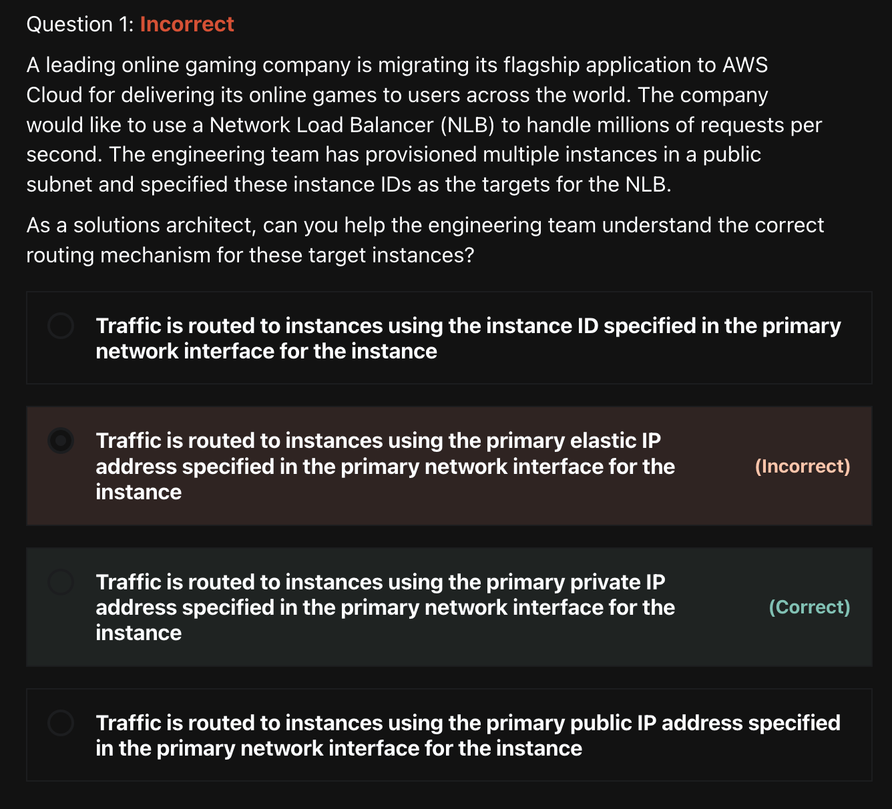
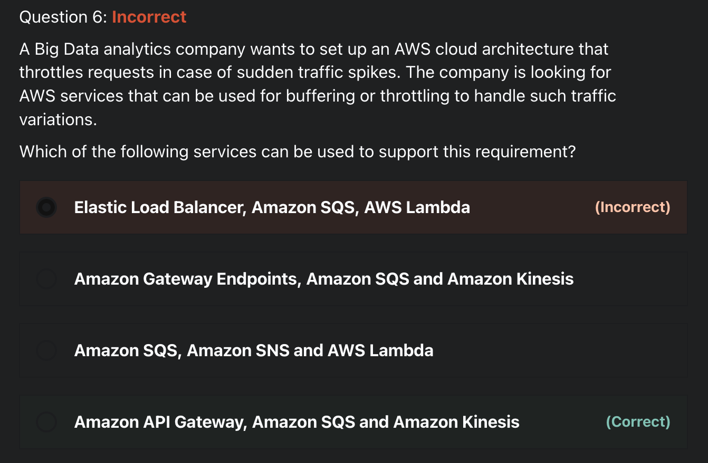
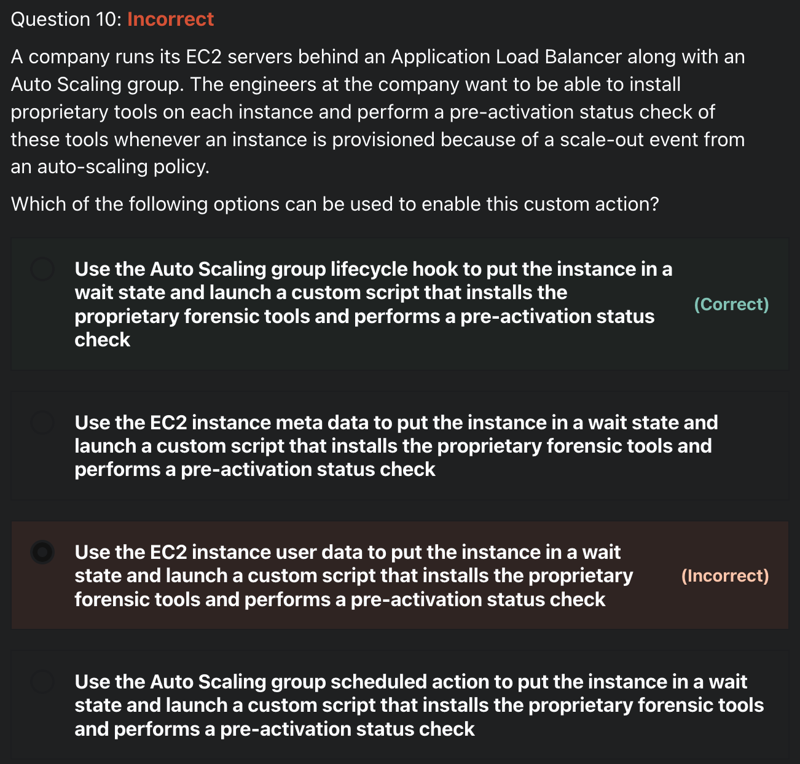
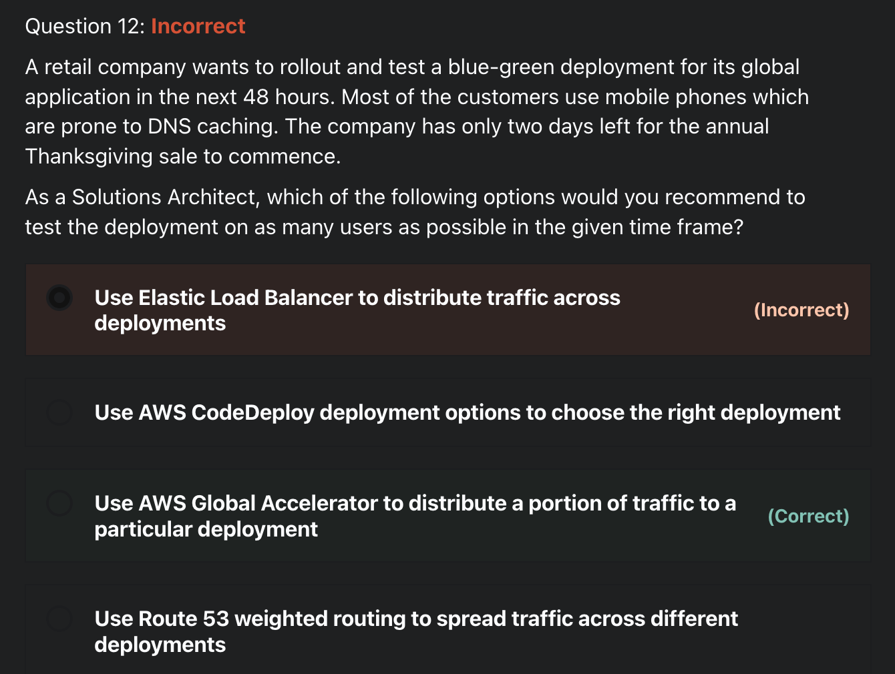
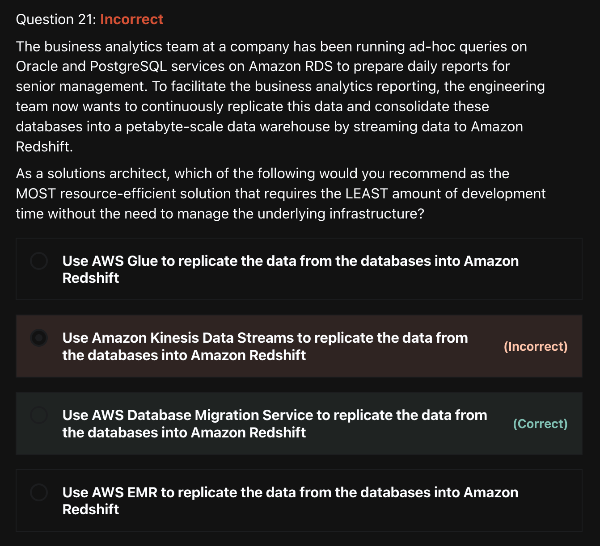
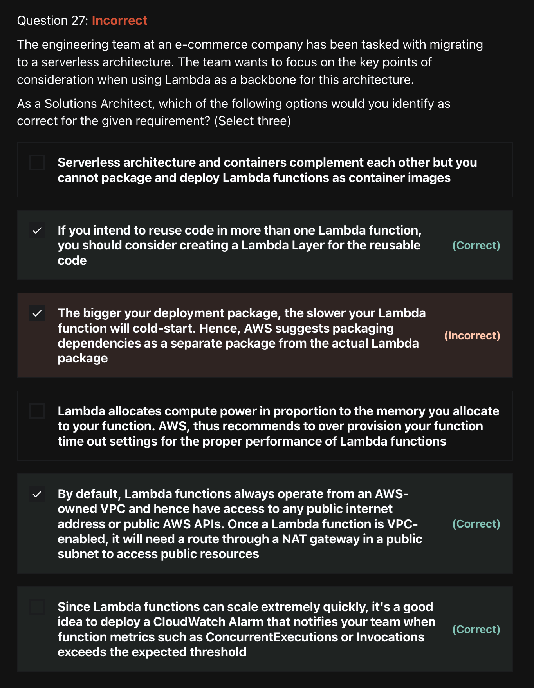
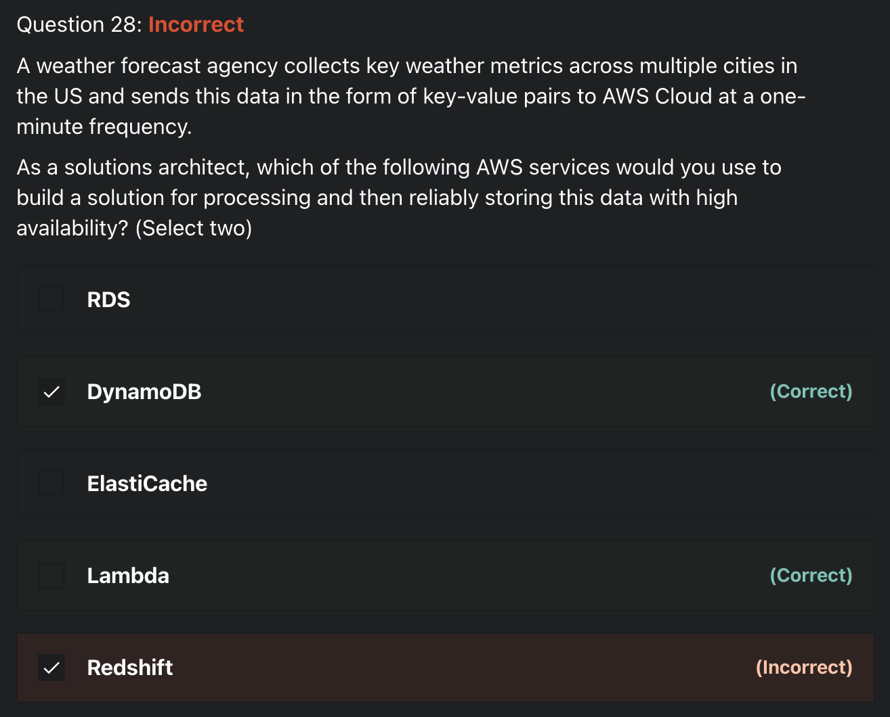
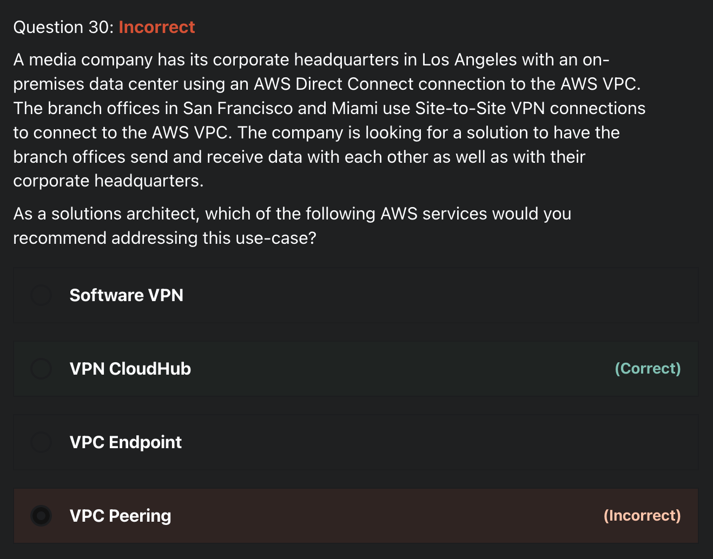
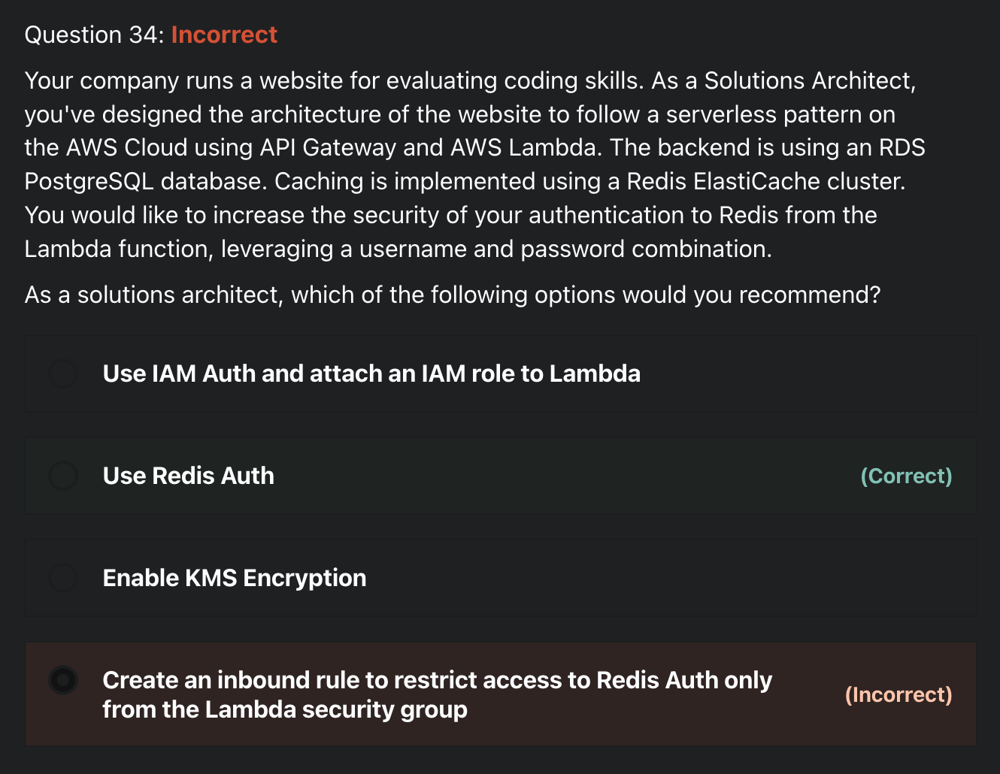
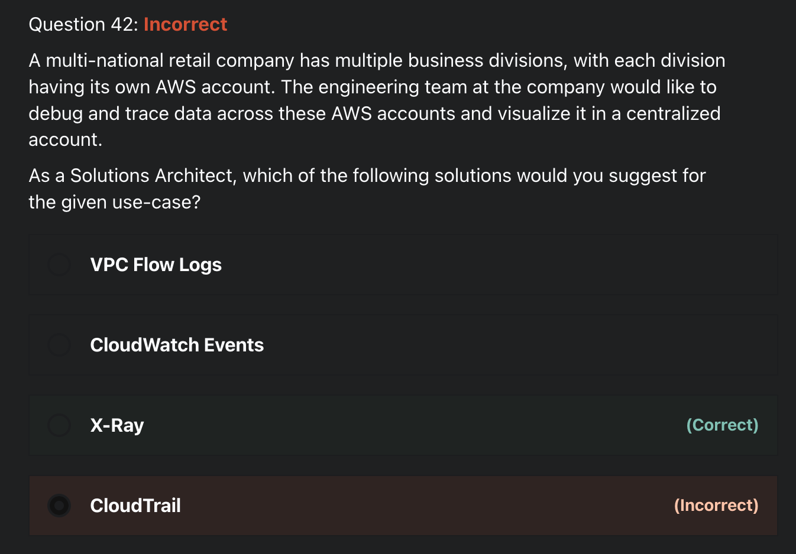

# Practice Exam
> [Practice Exam - AWS Certified Solutions Architect Associate](https://www.udemy.com/course/aws-certified-solutions-architect-associate-saa-c02/learn/quiz/4595602/) 을 풀고, 어렵거나 중요한 문제 10개를 선정하여 풀이/해설 제출하기

<br>
<br>

### 1) 1번 문제



```
답: 3
```
- Traffic is routed to instances using the **primary private IP** address specified in the **primary network interface** for the instance
- `Network Load Balancer`
  - Functions at the fourth layer of the Open Systems Interconnection (OSI) model
  - Can handle millions of requests per second
  - Attemps to open a **TCP connection** to the selected target on the port specified in the listener configuration

<br>

### 2) 6번 문제


```
답: 4
```
- Throttling is the process of **limiting the number of requests** an authorized program can submit to a given operation in a given amount of time
- `Amazon API Gateway`
  - To prevent your API from being overwhelmed by too many requests, Amazon API Gateway throttles requests to your API using the token bucket algorithm, where a token counts for a request
  - Sets a limit on a steady-state rate and a burst of request submissions against all APIs in your account
- `Amazon SQA`
  - A fully managed message queuing service that enables you to decouple and scale microservices, distributed systems, and serverless applications
  - Offers buffer capabilities to smooth out temporary volume spikes without losing messages or increasing latency
- `Amazon Kinesis`
  - A fully managed, scalable service that can ingest, buffer, and process streaming data in real-time

<br>

### 3) 10번 문제


```
답: 1
```
- `Auto Scaling group lifecycle hooks`
  - Enable you to perform custom actions as the Auto Scaling group launches or terminates instances
  - Enable you to perform custom actions **by pausing instances** as an Auto Scaling group launches or terminates them
    - When an instance is paused, it remains in a **wait state** either until you complete the lifecycle action using the `complete-lifecycle-action command` or the `CompleteLifecycleAction` operation, or until the `timeout` period ends (one hour by default)
<br>

### 4) 12번 문제

```
답: 3
```
- `AWS Global Accelerator`
  - 글로벌 사용자에게 제공하는 애플리케이션의 가용성과 성능을 향상하는 데 도움이 되는 네트워킹 서비스
  - 고정 IP 주소를 통해 애플리케이션에 **고정된 진입점**을 제공하고, 서로 다른 AWS 리전 및 가용 영역별로 특정 IP 주소를 관리하는 복잡성을 없앤다
  - 애플리케이션 상태, 사용자의 위치 및 고객이 구성하는 정책의 변경에 즉각적으로 대응하여 항상 성능에 기반한 **최적의 엔드포인트로 사용자 트래픽을 라우팅**한다
- `AWS Global Accelerator로 할 수 있는 것`  
  - AWS Global Accelerator에서 제공하는 고정 IP 주소와 AWS 엣지 로케이션의 애니캐스트를 리전별 AWS 리소스 또는 엔드포인트(예: Network Load Balancer, Application Load Balancer EC2 인스턴스 및 탄력적 IP 주소)에 연결할 수 있다
    - IP 주소는 AWS 엣지 로케이션에서 애니캐스트 되므로 사용자와 가까운 AWS 글로벌 네트워크에 온보딩 기능을 제공한다
  - DNS 구성을 업데이트하거나 클라이언트 애플리케이션을 변경하지 않고도 가용 영역 또는 AWS 리전 간에 엔드포인트를 손쉽게 이동할 수 있다
  - 엔드포인트 그룹에 대한 트래픽 다이얼 비율을 구성하여 특정 AWS 리전에 대한 트래픽 양을 늘리거나 줄일 수 있다
    - 성능 및 업데이트를 테스트할 때 유용
  - 엔드포인트 간에 가중치를 할당하여 엔드포인트 그룹 내 각 엔드포인트로 향하는 트래픽 양을 제어할 수 있다
- [참고: AWS Global Accelerator FAQ](https://aws.amazon.com/ko/global-accelerator/faqs/)
<br>

### 5) 21번 문제


```
답: 3
```
- `AWS Database Migration Service`
  - 관계형 데이터베이스, 데이터 웨어하우스, NoSQL 데이터베이스 및 기타 유형의 데이터 저장소를 쉽게 **마이그레이션**할 수 있는 클라우드 서비스
  - On-premise -> on-premise는 불가

<br>

### 6) 27번 문제


```
답: 2, 5, 6
```
- By default, Lambda functions always operate from an **AWS-owned VPC** and hence **have access to any public internet address** or public AWS APIs
- Once a Lambda function is VPC-enabled, it will need a route through a **NAT gateway** in a public subnet to access public resources

<br>

### 7) 28번 문제


```
답: 2, 4
```
- AWS Lambda can be combined with DynamoDB to process and capture the **key-value data** from the IoT sources described in the use-case

<br>

### 8) 30번 문제


```
답: 2번 
```
- `VPN CloudHub`
  - **다수의 AWS Site-to-Site VPN 연결**을 사용하는 경우 AWS VPN CloudHub로 사이트 간에 보안 통신을 제공할 수 있다
  -  VPC와 함께 또는 VPC 없이 사용할 수 있는 간단한 **hub-and-spoke** 모델에서 작동한다

<br>

### 9) 34번 문제

```
답: 4번
```
- **Redis authentication tokens** enable Redis to require a token (password) before allowing clients to execute commands, thereby improving data security
- IAM Auth is not supported by ElastiCache

<br>

### 10) 42번 문제

```
답: 3
```
- `AWS X-Ray`
  - 애플리케이션이 **처리하는 요청에 대한 데이터를 수집**하는 서비스
    - 해당 데이터를 보고, 필터링하고, 통찰을 얻어 문제와 최적화 기회를 식별할 수 있는 도구를 제공한다
  - X-Ray를 사용해 자신이 개발한 애플리케이션과 기본 서비스가 **성능 문제**와 **오류의 근본 원인 식별**과 문제 해결을 올바로 수행하는지 파악할 수 있다
  - X-Ray는 요청이 애플리케이션을 통과함에 따라 요청에 대한 엔드 투 엔드 뷰를 제공하고 애플리케이션의 기본 구성 요소를 맵으로 보여준다

<br>