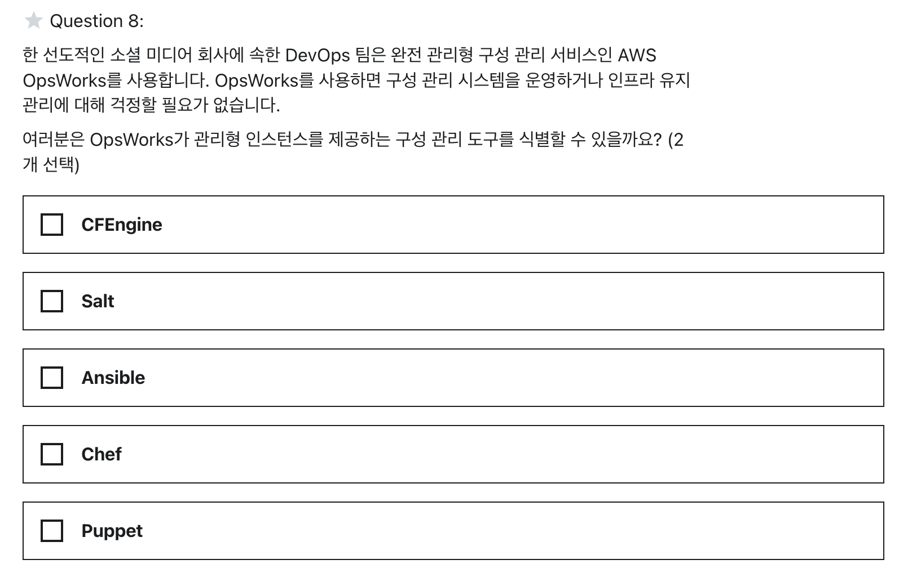
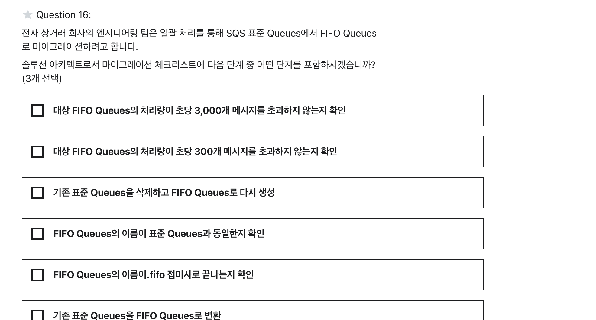
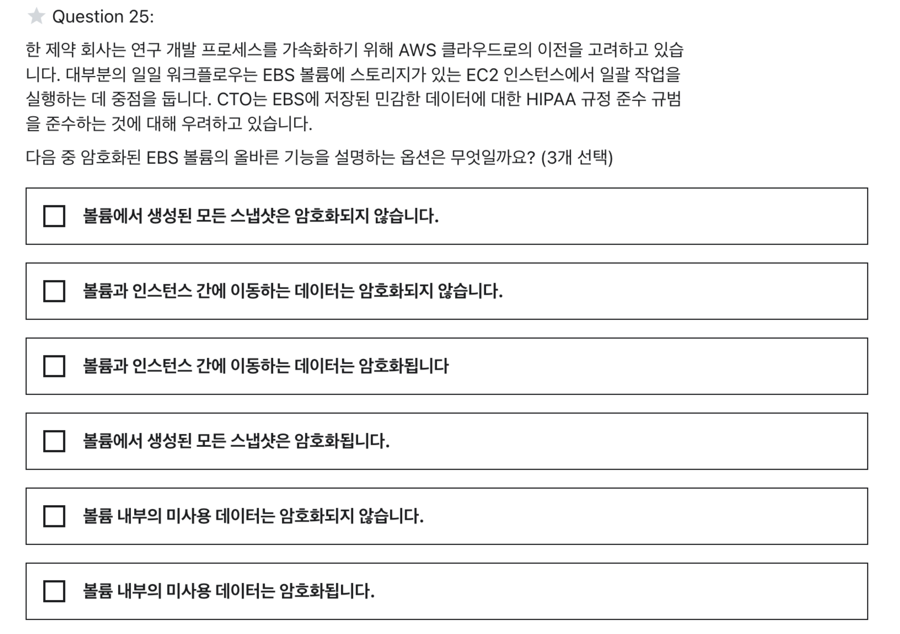
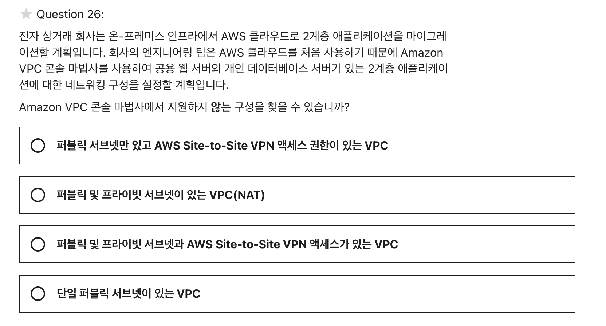
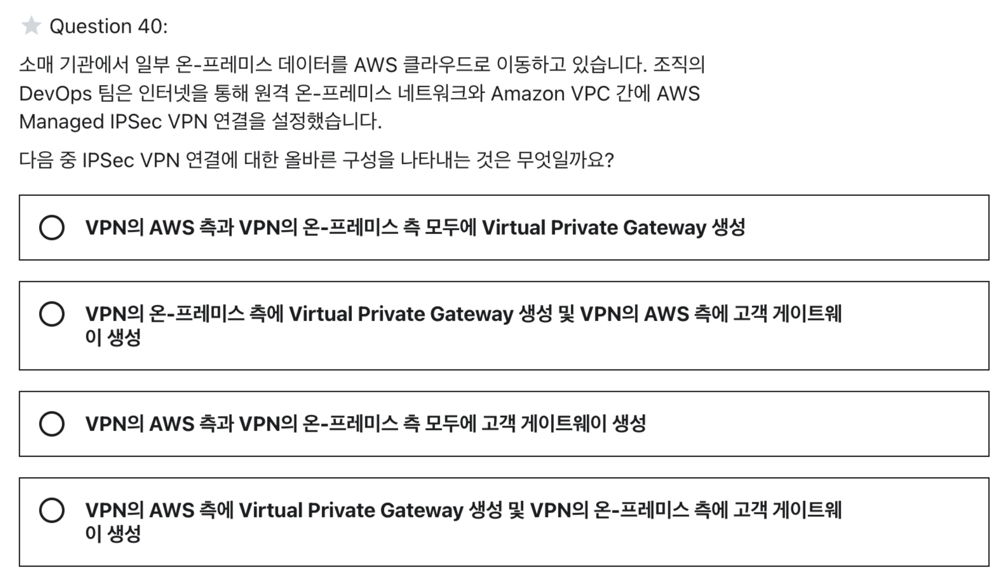
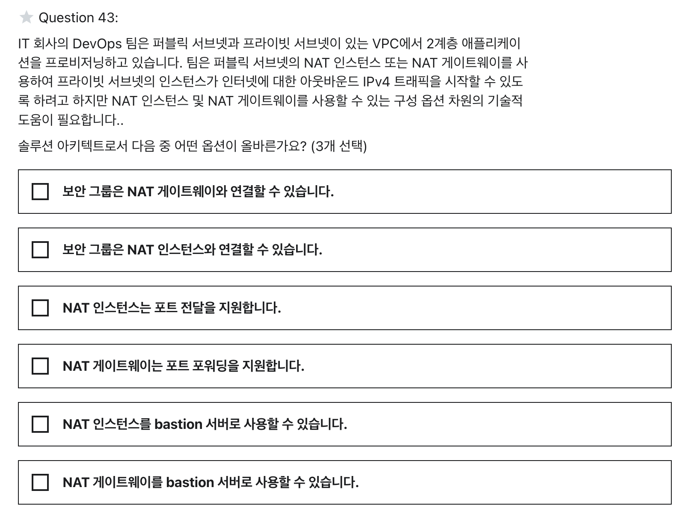
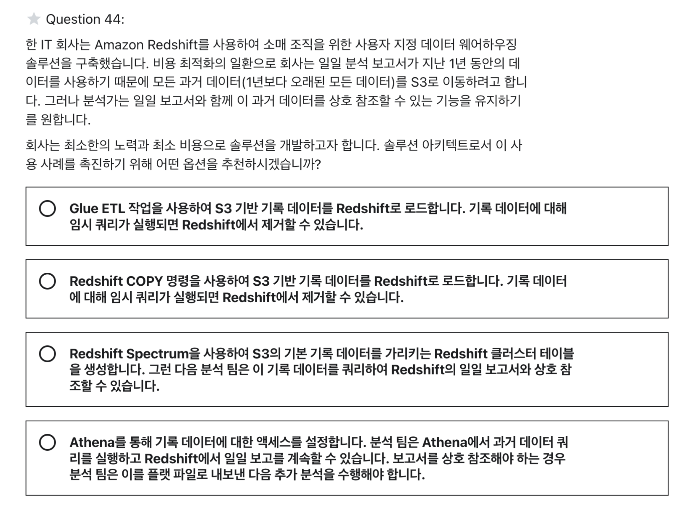
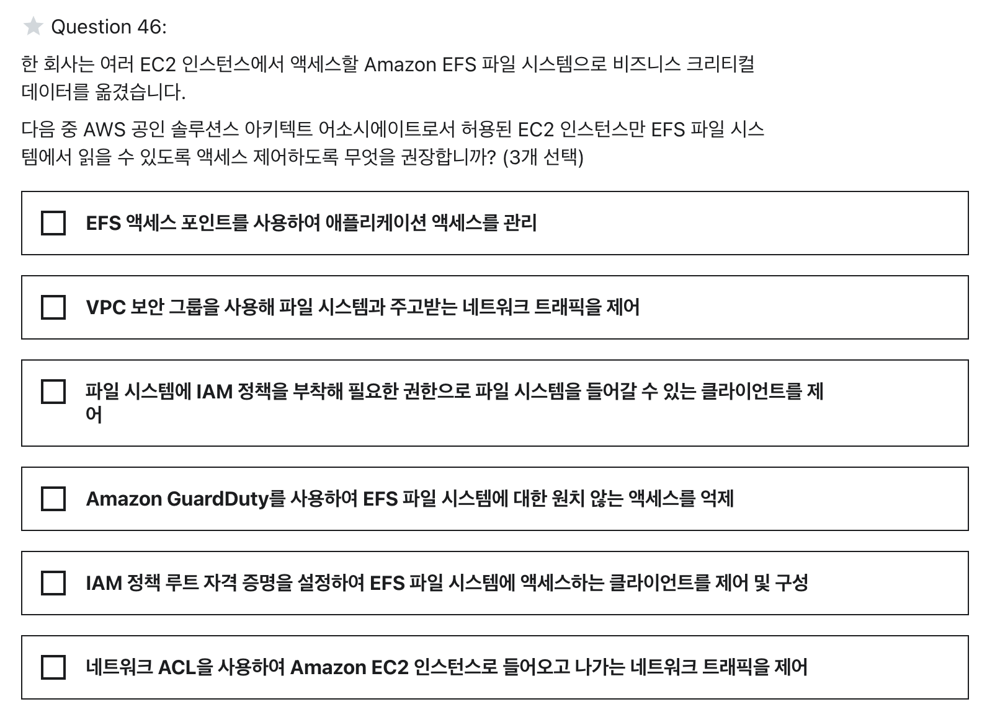
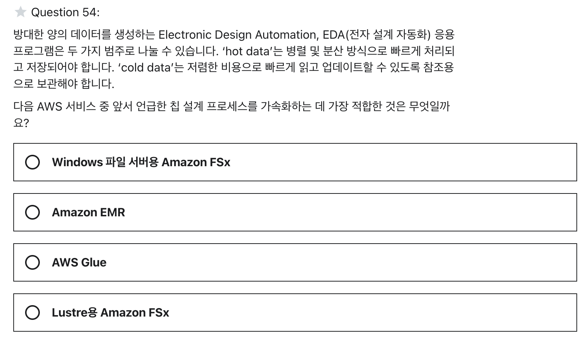

# Section 30 > Practice Test 1 연습시험

## 1)

정답은 `4) Chef`, `5) Puppet`이다.

### AWS OpsWorks?

AWS OpsWorks는 관리형 인스턴스를 제공하는 구성 관리 서비스로, Chef와 Puppet을 지원한다. 

OpsWorks를 사용하면 EC2 인스턴스 또는 온프레미스 컴퓨팅 환경에서 서버를 구성, 배포 및 관리하는 방법을 자동화할 수 있다.

## 2)

`정답`

1) 대상 FIFO Queues의 처리량이 초당 3,000개 메시지를 초과하지 않는지 확인

3) 기존 표준 Queues을 삭제하고 FIFO Queues로 다시 생성

5) FIFO Queues의 이름이 .fifo 접미사로 끝나는지 확인하십시오.

### FIFO Queues?

SQS에서는 제공해주는 큐의 유형이 두 가지이다. 

1. 표준 Queue
2. FIFO Queue

FIFO Queue를 사용하면 메시지가 전송된 정확한 순서로 처리된다. (먼저 들어온게 먼저 나감) 

표준 Queue에서 FIFO Queue로 바꾸는 방법은 따로 없기 때문에 삭제하고 다시 생성해야한다. (3번)

또한 .fifo 접미사로 끝나야한다. (5번) 

기본적으로 FIFO Queues은 일괄 처리를 통해 초당 최대 3,000개의 메시지를 지원한다. (1번)

## 3)

`정답`

3) 볼륨과 인스턴스 간에 이동하는 데이터는 암호화됩니다.

4) 볼륨에서 생성된 모든 스냅샷은 암호화됩니다.

6) 볼륨 내부의 미사용 데이터는 암호화됩니다.

### 암호화된 EBS 볼륨?

AWS Key Management Service(AWS KMS) 고객 마스터 키(CMK)를 사용하면 암호화된 EBS 볼륨을 만들 수 있다.

암호화된 EBS 볼륨을 생성하여 인스턴스 유형에 연결하면 아래 내용들은 모두 암호화된다.

- 볼륨에 저장된 데이터
- 볼륨과 인스턴스 간에 이동하는 데이터 (미사용 데이터, 전송 중인 데이터)
- 볼륨에서 생성된 스냅샷 및 이러한 스냅샷에서 생성된 볼륨

## 4)

`정답` 

1) 퍼블릭 서브넷만 있고 AWS Site-to-Site VPN 액세스 권한이 있는 VPC

### VPC 콘솔 마법사

Amazon VPC 콘솔 마법사는 다음 네 가지 구성을 제공한다.

1. 단일 퍼블릭 서브넷이 있는 VPC
2. 퍼블릭 및 프라이빗 서브넷(NAT)이 있는 VPC
3. 퍼블릭 및 프라이빗 서브넷이 있고 AWS Site-to-Site VPN 액세스가 있는 VPC
4. 프라이빗 서브넷만 있고 AWS Site-to-Site VPN 액세스가 있는 VPC

## 5)

`정답` 

1) 기본적으로 Lambda 함수는 항상 AWS 소유 VPC에서 작동하므로 모든 공용 인터넷 주소 또는 공용 AWS API에 액세스할 수 있습니다. Lambda 함수가 VPC를 활성화하면 퍼블릭 리소스에 액세스하려면 퍼블릭 서브넷의 NAT 게이트웨이를 통한 경로가 필요합니다.

2)  둘 이상의 Lambda 함수에서 코드를 재사용하려는 경우 재사용 가능한 코드에 대한 Lambda 계층 생성을 고려해야 합니다.

4) Lambda 함수는 매우 빠르게 스케일할 수 있으므로 ConcurrentExecutions 또는 Invocations와 같은 함수 metrics가 예상 임계값을 초과할 때 팀에 알리는 CloudWatch 경보를 배포하는 것이 좋습니다.

### Lambda

3) 서버리스 아키텍처와 컨테이너는 서로를 보완하여 Lambda 함수 내에서 Docker 컨테이너를 활용해야 합니다.

→ Lambda는 Docker 컨테이너 실행을 지원하지 않는다.

5) Lambda는 함수에 할당한 메모리에 비례하여 컴퓨팅 성능을 할당합니다. 따라서 AWS는 Lambda 함수의 적절한 성능을 위해 함수 시간 초과 설정을 과도하게 프로비저닝할 것을 권장합니다. 

→ Lambda는 함수에 할당한 메모리에 비례하여 컴퓨팅 성능을 할당한다. 즉, 메모리를 초과 프로비저닝하여 기능을 더 빠르게 실행하고 잠재적으로 비용을 절감할 수 있습니다. 그러나 AWS는 함수 시간 초과 설정을 과도하게 프로비저닝하면 Lambda 함수가 예상보다 오래 실행되고 예상치 못한 비용이 발생하는 경우가 많습니다.

6) 배포 패키지가 클수록 Lambda 함수가 콜드 스타트하는 속도가 느려집니다. 따라서 AWS는 종속성을 실제 Lambda 패키지와 별도의 패키지로 패키징할 것을 제안합니다.

→ 모든 종속성은 단일 Lambda 배포 패키지에도 패키징된다.

## 6)

`정답`

4) VPN의 AWS 측에 Virtual Private Gateway 생성 및 VPN의 온-프레미스 측에 고객 게이트웨이 생성

### Virtual Private Gateway

가상 프라이빗 게이트웨이(VPN 게이트웨이라고도 함)는 VPN 연결의 AWS VPC 측 엔드포인트

### 고객 게이트웨이

고객 게이트웨이 디바이스에 대한 정보를 AWS에 제공하는 AWS 리소스

## 7)

`정답`

2) 보안 그룹은 NAT 인스턴스와 연결할 수 있습니다.

3) NAT 인스턴스는 포트 전달을 지원합니다.

5) NAT 인스턴스를 bastion 서버로 사용할 수 있습니다.

### NAT 게이트웨이

 VPC의 퍼블릭 서브넷에서 사용하여 프라이빗 서브넷의 인스턴스가 인터넷으로 아웃바운드 IPv4 트래픽을 시작할 수 있도록 한다.

보안 그룹과 NAT 게이트웨이를 바로 연결할 수 있고, 포트 전달도 지원한다. 또한 NAT 인스턴스를 배스천 서버로 사용할 수도 있다.

## 8)

`정답` 

3) Redshift Spectrum을 사용하여 S3의 기본 기록 데이터를 가리키는 Redshift 클러스터 테이블을 생성합니다. 그런 다음 분석 팀은 이 기록 데이터를 쿼리하여 Redshift의 일일 보고서와 상호 참조할 수 있습니다.

### Redshift Spectrum

Amazon Redshift는 대규모 데이터 세트 저장 및 분석을 위해 설계된 완전 관리형 페타바이트 규모의 클라우드 기반 데이터 웨어하우스 제품이다.

Amazon Redshift Spectrum을 사용하면 Amazon Redshift 테이블에 데이터를 로드할 필요 없이 Amazon S3의 파일에서 구조화 및 반구조화 데이터를 효율적으로 쿼리하고 검색할 수 있다. Amazon Redshift Spectrum은 클러스터와 독립적인 전용 Amazon Redshift 서버에 있습니다. 또한 다른 쿼리보다 클러스터의 처리 용량을 훨씬 적게 사용하기 때문에 비용 효율적이다.

## 9)

`정답`

1) EFS 액세스 포인트로 애플리케이션 액세스 관리

2) VPC 보안 그룹을 사용하여 파일 시스템과 주고받는 네트워크 트래픽을 제어

3) 파일 시스템에 IAM 정책을 부착해 필요한 권한으로 파일 시스템을 들어갈 수 있는 클라이언트 제어

### 오답 풀이

4) Amazon GuardDuty를 사용하여 EFS 파일 시스템에 대한 원치 않는 액세스 억제

→ GuardDuty는 EFS 파일 시스템에 대한 액세스 제어를 위해 사용할 수 없다.

5) IAM 정책 루트 자격 증명을 설정하여 EFS 파일 시스템에 액세스하는 클라이언트를 제어하고 구성
→ IAM 정책 루트 자격 증명이라는것은 없다.

6) 네트워크 ACL을 사용하여 Amazon EC2 인스턴스로 들어오고 나가는 네트워크 트래픽을 제어

→ 네트워크 ACL은 인스턴스 수준이 아닌 서브넷 수준에서 작동한다.

## 10)

`정답`

4) Lustre용 Amazon FSx

### Lustre용 Amazon FSx

Amazon FSx for Lustre를 사용하면 쉽고 비용 효율적으로 전 세계에서 가장 인기 있는 고성능 파일 시스템을 실행할 수 있다. 또한 ‘hot data’를 병렬 및 분산 방식으로 처리하고 Amazon S3에 ‘cold data’를 쉽게 저장할 수 있는 기능을 제공한다. 따라서 가장 적합하다.