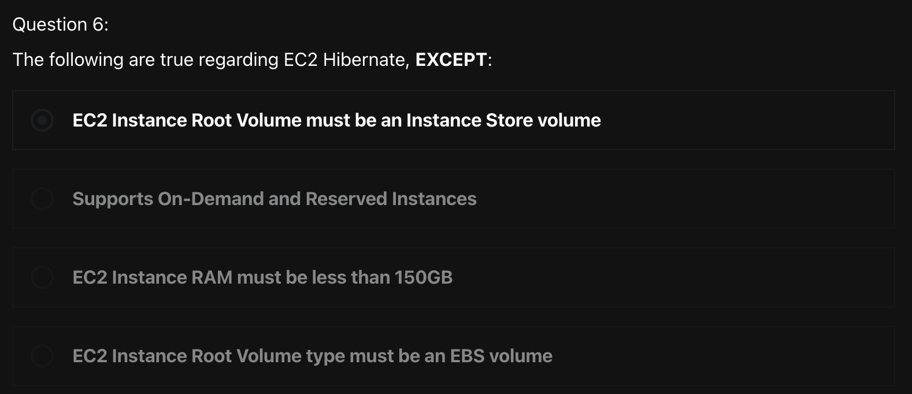
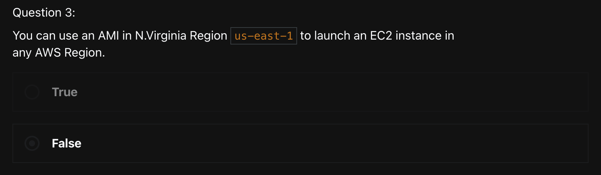
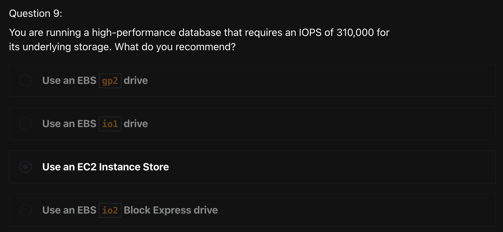

# Quiz
> [Udemy AWS SAA 강의](https://www.udemy.com/course/best-aws-certified-solutions-architect-associate/) Quiz 2,3,4를 풀고, 어려운 문제 3개 선정하여 해설을 제출하기

<br>

### 1) 



```
답: 1번
```

- EC2 Hibernate를 적용하려면, EC2 Instance의 Root Volume type은 `EBS volume` 이어야 하고, 암호화 되어 있어야한다


<br>

### 2) 



```
답: False
```

- AMI는 특정 region에 종속되며, 각각의 AWS region 마다 고유하다는 특징을 갖는다
- 다른 region의 AMI를 사용하여 EC2 인스턴스를 런칭할 수 없지만, 다른 region에서 AMI를 복사해서 신규 EC2 인스턴스를 생성할 수 있다  

<br>

### 3) 



```
답: 3번
```

- 2) EBS `io1` 또는 `io2` volume type 사용시, 최대 IOPS는 64,000이다 -> 오답
- 3) EC2 인스턴스 스토어는 인스턴스에 block 수준의 임시 스토리지를 제공하며, 해당 스토리지는 컴퓨터에 물리적으로 연결된 디스크에 위치한다
  - 적합한 사용 예
    - Buffer, cache, scratch data, 기타 임시 콘텐츠 등 자주 변경되는 정보의 임시 스토리지 or 로드가 분산된 웹 서버 풀과 같은 여러 인스턴스상에서 복제되는 데이터에 가장 적합하다
  - 인스턴스 스토어의 수명
    - 인스턴스 스토어의 데이터는 해당 인스턴스의 수명 기간 동안만 지속되지만, 아래와 같은 상황에서는 데이터가 손실된다
      - 기본 디스크 드라이브 오류
      - 인스턴스의 중지
      - 인스턴스의 최재 절전 모드로의 전환
      - 인스턴스 종료
    - 그러므로 장기 데이터의 경우 S3나 EBS, EFS 등 내구성이 뛰어난 데이터 스토리지를 사용하는 것이 좋다
- 4) EBS `io2` Block Express volume type 사용시, 최대 IOPS는 256,000이다 -> 오답