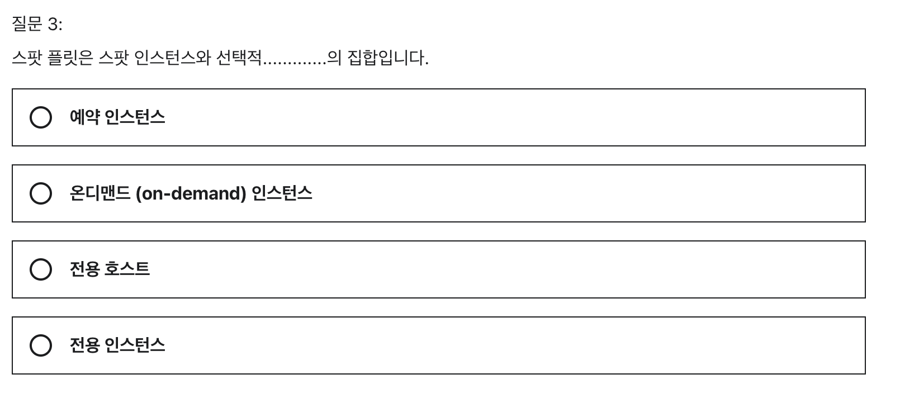
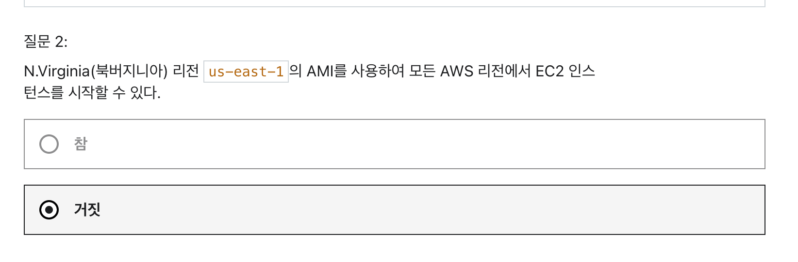

# 5주차 과제

> [Udemy 강의](https://www.udemy.com/course/best-aws-certified-solutions-architect-associate/) 섹션 5, 6, 7 의 퀴즈를 풀고 해설하기
> 
> 섹션 5 : EC2 - 기초  
> 섹션 6 : EC2 - 솔루션스 아키텍트 어소시에이트 레벨  
> 섹션 7 : EC2 - 인스턴스 스토리지

 
 

### 섹션 5 : EC2 - 기초

### 섹션 6 : EC2 - 솔루션스 아키텍트 어소시에이트 레벨

스팟 블록 인스턴스 : 지속시간이 정의된 스팟 인스턴스
 - 1시간 ~ 6시간 동안 지속되도록 지정이 가능하다.
 - 2021/07/01 부터 제공되지 않는 서비스.
 - 이미 만들어진 것들은 2022/12/31 까지 사용가능.

 
 

Fleet : 무리, 집합의 뜻

 - EC2 Fleet : 한 번의 API 호출에서 플릿은 온디맨드 인스턴스, 예약 인스턴스 및 스팟 인스턴스 구매 옵션을 함께 사용하여 여러 가용 영역에서 여러 인스턴스 유형을 시작할 수 있습니다.
    - 온디맨드 및 스팟 용량
    - 시간당 최대 지불하려는 금액
    - 인스턴스 유형

지정한 최대 금액에 도달할 떄 까지 인스턴스를 자동으로 만들고, 최대 금액에 도달하면 용량목표가 차지 못해도 더 만들지 않는다.

 - Spot Fleet : 사용자가 지정한 기준에 따라 시작되는 스팟 인스턴스의 집합, 선택적으로 온디맨드 인스턴스의 집합
    - 스팟 플릿을 요청하는 사용자의 기준에 따라 자동으로 스팟 인스턴스(필수) or 온디맨드 인스턴스(선택) 를 생성하고 시작한다.
    - 스팟 request (요청) 을 작성하여 작동한다.

- Spot Fleet 요청 type
    1. `request` : 처음 목표 용량을 얻기 위한 비동기 요청을 한다.
        1. 이 요청은 일회성이다.
        2. 스팟 중단으로 인해 용량이 감소해도, 다시 대체 스팟을 보충하지 않는다.
    2. `maintain` : 스팟 플릿이 활성화 되어 있는 동안, 스팟 인스턴스가 중단되면 다시 목표한 용량까지 스팟 인스턴스를 띄우도록 시도한다.
    

 
 

### 섹션 7 : EC2 - 인스턴스 스토리지

 - 보안그룹 : 하나의 VPC 에 지정 가능. 하나의 리전에서 사용 가능.
 - EC2 클러스터 배치 그룹 : 단일 AZ.
 - EC2 스프레드 배치 그룹 : 같은 리전의 여러 AZ.
 - EC2 파티션 배치 그룹 : 같은 리전의 여러 AZ.
 - ENI : VPC 의 하위 컴포넌트. 하나의 AZ 의 EC2 에만 연결가능.
 - AMI : 하나의 리전에서만 사용 가능. 다른 리전으로 복사는 가능.
 - EBS : 하나의 AZ 에서만 사용 가능. 스냅샷을 복사하면 이동 가능.
 - EFS : 하나의 리전의 복수개의 AZ 선택 가능.