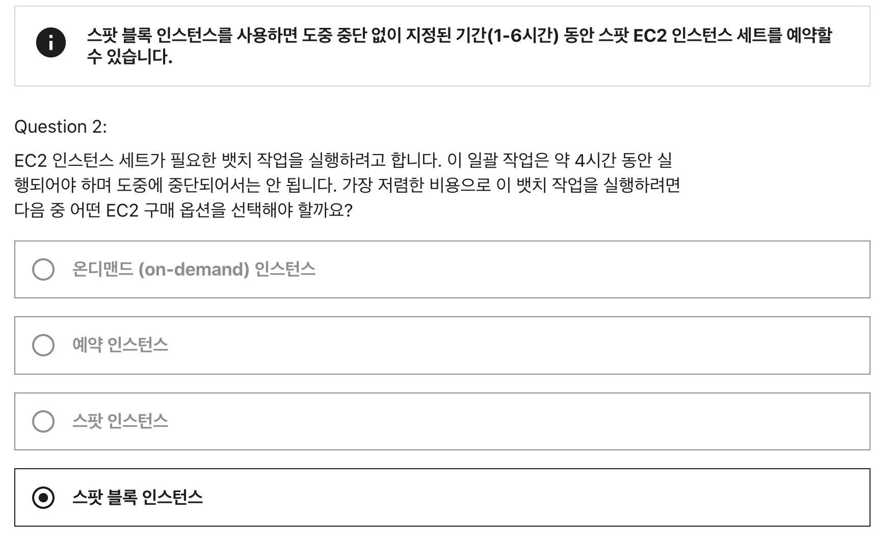
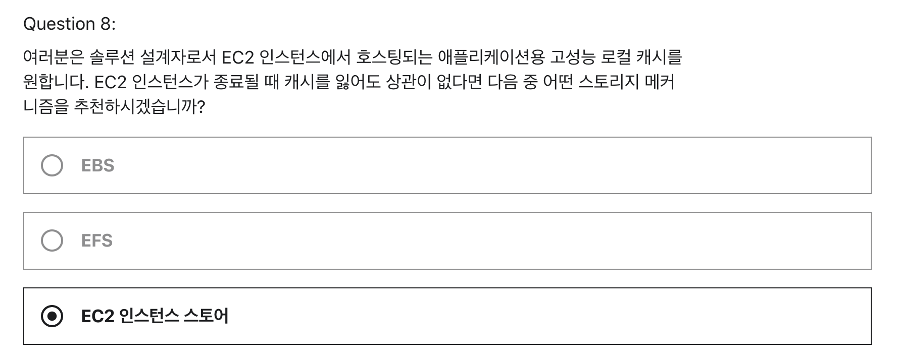
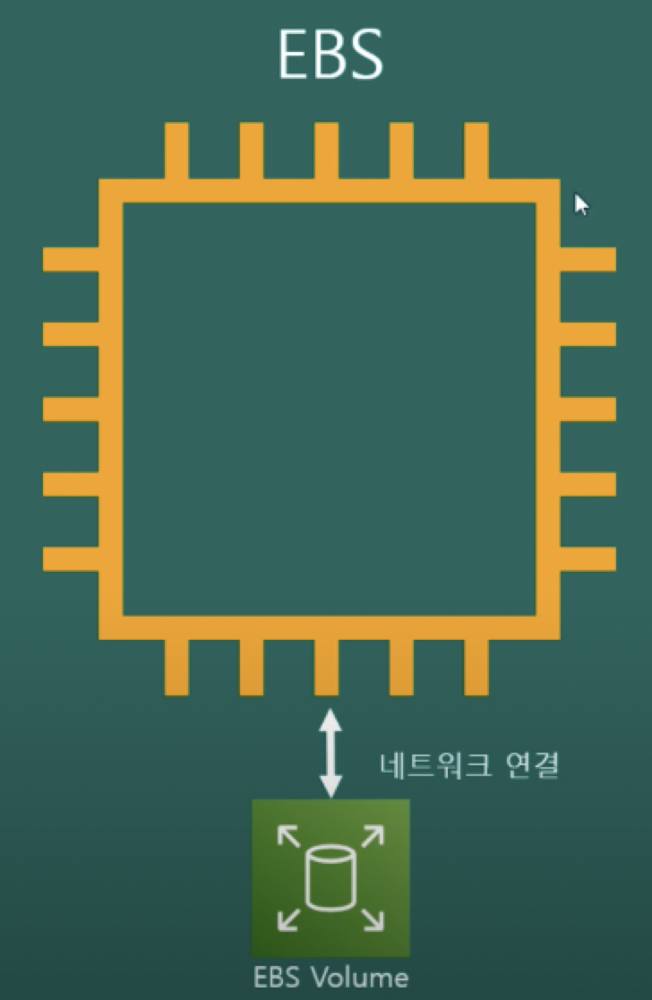
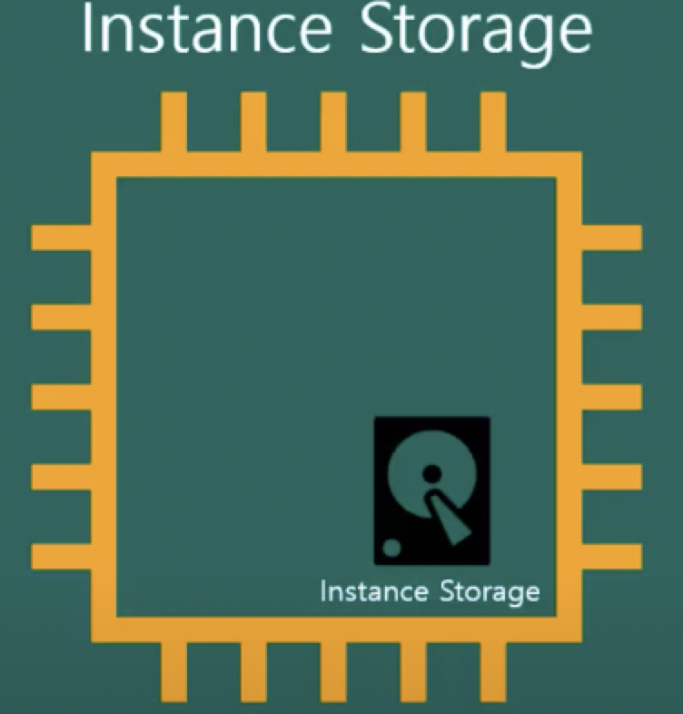
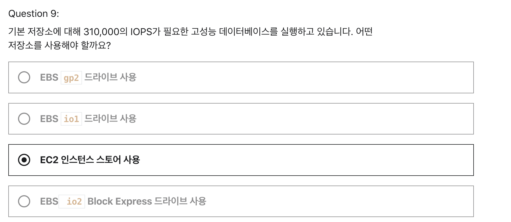

# W5 과제

## Section 6 - Question 2


#### 1. 스팟 플릿(함대)

- 스팟 인스턴스의 집합 혹은 온디맨드 인스턴스 집합
- 우리가 정한 입찰 가격에 충족하는 스팟 용량 풀을 선택하고 플릿에 대한 목표 용량을 충족하는 스팟 인스턴스를 시작
- 스팟 플릿이 정해놓은 예산에 도달하거나 원하는 용량에 도달하면 중지된다.

#### 2. 스팟 블럭

- 스팟 블럭
    - 지정된 기간동안 스팟 인스턴스 회수를 차단하고 중단 없이 지정된 기간(1-6시간) 인스턴스 사용 가능
- [스팟 블럭 서비스 중단](https://docs.aws.amazon.com/ko_kr/AWSEC2/latest/UserGuide/spot-requests.html)
  - 지속 시간이 정의된 스팟 인스턴스(스팟 블록이라고도 함)는 2021년 7월 1일부터 더 이상 신규 고객에게 제공되지 않습니다. 이전에 이 기능을 사용한 고객의 경우 2022년 12월 31일까지 지속 시간이 정의된 스팟 인스턴스를 계속 지원합니다.


<br>

-----

## Section 7 - Question 8


```
문제 선택 이유 : 
문제 지문에서 고성능이라는 단어와 EC2 인스턴스가 종료될 때 데이터를 잃어도 되는지에 대한 지문으로 인해
1번 보기에서 EBS에서는 io1 / io2 (SSD) - 고성능 SSD가 떠올랐고
2번 보기에서 EFS는 EFS의 프로비젼 처리량 모드가 떠올랐다.
3번은 인스턴스 스토리지가 휘발성인 특징을 알고있어서 문제 요구사항은 데이터를 잃어도 상관없다는 부분이 중점인것 같아 3번 선택
```
- EC2는 두가지 종류의 스토리지가 존재한다.
1. EBS Based : 반 영구적인 파일의 저장
  - 스냅샷 기능
  - Stop이 가능함. (중지가 가능하다.)
  - EBS 타입의 EC2는 실제 하드 디스크랑 인스턴스랑 분리되어 있고 네트워크로 연결되어 잇다.
  - EC2와 분리되어 있기 때문에 EC2 인스턴스가 내려가도 EBS는 살아있어서 또 사용가능
  - 즉, 컴퓨팅 파워와 파일이 종속적이지 않음
  - 
2. Instance Storage : 휘발성, 빠른 방식
  - 빠르지만 저장이 필요 없는 경우
  - Stop이 불가능함
  - 인스턴스 스토리지는 EC2 안에 물리적으로 연결되어 있다.
  - 그래서 바로 접근이 가능해서 빠르다.
  - EC2를 내려버리면 인스턴스 스토리지도 날라간다.
  - 그렇기에 다시 올리면 기존 파일을 저장할 수 없다.
  - 빠른 연산이 필요하고 굳이 파일 저장할 필요가 없을 때
  - 

<br>

----

## Section 7 - Question 9

```
문제 선택 이유 : 
문제에서 데이터베이스 라는 키워드가 있어서 휘발성인 인스토어 스토리지를 제거하고
기억으로 Block Express의 IOPS가 20만 이상이였던 것 같아 선택했었는데 틀림
```
- `io2 Block Express`
  - MAX `256,000 IOPS`
- 인스턴스 스토리지
  - 강의에서 EBS 볼륨은 성능은 좋지만 제한된 네트워크 드라이브라고 설명하면서
  - **만약 더 높은 I/O 퍼포먼스를 원한다면 EC2 인스턴스 스토어를 사용하면 된다고 함.**
  - week3 17번 문제의 보기 문제 해설
    - SSD 지원 스토리지 최적화(i2) 인스턴스는 임의로 `365,000 IOPS` 이상을 제공합니다.
    - https://docs.aws.amazon.com/ko_kr/AWSEC2/latest/UserGuide/storage-optimized-instances.html