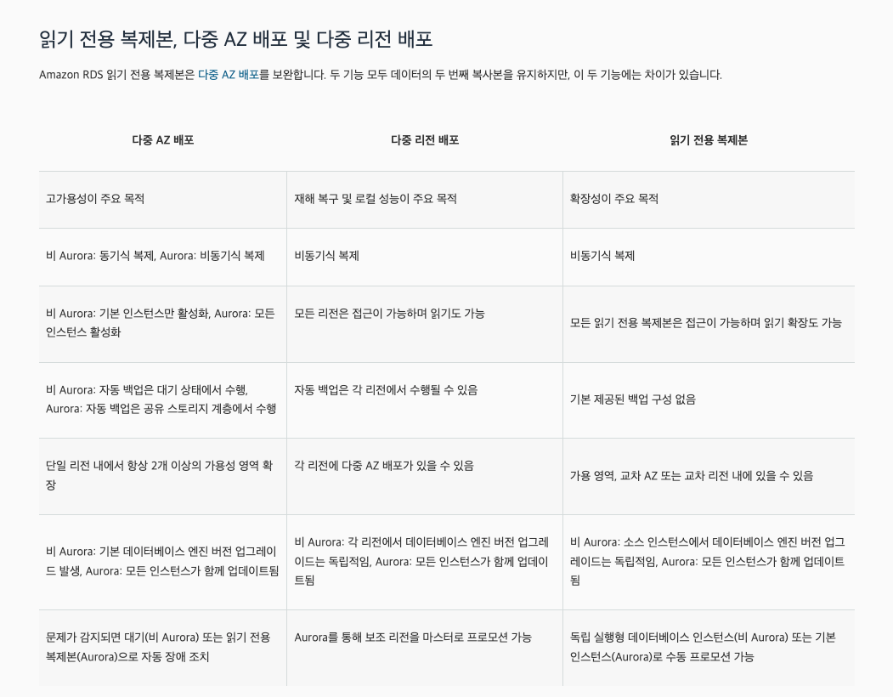

퀴즈 1:질문 1:다음 중 IAM 역할의 올바른 정의는 무엇일까요?
- [ ]  다수의 사용자 그룹 내 IAM 사용자
- [ ]  IAM 사용자에 대한 암호 정책을 정의하는 IAM 엔터티
- [ ]  AWS 서비스에 요청하기 위한 권한 집합을 정의하고 AWS 서비스에서 사용할 IAM 엔터티 v
- [ ]  특정 작업을 수행하기 위해 IAM 사용자에게 할당된 권한
```
IAM 사용자는 여러 사용자 그룹에 속할 수 있지만 IAM 역할의 정의는 아닙니다.
IAM 역할은 암호 정책이 아닙니다.
일부 AWS 서비스는 사용자를 대신하여 작업을 수행해야 하며 IAM 역할을 사용하여 AWS 서비스에 권한을 할당합니다.
IAM 역할을 IAM 사용자에게 할당할 수 없습니다.
```

퀴즈 6:질문 13:다음 중 RDS 읽기 전용 복제본과 다중 AZ의 복제에 대한 설명으로 옳지 않은 것은 무엇일까요?
- [ ]  읽기 전용 복제본은 비동기식 복제를 사용하고 다중 AZ는 비동기식 복제를 사용합니다.
- [ ]  읽기 전용 복제본은 비동기식 복제를 사용하고 다중 AZ는 동기식 복제를 사용합니다. ??
- [ ]  읽기 전용 복제본은 동기식 복제를 사용하고 다중 AZ는 동기식 복제를 사용합니다.
- [ ]  읽기 전용 복제본은 동기식 복제를 사용하고 다중 AZ는 비동기식 복제를 사용합니다.
```
읽기 전용 복제본을 생성할 때 먼저 기존 DB 인스턴스를 원본으로 지정합니다. 
그런 다음 Amazon RDS는 소스 인스턴스의 스냅샷을 만들고 스냅샷에서 읽기 전용 인스턴스를 생성합니다. 
그런 다음 Amazon RDS는 DB 엔진에 대한 비동기 복제 방법을 사용하여 기본 DB 인스턴스에 변경 사항이 있을 때마다 읽기 전용 복제본을 업데이트합니다. 
읽기 전용 복제본은 읽기 전용 연결만 허용하는 DB 인스턴스로 작동합니다.
```




퀴즈 7:질문 6:여러분은 GoDaddy에서 도메인을 구매했으며 Route 53을 DNS 서비스 공급자로 사용하려고 합니다. 이 작업을 수행하려면 어떻게 해야 할까요?
- [ ]  도메인 이전 요청
- [ ]  프라이빗 호스팅 영역 생성 및 타사 레지스트라 NS 레코드 업데이트
- [ ]  퍼블릭 호스팅 영역 생성 및 Route 53 NS 레코드 업데이트
- [ ]  퍼블릭 호스팅 영역 생성 및 타사 레지스트라 NS 레코드 업데이트 v
```
프라이빗 호스팅 영역은 내부 네트워크(예: VPC) DNS 쿼리에 사용되며 공개적으로 액세스할 수 없습니다.
공개 호스팅 영역은 인터넷을 통해 여러분의 웹사이트를 요청하는 사람들을 위해 사용됩니다. 마지막으로, NS 레코드는 타사 레지스트라에서 업데이트되어야 합니다.
```