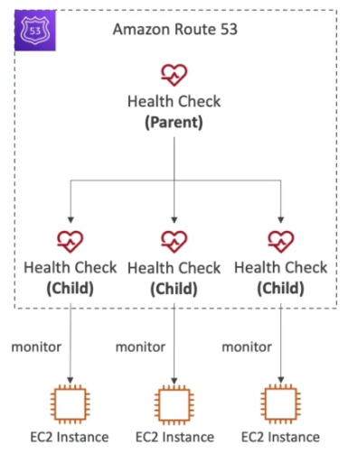

# Quiz1: IAM 및 AWS CLI 퀴즈
## Question 2:
다음 중 IAM 보안 도구는 무엇일까요
- (정답) IAM 자격 증명 보고서
- IAM Root Account Manager
- IAM Services Report
- IAM Security Advisor
```markdown
# IAM Security Tools
## IAM Credential Report (account-level)
- 자격 증명 보고서
- 계정 내 사용자 목록과 모든 자격증명의 상태에 대한 보고서  
## IAM Access Advisor (user-level)
- 액세스 관리자
- 사용자에게 부여된 서비스 권한과 마지막으로 접근한 날짜를 보여줌
- 정책 수정시 참고 자료로 활용 가능 
```

## Question 10:
AWS Shared Responsibility Model에 따르면 다음 중 AWS의 책임은 무엇일까요?
- IAM 사용자, 사용자 그룹 및 IAM 정책들
- (정답) AWS Infrastructure
- 루트 계정 및 모든 IAM 사용자에 대한 MFA 활성화
- IAM 사용자들의 액세스 키 교체
```markdown
# 해설
- AWS 인프라 자체의 문제에 대해서만 AWS가 책임을 진다.
# 공동책임모델 (Shared Responsibility Model)
- 퍼블릭 클라우드 사용 시 장애나 보안사고 등의 피해가 발생했을 때, AWS가 책임져야 할 부분과 고객이 책임져야 하는 부분을 나누어 놓은 모델
- https://aws.amazon.com/ko/compliance/shared-responsibility-model/
```
- IAM에서의 공동책임모델

 
# Quiz6: RDS, Aurora 및 ElastiCache 퀴즈
## Question 5:
어떤 RDS(NOT Aurora) 기능을 사용할 때 SQL 연결 문자열을 변경할 필요가 없습니까?
- (정답) 다중 AZ
- 복제본 읽기
```markdown
- 복제본을 사용하는 경우 SQL 연결 문자열(connection string)이 달라질 수 있음
- 다중 AZ(multi AZ) 기능에서는 하나의 DNS을 공유하기 때문에 연결 문자열을 수정할 필요 없음
```

## Question 8:
기본 AWS 리전에 재해가 발생하는 경우 다른 AWS 리전에서 데이터베이스 복제본을 사용할 수 있도록 하고 싶습니다. 이것을 쉽게 구현하려면 어떤 데이터베이스를 권장해야 할까요?
- RDS 읽기 전용 복제본
- RDS 다중 AZ
- Aurora 읽기 전용 복제본
- (정답) Aurora 글로벌 데이터베이스
```markdown
- 키워드: 다른 AWS 리전

# Global Aurora
## Aurora Cross Region Read Replicas (리전 간 읽기전용 복제본)
- Useful for disaster recovery
- Simple to put in place (쉬운 구성) 

## Aurora Global Database
- 1 Primary Region (read / write)
- Up to 5 secondary (read-only) regions, replication lag is
less than 1 second
- Up to 16 Read Replicas per secondary region
- Helps for decreasing latency
- Promoting another region (for disaster recovery) has an
RTO(Recovery Time Objective, 복구시간목표) < 1 min
```


## Question 9:
사용자가 연결할 때 암호를 입력하도록 하여 ElastiCache Redis 클러스터의 보안을 강화할 수 있는 방법은 무엇일까요?
- (정답) Redis 인증 사용
- IAM 인증 사용
- 보안 그룹
```markdown
# ElastiCache 보안
## 모든 ElastiCache
- ElastiCache는 IAM 인증을 지원하지 않음 (IAM 인증은 AWS API 레벨의 보안만 지원) 
## Redis 인증
  - 레디스 클러스터 생성시 password/token 발급
  - 보안그룹에 추가로 보안을 강화하는 방법
  - SSL 암호화 지원
## Memcahed
- SASL(Simple Authentication and Security Layer) 인증 지원 (고급)
- 간단하게 어플리케이션 프로토콜들로 부터 인증 처리를 위한 별도의 층(Layer)을 분리하고 그 층에서 인증을 처리하는 방식
```

## Question 11:
여러분은 RDS PostgreSQL 데이터베이스에 대한 재해 복구 전략을 생성하여 지역 중단 시 다른 AWS 지역의 읽기 및 쓰기 워크로드 모두에 대해 데이터베이스를 신속하게 사용할 수 있도록 하려고 합니다. DR 데이터베이스는 고가용성이어야 합니다. 다음 중 무엇을 사용해야 할까요?
- 동일한 지역에 읽기 전용 복제본을 생성하고 기본 데이터베이스에서 다중 AZ를 활성화합니다.
- (정답) 다른 리전에서 읽기 전용 복제본 생성 및 읽기 전용 복제본에서 다중 AZ 활성화
- 동일한 리전에서 읽기 전용 복제본 생성 및 읽기 전용 복제본에서 다중 AZ 활성화
- 기본 데이터베이스에서 다중 지역 옵션 활성화
```markdown
- 키워드: 재해 복구, 지역 중단, 고가용성
- 지역(리전)을 넘어서는 고가용성을 구성해야 함
- RDS의 읽기 전용 복제본 생성은 Cross AZ, Cross Region 모두 가능 
```

## Question 15:
RDS 데이터베이스의 경우 최대 .............개의 읽기 복제본을 가질 수 있습니다.
- (정답) 5
```
RDS 읽기 복게본은 최대 5개까지 가질 수 있음
```

## Question 18:
프로덕션에서 실행 중인 애플리케이션이 Aurora 클러스터를 데이터베이스로 사용하고 있습니다. 개발 팀은 필요에 따라 과중한 작업을 수행할 수 있는 애플리케이션 버전을 축소된 애플리케이션에서 실행하려고 합니다. 대부분의 경우 애플리케이션은 사용되지 않을 것입니다. CIO는 여러분에게 팀이 비용을 최소화하면서 이를 달성할 수 있도록 지원하는 임무를 부여했습니다. 팀에 무엇을 제안하시겠습니까?
- Aurora 글로벌 데이터베이스 사용
- RDS 데이터베이스 사용
- (정답) Aurora 서버리스 사용
- EC2에서 Aurora를 실행하고 밤에 EC2 인스턴스를 종료하는 스크립트 작성
```markdown
- 키워드: 대부분의 경우 애플리케이션은 사용되지 않을 것입니다. 비용을 최소화.

# Aurora Serverless
- 자동화된 구성 및 사용량에 따라서 오토스케일링
- 빈도가 낮고 주기적이지 않은 작업에 적합
- 용량/사양 산정이 따로 필요없음
- 초당 과금 (비용효율적)
```

## Question 19:
단일 Aurora DB 클러스터에 몇 개의 Aurora 읽기 전용 복제본을 보유할 수 있을까요?
- 15
```markdown
# Aurora High Availability and Read Scaling
- 6 copies of data acrross 3 AZ
- 1 master (can write)
- automated failover for master < 30s
- up to  15 read replicase
- cross regions replication   
```


## Question 21:
여러분은 게임 회사의 솔루션 아키텍트로 일하고 있습니다. 게임 중 하나는 점수에 따라 실시간으로 플레이어에게 순위를 매깁니다. 여러분의 상사는 게임 리더보드를 만들기 위해 효과적이고 가용성이 높은 솔루션을 설계한 다음 구현하도록 요청했습니다. 여러분은 무엇을 사용하시겠습니까?
- MySQL RDS
- Amazon Aurora
- Memcached ElasticCache
- (정답) Redis ElastiCache - Sorted Set
```markdown
- 점수에 따라 실시간으로 순위를 매김 -> 유일성과 정렬 모두 필요

# Redis Sorted Set
- 유일성과 정렬까지 보장
- https://meetup.toast.com/posts/224
```


# Quiz7: Route53 퀴즈
## Question 1:
Amazon Route 53 Registrar에서 mycoolcompany.com을 구매했으며 도메인이 Elastic Load Balancer my-elb-1234567890.us-west-2.elb.amazonaws.com을 가리키도록 하고 싶습니다. 여기서 사용해야 하는 Route 53 레코드 유형은 무엇일까요?
- Alias
```
# CNAME (Canonical Name)
- hostname -> other hostname (ex. app.mydomain.com -> blabla.anything.com)
- 비 최상위(non root) 도메인에서만 가능 (ex. something.mydomain.com)

# Alias (Alias Record)
- hostname -> AWS resource (app.mydomain.com -> blabla.amazonaws.com)
- 최상위(root) 도메인, 비 최상위(not root) 도메인 모두 가능 (ex. somthing.mydomain.com , mydomain.com)
- 무료
- 헬스체크 제공
- 자동으로 리소스의 IP 변화 감지
- 종류는 A(IPv4) 혹은 AAAA(IPv6)
- (참고) Zone Apex: 루트 도메인, 네이키드 도메인(Naked Domain). 이름 그대로 서브 도메인이 붙지 않은 상태
- TTL 설정 불가

# Alias Record 대상
- ELB
- CloudFront Distributions
- API Gateway
- Elastic Beanstalk 환경
- S3 웹사이트
- VPC Interface Endpoint
- Global Accelarator
- Route53 Record
- (불가) EC2 DNS name
```

## Question 4:
여러분은 두 개의 서로 다른 AWS 리전 us-west-1 및 eu-west-2에서 호스팅되는 애플리케이션이 있습니다. 애플리케이션 서버에서 사용자에 대한 응답 시간을 최소화하여 사용자가 최상의 사용자 경험을 얻을 수 있기를 바랍니다. 어떤 Route 53 라우팅 정책을 선택해야 할까요?
- 대기 시간
```
# 대기시간(Latency) 기반 라우팅 정책
- 대기시간이 가장 짧은 리소스로 리다이렉트
- 사용자와 AWS 리전 간 대기시간 트래픽 기반
- ex) 대기시간이 짧다면 독일 사용자가 -> 미국 리전으로 리다이렉팅 가능
```

## Question 6:
여러분은 GoDaddy에서 도메인을 구매했으며 Route 53을 DNS 서비스 공급자로 사용하려고 합니다. 이 작업을 수행하려면 어떻게 해야 할까요?
- 퍼블릭 호스팅 영역 생성 및 타사 레지스트라 NS 레코드 업데이트
```markdown
# Domain name registrar(도메인 네임 등록 대행사) vs. DNS Service
- https://ko.wikipedia.org/wiki/%EB%8F%84%EB%A9%94%EC%9D%B8_%EB%84%A4%EC%9E%84_%EB%93%B1%EB%A1%9D_%EB%8C%80%ED%96%89%EC%9E%90
- 보통 도메인 네임 등록 대행사는 DNS 관리 서비스까지 제공 
- 그러나 다른 DNS 서비스를 통해 DNS 레코드 관리 가능
- ex) GoDaddy에서 도메인을 구입하고 Route53으로 DNS 레코드 관리
- 이를 위해서는 도메인 네임 등록 대행사의 네임서버에 Route53 네임서버 등록 필요

# 써드파티 도메인 네임 등록 대행사와 AWS Route53
1. Hosted Zone 생성
2. 써드파티 대행사의 NS 레코드를 Route53 NS 레코드로 등록
 ```

## Question 7:
다음 중 올바르지 않은 Route 53 상태 확인은 무엇일까요?
- (정답) SQS Queues을 모니터링하는 상태 확인
- Endpoint를 모니터링하는 상태 확인
- 다른 상태 확인을 모니터링하는 상태 확인
- CloudWatch 경보를 모니터링하는 상태 확인
```markdown
# 해설
- Route53은 SQS Queues를 직접 모니터링하는 상태 확인을 할 수 없고 CloudWatch 경보를 사용하여 상태 확인을 해야 함

# Route53 Health Checks
- HTTP Health Check는 퍼블릭 리소스만 가능  
- 자동화된 DNS 장애회복 목적 (for Automated DNS Failover)
- 종류
  1. 엔드포인트: AWS 리소스
  2. 다른 health check(calculated health checks): 다른 health check 를 OR, AND, NOT으로 조합하여 계산 가능 
  3. CloudWatch Alarms: ex. DB관련 메트릭으로 private endpoint health check 가능)
- healthcheck와 CW metric는 연계 가능
```
- Endpoint를 모니터링하는 상태 확인
<br>
- 다른 상태 확인을 모니터링하는 상태 확인 (calculated health checks)
<br>
- CloudWatch 경보를 모니터링하는 상태 확인 (Private Hosted Zones/Endpoints)
<br>