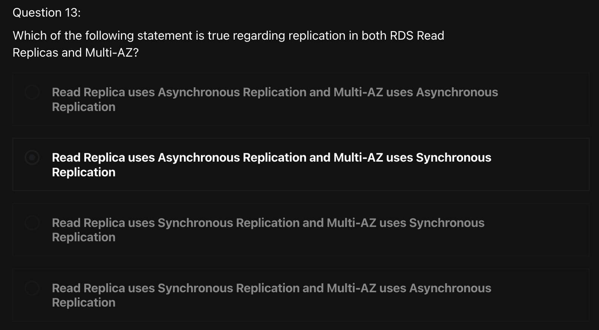
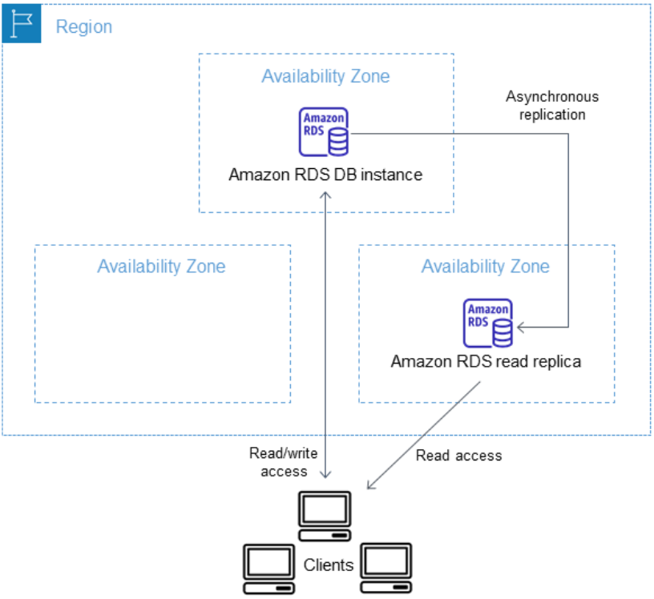
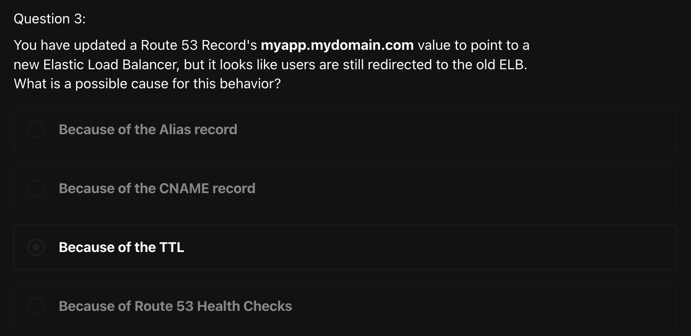
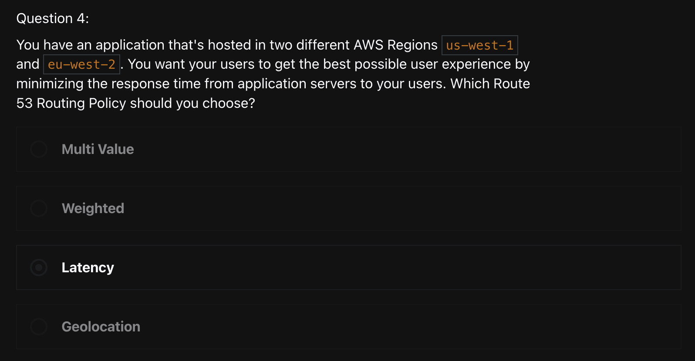

# Quiz
> [Udemy AWS SAA 강의](https://www.udemy.com/course/best-aws-certified-solutions-architect-associate/) Quiz 1,6,7를 풀고, 어려운 문제 3개를 선정하여 해설을 제출하기

<br>

### 1) 



```
답: 2번
```

- `Read Replica`
  - Amazon RDS는 DB 엔진의 기본 복제 기능을 사용하여 원본 DB 인스턴스의 `Read Replica` 라고 하는 특수한 유형의 DB 인스턴스를 생성할 수 있다
  - 원본 DB 인스턴스가 Primary DB 인스턴스가 된다
  - Primary DB 인스턴스에 적용된 업데이트는 Read Replica에 **비동기식**으로 복사된다
  - 애플리케이션에서 Read query를 Read Replica로 라우팅하여 Primary DB 인스턴스의 로드를 줄일 수 있다
- `Multi-AZ 배포`
  - Multi AZ 배포에는 standby DB 인스턴스가 하나 또는 두개 있을 수 있다
  - 배포 시 하나의 standby DB 인스턴스가 있는 경우를 `Multi-AZ DB 인스턴스 배포` 라고 한다
    - Multi-AZ DB 인스턴스 배포에는 **failover 지원**을 제공하지만, 읽기 트래픽은 처리하지 않는다
  - 배포에 두 개의 대기 DB 인스턴스가 있는 경우를 `Multi-AZ DB 클러스터 배포`라고 한다
    - Multi-AZ DB 클러스터 배포에는 **failover 지원**을 제공하고, 읽기 트래픽도 처리할 수 있는 standby 인스턴스가 있다
- `Multi-AZ DB 인스턴스 배포와 Multi-AZ DB 클러스터 배포`
  - **Multi-AZ DB 인스턴스 배포**
    - DB 인스턴스에는 row가 하나만 있다
    - 역할(Role) 값은 인스턴스(Instance) 또는 기본(Primary)이다
    - 다중 AZ(Multi-AZ) 값은 예(Yes)이다
  - **Multi-AZ DB 클러스터 배포**
    - 클러스터 수준 row에는 3개의 DB 인스턴스 row이 있다
    - 클러스터 수준 row의 경우 role 값은 Multi-AZ DB cluster 이다
    - 각 인스턴스 수준 row에서 role 값은 Writer instance 또는 Reader instance이다
    - 각 인스턴스 수준 row에서 Multi-AZ 값은 3 Zones 이다


<br>

### 2) 



```
답: 3번
```

#### Route 53
- `Value/Route traffic to`
  > CNAME을 제외한 모든 routing policy는 둘 이상의 값을 입력할 수 있다
  - A – IPv4 주소
  - AAAA - IPv6 주소
  - CAA - 인증 기관 인증
  - CNAME – 정식 이름
  - MX - 메일 교환
  - NAPTR - 이름 권한 포인터
  - NS - 이름 서버
    - 이름 서버의 도메인 이름(예: ns1.example.com)
  - PTR - 포인터
  - SPF - 발신자 정책 프레임워크
  - SRV - 서비스 로케이터
  - TXT - 텍스트
- `TTL`
  > DNS recursive resolver가 해당 record에 대한 정보를 caching할 시간(초)를 의미한다

<br>

### 3) 



```
답: 3번
```

#### Routing Policy
> Record를 생성할 때 routing policy를 선택하게 되는데, 이것으로 Amazon Route 53이 쿼리에 응답하는 방식을 결정한다
- `단순 라우팅 정책(Simple routing policy)`
  - 도메인에 대해 특정 기능을 수행하는 하나의 리소스만 있는 경우
  - ex) example.com 웹 사이트의 콘텐츠를 제공하는 하나의 웹 서버)에 사용
- `장애 조치 라우팅 정책(Failover routing policy)`
  - 액티브-패시브 장애 조치를 구성하려는 경우에 사용
- `지리 위치 라우팅 정책(Geolocation routing policy)`
  - **사용자의 위치에 기반**하여 트래픽을 라우팅하려는 경우에 사용
- `지리 근접 라우팅 정책(Geoproximity routing policy)`
  - 리소스의 위치를 기반으로 트래픽을 라우팅하고 필요에 따라 한 위치의 리소스에서 다른 위치의 리소스로 트래픽을 보내려는 경우에 사용
- `지연 시간 라우팅 정책(Latency routing policy)`
  - 여러 AWS 리전에 리소스가 있고 왕복 시간이 적은 최상의 지연 시간을 제공하는 리전으로 트래픽을 라우팅하려는 경우에 사용
- `다중 응답 라우팅 정책(Multivalue answer routing policy)`
  - Route 53이 DNS 쿼리에 무작위로 선택된 최대 8개의 healthy 레코드로 응답하게 하려는 경우에 사용
- `가중치 기반 라우팅 정책(Weighted routing policy)`
  - 사용자가 지정하는 비율에 따라 여러 리소스로 트래픽을 라우팅하려는 경우에 사용