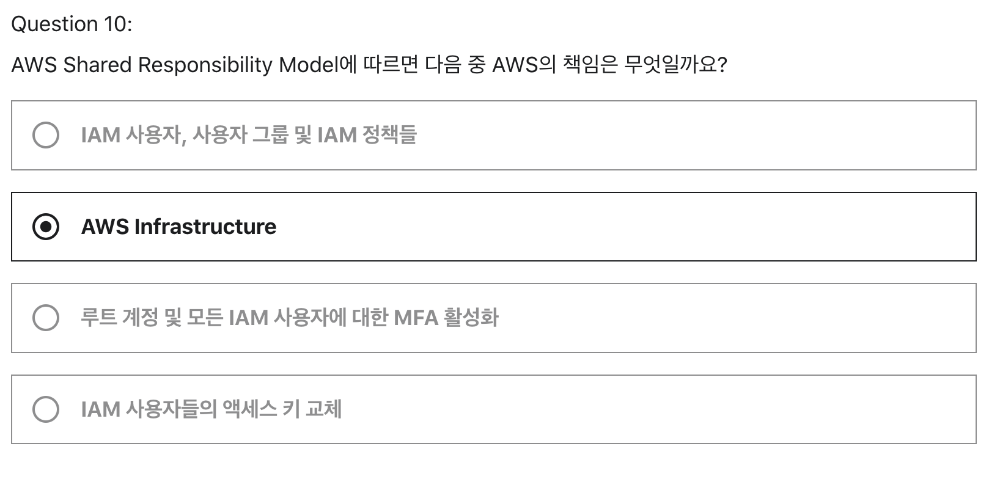
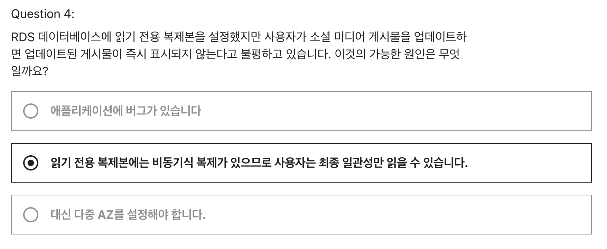
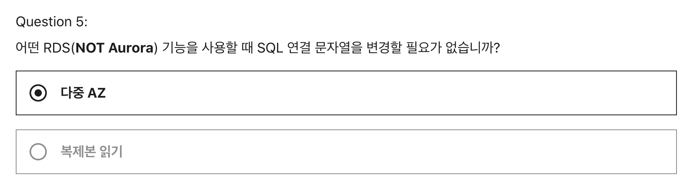

# W6 과제
## 1. Section4 - Quiz 1 - Question 10

- [AWS Shared Responsibility Model Docs](https://aws.amazon.com/ko/compliance/shared-responsibility-model/)
- 위 문서에 따르면 고객과 AWS의 책임을 확인할 수 있다.
- AWS의 책임
  - 호스트 운영 체제, 스토리지, 데이터베이스 등
  - 리젼, AZ 등
  - 가상화 계층에서 서비스가 운영되는 시설의 물리적 보안
  - `AWS 클라우드에서 제공되는 모든 서비스를 실행하는 인프라를 보호할 책임`
- 고객의 책임
  - 게스트 운영 체제(업데이트 및 보안 패치 포함)
  - 애플리케이션 소프트웨어 또는 유틸리티의 관리
  - 인스턴스별로 AWS에서 제공한 방화벽(보안 그룹)의 구성 관리
  - 데이터 관리(암호화 옵션 포함), 적절한 권한을 부여하는 IAM 도구 사용에 책임

 
 

## 2. Section 9 - Quiz 6 - Question 4

- 비동기 복제 -> 데이터가 아직 복제되지 않았다? -> **데이터 복제 지연 문제가 있다.**
- [Amazon RDS for MySQL을 사용하여 긴 복제 지연 문제를 해결하려면 어떻게 해야 합니까?](https://aws.amazon.com/ko/premiumsupport/knowledge-center/rds-mysql-high-replica-lag/)

 

- MySQL 복제 지연이 발생한다?
  - 읽기 전용 복제본에 비동기 복제 동기화 작업은 Binlog Dump 스레드, IO_THREAD 및 **SQL_THREAD**의 세 가지 스레드로 작동
  - 디비 병목은 보통 디스트 I/O에서 많이 발생하기 때문에 복제가 지연되면 복제본 IO_THREAD 또는 복제본 SQL_THREAD를 확인하라고 함
  - SQL Thread는 Relay Log(원본 데이터를 가져와서 바이너리로 저장하는 곳)에 기록된 변경 데이터를 읽어서 스토리지 엔진에 적용
  
 

- 복제 지연 문제가 발생할 경우 확인하는 방법
  - Amazon RDS for MySQL을 사용하는 경우 복제 지연을 모니터링할 수 있다.
  - Amazon CloudWatch에서 Amazon RDS에 대한 **ReplicaLag** 지표를 확인

 

- 복제 지연 이유
1. Long Query
2. 하드웨어 이슈 (스토리지 부족)
3. Write 쿼리량 증가 (데이터 사이즈 증가)
  - 서비스 사용량 증가로 인해 write 쿼리가 증가하여 복제해야하는 양이 많아지면서 지연이 발생
4. Lock 이슈
  - 슬레이브에서 락이 걸린 상황, 자주 수정되는 테이블의 경우, 쿼리 캐시를 사용하면 캐시가 자주 잠기고 새로 고쳐지기 때문에 복제 지연이 늘어날 수 있다고 함.
5. 복제본 생성 지연
  - 슬레이브에서 실행되는 서비스 read 트래픽, 배치 쿼리 또는 백업으로 인해 슬레이브 사용량이 증가하면서 평소보다 처리 성능이 지연
6. 기본 DB 인스턴스에서 실행된 병렬 쿼리

 

- 해결 방법
  - [읽기 전용 복제본 지연 해결 공식 문서](https://docs.aws.amazon.com/ko_kr/AmazonRDS/latest/UserGuide/CHAP_Troubleshooting.html#CHAP_Troubleshooting.MySQL.ReplicaLag)

 
 

## 3. Section 9 - Quiz 6 - Question 5

- 해설 : 다중 AZ는 어떤 데이터베이스가 작동 중인지에 관계없이 동일한 연결 문자열을 유지합니다.
- 강의에서 하나의 DNS 이름을 갖는다고 설명하긴 했는데 마스터 디비에 장애가 발생하면 StandBy DB에 대해 자동으로 장애 조치를 수행하기 위해 하나의 DNS 이름을 갖는다고 이해했다. 
- 동일한 Connection String을 제공하는지는 처음 알았다.
- 좀 더 찾아보니 Connection String 파라미터는 다음과 같다.
  - [연결 문자열에는 호스트 파라미터로 DB 인스턴스 엔드포인트의 `DNS 주소`와 `포트` 파라미터를 지정한다.](https://docs.aws.amazon.com/ko_kr/AmazonRDS/latest/UserGuide/CHAP_GettingStarted.CreatingConnecting.MySQL.html)