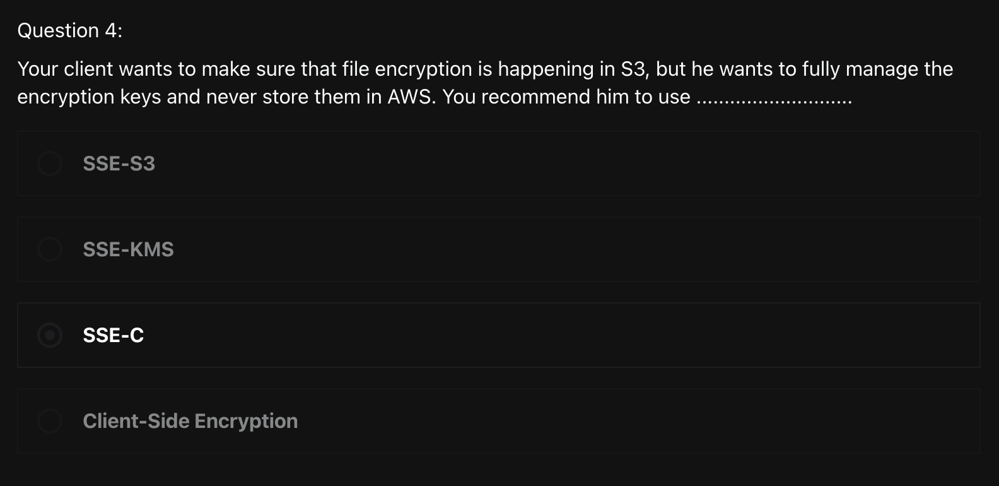
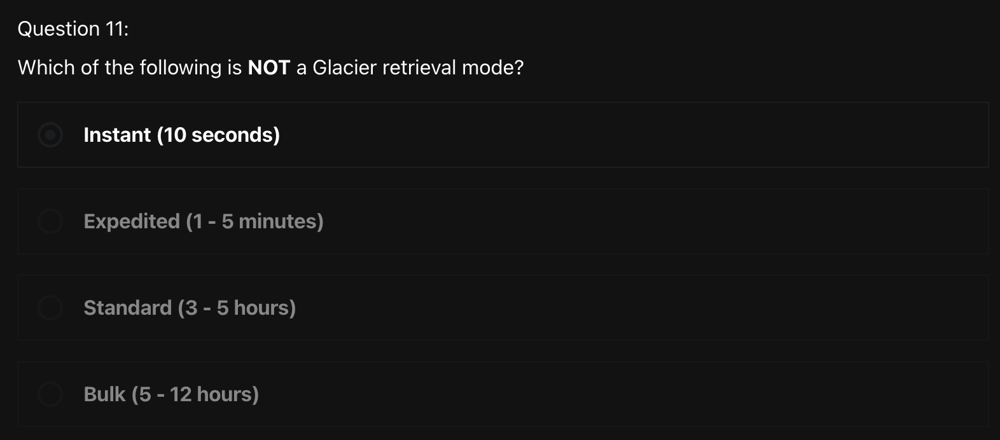

# Quiz
> [Udemy AWS SAA 강의](https://www.udemy.com/course/best-aws-certified-solutions-architect-associate/) Quiz 8, 9, 10, 11 을 풀고, 어려운 문제를 선정하여 해설을 제출하기

<br>

## Quiz 8. 클래식 솔루션 아키텍처 토론 퀴즈 (6문제)
N/A

<br>

## Quiz 9. Amazon S3 퀴즈 (8문제)

### Q4)



```
답: 3번
```

#### [SSE-C](https://docs.aws.amazon.com/ko_kr/AmazonS3/latest/userguide/ServerSideEncryptionCustomerKeys.html)
- 고객 제공 암호화 키(SSE-C)로 `서버 측 암호화`를 사용하여 자체 암호화 키를 설정할 수 있다
- Amazon S3는 디스크에 쓸 때 `암호화`를 관리하고 객체에 액세스할 때 `암호 해독`을 관리합니다. 따라서 데이터 암호화 및 암호 해독을 수행하기 위해 어떠한 코드도 사용할 필요가 없으며, 제공한 암호화 키를 관리하기만 하면 된다
- 객체를 업로드하면 Amazon S3는 제공된 암호화 키를 사용하여 `AES-256 암호화`를 데이터에 적용하고 메모리에서 암호화 키를 삭제한다
  - 객체를 검색할 경우 요청에 포함된 것과 동일한 암호화 키를 제공해야 한다

<br>

## Quiz 10. AWS IAM, CLI 및 SDK 퀴즈 (3문제)

N/A

<br>

## Quiz 11. Amazon S3 고급 및 Athena 퀴즈 (18문제)

### Q11)



```
답: 1번
```

#### [Retrieving S3 Glacier Archives](https://docs.aws.amazon.com/ko_kr/amazonglacier/latest/dev/downloading-an-archive-two-steps.html)
> Amazon S3 Glacier에서 아카이브를 가져오는 작업은 `비동기식` 작업이다
- S3 Glacier에서 아카이브를 가져오는 작업은 2단계 프로세스로 구성된다
  1. 아카이브 가져오기 작업 시작하기
    - 원하는 아카이브의 ID 가져오기
      - 아카이브 ID는 vault에서 가져올 수 있다
    - [Initiate Job (POST jobs)](https://docs.aws.amazon.com/amazonglacier/latest/dev/api-initiate-job-post.html) 를 사용하여 가져오고자 하는 전체 아카이브를 준비하도록 요청하는 job을 실행하기
    - 작업을 시작하면 S3 Glacier가 응답으로 작업 ID를 반환하고 비동기식으로 작업을 실행한다
  2. 1의 작업이 완료된 후, [작업 출력 가져오기(GET output)](https://docs.aws.amazon.com/ko_kr/amazonglacier/latest/dev/api-job-output-get.html) 작업을 사용하여 바이트를 다운로드
- 아카이브 검색 옵션
  - `Expedited`
    - 일부 아카이브의 하위 집합을 긴급하게 요청해야 하는 경우 S3 Glacier Flexible Retrieval 스토리지 클래스 또는 S3 Intelligent-Tiering Archive Access 계층에 저장된 데이터에 신속하게 액세스할 수 있다
    - 매우 큰 아카이브(250MB+)를 제외한 모든 경우, 신속 가져오기를 사용하여 액세스된 데이터는 일반적으로 `1~5분` 안에 사용할 수 있게된다
  - `Standard`
    - 표준 검색은 보통 `3~5시간` 안에 완료된다
  - `Bulk`
    - 대량 가져오기는 S3 Glacier에서 가장 저렴한 가져오기 옵션으로, 페타바이트 규모의 대용량 데이터를 하루 동안 가져올 때 사용할 수 있다
    - 벌크 검색은 보통 `5~12시간` 안에 완료된다