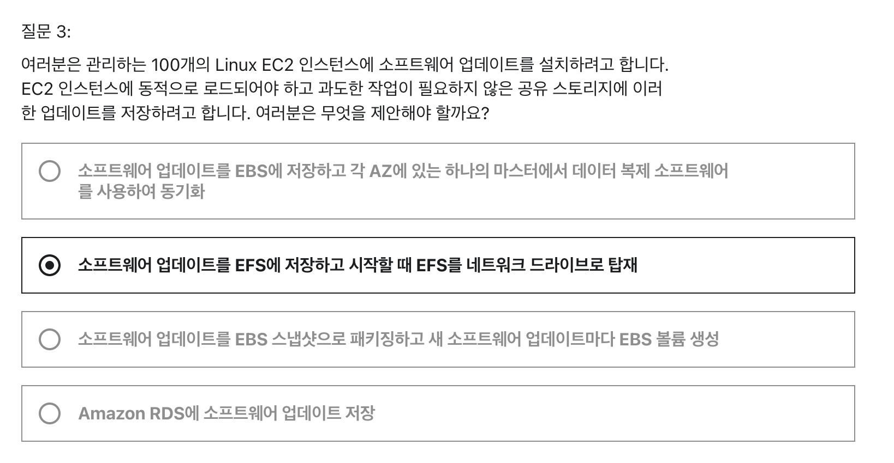
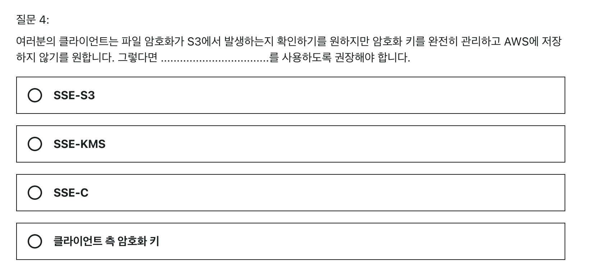
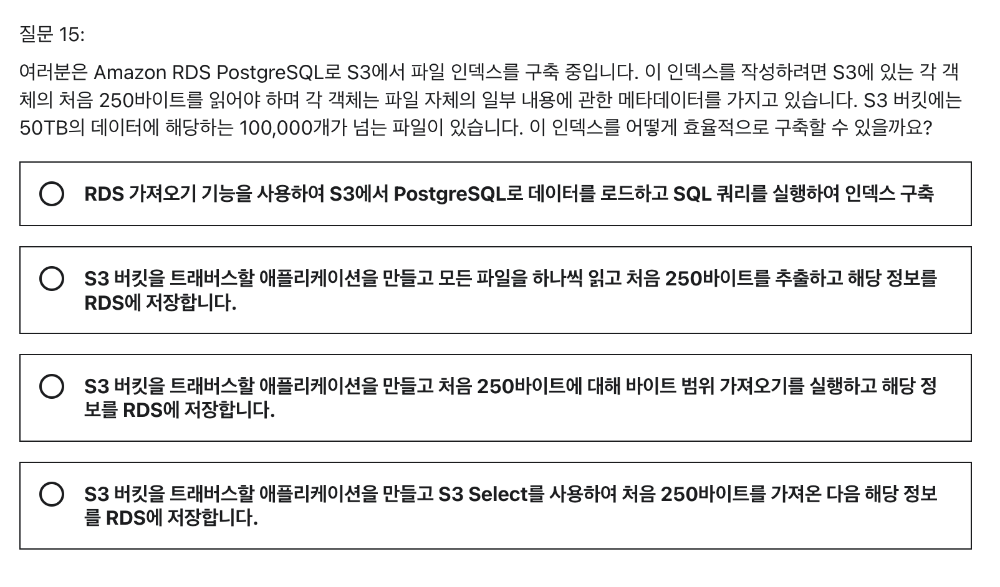

```
7주차 과제

Quiz 8. 클래식 솔루션 아키텍처 토론 퀴즈 (6문제)
Quiz 9. Amazon S3 퀴즈 (8문제)
Quiz 10. AWS IAM, CLI 및 SDK 퀴즈 (3문제)
Quiz 11. Amazon S3 고급 및 Athena 퀴즈 (18문제)
```




[오답]

소프트웨어 업데이트를 EBS 에 저장하고 각 AZ에 있는 하나의 마스터에서 데이터 복제 소프트웨어를 사용하여 동기화 -> AZ 가 따로 있다는 말도 없고, 데이터 복제 소프트웨어는 AWS 서비스가 아니다. -> 모든 EBS 에 복제하는건 엄청 무거운 일이다.
소프트웨어 업데이트를 EBS 스냅샷으로 패키징하고 새 소프트웨어 업데이트마다 EBS 볼륨 생성 -> EBS 볼륨은 인스턴스당 생성되는것. 인스턴스가 100개면 100번 해야한다.
Amazon RDS에 소프트웨어 업데이트 저장 -> RDS 에는 업데이트를 저장하지 못한다.
[정답] 4. 소프트웨어 업데이트를 EFS에 저장하고 시작할 때 EFS를 네트워크 드라이브로 탑재

EFS : eleastic file system

-> EBS 가 인스턴스당 할당되는 것에 반해 EFS 는 여러 인스턴스에 마운트될 수 있다.

서로 다른 인스턴스에서 보안그룹을 통해 네트워크로 연결된다.
최대 1000 개의 Network Client 와 연결가능
EBS 보다 비싸고, 사용 용량만큼 지불한다.
NFSv4.1 프로토콜을 사용





