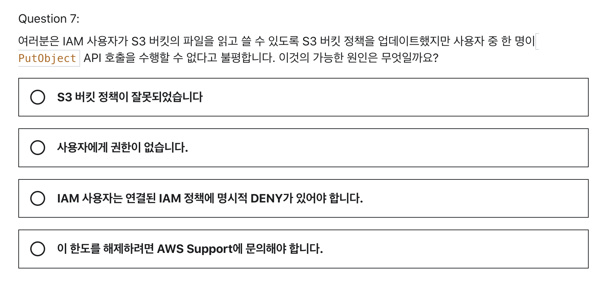
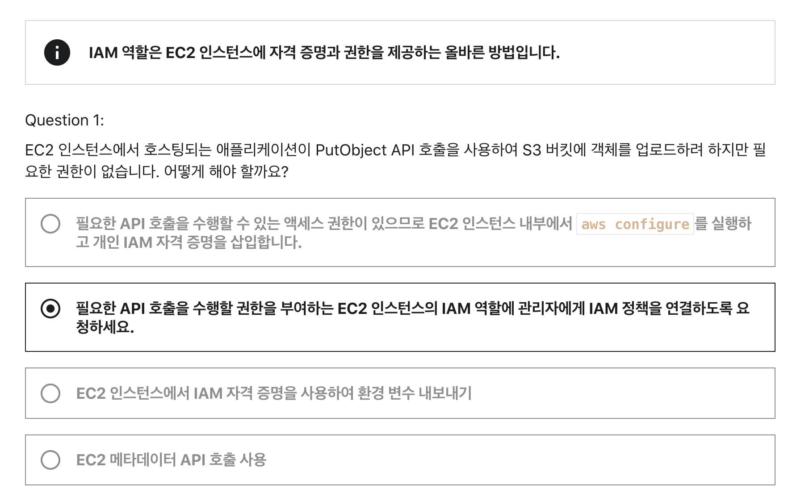
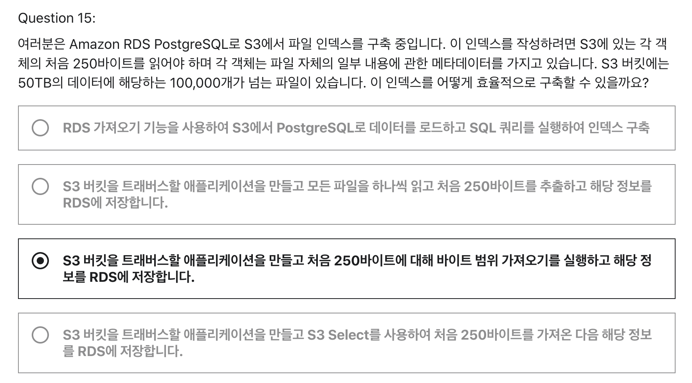
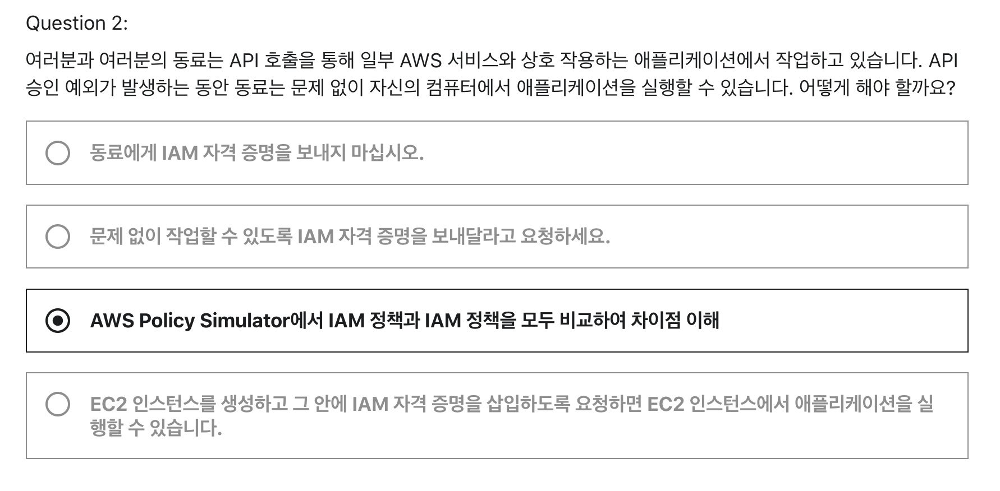

# W7 과제
## 1. Section12 - Question9

- 강의에서 이해한 내용은 다음과 같다.
- 사용자가 IAM 정책을 통해 S3 버킷에 엑세스할 수 있더라도 버킷 정책이 사용자 엑세스를 명시적으로 거부한다면 엑세스가 불가능하다.
- 해서 버킷 정책 > IAM 정책 으로 이해했는데
- 문제 해설을 보니까 IAM 정책의 명시적 DENY는 S3 버킷 정책보다 우선시 한다고 하여 잘못 알고 있는 내용이라 복기하고자 선택

 

## 2. Secion13 - Quiz 10 - Question 1

- 역할을 사용하여 일반적으로 AWS 리소스에 액세스할 수 없는 사용자, 애플리케이션 또는 서비스에 액세스 권한을 위임할 수 있습니다.
  - [Amazon EC2의 자격 증명 및 액세스 관리](https://docs.aws.amazon.com/ko_kr/AWSEC2/latest/UserGuide/security-iam.html)
  - Amazon EC2 및 AWS Identity and Access Management(IAM)의 기능을 사용하면 보안 자격 증명을 공유하지 않고도 다른 사용자, 서비스 및 애플리케이션에 Amazon EC2 리소스 사용을 허가할 수 있습니다. 
  - IAM을 사용하여 다른 사용자가 AWS 계정의 리소스를 사용하는 방법을 제어
- ec2 강의 실습 때 생성시 역할 부여만 했었는데, 실행되는 EC2 인스턴스에 역할 부여도 가능

 

## 3. Section 14 - Quiz 11 - Question 15

- 이 문제의 포인트
  - S3에 있는 객체의 처음 250바이트를 읽어야함
  - 이 첫 250바이트는 메타 데이터를 가지고 있음
  - 용량 큰 파일들을 인덱스 구축해야함.
- 트래버스란? 
  - 레일 방향으로 일정한 간격으로 배치되는 부품
  - 즉 일정한 크기로 GET 요청을 하는 어플리케이션으로 이해
- [바이트 범위 가져오기 사용](https://docs.aws.amazon.com/ko_kr/AmazonS3/latest/userguide/optimizing-performance-guidelines.html#optimizing-performance-guidelines-get-range)
  - GET Object 요청에서 Range HTTP 헤더를 사용하면 객체에서 바이트 범위를 가져와 지정된 부분만 전송할 수 있습니다.
- 객체의 metadata는 response header에 반환된다.
  - S3 고유의 메타데이터(x-amz-로 시작, x-amz-meta-은 사용자가 정의할 수 있는 메타데이터를 의미)

 

## Question 1
- Secion13 - Quiz 10 - Question 2
- 무슨 문제인가?

- 동료와 함께 API 호출을 통해 어플리케이션 <-> AWS 리소스 간 작업 중
- API 승인 예외가 발생하는 동안 동료는 문제없이 어플리케이션을 실행할 수 있다고 함
- 문제가 무엇을 말하는 건지, 또한 답이 왜 저거인지 잘 모르겠음..

