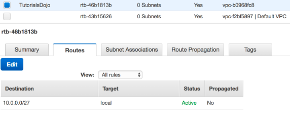

# AWS 공인 솔루션스 아키텍트 – 어소시에이트 연습문제 1 오답

## 1.
클라우드 아키텍처는 Linux 및 Windows EC2 인스턴스로 구성되어 있으며, 이 인스턴스는 대량의 데이터를 24시간, 일주일에 7일 처리합니다. 시스템의 고가용성을 보장하려면 모든 인스턴스의 메모리 및 디스크 사용률을 모니터링해야 합니다.
다음 중 구현하기에 가장 적합한 모니터링 솔루션은 무엇입니까?
- Amazon Inspector를 사용하고 모든 EC2 인스턴스에 Inspector 에이전트를 설치합니다.
- (정답) 메모리 및 디스크 사용률 데이터를 수집하는 모든 EC2 인스턴스에 CloudWatch 에이전트를 설치하고 Amazon CloudWatch 콘솔에서 사용자 지정 메트릭을 봅니다.
- 메모리 및 디스크 사용률 메트릭을 이미 사용할 수 있는 EC2 인스턴스에 기본 CloudWatch 구성을 사용합니다. 모든 EC2 인스턴스에 AWS SSM(AWS Systems Manager) 에이전트를 설치합니다.
- (선택) EC2에서 확장 모니터링 옵션을 사용하도록 설정하고 모든 EC2 인스턴스에 CloudWatch 에이전트를 설치하여 CloudWatch 대시보드에서 메모리 및 디스크 사용률을 볼 수 있습니다.
```markdown
- CloudWatch에는 CPU 사용률, 네트워크 사용률, 디스크 성능 및 디스크 읽기/쓰기 모니터링에 사용할 수 있는 Amazon EC2 메트릭이 있습니다.
- 아래 항목을 모니터링을 해야 하는 경우 Perl 또는 다른 쉘 스크립트를 사용하여 사용자 지정 메트릭을 준비해야 합니다.
• 메모리 활용
• 디스크 스왑 활용
• 디스크 공간 활용
• 페이지 파일 활용
• 로그 수집
- 메트릭과 로그를 수집하려면 모니터링 스크립트 대신 새 에이전트를 사용하는 것이 좋습니다.

오답
- 기본적으로 CloudWatch는 인스턴스의 메모리 및 디스크 사용률 메트릭을 자동으로 제공하지 않습니다. 인스턴스의 메모리, 디스크 스왑, 디스크 공간 및 페이지 파일 활용도를 모니터링하도록 사용자 지정 CloudWatch 메트릭을 설정해야 합니다.
- 확장 모니터링은 CloudWatch가 아닌 RDS의 기능입니다.
- Amazon Inspector는 Amazon EC2 인스턴스의 네트워크 액세스 가능성과 인스턴스에서 실행 중인 응용 프로그램의 보안 상태를 테스트하는 데 도움이 되는 자동 보안 평가 서비스입니다. VPC에 있는 각 및 모든 EC2 인스턴스의 메모리 및 디스크 사용률을 추적하는 사용자 지정 메트릭은 제공하지 않습니다.
```

## 6.
애플리케이션은 EC2 인스턴스에서 빅데이터 워크로드를 실행합니다. 애플리케이션은 최소 허용 성능 임계값을 유지하려면 최소 10개 이상의 인스턴스가 필요하고 워크로드의 급증 문제를 처리하려면 100개 인스턴스가 필요합니다. 애플리케이션에 의해 처리된 과거 워크로드를 기준으로 하면 80%의 인스턴스가 필요합니다.
안정적인 상태에서 워크로드 수요를 충족할 수 있도록 비용 최적 솔루션으로 권장하고 싶은 것은 다음 중 무엇입니까?
- (정답) 예약 인스턴스 80 개를 구매하고 워크로드 요구에 따라 추가 온디맨드 및 스팟 인스턴스를 프로비저닝합니다 .
- 온디맨드 인스턴스 80개를 구매합니다. 워크로드 요구에 따라 추가 온디맨드 및 스팟 인스턴스를 프로비저닝 합니다.
- (선택) 온디맨드 인스턴스 80개를 구매합니다. Auto Scaling Group을 사용하여 워크로드 요구에 따라 나머지 인스턴스를 스팟 인스턴스로 프로비저닝 합니다.
- 스팟 인스턴스 80개를 구매합니다. Auto Scaling Group을 사용하여 워크로드 요구에 따라 나머지 인스턴스를 온디맨드 인스턴스로 프로비저닝 합니다.
```markdown
- 정상 상태 워크로드 요구가 80개의 인스턴스이므로 80개의 예약 인스턴스를 구매하여 비용을 절감 할 수 있습니다.

- 온디맨드 인스턴스가 적합한 경우:
• 선결제 금액이나 장기 약정 없이 저렴하고 유연하게 Amazon EC2를 사용하기 원하는 사용자
• 단기의 갑작스럽거나 예측할 수 없는 워크로드가 있으며, 중단되어서는 안 되는 애플리케이션
• Amazon EC2에서 처음으로 개발 또는 시험 중인 애플리케이션

- 스팟 인스턴스가 적합한 경우:
• 시작 및 종료 시간이 자유로운 애플리케이션
• 컴퓨팅 가격이 매우 저렴해야만 수익이 나는 애플리케이션
• 대량의 서버 용량 추가로 긴급히 컴퓨팅 파워가 필요한 사용자

- Savings Plans는 1년 또는 3년 기간의 일정 사용량 약정(시간당 요금을 기준으로 측정)을 조건으로 EC2 및 Fargate 사용량에 대해 저렴한 요금을 제공하는 유연한 요금 모델입니다.

- 예약 인스턴스가 적합한 경우:
• 수요가 꾸준한 애플리케이션
• 예약 용량이 필요할 수 있는 애플리케이션
• 총 컴퓨팅 비용을 절감하기 위해 1년 또는 3년 동안 EC2를 사용하기로 약정할 수 있는 고객

- 전용 호스팅은 고객 전용의 물리적 EC2 서버입니다. 전용 호스팅을 사용하면 Windows Server, SQL Server, SUSE Linux Enterprise Server(라이선스 약관에 따름)를 비롯한 기존 서버 한정 소프트웨어 라이선스를 사용할 수 있으므로 비용을 절감할 뿐 아니라 규정 준수 요구 사항도 충족할 수 있습니다.
```

## 12.
현재 Amazon SQS에서 표준 대기열을 사용하고 있는 웹 기반 주문 처리 시스템이 있습니다. 지원팀은 주문이 두 번 처리된 사례가 많다는 것을 알게 되었습니다. 이 문제로 인해 처리 과정에서 많은 문제가 발생하여 고객이 매우 불만족스러워하고 있습니다. IT 관리자가 이 문제가 다시 발생하지 않도록 요청했습니다.
앞으로 이런 일이 다시 발생하지 않도록 하려면 어떻게 해야 합니까? (2 개 선택)
- (선택/정답) Amazon SQS FIFO 대기열을 사용합니다.
- (선택) SQS에서 메시지 크기를 변경합니다.
- (정답) Amazon SQS를 교체하고 대신 Amazon Simple Workflow 서비스를 사용합니다.
- (선택) SQS의 제한 시간 초과를 변경합니다.
- Amazon SQS의 보존 기간을 변경합니다.
```markdown
- FIFO(선입선출) 대기열은 다음 예와 같이 작업 및 이벤트 순서가 중요하거나 중복 항목이 허용되지 않는 경우에 애플리케이션 간 메시징을 강화해 줍니다.
• 사용자가 입력한 명령이 올바른 순서로 실행되도록 보장
• 가격 수정을 올바른 순서로 전송하여 올바른 제품 가격 표시.
• 학생이 계정 등록 전에 과정에 등록하지 못하도록 차단.

- FIFO 대기열은 정확히 1회 처리를 제공하지만 초당 트랜잭션(TPS) 수가 제한적입니다.
• 배치 처리를 사용하면 FIFO 대기열은 API 메서드(SendMessageBatch, ReceiveMessage 또는 DeleteMessageBatch)별 초당 최대 3,000개의 트랜잭션을 지원합니다.
• 배치 처리가 없으면 FIFO 대기열은 API 메서드(SendMessage, ReceiveMessage 또는 DeleteMessage)별 초당 최대 300개의 API 호출을 지원합니다.

- Amazon Simple Workflow Service(Amazon SWF)는 분산 애플리케이션 구성 요소에서 작업을 쉽게 조정할 수 있도록 해주는 웹 서비스입니다. Amazon SWF를 사용하면 광범위한 사용 사례, 예를 들어 미디어 프로세싱, 웹 애플리케이션의 백엔드, 비즈니스 프로세스 워크플로우, 분석 파이프라인 등에 대한 애플리케이션을 여러 작업의 조정으로 설계할 수 있습니다. 작업은 애플리케이션의 다양한 처리 단계의 호출을 의미하며 실행 코드, 웹 서비스 호출, 사람의 활동 및 스크립트 등을 통해 수행할 수 있습니다.

- 이 시나리오의 주요 이슈는 주문 관리 시스템이 때때로 중복 주문을 생산한다는 것입니다. 회사에서 SQS를 사용하고 있기 때문에 EC2 인스턴스가 이미 처리된 메시지를 삭제하지 못한 경우 메시지가 중복될 수 있습니다. 이 문제가 발생하지 않도록 하려면 SQS FIFO나 Amazon Simple Workflow 서비스를 사용해야 합니다.
```

## 19.
무단 액세스로부터 엔터프라이즈 애플리케이션을 보호하려면 VPC에 네트워크 ACL에 대한 여러 규칙을 구성해야 합니다. 액세스 규칙은 어떻게 평가됩니까?
- (선택) 네트워크 ACL 규칙은 규칙 번호에 따라 가장 높은 규칙부터 가장 낮은 규칙까지 평가되며 일치하는 허용/거부 규칙이 발견되면 즉시 실행됩니다.
- (정답) 네트워크 ACL 규칙은 규칙 번호에 따라 가장 낮은 규칙부터 가장 높은 규칙까지 평가되며 일치하는 허용/거부 규칙이 발견되면 즉시 실행됩니다.
- 네트워크 ACL 규칙은 가장 낮은 규칙부터 가장 높은 규칙까지 규칙 번호로 평가되며 충돌/허용 규칙에 대해 모든 규칙을 검사한 후에 실행됩니다.
- 기본적으로 모든 네트워크 ACL 규칙은 트래픽이 허용되거나 거부되기 전에 평가됩니다.
```markdown 
- 네트워크 ACL에는 번호가 매겨진 규칙 목록이 포함되어 있습니다. 가장 낮은 번호가 지정된 규칙부터 시작해서 트래픽이 네트워크 ACL과 연결된 서브넷의 내부 또는 외부로 전달되도록 허용되는지 결정합니다. 규칙에 사용할 수 있는 가장 높은 번호는 32766입니다. 나중에 필요한 곳에 새 규칙을 삽입할 수 있도록, 처음 시작할 때는 증분 방식으로(예: 10 또는 100 단위씩 증분) 규칙을 생성하는 것이 좋습니다.
- 네트워크 ACL은 상태 비저장입니다. 즉, 허용되는 인바운드 트래픽에 대한 응답은 아웃바운드 트래픽에 대한 규칙을 따르고, 그 반대의 경우에도 마찬가지입니다.

오답
- 네트워크 ACL은 일치하는 규칙이 발견되면 규칙이 즉시 실행되며 충돌 허용/거부 규칙이 있는지 모든 규칙을 검사 한 후에는 아닙니다.
```


## 21.
당신은 회사의 Solutions Architect로 일하고 있으며 최고 기술 책임자는 귀사의 모든 애플리케이션을 AWS로 마이그레이션하려고 합니다. 모든 데이터를 저장할 블록 스토리지를 찾고 있으며 EBS 볼륨과 함께 사용하기로 결정했습니다. 상사는 규정 준수 요구 사항, 다운타임 시나리오 및 IOPS 성능으로 인해 EBS 볼륨이 워크로드에 적합하지 않다고 우려하고 있습니다.
다음 중 EBS가 마이그레이션에 가장 적합한 서비스임을 입증하는 데 유효한 사항은 무엇입니까? (2개 선택)
- 가용 영역에서 EBS 볼륨을 생성하면 개별 AWS 영역에 자동으로 복제되어 단일 하드웨어 구성 요소 오류로 인한 데이터 손실을 방지합니다.
- (선택) EBS 볼륨을 가용 영역의 모든 EC2 인스턴스에 연결할 수 있습니다.
- (선택/정답) EBS 볼륨은 인스턴스의 수명과는 독립적으로 유지될 수 있는 오프인스턴스 스토리지입니다.
- (정답) EBS 볼륨은 프로덕션 중에 실시간 구성 변경을 지원하므로 서비스 중단 없이 볼륨 유형, 볼륨 크기 및 IOPS 용량을 수정할 수 있습니다.
- Amazon EBS는 EBS 볼륨의 스냅샷(백업)을 생성하고 볼륨의 데이터 복사본을 Amazon RDS에 쓰는 기능을 제공합니다. 이 기능은 여러 가용 영역에 중복으로 저장됩니다.
```markdown
- 현재 세대 인스턴스 유형에 연결된 현재 세대 EBS 볼륨의 경우 크기를 동적으로 늘리고 프로비저닝된 IOPS 용량을 수정하며 라이브 프로덕션 볼륨의 볼륨 유형을 변경할 수 있습니다.
- 여러 EBS 볼륨을 단일 인스턴스에 연결할 수 있습니다. 볼륨 및 인스턴스는 동일 가용 영역에 위치해야 합니다. 볼륨 및 인스턴스 유형에 따라 다중 연결을 사용하여 볼륨을 여러 인스턴스에 동시에 탑재할 수 있습니다.

# 오답
- EBS 볼륨을 가용 영역의 모든 EC2 인스턴스에 연결할 수 있습니다. -> 동시에 연결할 수 있다는 의미로 보이며 이는 EFS에 해당하는 설명 
```

## 26.
회사는 보고서를 Amazon S3 버킷에 저장하고 있습니다. IT 감사를 준수하기 위해 솔루션 아키텍트는 버킷에 추가된 모든 새 객체와 제거된 객체를 모두 추적하도록 아키텍처를 구성해야 하고 버전이 지정된 객체가 영구적으로 삭제되는지 여부를 추적해야 합니다. 아키텍트는 이러한 이벤트에 대한 알림을 사후 처리를 위한 대기열과 운영팀에 알릴 Amazon SNS 주제에 게시하도록 Amazon S3를 구성해야 합니다.
다음 중 가장 적합한 솔루션은 무엇입니까?
- 새 Amazon SNS 주제와 Amazon MQ를 생성하십시오. 버킷에 S3 이벤트 알림 구성을 추가하여 s3 : ObjectCreated : * 및 ObjectRemoved : DeleteMarkerCreated 이벤트 유형을 SQS 및 SNS에 게시합니다.
- 새 Amazon SNS 주제와 Amazon MQ를 생성하십시오. 버킷에 S3 이벤트 알림 구성을 추가하여 s3 : ObjectAdded : * 및 s3 : ObjectRemoved : * 이벤트 유형을 SQS 및 SNS에 게시합니다.
- (정답) 새로운 Amazon SNS 주제와 Amazon SQS 대기열을 생성합니다. 버킷에 S3 이벤트 알림 구성을 추가하여 s3 : objectCreated : * 및 s3 : objectRemoved : Delete 이벤트 유형을 SQS 및 SNS에 게시합니다.
- (선택) 새 Amazon SNS 주제와 Amazon SQS 대기열을 생성합니다. 버킷에 S3 이벤트 알림 구성을 추가하여 s3 : ObjectCreated : * 및 ObjectRemoved : DeleteMarkerCreated 이벤트 유형을 SQS 및 SNS에 게시합니다.
```markdown
- Amazon S3는 다음 이벤트에 대한 알림을 게시할 수 있습니다.
• 새 객체 생성 이벤트 : Amazon S3는 여러 객체 생성 API를 지원합니다. 따라서 특정 API(예: s3:ObjectCreated:Put)를 사용할 경우에만 알림을 보내도록 요청하거나, 와일드카드(예: s3:ObjectCreated:*)를 사용하여 API에 관계없이 객체가 생성되면 알림을 보내도록 요청할 수 있습니다.
• 객체 제거 이벤트 : Amazon S3는 버전이 지정된 객체 및 버전이 지정되지 않은 객체의 삭제를 지원합니다. s3:ObjectRemoved:Delete 이벤트 유형을 사용하여 객체가 삭제되거나 버전이 지정된 객체가 영구적으로 삭제될 경우 알림을 요청할 수 있습니다. 또한 s3:ObjectRemoved:DeleteMarkerCreated를 사용하여 버전이 지정된 객체에 대해 삭제 마커가 생성될 경우 알림을 요청할 수 있습니다. s3:ObjectRemoved:* 와일드카드를 사용하여 객체가 삭제되는 모든 경우에 알림을 요청할 수도 있습니다.
• 객체 복원 이벤트 : Amazon S3은 S3 Glacier 스토리지 클래스에 보관된 객체의 복원을 지원합니다. s3:ObjectRestore:Completed를 사용하여 객체 복원 완료 알림을 요청합니다. s3:ObjectRestore:Post를 사용하여 복원 시작 알림을 요청합니다.
• RRS(Reduced Redundancy Storage) 객체 손실 이벤트 : Amazon S3가 RRS 스토리지 클래스에서 객체 손실이 확인되면 알림 메시지를 보냅니다.
• 복제 이벤트 : Amazon S3는 S3 Replication Time Control (S3 RTC)가 활성화된 복제 구성에 대한 이벤트 알림을 보냅니다. 객체 복제가 실패할 경우, 객체가 15분 임계값을 초과할 경우, 객체가 15분 임계값 이후에 복제될 경우, 객체가 더 이상 복제 지표에 의해 추적되지 않을 경우 이러한 알림을 보냅니다. 객체가 대상 리전으로 복제될 때 두 번째 이벤트를 게시합니다.

- Amazon S3는 다음과 같은 이벤트 게시 대상을 지원합니다.
• Amazon Simple Notification Service(Amazon SNS) 주제
• Amazon Simple Queue Service(Amazon SQS) 대기열
• AWS Lambda
```

## 30.
단일 서브넷으로 VPC를 생성한 후 해당 서브넷에서 온디맨드 EC2 인스턴스를 시작했습니다. 인터넷 게이트웨이 (IGW)를 VPC에 연결했으며 EC2 인스턴스에 퍼블릭 IP가 있는지 확인했습니다. VPC의 기본 라우팅 테이블은 다음과 같습니다.

그러나 컴퓨터에서 인스턴스에 연결하려고 할 때 여전히 인터넷에서 인스턴스에 도달할 수 없습니다.
이 문제를 해결하기 위해 다음 중 라우팅 테이블에 수행해야 할 것은 무엇입니까?
- (선택) 이 새 항목을 라우팅 테이블에 추가합니다. 0.0.0.0/27-> 인터넷 게이트웨이
- 라우팅 테이블에 다음 항목을 추가합니다. 10.0.0.0/27-> 인터넷 게이트웨이
- (정답) 이 새 항목을 라우팅 테이블에 추가하십시오. 0.0.0.0/0-> 인터넷 게이트웨이
- 위의 라우팅 테이블을 수정합니다. 10.0.0.0/27-> 인터넷 게이트웨이
```markdown
- 라우팅 테이블에는 서브넷 또는 게이트웨이의 네트워크 트래픽이 전송되는 위치를 결정하는 데 사용되는 라우팅이라는 규칙 집합이 포함되어 있습니다.
- 라우팅 테이블에 인터넷 게이트웨이에 대한 항목이 없습니다. 이것이 EC2 인스턴스에 연결할 수 없는 이유입니다. 이 문제를 해결하려면 IPv4 트래픽의 경우 대상 0.0.0.0/0 또는 IPv6 트래픽의 경우 :: / 0, 인터넷 게이트웨이 ID (igw-xxxxxxxx)의 대상이 있는 경로를 추가해야 합니다.
```

## 31.
회사에서는 VPC의 모든 AWS 리소스가 각각의 서비스 제한을 초과하지 않도록 지시했습니다. AWS 모범 사례를 준수하는 리소스 프로비저닝에 대한 실시간 지침을 제공하는 시스템을 준비해야 합니다.
다음 중 이 작업을 수행하는 데 가장 적합한 서비스는 무엇입니까?
- AWS Trusted Advisor
- AWS Cost Optimization
- Amazon Inspector
- AWS 예산
```markdown
- AWS Trusted Advisor는 AWS 모범 사례에 따라 리소스를 프로비저닝하는 데 도움이 되도록 실시간 지침을 제공하는 온라인 도구입니다. Trusted Advisor는 AWS 인프라를 최적화하고 보안과 성능을 향상시키고 전체 비용을 절감하며 서비스 한도를 모니터링할 수 있습니다. 새 워크플로를 설정하든, 애플리케이션을 개발하든, 지속적인 개선의 목적으로 진행하든 상관없이, 정기적으로 Trusted Advisor에서 제시하는 권장 사항을 활용하면 솔루션을 최적으로 프로비저닝된 상태로 유지하는 데 도움이 됩니다.

- AWS Trusted Advisor는 AWS 환경을 분석하여 다음 5가지 카테고리의 모범 사례 권장 사항을 제공합니다.
• 비용 최적화 : AWS Trusted Advisor는 미사용 및 유휴 리소스를 제거하거나 예약 용량을 약정하여 AWS에서 비용을 절감할 수 있습니다.
• 성능 : AWS Trusted Advisor는 서비스 한도를 점검하고 프로비저닝된 처리량을 활용하는지 확인하며 과다 사용되는 인스턴스를 모니터링함으로써 서비스 성능을 개선할 수 있습니다.
• 보안 : AWS Trusted Advisor는 결함을 없애고 다양한 AWS 보안 기능을 사용하며 권한을 점검하여 애플리케이션 보안을 개선할 수 있습니다.
• 내결함성 : AWS Trusted Advisor는 Auto Scaling, 상태 확인, 다중 AZ 및 백업 기능을 활용하여 AWS 애플리케이션의 가용성과 중복성을 향상시킬 수 있습니다.
• 서비스 한도 : AWS Trusted Advisor는 서비스 사용량이 서비스 한도의 80%를 넘는지 점검합니다. 값은 스냅샷을 기반으로 하므로 현재 사용량은 다를 수 있습니다. 한도 및 사용량에 변경 사항이 반영되는 데 최대 24시간이 걸릴 수 있습니다.

오답
- AWS Cost Optimization는 비용과 사용량을 보고, 분석 할 수 있는 도구입니다.
- Amazon Inspector는 AWS에 배포된 애플리케이션의 보안 및 규정 준수를 개선하는데 도움이 되는 자동 보안 평가 서비스입니다.
- AWS 예산을 사용하면 비용 또는 사용량이 예산 금액을 초과하거나 초과할 것으로 예상될 때 알림을 받도록 사용자 지정 예산을 설정할 수 있습니다.
```

## 35.
사용자가 업로드한 이미지의 리포지토리 역할을 하는 내부 애플리케이션을 만들고 있습니다. 사용자가 이미지를 업로드할 때마다 해당 이미지가 S3 버킷에 저장되기 전에 Kinesis로 전송되어 처리됩니다. 그런 다음 업로드가 성공하면 애플리케이션에서 사용자에게 업로드가 성공했음을 알리는 메시지를 반환합니다. 전체 처리를 완료하는 데 일반적으로 약 5분이 소요됩니다.
다음 중 가장 비용 효율적인 방법으로 애플리케이션에 대한 요청을 비동기식으로 처리할 수 있는 옵션은 무엇입니까?
- (정답) 비동기적으로 요청을 처리 할 Lambda 함수를 만듭니다.
- SQS 조합을 사용하여 요청을 대기열에 넣은 후 온디맨드 EC2 인스턴스를 사용하여 비동기적으로 처리합니다.
- (선택) Lambda와 Step Functions를 함께 사용하여 서비스 구성 요소를 조정하고 요청을 비동기적으로 처리합니다.
- SNS 조합을 사용하여 요청을 버퍼링한 다음 온디맨드 EC2 인스턴스를 사용하여 비동기적으로 처리합니다.
```markdown
- AWS Lambda를 사용하여 Amazon S3 버킷 또는 Amazon DynamoDB 테이블의 데이터 변경과 같은 이벤트에 대한 응답으로 코드를 실행할 수 있습니다. Amazon API Gateway를 사용하여 HTTP 요청에 대한 응답으로 코드를 실행할 수도 있으며, 또는 AWS SDK를 사용하여 만든 API 호출을 통해 코드를 호출할 수 있습니다. 이러한 기능을 제공하므로 Lambda를 사용하여 Amazon S3 및 Amazon DynamoDB와 같은 AWS 서비스에 대한 데이터 처리 트리거를 손쉽게 빌드하거나, Kinesis에 저장된 스트리밍 데이터를 처리하거나 AWS 규모, 성능, 보안에 따라 작동하는 자체 백엔드를 생성할 수 있습니다.
- 함수를 호출할 때 동기식으로 호출할 것인지 비동기식으로 호출할 것인지 선택할 수 있습니다. 동기식 호출의 경우 함수가 이벤트를 처리하여 응답을 반환하기를 기다립니다. 비동기식 호출의 경우 Lambda는 처리를 위해 이벤트를 대기열에 저장하고 즉시 응답을 반환합니다. 비동기식 호출의 경우 Lambda는 재시도를 처리하고, 호출 레코드를 대상에 보낼 수 있습니다.
- 처리에는 5 분 밖에 걸리지 않으므로 Lambda는 비용 효율적인 선택입니다.

오답
- Step Functions은 Lambda를 활용하여 워크플로우를 구축하는 것이므로 관계가 없음
```

## 37.
당신은 온라인 거래 플랫폼을 구축하는 과정에 있는 솔루션 아키텍트입니다. 고가용성 및 확장 성을 보장하기 위해 여러 가용 영역에 걸쳐 온디맨드 EC2 인스턴스의 Auto Scaling 그룹 앞에서 Elastic Load Balancer를 사용하도록 플랫폼을 설계했습니다. 데이터베이스 계층의 경우 단일 Amazon Aurora 인스턴스를 사용하여 분산, 내결함성 및 자동 복구 스토리지 시스템을 활용했습니다.
기본 데이터베이스 인스턴스에서 시스템 장애가 발생하는 경우 장애 조치 중에 Amazon Aurora는 어떻게 됩니까?
- Aurora는 먼저 원래 인스턴스의 다른 가용 영역에 새 DB 인스턴스를 생성하려고 시도합니다. 그렇게 할 수 없는 경우 Aurora는 원래 가용성에서 새 DB 인스턴스를 생성하려고 시도합니다.
- (정답) Aurora는 먼저 원래 인스턴스와 동일한 가용 영역에 새 DB 인스턴스를 생성하려고 시도합니다. 그렇게 할 수 없는 경우 Aurora는 다른 가용 영역에서 새 DB 인스턴스를 생성하려고 시도합니다.
- (선택) Amazon Aurora는 DB 인스턴스의 표준 이름 레코드 (CNAME)를 뒤집어 정상 복제본을 가리키고 새로운 기본 인스턴스로 승격됩니다.
- Amazon Aurora는 DB 인스턴스의 A 레코드를 뒤집어 정상 복제본을 가리키고 새로운 기본 인스턴스로 승격됩니다.
```markdown
- 키워드: 단일 Amazon Aurora 인스턴스, 기본 데이터베이스 인스턴스에서 시스템 장애가 발생
- 장애 조치는 Amazon Aurora에서 자동으로 처리하므로 수동 관리 작업 없이도 애플리케이션이 데이터베이스 작업을 가능한 한 빨리 재개 할 수 있습니다.
- (복제본O) 동일하거나 다른 가용 영역에 Amazon Aurora 복제본이 있는 경우 장애 조치 시 Amazon Aurora는 DB 인스턴스의 표준 이름 레코드 (CNAME)를 정상 복제본을 가리 키도록 하여 새로운 복제본으로 승격시킵니다.
- (본제본X) Amazon Aurora 복제본 (예 : 단일 인스턴스)이 없고 Aurora 서버리스를 실행하지 않는 경우 Aurora는 원래 인스턴스와 동일한 가용 영역에 새 DB 인스턴스를 생성하려고 시도합니다.

오답
- CNAME 변경은 Amazon Aurora Replica를 사용하는 경우에만 수행됩니다. 또한 Amazon Aurora는 인스턴스의 A 레코드(IP 주소)가 아닌 표준 이름 레코드(CNAME)를 건너뜁니다.
- CNAME을 변경하지 A레코드를 변경하지 않습니다.
- Aurora는 먼저 원래 인스턴스와 동일한 가용 영역에 새 DB 인스턴스를 만들려고 시도합니다. 그렇게 할 수 없는 경우 Aurora는 다른 가용 영역에서 새 DB 인스턴스를 만들려고 시도합니다.

참고
- https://aws.amazon.com/ko/rds/aurora/faqs/
```

## 38.
제약 회사가 바이러스 백신의 개발에 참여하고 있습니다. 이 회사의 연구소는 매일 수백 테라바이트의 연구 데이터를 생성합니다. 이 회사의 엔지니어링 팀은 혁신 프로세스를 더욱 가속화하기 위해 대부분의 온프레미스 데이터를 Amazon S3, Amazon EFS 및 Windows File Server 용 Amazon FSx로 쉽고 빠르고 비용 효율적으로 이동하려고 합니다. 팀은 이러한 AWS 스토리지 서비스에 대한 온라인 데이터 전송을 자동화하고 가속화할 수 있기를 원합니다.
다음 중 가장 적합한 솔루션은 무엇입니까?
- AWS Transfer Family를 사용하여 지정된 AWS 스토리지 서비스로 온라인 데이터 전송을 자동화하고 가속화 하십시오.
- (정답) AWS DataSync를 사용하여 지정된 AWS 스토리지 서비스로 온라인 데이터 전송을 자동화하고 가속화하십시오.
- AWS Snowball Edge 디바이스를 사용하여 지정된 AWS 스토리지 서비스로 온라인 데이터 전송을 자동화하고 가속화 하십시오.
- (선택) File Gateway를 사용하여 지정된 AWS 스토리지 서비스로 온라인 데이터 전송을 자동화하고 가속화 하십시오.
```markdown
- AWS DataSync는 온라인 데이터 전송 서비스로, 인터넷 또는 AWS Direct Connect를 통해 AWS 스토리지 서비스에서 송수신되는 대량의 데이터 복사를 간소화, 자동화 및 가속화합니다. DataSync는 NFS(Network File System)/SMB(Server Message Block) 파일 서버 또는 AWS Snowcone과 Amazon Simple Storage Service(Amazon S3) 버킷, Amazon Elastic File System(Amazon EFS) 및 Amazon FSx for Windows File Server 파일 시스템 간에 데이터를 복사할 수 있습니다.

오답
- AWS Transfer Family는 SFTP, AS2, FTPS 및 FTP를 통해 Amazon S3 또는 Amazon EFS에서 파일을 송수신할 수 있는 완전관리형 지원을 제공합니다. 이 시나리오에서 언급한 다른 AWS 스토리지 서비스 (EFS 및 Windows 용 Amazon FSx)로의 마이그레이션은 지원하지 없습니다.
- 파일 게이트웨이는 업계 표준 파일 프로토콜을 사용하여 파일을 원활하게 Amazon S3에 객체로 저장하고 이에 액세스할 수 있는 파일 인터페이스를 애플리케이션에 제공하는 AWS Storage Gateway 서비스의 구성입니다. 이 시나리오에서 언급한 다른 AWS 스토리지 서비스 (EFS 및 Windows 용 Amazon FSx)로의 마이그레이션을 지원하지 없습니다.
```

## 44.
SSH 연결을 통해 특정 IP 주소(110.238.98.71)에서만 온디맨드 EC2 인스턴스에 액세스할 수 있는지 확인해야 합니다.
아래 어떤 구성이 이 요구 사항을 충족합니까?
- (선택) 보안 그룹 인바운드 규칙 : 프로토콜 – TCP, 포트 범위 – 22, 소스 110.238.98.71/0
- 보안 그룹 인바운드 규칙 : 프로토콜 – UDP, 포트 범위 – 22, 소스 110.238.98.71/0
- 보안 그룹 인바운드 규칙 : 프로토콜 – UDP, 포트 범위 – 22, 소스 110.238.98.71/32
- (정답) 보안 그룹 인바운드 규칙 : 프로토콜-TCP. 포트 범위-22, 소스 110.238.98.71/32
```markdown
- SSH 프로토콜은 TCP 포트 22를 사용합니다.
- 전체 네트워크가 아닌 클라이언트의 개별 IP 만 허용해야합니다. /32는 하나의 IP 주소를 나타냅니다.
```

## 48.
회사에서 매주 액세스되는 재무 파일을 AWS에 저장하려고 합니다. Architect는 엔벨로프 암호화를 사용하고 키 순환을 자동화하는 스토리지 시스템을 설정하라는 지시를 받았습니다. 또한 누가 암호화 키를 사용했으며 보안 목적으로 누가 사용했는지 보여주는 감사 추적도 제공해야 합니다.
다음 중 가장 비용 효율적인 방법으로 요구 사항을 충족하기 위해 구현해야 할 것은 무엇입니까? (2 개 선택)
- (선택) 고객 제공 키를 사용하여 서버 측 암호화 구성 (SSE-C) 합니다.
- Amazon S3 Glacier Deep Archive를 사용하여 데이터 저장합니다.
- Amazon S3 관리형 키를 사용하여 서버 측 암호화 구성 (SSE-S3) 합니다.
- (선택/정답) AWS KMS 관리형 키 (SSE-KMS)를 사용하여 서버 측 암호화를 구성합니다.
- (정답) Amazon S3를 사용하여 데이터를 저장합니다.
```markdown
# Amazon S3 관리형 키를 사용한 서버 측 암호화(SSE-S3)
- Amazon S3 관리형 키를 사용한 서버 측 암호화(SSE-S3)를 사용하면 각 객체는 고유한 키로 암호화됩니다. 또한 추가 보안 조치로 주기적으로 바뀌는 마스터 키를 사용하여 키 자체를 암호화합니다. Amazon S3 서버 측 암호화는 가장 강력한 블록 암호 중 하나인 256비트 고급 암호화 표준(AES-256)을 사용하여 데이터를 암호화합니다.

# AWS Key Management Service에 저장된 고객 마스터 키(CMK)를 사용한 서버 측 암호화(SSE-KMS)
- AWS Key Management Service에 저장된 고객 마스터 키(CMK)를 사용한 서버 측 암호화(SSE-KMS)는 SSE-S3와 유사하지만 이 서비스 사용 시 몇 가지 추가적인 이점이 있고 비용이 발생합니다. Amazon S3의 객체에 대한 무단 액세스에 대응하여 추가적인 보호를 제공하는 CMK를 사용하려면 별도의 권한이 필요합니다. SSE-KMS도 CMK가 사용된 때와 사용 주체를 표시하는 감사 추적 기능을 제공합니다. 또한 고객 관리형 CMK를 생성하고 관리하거나 사용자, 서비스 및 리전에 고유한 AWS 관리형 CMK를 사용할 수 있습니다.

# 고객 제공 키를 사용한 서버 측 암호화(SSE-C)
- 고객 제공 키를 사용한 서버 측 암호화(SSE-C)를 사용하면 사용자는 암호화 키를 관리하고 Amazon S3는 암호화(디스크에 쓸 때) 및 해독(객체에 액세스할 때)을 관리합니다.

이 시나리오에서 회사는 매주 액세스 되는 재무 파일을 AWS에 저장해야 하며 솔루션은 엔벨로프 암호화를 사용해야 합니다.
이 요구 사항은 AWS KMS 관리형 키 (SSE-KMS)와 함께 서버 측 암호화로 구성된 Amazon S3를 사용하여 충족 할 수 있습니다.
따라서 Amazon S3를 사용하여 데이터를 저장하고 AWS KMS 관리형 키 (SSE-KMS)로 서버 측 암호화를 구성하는 것이 정답입니다.
```

## 50.
바이러스를 연구하는 과학자가 Amazon S3에 고해상도 세포 이미지를 업로드하려고 합니다. 이미지 크기는 약 3GB입니다. 과학자는 S3 Transfer Acceleration (S3TA)을 사용하여 이미지를 더 빠르게 업로드하고 있습니다. 하지만 알고 보니 전송이 가속화 되지 않았음을 알 수 있습니다.
이 시나리오에서 이 이미지 전송에 대한 요금과 관련하여 다음 중 올바른 것은 무엇입니까?
- (정답) 과학자는 이미지 업로드를 위해 전송 요금을 지불 할 필요가 없습니다.
- (선택) 과학자는 이미지 업로드에 S3 전송 요금만 지불하면 됩니다.
- 과학자는 이미지 업로드에 대해 S3TA 전송 요금만 지불하면 됩니다.
- 과학자는 이미지 업로드에 대해 S3 전송 요금과 S3TA 전송 요금을 모두 지불해야 합니다.
```markdown
- 인터넷에서 데이터를 전송할 때 S3 데이터 전송 요금은 없습니다. 또한 S3TA를 사용하면 가속화된 전송에 대해서만 비용을 지불합니다. 따라서 S3TA는 전송 속도가 빨라지지 않았기 때문에 주니어 과학자는 이미지 업로드에 대해 전송 요금을 지불 할 필요가 없습니다.
```

## 55.
회사는 데이터를 S3 버킷에 저장하는 EC2 인스턴스의 Auto Scaling 그룹에서 호스팅 되는 애플리케이션을 운영하고 있습니다. 회사에서 제공하고 관리하는 암호화 키를 사용하여 유휴 데이터를 암호화해야 합니다. 이 변경 사항은 회사의 엄격한 보안 정책을 준수하기 위해 데이터에 AES-256 암호화를 제공해야 합니다.
이를 위해 다음 중 어떤 조치를 수행해야 합니까? (2개 선택)
- (선택/정답) 자체 마스터 키를 사용하여 Amazon S3로 전송하기 전에 클라이언트 측의 데이터를 암호화합니다.
- (선택) Amazon S3 관리 암호화 키를 사용하여 Amazon S3 서버 측 암호화를 구현합니다.
- AWS KMS 관리 키 (SSE-KMS)를 사용하여 Amazon S3 서버 측 암호화를 구현합니다.
- (정답) 고객 제공 키 (SSE-C)를 사용하여 Amazon S3 서버 측 암호화를 구현합니다.
- Amazon S3로 전송되는 동안 SSL을 사용하여 데이터 암호화합니다.
```markdown
Amazon S3에서 유휴 데이터를 보호하는 다음과 같은 옵션이 있습니다.
1. 서버 측 암호화 – 데이터 센터의 디스크에 저장하기 전에 객체를 암호화하고 객체를 다운로드할 때 이를 해독하도록 Amazon S3에 요청합니다.
2. 클라이언트 측 암호화 – 클라이언트 측 데이터를 암호화하여 암호화된 데이터를 Amazon S3에 업로드합니다. 이 경우 사용자가 암호화 프로세스, 암호화 키 및 관련 도구를 관리합니다.

서버 측 암호화는 데이터를 받는 애플리케이션 또는 서비스에 의해 해당 대상에서 데이터를 암호화하는 것입니다. Amazon S3에서는 데이터 센터의 디스크에 데이터를 쓸 때 객체 레벨에서 데이터를 암호화하고 해당 데이터에 액세스할 때 자동으로 암호 해독합니다. 요청을 인증하기만 하면 액세스 권한을 갖게 되며, 객체의 암호화 여부와 관계없이 액세스 방식에는 차이가 없습니다. 예를 들어, 미리 서명된 URL을 사용하여 객체를 공유하는 경우, 해당 URL은 암호화된 객체와 암호화되지 않은 객체에 동일하게 작동합니다. 또한 버킷에 객체를 나열하는 경우 목록 API에서는 암호화 여부와 관계없이 전체 객체의 목록을 반환합니다.

암호화 키 관리 방법으로 무엇을 선택하느냐에 따라 다음과 같은 세 가지 옵션을 독립적으로 사용할 수 있습니다.

1. Amazon S3 관리형 키를 사용한 서버 측 암호화(SSE-S3)
- Amazon S3 관리형 키를 사용한 서버 측 암호화(SSE-S3)를 사용하면 각 객체는 고유한 키로 암호화됩니다. 또한 추가 보안 조치로 주기적으로 바뀌는 마스터 키를 사용하여 키 자체를 암호화합니다. Amazon S3 서버 측 암호화는 가장 강력한 블록 암호 중 하나인 256비트 고급 암호화 표준(AES-256)을 사용하여 데이터를 암호화합니다.

2. AWS Key Management Service에 저장된 고객 마스터 키(CMK)를 사용한 서버 측 암호화(SSE-KMS)
- AWS Key Management Service에 저장된 고객 마스터 키(CMK)를 사용한 서버 측 암호화(SSE-KMS)는 SSE-S3와 유사하지만 이 서비스 사용 시 몇 가지 추가적인 이점이 있고 비용이 발생합니다. Amazon S3의 객체에 대한 무단 액세스에 대응하여 추가적인 보호를 제공하는 CMK를 사용하려면 별도의 권한이 필요합니다. SSE-KMS도 CMK가 사용된 때와 사용 주체를 표시하는 감사 추적 기능을 제공합니다. 또한 고객 관리형 CMK를 생성하고 관리하거나 사용자, 서비스 및 리전에 고유한 AWS 관리형 CMK를 사용할 수 있습니다.

3. 고객 제공 키를 사용한 서버 측 암호화(SSE-C)
- 고객 제공 키를 사용한 서버 측 암호화(SSE-C)를 사용하면 사용자는 암호화 키를 관리하고 Amazon S3는 암호화(디스크에 쓸 때) 및 해독(객체에 액세스할 때)을 관리합니다.

클라이언트 측 암호화는 Amazon S3로 보내기 전에 데이터를 암호화하는 것을 가리킵니다. 클라이언트 측 암호화를 활성화하기 위한 다음 옵션이 있습니다.

1. AWS Key Management Service(AWS KMS)에 저장된 고객 마스터 키(CMK)를 사용합니다.
- 객체를 업로드할 때 — 고객 마스터 키(CMK) ID를 사용하여 클라이언트가 먼저 AWS KMS로 객체 데이터를 암호화하는 데 사용할 수 있는 CMK를 요청합니다. AWS KMS는 임의로 생성된 데이터 키의 다음 두 가지 버전을 반환합니다.
1-1. 클라이언트가 객체 데이터를 암호화하는 데 사용하는 일반 텍스트 버전의 데이터 키
1-2. 클라이언트가 Amazon S3에 객체 메타데이터로 업로드하는 동일한 데이터 키의 암호 BLOB

2. 애플리케이션 내에 저장한 마스터 키를 사용합니다.
클라이언트 측 마스터 키와 암호화되지 않은 데이터는 AWS로 전송되지 않습니다. 따라서 암호화 키를 안전하게 관리하는 것이 중요합니다. 해당 키를 잃어버리면 데이터의 암호를 해독할 수 없습니다
2-1. 객체를 업로드할 때Amazon S3 암호화 클라이언트에 클라이언트 측 마스터 키를 제공합니다. 클라이언트에서는 임의로 생성하는 데이터 암호화 키를 암호화하기 위해서만 이 마스터 키를 사용합니다. 프로세스는 다음과 같습니다.
2-1-1. Amazon S3 암호화 클라이언트에서 일회용 대칭 키(즉 데이터 암호화 키 또는 데이터 키)를 로컬로 생성합니다. 또한 데이터 키를 사용하여 단일 객체의 데이터를 암호화합니다. 클라이언트는 각 객체에 대한 개별 데이터 키를 생성합니다.
2-1-2. 클라이언트에서 사용자가 제공하는 마스터 키를 사용하여 데이터 암호화 키를 암호화합니다. 클라이언트에서 암호화된 데이터 키 및 해당 구성 요소 설명을 객체 메타데이터의 일부로 업로드합니다. 클라이언트는 구성 요소 설명을 사용하여 어떤 클라이언트 측 마스터 키를 암호화에 사용할지 결정합니다.
2-1-3. 그런 다음 클라이언트에서 기본적으로 암호화된 데이터를 Amazon S3로 업로드하고 암호화된 데이터 키를 객체 메타데이터(x-amz-meta-x-amz-key)로 Amazon S3에 저장합니다.
2-2. 객체를 다운로드할 때클라이언트가 먼저 Amazon S3에서 암호화된 객체를 다운로드합니다. 클라이언트에서 먼저 객체 메타데이터의 구성 요소 설명을 사용하여 데이터 키의 암호 해독에 어떤 마스터 키를 사용할지를 결정합니다. 클라이언트는 해당 마스터 키를 사용하여 데이터 키를 암호 해독하고 나서 데이터 키를 사용하여 객체를 암호 해독합니다.

결국 가장 강력한 블록 암호 중 하나인 256비트 고급 암호화를 사용하기 위해서는 SSE-S3와 Client Side Encryption을 사용해야 합니다.
```

## 56.
애플리케이션이 Amazon S3 버킷에 로드될 때마다 배치 작업을 실행하는 AWS Fargate 클러스터에서 애플리케이션이 호스팅 됩니다. 최소 ECS 작업 수는 처음에 1로 설정되어 비용을 절약하고 S3 버킷에 업로드된 새 객체를 기반으로 작업 수만 증가시킵니다. 처리가 완료되면 버킷이 비게 되고 ECS 작업 수는 1로 다시 설정되어야 합니다.
최소한의 노력으로 구현하기에 가장 적합한 옵션은 무엇입니까?
- (정답) S3 객체 PUT 작업을 탐지하도록 CloudWatch 이벤트 규칙을 설정하고 작업 수가 증가함에 따라 대상을 ECS 클러스터로 설정합니다. S3 DELETE 작업을 탐지하는 다른 규칙을 만들고 작업 수를 1로 하여 대상을 ECS 클러스터로 설정합니다.
- S3 객체 수준 작업이 CloudTrail에 기록되므로 CloudTrail을 모니터링 하도록 CloudWatch에 경보를 설정합니다. ECS 작업 수를 늘리거나 줄이기 위한 두 개의 Lambda 함수를 만듭니다. S3 이벤트에 따라 CloudWatch Alarm의 각 대상으로 설정합니다.
- 이 S3 객체 수준 작업이 CloudTrail에 기록되므로 CloudTrail을 모니터링 하도록 CloudWatch에 경보를 설정합니다. S3 이벤트에 따라 ECS 작업 수를 스케일 아웃 / 스케일 인으로 업데이트하도록 두 개의 알람 동작을 설정합니다.
- (선택) S3 객체 PUT 작업을 탐지하도록 CloudWatch 이벤트 규칙을 설정하고 Amazon ECS API 명령을 실행하여 ECS의 작업 수를 늘리는 Lambda 함수로 대상을 설정합니다. S3 DELETE 조작을 감지하는 다른 규칙을 작성하고 Lambda 함수를 실행하여 ECS 태스크 수를 줄이십시오.
```markdown
- (Amazon CloudWatch Events는 Amazon EventBridge으로 변경되었습니다.)
- Amazon CloudWatch Events는 Amazon Web Services(AWS) 리소스의 변경 사항을 설명하는 시스템 이벤트의 스트림을 거의 실시간으로 제공합니다. 
- CloudWatch 이벤트를 사용하여 특정 AWS 이벤트가 발생할 때 Amazon ECS 작업을 실행할 수 있습니다. 이 자습서에서는 Amazon S3 PUT 작업을 사용하여 파일이 특정 Amazon S3 버킷에 업로드될 때마다 Amazon ECS 작업을 실행하는 CloudWatch 이벤트 규칙을 설정합니다.

오답
- 이 시나리오에 대한 자체 Lambda 함수를 생성할 필요는 없습니다. ECS 작업을 CloudWatch 이벤트 규칙의 대상으로 직접 제어하는 것이 훨씬 간단합니다. 시나리오에서는 가장 구현하기 쉬운 솔루션을 요구합니다.
```

## 59.
온프레미스 데이터 센터에서 AWS 클라우드로 MySQL 데이터베이스를 마이그레이션 할 계획입니다. 이 데이터베이스는 아침에 꾸준한 상태의 워크로드가 있지만 밤에는 처리가 끝날 때 최대 로드가 있는 레거시 배치 애플리케이션에서 사용됩니다. 최대 450GB의 데이터를 처리 할 수 있고 EC2 인스턴스의 시스템 부팅 볼륨으로도 사용할 수 있는 EBS 볼륨을 선택 해야 합니다.
이 시나리오에서 가장 비용 효율적인 스토리지 유형은 다음 중 어느 것입니까?
- (선택) EBS 프로비저닝된 IOPS SSD(io1)
- Cold HDD (sc1)
- 처리량에 최적화된 HDD (st1)
- (정답) EBS 범용 SSD(gp2)
```markdown
- 키워드: 최대 450GB의 데이터를 처리, 시스템 부팅 볼륨으로도 사용
- HDD 볼륨은 부팅 가능한 볼륨으로 사용할 수 없으므로 SSD 볼륨을 선택하여 옵션 범위를 좁힐 수 있습니다. 
- 또한 SSD 볼륨은 트랜잭션 데이터베이스 워크로드에 더 적합합니다.
- 범용 SSD(gp2) 볼륨은 광범위한 작업에서 이상적으로 사용될 수 있는 비용 효과적인 스토리지를 제공합니다. 이러한 볼륨은 시간을 연장할 경우 3,000IOPS의 버스트 기능까지 지원되어 지연 시간이 한 자릿수 밀리초에 불과합니다. 최소 100 IOPS(33.33GiB 이하)와 최대 16,000 IOPS(5,334GiB 이상) 사이에서, 기준 성능은 볼륨 크기의 GiB당 3 IOPS로 일정하게 확장됩니다. AWS는 프로비저닝된 성능의 99%의 시간에 제공하기 위해 gp2 볼륨을 설계합니다. gp2 볼륨 크기는 1GiB~16TiB입니다.
- 450GB은 1GiB ~ 16TiB 범위 이내이므로 EBS 범용 SSD로 충분합니다.

오답
- Amazon EBS 프로비저닝 IOPS SSD (io1)는 가장 비용 효율적인 EBS 유형이 아니며 IOPS 성능이 지속적으로 요구되는 중요한 비즈니스 애플리케이션에 주로 사용되므로 올바르지 않습니다.

참고
- https://docs.aws.amazon.com/ko_kr/AWSEC2/latest/UserGuide/ebs-volume-types.html#solid-state-drives
```