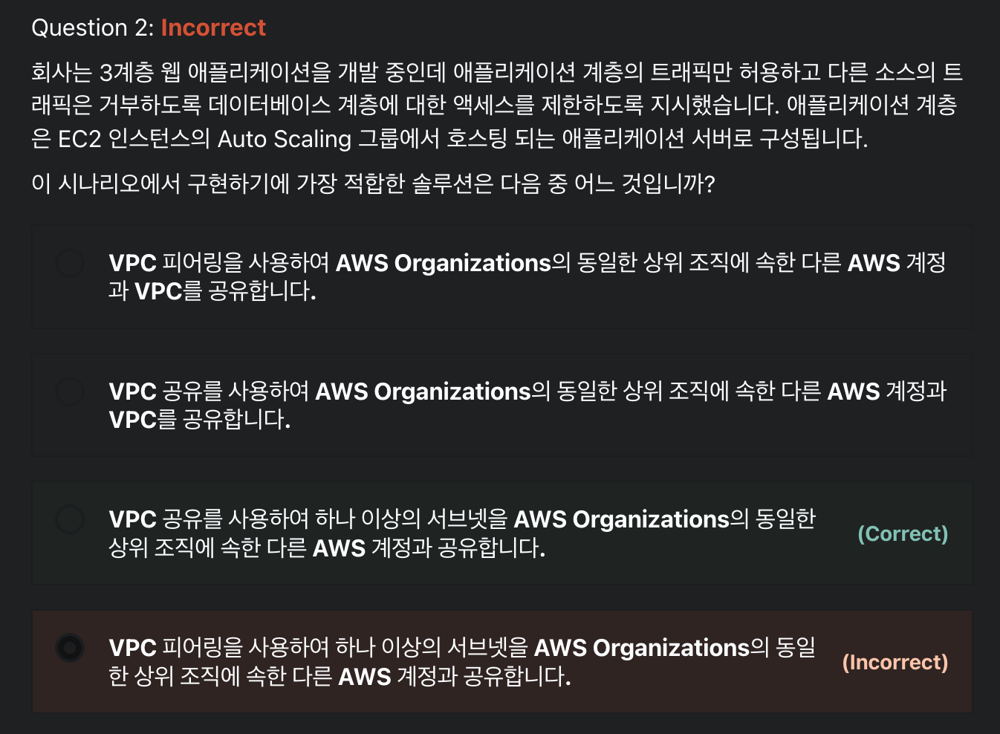
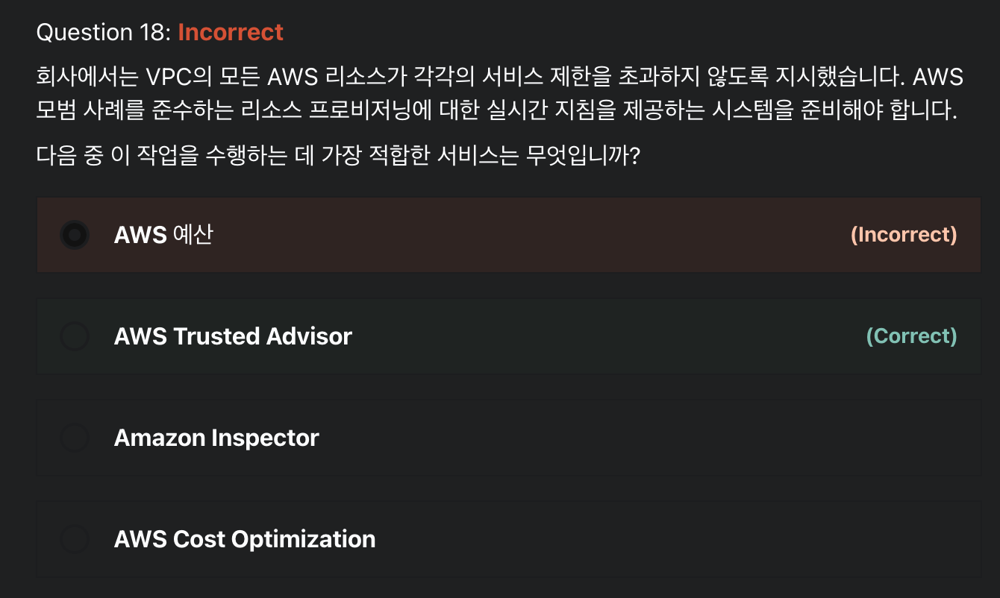
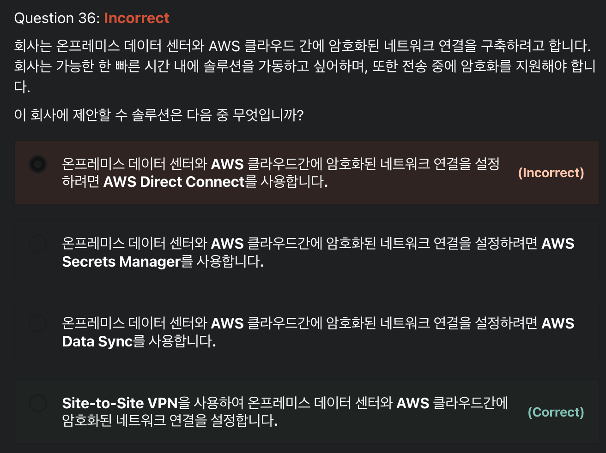
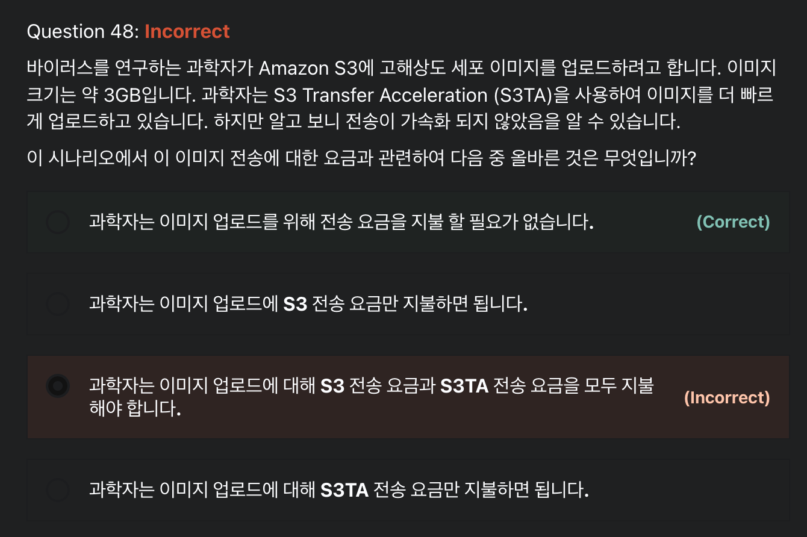

# AWS 공인 솔루션스 아키텍트 – 어소시에이트 SAA-C02 연습문제 1 풀이

<br>

### Q2)



```
답: 3번
```

#### VPC Sharing
- **VPC 공유**를 사용하면 여러 AWS 계정에서 `Amazon EC2 인스턴스`, `Amazon RDS`, `Amazon Redshift 클러스터`, `AWS Lambda 함수` 등과 같은 애플리케이션 리소스를 공유되는 중앙 관리형 Amazon Virtual Private Cloud(VPC)에 생성할 수 있다
  - VPC(소유자)를 소유하는 계정은 AWS Organizations의 동일한 조직에 속한 다른 계정(참여자)과 한 개 또는 여러 개의 `서브넷을 공유`한다
  - 서브넷을 공유한 후 참여자는 공유된 서브넷의 해당 애플리케이션 리소스를 보고, 생성하고, 수정하고, 삭제할 수 있다
- Amazon VPC를 공유하여 높은 상호 연결성을 필요로 하고 동일한 신뢰 경계 내에 있는 애플리케이션에 대해 VPC 내의 `암시적 라우팅`을 활용할 수 있다
  - 이것을 통해 **생성 및 관리하는 VPC 수가 줄어**들고 청구 및 액세스 제어에 **별도의 계정**을 사용할 수 있다
  - `AWS PrivateLink`, `AWS Transit Gateway`, `Amazon VPC 피어링` 등의 연결 기능을 통해 공유된 Amazon VPC를 상호 연결하여 네트워크 토폴로지를 단순화할 수 있다
- **VPC 소유자**
  - VPC 소유자는 참여자가 생성한 보안 그룹을 비롯하여, 참여자 리소스를 수정하거나 삭제할 수 없다
  - VPC 소유자는 문제 해결 및 감사를 위해 모든 네트워크 인터페이스 및 참여자 리소스에 연결된 보안 그룹에 대한 세부 정보를 볼 수 있다
  - VPC 소유자는 트래픽 모니터링 또는 문제 해결을 위해 VPC, 서브넷 또는 ENI 수준에서 흐름 로그 구독을 생성할 수 있다
- **공유 VPC의 참여자**
  - 공유 VPC의 참여자는 Amazon EC2 인스턴스, Amazon RDS 데이터베이스, 로드 밸런서를 비롯하여 해당 리소스에 대한 생성, 관리 및 삭제를 책임진다
  - 참여자는 다른 참여자 계정에 속한 리소스를 보거나 수정할 수 없다
  - 참여자는 `라우팅 테이블` 및 `공유된 서브넷에 연결된 네트워크 ACL의 세부 정보`를 볼 수 있다
    - but, 라우팅 테이블, 네트워크 ACL, 서브넷 등을 포함하여 VPC 수준 리소스를 수정할 수 없다
  - 참여자는 보안 그룹 ID를 사용하여 다른 참여자 또는 소유자에게 속한 보안 그룹을 참조할 수 있다
  - 참여자는 자신이 소유한 인터페이스에 대해서만 흐름 로그 구독을 생성할 수 있다


<br>

### Q18)



```
답: 2번
```

#### AWS Trusted Advisor
- **AWS Trusted Advisor란?**
  - AWS Trusted Advisor는 AWS 모범 사례에 따라 리소스를 프로비저닝하는 데 도움이 되도록 실시간 지침을 제공하는 온라인 도구다
  - Trusted Advisor는 AWS 인프라를 **최적화**하고 **보안과 성능을 향상**시키고 **전체 비용을 절감**하며 **서비스 한도를 모니터링**할 수 있다
- **AWS Trusted Advisor가 제공하는 5가지 모범 사례 권장 사항**
  1. `비용 최적화` : AWS Trusted Advisor는 미사용 및 유휴 리소스를 제거하거나 예약 용량을 약정하여 AWS에서 비용을 절감할 수 있다
  2. `성능` : AWS Trusted Advisor는 서비스 한도를 점검하고 프로비저닝된 처리량을 활용하는지 확인하며 과다 사용되는 인스턴스를 모니터링함으로써 서비스 성능을 개선할 수 있다
  3. `보안` : AWS Trusted Advisor는 결함을 없애고 다양한 AWS 보안 기능을 사용하며 권한을 점검하여 애플리케이션 보안을 개선할 수 있다
  4. `내결함성` : AWS Trusted Advisor는 Auto Scaling, 상태 확인, 다중 AZ 및 백업 기능을 활용하여 AWS 애플리케이션의 가용성과 중복성을 향상시킬 수 있다
  5. `서비스 한도`
     - AWS Trusted Advisor는 서비스 사용량이 서비스 한도의 80%를 넘는지 점검한다
     - 값은 스냅샷을 기반으로 하므로 현재 사용량은 다를 수 있다
     - 한도 및 사용량에 변경 사항이 반영되는 데 **최대 24시간**이 걸릴 수 있다!

<br>

### Q36)



```
답: 4번
```

#### AWS Site-to-Site VPN
- Site-to-Site VPN 연결은 VPC를 온프레미스 네트워크에 **비공개로 연결**한다
  - VPC와 네트워크 경로 간에 전송되는 데이터는 암호화된 VPN 연결을 통해 라우팅되어 전송 데이터의 `기밀성`과 `무결성`이 유지된다
  - Amazon은 `인터넷 프로토콜 보안(IPsec) VPN 연결`을 지원한다
    - `IPsec`은 데이터 흐름의 각 **IP 패킷을 인증하고 암호화**함으로써 IP 통신의 보안을 유지하는 프로토콜이다!
- 각 Site-to-Site VPN 연결은 AWS와 네트워크를 연결하는 `두 개의 암호화된 IPsec VPN 터널`로 구성된다
  - 각 터널의 트래픽은 `AES128` or `AES256`를 사용하여 암호화할 수 있고 키 교환을 위해 Diffie-Hellman 그룹을 사용할 수 있게 되어 Perfect Forward Secrecy를 제공한다
  - AWS는 `SHA1` 또는 `SHA2` 해싱 함수를 사용하여 인증한다
- VPC의 인스턴스에는 Site-to-Site VPN 연결의 반대쪽에 있는 리소스에 연결하기 위한 `퍼블릭 IP 주소`가 필요하지 않는다
  - 인스턴스는 온프레미스 네트워크에 대한 Site-to-Site **VPN 연결을 통해 인터넷 트래픽을 라우팅**할 수 있다
  - 그런 다음 기존 아웃바운드 트래픽 지점과 네트워크 보안 및 모니터링 디바이스를 통해 인터넷에 액세스할 수 있다


<br>

### Q48)



```
답: 1번
```

#### Amazon S3 Transfer Acceleration
- Amazon S3 Transfer Acceleration은 거리가 먼 클라이언트와 S3 버킷 간에 파일을 빠르고, 쉽고, 안전하게 전송할 수 있게 해준다
  - Transfer Acceleration은 전 세계적으로 분산되어 있는 `Amazon CloudFront의 엣지 로케이션`을 활용한다
  - 엣지 로케이션에 도착한 데이터는 최적화된 네트워크 경로를 통해 Amazon S3로 라우팅된다
- **버킷에서 Transfer Acceleration을 사용하는 이유**
  - 전 세계 각지에서 중앙의 버킷으로 업로드하는 고객이 있을 경우
  - 전 세계에 정기적으로 수 기가바이트에서 수 테라바이트의 데이터를 전송할 경우
- Transfer Acceleration을 사용할 경우 `데이터 전송 요금`이 추가로 적용될 수 있다
  - but, 인터넷에서 데이터를 전송할 때 S3 데이터 전송 요금은 없다
    - 또한 S3TA를 사용하면 가속화된 전송에 대해서만 비용을 지불한다
    - 따라서 S3TA는 전송 속도가 빨라지지 않았기 때문에 주니어 과학자는 이미지 업로드에 대해 전송 요금을 지불 할 필요가 없다

<br>