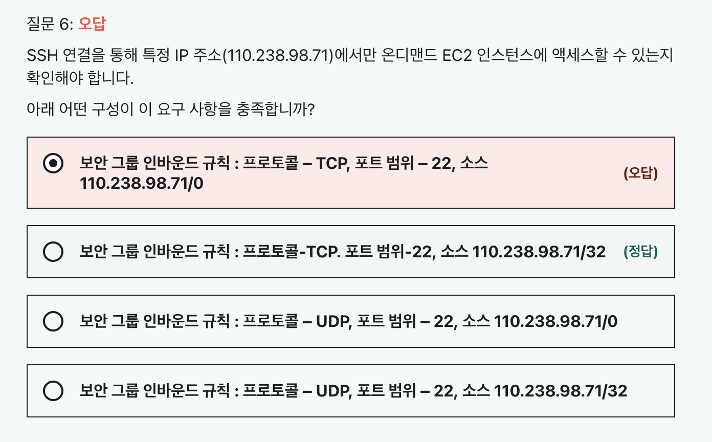
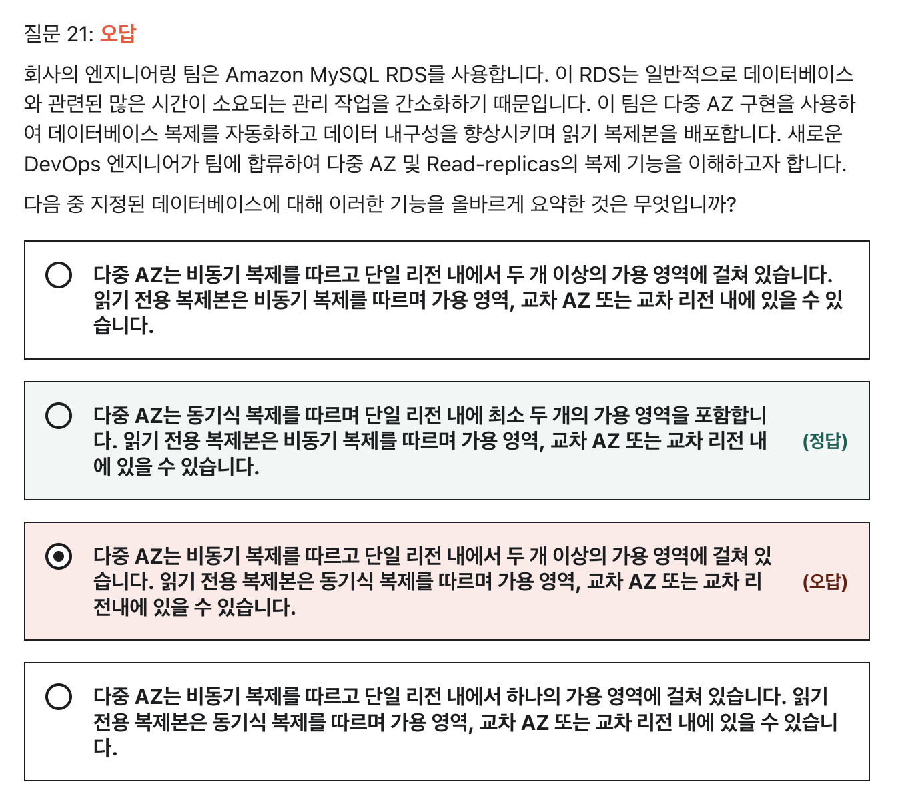
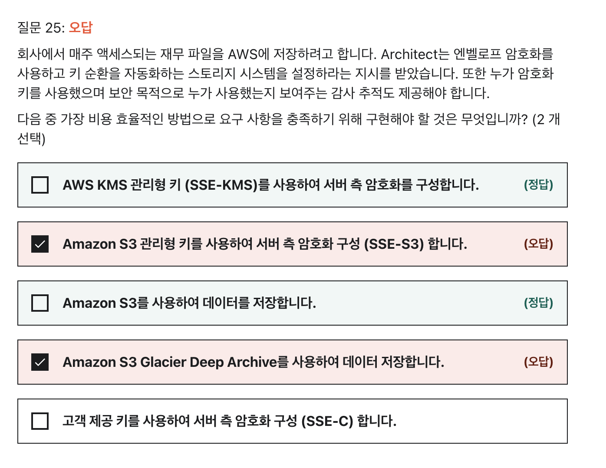
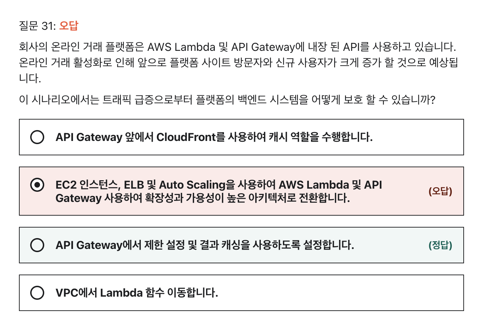
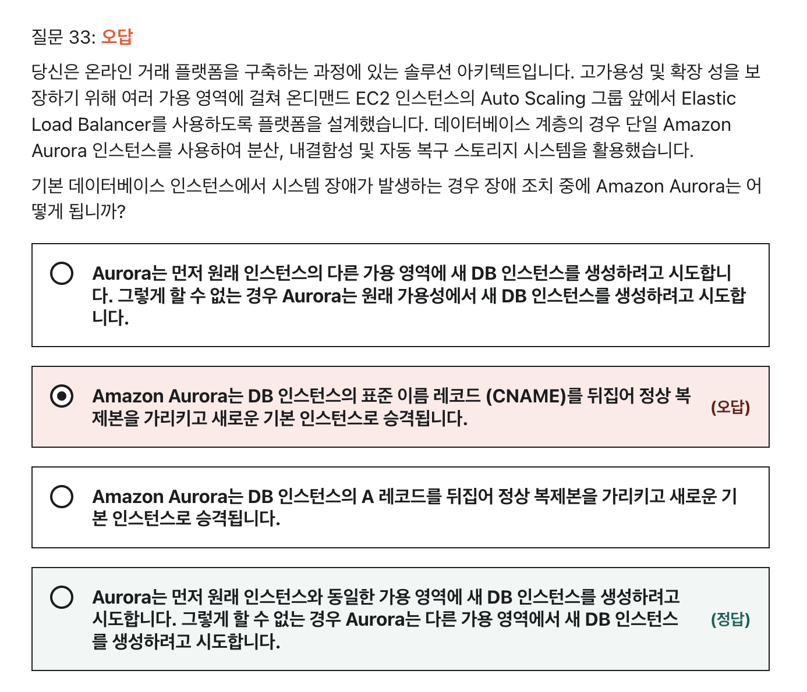

### 8주차 과제

```
- [AWS 공인 솔루션스 아키텍트 – 어소시에이트 SAA-C02 연습문제](https://www.udemy.com/course/aws-saa-c02/) `어소시에이트 연습문제 1`을 풀이합니다.
- 리뷰가 필요할만한 문제 최소 5문제에 대해서 풀이/해설을 제출합니다.
```

### 6.



> CIDR : Classless Inter Domain Routing  
> IP 주소에서 네트워크 구분을 클래스로 하지 않는 방식

CIDR 표기법
- ex) `192.168.10.0/24`
- 위에서 `/24` 가 CIDR 표기법이다.
- 왼쪽에서 부터 24 비트 이후로는 모두 사용가능하다는 뜻.
- 즉, `192.168.10.0 ~ 192.168.10.255` 까지 사용가능

/32 는 모든 자리수이기  때문에 자기 자신만을 의미한다.
- ex) `192.168.36.111/32` 는 `192.168.36.111` 만 쓸 수 있다는 것.

<br>
<br>
<br>

---




1. 다중 AZ
    - 가용성 목적
    - 하나의 AZ 에 Master, 다른 AZ 에 예비 인스턴스. => 적어도 두 AZ 에서 동작한다.
    - 동기식 복제 : DB 쓰기 작업시 동시에 모든 인스턴스에 쓴다.


2. 읽기 전용 복제본
    - 성능개선, 내구성 목적
    - 읽기 작업의 트래픽을 분산시킬 수 있다.
    - 비동기 복제 : RW 에 쓰기가 발생하면, 비동기식으로 RW 로그를 복사해와서 싱크를 맞춤
    - Master 로 승격 가능.

<br>
<br>
<br>

---



```
봉투 암호화 (envelop Encryption)  

데이터 키로 일반 텍스트 데이터를 암호화한 후, 다른 키 아래에서 데이터 키를 암호화하는 방법
-> 키를 보호하기 위한 방법
-> KMS 에서 사용
```

SSE-KMS : 고객의 마스터 키(CMK) 를 봉투 암호화를 통해 AWS 에서 관리하는 키로 암호화시킴.

Amazon S3 Glacier Deep Archive : 자주 엑세스되지 않고, 장기적으로 저장하기 위한 저장소

<br>
<br>
<br>

---




AWS API GateWay
 - API 를 쉽게 생성해주는 기능
 - EC2, ECS, Beanstalk, Lambda 등등을 붙여서 API 를 만들 수 있다.
 - 트래픽 관리, 모니터링, 보호 등등을 할 수 있는 완전 관리형 서비스

**API Gateway 에서 서버가 터지지 않도록 할 수 있는 것**
- API 요청 건수 제한 : 일정 갯수 이상으로는 429 로 거절 가능
- 캐시 사용

<br>
<br>
<br>


---



Aurora 의 장애복구 : 자동으로 다 해준다.

Aurora 의 장애복구 순서
1. 동일한 AZ 에 복제본이 있다면 CNAME 을 변경하여 가리킨다.
2. 다른 AZ 에 복제본이 있다면 CNAME 을 변경하여 가리킨다.
3. 복제본이 없는 단일 인스턴스라면 동일 AZ 에 복제본 생성을 시도한다.
4. 실패하면 다른 AZ 에 복제본 생성을 시도한다.

문제에서 단일 인스턴스를 사용한다고 했다.  따라서 위 순서의 3, 4번을 시도할 것이다.