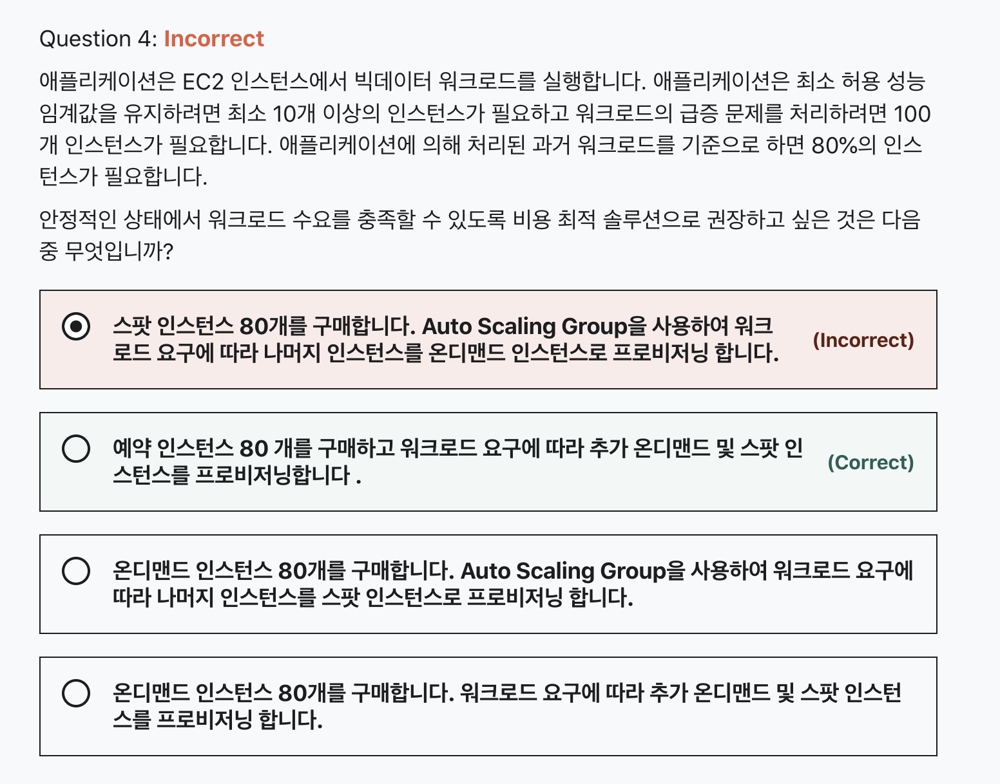
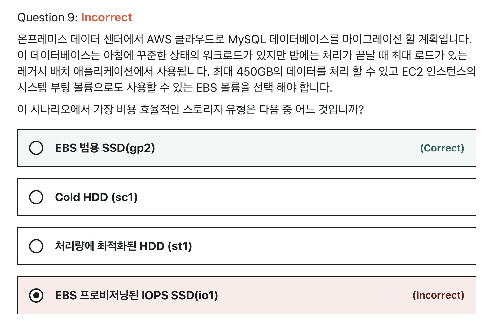
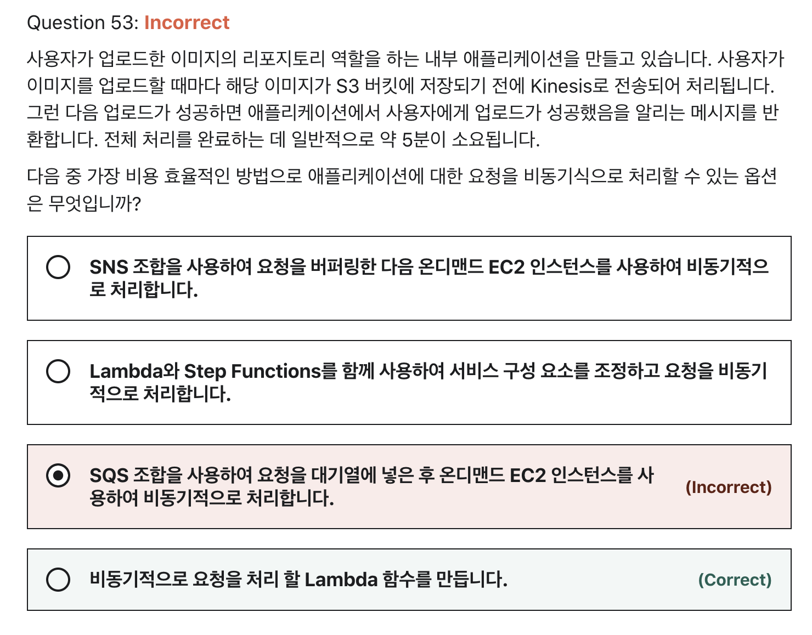
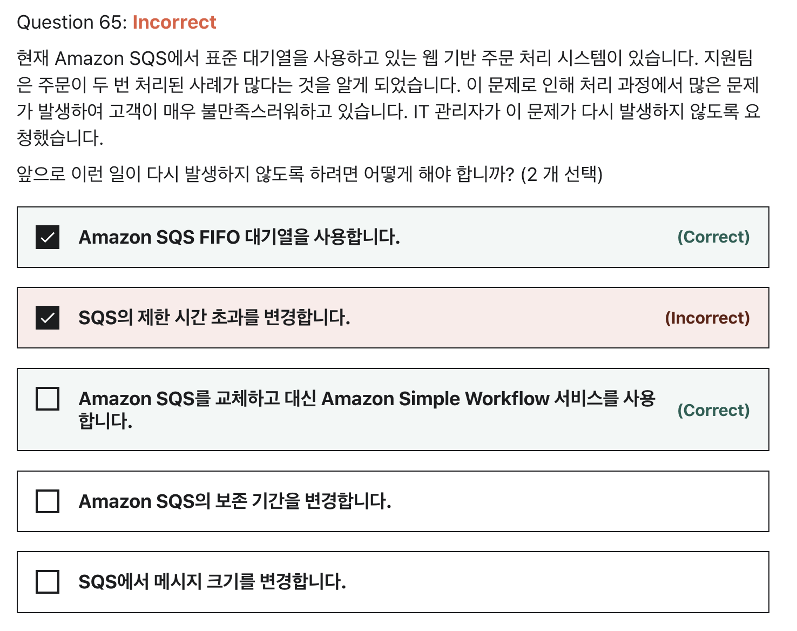

# W8 과제
## Question 4



- 문제 포인트
  - ~~빅데이터~~
  - 80%의 인스턴스가 필요
  - 최소 비용

### 개인 해설
```
비용적인 측면에서는 스팟, 예약 > 온디맨드가 많이 싸다고 알고있음
그래서 온디맨드 인스턴스 보기 2개 제거

예약 인스턴스는 계약 기간과 정확한 기간과 수요 예측을 못할 경우 잉여 인스턴스가 생길 가능성이 높음
게다가 예약 인스턴스는 긴 워크로드에 적합하다는걸로 알고 있고 1년 또는 3년 동안 인스턴스를 예약을 해야되기 때문에
기간에 대한 내용이 언급되지 않아 그래서 예약 인스턴스를 제거하고 남은 스팟 인스턴스를 고름
``` 

### 문제 해설
- `정상 상태 워크로드 요구`가 80% (80개의 인스턴스)가 필요하다고 요구가 명확하기 때문에 80개의 예약 인스턴스를 구매하여 비용을 절감 가능

<br>

- `온디맨드 인스턴스`가 적합한 경우:
  - 선결제 금액이나 장기 약정 없이 저렴하고 유연하게 Amazon EC2를 사용하기 원하는 사용자
  - 단기의 갑작스럽거나 예측할 수 없는 워크로드가 있으며, 중단되어서는 안 되는 애플리케이션 
  - Amazon EC2에서 처음으로 개발 또는 시험 중인 애플리케이션
- Amazon EC2 스팟 인스턴스를 사용하면 온디맨드 요금보다 최대 90% 할인된 가격으로 예비 Amazon EC2 컴퓨팅 용량을 요청할 수 있습니다.

<br>

- `스팟 인스턴스`가 적합한 경우:
  - 시작 및 종료 시간이 자유로운 애플리케이션
  - 컴퓨팅 가격이 매우 저렴해야만 수익이 나는 애플리케이션
  - 대량의 서버 용량 추가로 긴급히 컴퓨팅 파워가 필요한 사용자
- Savings Plans는 1년 또는 3년 기간의 일정 사용량 약정(시간당 요금을 기준으로 측정)을 조건으로 EC2 및 Fargate 사용량에 대해 저렴한 요금을 제공하는 유연한 요금 모델입니다.

<br>

- `예약 인스턴스`가 적합한 경우:
  - 수요가 꾸준한 애플리케이션 
  - 예약 용량이 필요할 수 있는 애플리케이션 
  - 총 컴퓨팅 비용을 절감하기 위해 1년 또는 3년 동안 EC2를 사용하기로 약정할 수 있는 고객
- 예약 인스턴스는 온디맨드 인스턴스 요금과 비교하여 상당한 할인 혜택(최대 75%)을 제공합니다. 
- 예약 인스턴스를 특정 가용 영역에 지정하면 용량 예약이 제공되므로 필요할 때 예약한 인스턴스를 시작할 수 있다는 확신을 가질 수 있습니다.
- `수요가 꾸준하거나 예측 가능한 애플리케이션의 경우`, 예약 인스턴스를 사용하면 온디맨드 인스턴스 사용과 비교하여 상당한 비용을 절감할 수 있습니다.

<br>
<br>

----

## Question 9



- 문제 포인트
  - 데이터베이스
  - 최대 450GB 데이터 처리
  - 인스턴스 부팅 가능한 볼륨
  - 효율적인 비용

### 개인 해설
```
HDD는 부팅이 불가능하다고 강의에서 배웠기에 HDD 보기 2개 제거
보통 데이터베이스 워크로드에 사용되는 볼륨은 프로비저닝된 IOPS SSD라고 강의에서 배웠기에 io1 선택
``` 

### 문제 해설
- 범용 SSD(gp2) 볼륨은 광범위한 작업에서 이상적으로 사용될 수 있는 비용 효과적인 스토리지를 제공합니다. 
- 이러한 볼륨은 시간을 연장할 경우 3,000IOPS의 버스트 기능까지 지원되어 지연 시간이 한 자릿수 밀리초에 불과합니다.
- 최소 100 IOPS(33.33GiB 이하)와 최대 16,000 IOPS(5,334GiB 이상) 사이에서, 기준 성능은 볼륨 크기의 GiB당 3 IOPS로 일정하게 확장됩니다.
- AWS는 프로비저닝된 성능의 99%의 시간에 제공하기 위해 gp2 볼륨을 설계합니다. 
- gp2 볼륨 크기는 1GiB~16TiB입니다.

<br>

- EBS 프로비저닝된 IOPS SSD(io1)
  - Amazon EBS 프로비저닝 IOPS SSD (io1)는 가장 비용 효율적인 EBS 유형이 아니며 IOPS 성능이 지속적으로 요구되는 중요한 비즈니스 애플리케이션에 주로 사용되므로 올바르지 않습니다.

<br>
<br>

----

## Question 31


- 문제 포인트
  - S3 업로드 이벤트 (PutObject)
  - 처리 완료시 버킷을 비워야함
  - 증가된 ECS 작업수를 1로 재설정

### 개인 해설
```
회사에서 ECS는 안써봤지만 비슷한 상황으로 구성한적이 있음,
PUT 이벤트를 AWS 이벤트브릿지를 통해 람다에게 이벤트를 전달하여 처리하는 작업이 있는데
비슷한 상황인거같아 4번으로 선택 
``` 
- [Amazon EventBridge](https://aws.amazon.com/ko/blogs/korea/new-use-amazon-s3-event-notifications-with-amazon-eventbridge)
  - 다양한 소스의 데이터와 애플리케이션을 연결하는 데 사용할 수 있는 서버리스 이벤트 버스 서비스


### 문제 해설
```
보기 4
S3 객체 PUT 작업을 탐지하도록 CloudWatch 이벤트 규칙을 설정하고 Amazon ECS API 명령을 실행하여 ECS의 작업 수를 늘리는 Lambda 함수로 대상을 설정합니다.
S3 DELETE 조작을 감지하는 다른 규칙을 작성하고 Lambda 함수를 실행하여 ECS 태스크 수를 줄이십시오.
```
- 이 솔루션은 요구 사항을 충족하지만 이 시나리오에 대한 자체 Lambda 함수를 생성할 필요는 없습니다. 
- ECS 작업을 CloudWatch 이벤트 규칙의 대상으로 직접 제어하는 것이 훨씬 간단합니다. 
- `시나리오에서는 가장 구현하기 쉬운 솔루션을 요구합니다.`

<br>

```
보기 1
S3 객체 수준 작업이 CloudTrail에 기록되므로 CloudTrail을 모니터링 하도록 CloudWatch에 경보를 설정합니다.
ECS 작업 수를 늘리거나 줄이기 위한 두 개의 Lambda 함수를 만듭니다.
S3 이벤트에 따라 CloudWatch Alarm의 각 대상으로 설정합니다.
```
- CloudTrail, CloudWatch Alarm 및 두 개의 Lambda 기능을 사용하면 달성하려는 작업이 불필요하게 복잡해집니다. 
- CloudWatch Events는 새 규칙을 생성할 때 대상 섹션에서 ECS 태스크를 직접 대상으로 지정할 수 있습니다.

<br>

```
보기 2
이 S3 객체 수준 작업이 CloudTrail에 기록되므로 CloudTrail을 모니터링 하도록 CloudWatch에 경보를 설정합니다.
S3 이벤트에 따라 ECS 작업 수를 스케일 아웃 / 스케일 인으로 업데이트하도록 두 개의 알람 동작을 설정합니다.
```
- ECS 작업 수를 업데이트하도록 CloudWatch 알람을 직접 설정할 수 없습니다.
- 대신 CloudWatch Events를 사용해야 합니다.

<br>
<br>

----

## Question 53



- 문제 포인트
  - S3 업로드할때마다 전송 처리
  - 업로드 성공시 사용자에게 응답 반환 (즉 요청 -> 응답까지 처리 완료가 동기처리로 되어있음)
    - 동기 처리로 되어있다보니 5분 소요
  - 비동기 처리
  - 비용 효율적

### 개인 해설
```
현재 회사에서 이미지 업로드, 온디맨드 리사이징 다운로드 서버를 개발하고 있음
실제로 동기 처리 방식으로 하다보니 문제와 비슷한 상황을 조우함

그래서 해결 책으로 업로드 요청이 들어오면 SQS에 메시지 발송하는 것까지 동기처리로 하고
나머지 작업은 비동기 처리로하도록 구성, 이때 SQS를 사용

사용자에게는 SQS 메시지 발송까지 완료가 되면 업로드 요청 받았어요! 라는 뉘양스의 응답을 줌 (업로드 완료 응답이 아님)
사용자에게 빠른 응답 처리를 위한 설계
업로드 완료는 웹훅을 이용하여 응답 처리

그러다보니 자연스럽게 3번을 선택
하지만 문제에서 제시한 비용 효율적인 방법을 고려하지 못했음
온디맨드로 하게되면 비싸기 때문에 람다를 선택했어야함,
실제로 개발하면서 POC할때 람다도 고려했었는데, 별도의 인증 로직과 복잡한 로직이 많아서 람다로 감당하기 힘들어 백엔드 어플리케이션을 구축
너무 경험 기반으로 이입하여 문제를 풀었기에 리뷰 
``` 

### 문제 해설
[AWS Lambda]
- 서버리스형 코드를 실행할 수 있게 해주는 컴퓨팅 서비스
- AWS Lambda는 필요 시에만 코드를 실행하며, 하루에 몇 개의 요청에서 초당 수천 개의 요청까지 자동으로 확장이 가능
- 사용한 컴퓨팅 시간에 대해서만 요금을 지불하면 되고 코드가 실행되지 않을 때는 요금이 부과되지 않습니다. 
- AWS Lambda에서는 사실상 모든 유형의 애플리케이션이나 백엔드 서비스에 대한 코드를 별도의 관리 없이 실행할 수 있습니다. 
- AWS Lambda는 고가용성 컴퓨팅 인프라에서 코드를 실행하고 서버 및 운영 체제 유지 관리, 용량 프로비저닝 및 자동 조정, 코드 및 보안 패치 배포, 코드 모니터링 및 로깅 등 모든 컴퓨팅 리소스 관리를 수행합니다.

<br>

- 함수를 호출할 때 동기식으로 호출할 것인지 비동기식으로 호출할 것인지 선택할 수 있습니다. 
- 동기식 호출의 경우 함수가 이벤트를 처리하여 응답을 반환하기를 기다립니다.
- 비동기식 호출의 경우 Lambda는 처리를 위해 이벤트를 대기열에 저장하고 즉시 응답을 반환합니다.
- 비동기식 호출의 경우 Lambda는 재시도를 처리하고, 호출 레코드를 대상에 보낼 수 있습니다.
- 처리에는 5 분 밖에 걸리지 않으므로 Lambda는 비용 효율적인 선택입니다.

<br>
<br>

----

## Question 65



- 문제 포인트
  - 표준 대기열
  - 주문이 두번 처리됨

### 개인 해설
```
주문이 두번 처리 된다는 것은 두번 읽히기 때문이라고 생각,
그렇기에 표준 대기열을 FIFO로 변경하면 해결된다고 생각

또한 대기열에서 메시지를 수신하고 처리하면 SQS에서 메시지를 자동으로 삭제하지않고 메시지는 계속 대기열에 있기때문에
두번 읽기가 발생한다고 생각하여 제한 시간 초과를 늘리는 방식으로 변경하면 된다고 생각하여 1,2 번을 선택
```
- 표준 대기열 (Standard Queue)
  - 최소 1회 전달 보장, 단 중복 수신이 될 수 있다.
  - 메시지 순서 보장 안됨
- FIFO 대기열 (First In First Out Queue)
  - 1번의 전송, 1번의 수신 지켜짐 (중복수신 방지)
  - 순서를 위해 느린 퍼포먼스 (초당 300TPS)
- 제한 시간 초과
  - Amazon SQS에서 다른 소비자가 메시지를 수신하고 처리하지 못하게 하는 시간
  - 메시지의 기본 제한 시간은 30초, 최소 값은 0초 ~ 최대 시간은 12시간

<br>

### 문제 해설
- 이 시나리오의 주요 이슈는 주문 관리 시스템이 때때로 중복 주문을 생산한다는 것입니다. 
- 회사에서 SQS를 사용하고 있기 때문에 `EC2 인스턴스가 이미 처리된 메시지를 삭제하지 못한 경우 메시지가 중복`될 수 있습니다. 
- 이 문제가 발생하지 않도록 하려면 SQS FIFO나 Amazon Simple Workflow 서비스를 사용해야 합니다.
  - **보기에 SQS 메시지를 삭제 관련 내용이 없어서 SWF를 사용함으로써 중복 읽기를 방지하려고 하는 것 같다.**
  - **예약된 작업을 사용하는 다른 방법을 고려해보라는 문제 인 것 같다. (SWF)**

<br>

- Amazon Simple Workflow
  - 클라우드 워크플로우 관리
  - 애플리케이션 구성요소 조정을 위한 워크플로우 서비스
  - 상태 추적기 및 작업 조정자 역할
  - 병렬 또는 순차 단계가 있는 백그라운드 작업을 구축하고 실행하고 확장할 수 있음
  
<br>

- [SQS 와 SWF 차이](https://medium.com/awesome-cloud/aws-difference-between-sqs-and-swf-7a0954999621)

[SQS]
- SQS는 분산 환경에서 어플리케이션간 주고 받을 수 있는 메시지를 대기열에 넣을 수 있는 서비스입니다. 
- SQS는 메시지를 확장성이 높은 환경에 저장 및 보관하여 필요에 따라 다른 서비스 처리할 수 있다.
  - 메시지를 삭제하지 않으면 중복 수신 가능

[SWF]
- SWF는 완전히 다른 서비스로, 백그라운드로 작업을 병렬 혹은 순차적인 이벤트 순서를 구성하고 처리
- 프로세스 워크플로우를 추적하고 관리하는 데 사용할 수 있습니다.
- 개발자가 병렬 또는 순차적인 단계를 가진 백그라운드 작업을 작성, 실행 및 확장할 수 있도록 지원합니다.
  - task를 통해 작업 단위를 관리하며 task는 한번만 수행된다.

[차이점]
- 서비스 지향점
  - Amazon SQS API 작업은 메시지 지향입니다.
  - Amazon SWF API 작업은 작업 지향적입니다.
- 트래킹
  - Amazon SWF는 모든 작업 및 이벤트를 추적한다.
  - Amazon SQS에서 여러 대기열을 사용하는 경우 자체 응용 프로그램 수준 추적을 구현해야 합니다.

