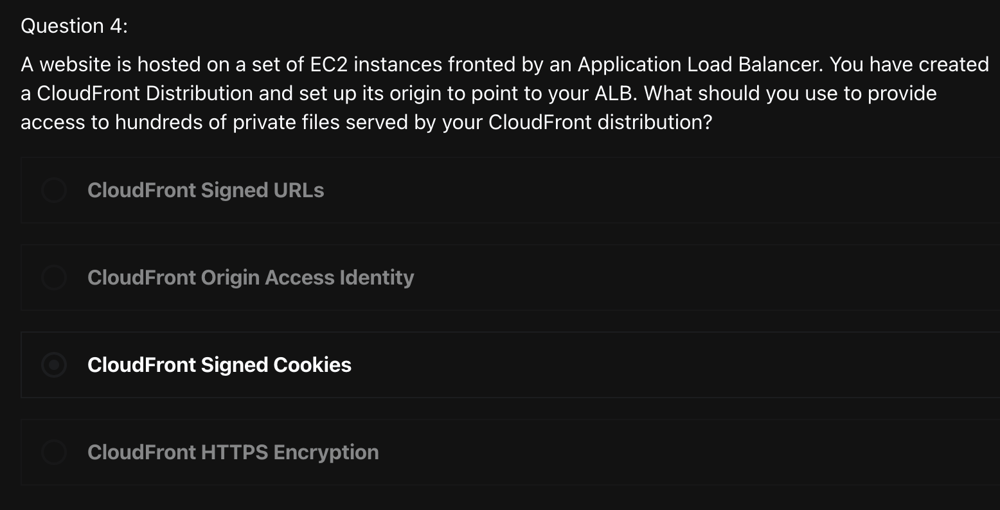
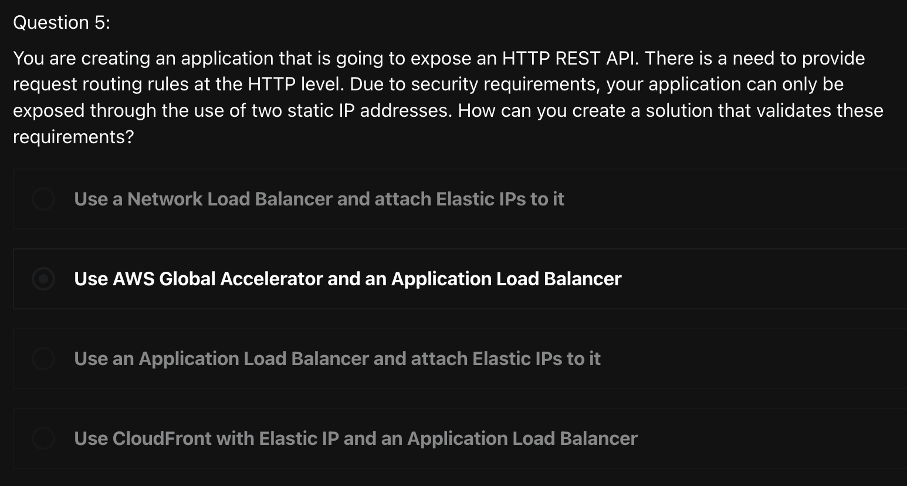
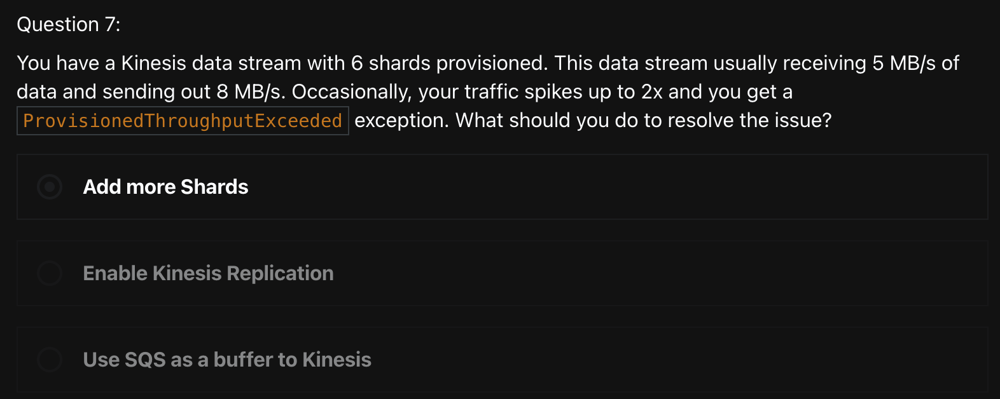

# Quiz
> [Udemy AWS SAA 강의](https://www.udemy.com/course/best-aws-certified-solutions-architect-associate/) Quiz 12, 13, 14 를 풀고, 어려운 문제를 선정하여 해설을 제출하기

<br>

## Quiz 12. CloudFront & AWS Storage Extras Quiz (6문제)

### Q4) 



```
답: 3번
```

### [CloudFront Signed Cookies](https://docs.aws.amazon.com/ko_kr/AmazonCloudFront/latest/DeveloperGuide/private-content-signed-cookies.html)
> 현재의 URL을 변경하지 않으려는 경우나 **여러 제한된 파일**(예: 웹 사이트의 구독자 영역에 있는 전체 파일)에 대한 액세스 권한을 제공하려는 경우, `CloudFront signed cookie`를 사용하여 **콘텐츠 액세스를 제어**할 수 있다
- `서명된 쿠키에 대하여 미리 준비된(canned) 정책과 사용자 지정 정책 중 선택`
  - 서명된 쿠키를 만들 때 JSON 형식의 정책 설명을 작성하여 서명된 쿠키의 제약 조건(예: 쿠키의 유효 기간)을 지정한다
  - 미리 준비된 정책 또는 사용자 지정 정책을 사용할 수 있다
- `서명된 쿠키 작동 방식`
  1. CloudFront 배포에서 CloudFront가 URL 서명을 확인하는 데 사용할 수 있는 퍼블릭 키가 포함된 신뢰할 수 있는 키 그룹을 하나 이상 지정한다
    - 해당 Private key를 사용하여 URL에 서명한다
  2. 사용자가 콘텐츠에 액세스해야 하는지 여부를 파악하고, 필요하면 최종 사용자에게 `Set-Cookie` header 세 개를 보내도록 애플리케이션을 개발한다
    - 각 Set-Cookie hearder는 `key-value pari`를 하나만 포함할 수 있고 CloudFront 서명된 쿠키에는 이름-값 페어 3개가 필요하다
    - 최종 사용자가 프라이빗 콘텐츠를 요청하기 전에 Set-Cookie header를 최종 사용자에게 보내야 한다
      - 쿠키의 만료 시간을 짧게 설정한 경우, 사용자가 계속 액세스할 수 있도록 후속 요청에 대해 Set-Cookie header 세 개를 더 보낼 수 있다!
  3. 사용자가 웹 사이트에 로그인하여 콘텐츠에 대한 비용을 지불하거나 액세스에 필요한 자격 요건을 충족한다
  4. 애플리케이션은 응답을 통해 `Set-Cookie header`를 **반환**하고 최종 사용자는 `key-value pair`를 **저장**한다
  5. 사용자가 파일을 요청한다
    - 사용자의 브라우저 또는 기타 최종 사용자는 4단계의 key-value pair를 불러와서 이를 Cookie header의 요청에 추가한다
      - 이게 signed cookie다!
  6. CloudFront는 퍼블릭 키를 사용하여 서명된 쿠키의 서명을 확인하고 쿠키가 아직 변조되지 않았음을 확인한다
    - 유효하지 않은 서명인 경우 요청을 거부한다
    - 쿠키의 서명이 유효한 경우, CloudFront는 쿠키의 정책 설명을 보거나 미리 준비된(canned) 정책을 사용하는 경우, 정책 설명을 구성하여 요청이 아직 유효함을 확인한다
    - 요청이 정책 설명의 요구 사항을 충족하는 경우, CloudFront는 제한되지 않은 콘텐츠와 같은 방식으로 콘텐츠를 제공한다!


<br>

### Q5) 



```
답: 2번
```
### [AWS Global Accelerator](https://docs.aws.amazon.com/ko_kr/global-accelerator/latest/dg/introduction-components.html)
> AWS Global Accelerator는 사용자가 액셀러레이터를 사용하여 로컬 및 글로벌 사용자를 위한 애플리케이션의 성능을 향상시킬 수 있게 한다
- **AWS Global Accelerator의 구성 요소**
  - `고정 IP 주소`
    - 글로벌 액셀러레이터는 AWS 엣지 네트워크에서 캐스트된 두 개의 정적 IP 주소 집합을 제공한다
    - IP 주소는 클라이언트의 **단일 고정 진입점** 역할을 한다
      - 애플리케이션에 대해 Elastic Load Balancing 로드 밸런서, Amazon EC2 인스턴스 또는 엘라스틱 IP 주소 리소스가 이미 설정되어 있는 경우 글로벌 가속기의 표준 가속기에 이러한 리소스를 쉽게 추가할 수 있다!
      - 이렇게 함으로써 글로벌 가속기가 정적 IP 주소를 사용하여 리소스에 액세스할 수 있다
  - `가속기`
    - 가속기는 AWS 글로벌 네트워크를 통해 엔드포인트로 트래픽을 전송하여 인터넷 애플리케이션의 성능을 향상시킨다
    - 각 가속기에는 하나 이상의 수신기가 포함된다
  - `DNS 이름`
    - 글로벌 액셀러레이터별로 기본 DNS (Domain Name System) 이름을 할당한다
    - 가속기의 고정 IP 주소 또는 DNS 이름을 사용하여 트래픽을 가속기로 라우팅하거나 DNS 레코드를 설정하여 사용자 지정 도메인 이름을 사용하여 트래픽을 라우팅할 수 있다
  - `Network Zone`
    - 네트워크 영역은 고유한 IP 서브넷에서 가속기에 대한 고정 IP 주소를 제공한다
    - AWS 가용 영역과 마찬가지로 네트워크 영역은 자체 물리적 인프라 세트가 있는 격리된 단위이다
    - 가속기를 구성하면 기본적으로 글로벌 가속기에서 두 개의 IPv4 주소를 할당한다
  - `Listener`
    - 수신기는 사용자가 구성하는 포트 (또는 포트 범위) 및 프로토콜 (또는 프로토콜) 에 따라 클라이언트에서 글로벌 가속기로의 인바운드 연결을 처리한다
    - Listener는 TCP, UDP 또는 TCP 및 UDP 프로토콜 모두 구성 가능하다
  - `Endpoint Group`
    - 각 엔드포인트 그룹은 특정 AWS 리전과 연결되어 있다
    - 엔드포인트 그룹은 region에 하나 이상의 endpoint를 포함한다
    - 표준 가속기를 사용하면 엔드포인트 그룹에 전달되는 트래픽의 비율을 늘리거나 줄일 수 있다
  - `Endpoint`
    - 엔드포인트는 글로벌 액셀러레이터가 트래픽을 전달하는 리소스이다
    - 엔드포인트는 네트워크 로드 밸런서, 애플리케이션 로드 밸런서, EC2 인스턴스 또는 엘라스틱 IP 주소일 수 있다


<br>

## Quiz 13. AWS Storage Extras Quiz (9문제)

N/A

<br>

## Quiz 14. Messaging & Integration Quiz (13문제)

### Q7)



```
답: 1번
```

### [Kinesis Data Streams에서 ReadProvisionedThroughputExceeded 예외를 감지하고 문제를 해결하기](https://aws.amazon.com/ko/premiumsupport/knowledge-center/kinesis-readprovisionedthroughputexceeded/)

#### Short Description
- ReadProvisionedThroughputExceeded 오류는 일정 시간 동안 Kinesis Data Streams가 GetRecords 호출을 제한할 때 발생한다
- Amazon Kinesis 데이터 스트림은 다음과 같은 한도를 초과하면 제한될 수 있다
  - 각 샤드는 `초당 최대 5개의 읽기 트랜잭션`(또는 각 샤드에 초당 5건의 GetRecords 호출)까지 지원할 수 있다
  - 각 샤드는 최고 2MiB/초의 읽기 속도를 지원한다
  - GetRecords는 한 개의 샤드에서 호출당 최고 10MiB의 데이터, 호출당 최고 10,000개의 레코드를 검색할 수 있다

#### Resolution
- 스트림을 리샤딩하여 스트림 내 샤드 수를 늘린다
- GetRecords 요청의 크기를 줄인다
- Data Streams 내의 모든 샤드에 걸쳐 읽기 및 쓰기 작업을 최대한 골고루 분포시킨다
- 향상된 팬아웃이 있는 consumer를 사용한다